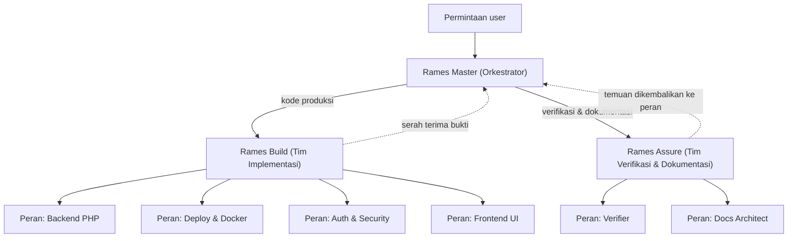

# Agent Rames — 1 Orkestrator + 2 Tim

Folder ini berisi **custom agent VS Code Copilot** untuk project **Rames** (deploy dashboard, Webman PHP 8.1+). Polanya: **satu orkestrator + dua tim** — *Build* (penulis kode produksi) dan *Assure* (verifikasi & dokumentasi).

Bentuk ini adalah **adaptasi untuk Copilot** dari pola yang sudah lebih dulu dipakai di `.opencode/agents/` (lihat `.opencode/README.md`), dan **menggantikan** 7 agent spesialis lama (1 orkestrator + 6 domain tunggal). Tujuannya memangkas jumlah subagent tanpa kehilangan batas tanggung jawab: domain digabung menjadi **peran** di dalam tim.

Pemisahan **Build vs Assurance** sengaja dipilih agar aturan lama **"verifikasi tidak boleh dilakukan oleh penulis perubahan"** tetap terjaga: *Rames Build* menulis kode produksi, *Rames Assure* memverifikasi dan tidak pernah mengedit kode produksi.

## Daftar Agent

| File | Nama (`name:`) | Peran | Tools | Delegasi |
|---|---|---|---|---|
| `rames-master.agent.md` | **Rames Master (Orkestrator)** | Pecah task, rutekan ke tim, koordinasi integrasi, rangkum bukti | `read, search, edit, execute, todo, agent, web` | boleh memanggil **hanya** *Rames Build* & *Rames Assure* (field `agents:`) |
| `rames-build.agent.md` | **Rames Build (Tim Implementasi)** | Penulis kode produksi. 4 peran: Backend PHP, Deploy & Docker, Auth & Security, Frontend UI | `read, search, edit, execute, todo` | **tidak** — tool `agent` sengaja tidak diberikan |
| `rames-assure.agent.md` | **Rames Assure (Tim Verifikasi & Dokumentasi)** | Independen dari penulis kode. 2 peran: Verifier, Docs Architect | `read, search, edit, execute, todo` | **tidak** — tool `agent` sengaja tidak diberikan |

Catatan frontmatter:

- `rames-master` memakai **`disable-model-invocation: true`** — agent ini hanya untuk **dipilih user sebagai agent utama** lewat agent picker, bukan dipanggil sebagai subagent (dari dalam subagent ia tidak akan bisa mendelegasikan).
- Ketiga agent tetap *user-invocable* (muncul di agent picker), jadi satu tim boleh dipanggil langsung bila domainnya sudah jelas.

## Peta Perutean

Urutan yang disarankan untuk fitur lintas lapisan:
**Auth & Security (kontrak hak) → Backend PHP (endpoint & logika) → Deploy & Docker (bila menyentuh runtime) → Frontend UI (konsumsi endpoint) → Verifier (bukti) → Docs Architect (dokumentasi).**

## Cara Memakai

- **Agent utama**: pilih **Rames Master (Orkestrator)** untuk pekerjaan multi-lapisan. Ia akan memanggil *Rames Build*/*Rames Assure* sambil menyebut peran.
- **Panggil tim langsung** dengan agent picker atau sebut di chat, mis.
  - *"pakai Rames Build dengan Peran: Deploy & Docker untuk menyelidiki kenapa `compose up` gagal"*.
  - *"pakai Rames Assure dengan Peran: Verifier untuk menguji perubahan ini"*.
- **Satu pemanggilan = satu peran.** Untuk pekerjaan lintas domain, pecah menjadi beberapa panggilan berurutan.
- **Handoff** di `rames-master.agent.md` ("Implementasi (Rames Build)", "Verifikasi & dokumentasi (Rames Assure)") adalah **saran untuk user** (`send: false`) yang memberi tombol lanjutan setelah sebuah jawaban selesai — bukan delegasi otomatis. Delegasi otomatis hanya terjadi dari *Rames Master* lewat tool `agent`.

## Pemetaan dari Pola Lama (7 agent, sudah dihapus)

| Agent lama (`.github/agents/`) | Sekarang |
|---|---|
| `rames-pm.agent.md` — Rames PM (Orkestrator) | `rames-master.agent.md` — Rames Master (Orkestrator) |
| `rames-backend-php.agent.md` — Rames Backend PHP | `rames-build.agent.md` · Peran: Backend PHP |
| `rames-deploy-docker.agent.md` — Rames Deploy & Docker | `rames-build.agent.md` · Peran: Deploy & Docker |
| `rames-auth-security.agent.md` — Rames Auth & Security | `rames-build.agent.md` · Peran: Auth & Security |
| `rames-frontend-ui.agent.md` — Rames Frontend UI | `rames-build.agent.md` · Peran: Frontend UI |
| `rames-verifier.agent.md` — Rames Verifier | `rames-assure.agent.md` · Peran: Verifier |
| `rames-docs-architect.agent.md` — Rames Docs Architect | `rames-assure.agent.md` · Peran: Docs Architect |

## Padanan OpenCode ⇄ Copilot

Dokumen di `.opencode/` tidak bisa dipakai apa adanya oleh Copilot; inilah terjemahan mekanismenya.

| Aspek | OpenCode (`.opencode/`) | Copilot (`.github/agents/`) |
|---|---|---|
| Orkestrator | `rames-master.md` dengan `mode: all` | `rames-master.agent.md`, dipilih di agent picker; `disable-model-invocation: true` |
| Tim (subagent) | `mode: subagent` | agent biasa + didaftarkan di field `agents:` milik orkestrator |
| Delegasi | OpenCode memilih subagent dari `permissions`/deskripsi | tool `agent` + nama agent **persis** seperti `name:` target |
| Batas tool | `permissions: deny` untuk `webfetch`/`websearch`/`subagent` | daftar `tools:` — tanpa `agent` (tidak bisa delegasi) & tanpa `web` |
| Batas edit per-path | `permissions: edit` per glob (`database/*`, `apps/*`, `.github/*`, …) | **tidak didukung** → menjadi **aturan keras di body agent** yang harus dipatuhi |
| Kedalaman nesting | 1 — orkestrator wajib berjalan sebagai primary | nested subagent **nonaktif default** (`chat.subagents.allowInvocationsFromSubagents`) → sama: orkestrator wajib jadi agent utama |
| Field frontmatter | `description`, `mode`, `color`, `permissions`, `model`, `steps`, `hidden` | `description`, `name`, `argument-hint`, `tools`, `agents`, `model`, `user-invocable`, `disable-model-invocation`, `handoffs`, `target`, `hooks` |
| Skill `grill-with-docs` | didaftarkan di `.opencode/opencode.jsonc` (`skills: [".github/skills"]`) | **tanpa file config** — Copilot menemukan `.github/skills/<name>/SKILL.md` otomatis |
| Peran di dalam tim | disebut di prompt (`Peran: Deploy & Docker`) | sama; dipandu `argument-hint` tiap agent |

## Konvensi Batas Domain

- **Otorisasi = satu pintu** (`AppAccess`).
- **Eksekusi proses = satu jalur** (`ProcessRunner` + `SigchldGuard`).
- **Kontrak endpoint** ditentukan Backend PHP; Frontend UI tidak mengubah bentuk respons.
- **Verifikasi bukan oleh penulis perubahan** — gunakan *Rames Assure*.
- **Dokumentasi** (`SPECS.md`, `ARCHITECTURE.md`, customization agent) dikelola *Rames Assure* · Peran: Docs Architect.
- **Sinkron dua sisi**: setiap perubahan peran/wilayah harus tercermin di `.github/agents/` **dan** `.opencode/agents/`.

## Aturan Keras yang Berlaku untuk Semua Agent

Dilarang menyimpan state di properti controller (worker Webman persistent); dilarang `die()`, `exit()`, `dd()`, `var_dump()`, `echo`, `print` di kode produksi; dilarang query tanpa parameter binding; dilarang `session()`/`request()` di konstruktor controller; dilarang mengubah `controller_reuse` menjadi `true`; dilarang menaruh logika bisnis di controller (wajib di `app/library/`); dilarang menambah HTTP client tanpa timeout; dilarang hard-code kredensial/secret; dilarang menyentuh data runtime nyata (`database/apps.json`, `database/auth.json`, `apps/`, `nginx-status/`) saat menguji. Daftar lengkap per peran ada di body masing-masing agent.

> **Sumber resmi aturan lintas-fitur: `.github/copilot-instructions.md`** (instruksi selalu-aktif, memuat Hard Prohibitions #1–#16, peta lapisan, konvensi penamaan, dan definisi "selesai"). Ringkasan di README ini dan body tiap agent hanya meringkas — bila ada perbedaan, ikuti `copilot-instructions.md` lalu perbaiki ringkasannya (*Rames Assure* · Peran: Docs Architect).

## Merawat Agent

1. `description` adalah **permukaan penemuan** agent (dipakai model untuk memilih subagent) — pertahankan frasa pemicu (`GUNAKAN untuk ...`, `JANGAN gunakan ...`).
2. Pakai **hanya field Copilot** di daftar padanan di atas. **Jangan** menyalin field OpenCode (`mode`, `color`, `permissions`, `steps`, `hidden`) — silent failure.
3. Kutip nilai YAML yang mengandung `:`/`&`/`(`; gunakan spasi, bukan tab. Nilai `name:` harus **cocok persis** dengan entri `agents:` / `handoffs.agent` di `rames-master.agent.md`.
4. Bila field `agents:` diisi, tool `agent` **wajib** ada di `tools` agent tersebut.
5. Jangan biarkan dua agent punya wilayah tumpang tindih; perbarui tabel & diagram di README ini bila peran berubah.
6. Hindari siklus subagent (A memanggil B, B memanggil A) — nesting dibatasi satu tingkat.
7. Konsistensi dokumentasi & frontmatter ditinjau oleh *Rames Assure* · Peran: Docs Architect.
