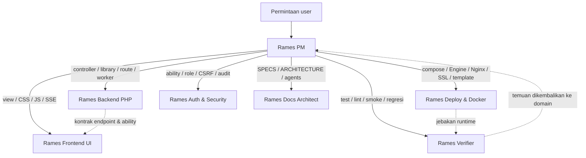

# Agent Rames — Orkestrasi & Subagent Spesialis

Folder ini berisi **custom agent** VS Code Copilot untuk project **Rames** (deploy dashboard, Webman PHP 8.1+). Polanya: **satu orkestrator + enam subagent berdomain tunggal**, agar konteks tetap terisolasi dan batas tanggung jawab jelas.

## Daftar Agent

| File | Nama | Peran | Tools |
|---|---|---|---|
| `rames-pm.agent.md` | **Rames PM (Orkestrator)** | Menerima permintaan user, memecah menjadi task, merutekan ke subagent, mengoordinasikan integrasi, merangkum hasil. Boleh memanggil semua subagent. | read, search, edit, execute, todo, agent, web |
| `rames-backend-php.agent.md` | **Rames Backend PHP** | Controller mediator, `app/library/`, model, middleware, route, worker `cli/*.php`, unit test. | read, search, edit, execute |
| `rames-deploy-docker.agent.md` | **Rames Deploy & Docker** | `docker compose`, Docker Engine API, override compose, bind mount, volume/port/network, Nginx, certbot, template, self-update. | read, search, edit, execute |
| `rames-auth-security.agent.md` | **Rames Auth & Security** | `AppAccess`, role app & global, session/CSRF, validasi input, audit kebocoran data, jalur terminal/database/self-update. | read, search, edit, execute |
| `rames-frontend-ui.agent.md` | **Rames Frontend UI** | View PHP native (`app/view/**`), CSS, JS (`monitor`, terminal xterm.js, `update`), SSE/EventSource, polling. | read, search, edit, execute |
| `rames-verifier.agent.md` | **Rames Verifier** | Verifikasi independen: `php -l`, `composer test`, smoke render view, uji compose tiri. Tidak menulis fitur. | read, search, execute |
| `rames-docs-architect.agent.md` | **Rames Docs Architect** | Menjaga `SPECS.md`, `ARCHITECTURE.md`, `README.md`, `copilot-instructions.md`, dan customization `.github/`. | read, search, edit |

## Peta Perutean

Urutan yang disarankan untuk fitur lintas lapisan:
**Auth & Security (kontrak hak) → Backend PHP (endpoint & logika) → Deploy & Docker (bila menyentuh runtime) → Frontend UI (konsumsi endpoint) → Verifier (bukti) → Docs Architect (dokumentasi).**

## Cara Memakai

- **Agent picker**: pilih **Rames PM** untuk pekerjaan multi-lapisan, atau subagent tertentu bila Anda sudah tahu domainnya.
- **Slash/eksplisit**: sebut agent di chat, mis. *"pakai Rames Deploy & Docker untuk menyelidiki kenapa `compose up` gagal"*.
- **Handoff**: Rames PM menyediakan handoff "Mulai investigasi teknis" dan "Verifikasi hasil" (dikirim manual, bukan otomatis).

## Konvensi Batas Domain

- **Satu agent = satu domain.** Bila satu perubahan menyentuh beberapa domain, dikerjakan **berurutan**, bukan dipaksakan ke satu agent.
- **Otorisasi = satu pintu** (`AppAccess`). Setiap endpoint baru wajib lewat **Rames Auth & Security**.
- **Eksekusi proses = satu jalur** (`ProcessRunner` + `SigchldGuard`). Wajib lewat **Rames Backend PHP** / **Deploy & Docker**.
- **Kontrak endpoint** ditentukan Backend PHP; Frontend UI **tidak** mengubah bentuk respons.
- **Verifikasi tidak boleh dilakukan oleh penulis perubahan** — gunakan **Rames Verifier**.

## Aturan Keras yang Berlaku untuk Semua Agent

Rujuk `.github/copilot-instructions.md`. Ringkasnya: dilarang menyimpan state di properti controller, dilarang `die()/exit()/dd()/var_dump()/echo` di kode produksi, dilarang query tanpa parameter binding, dilarang `session()`/`request()` di konstruktor, dilarang mengubah `controller_reuse`, dilarang logika bisnis di controller, dilarang HTTP client tanpa timeout, dilarang hard-code kredensial, dan **dilarang menyentuh data runtime nyata** saat menguji.

## Merawat Agent

Bila menambah/mengubah agent:
1. `description` harus memuat frasa pemicu (`GUNAKAN untuk ...`) — inilah permukaan penemuan agent.
2. Kutip nilai YAML yang mengandung `:`; gunakan spasi, bukan tab.
3. Jaga agar tidak ada dua agent dengan wilayah tumpang tindih; perbarui tabel & diagram di README ini.
4. Nama di `agents:` / `handoffs:` pada `rames-pm.agent.md` harus **cocok persis** dengan `name:` agent terkait.
5. Tugaskan peninjauan konsistensi ke **Rames Docs Architect**.
