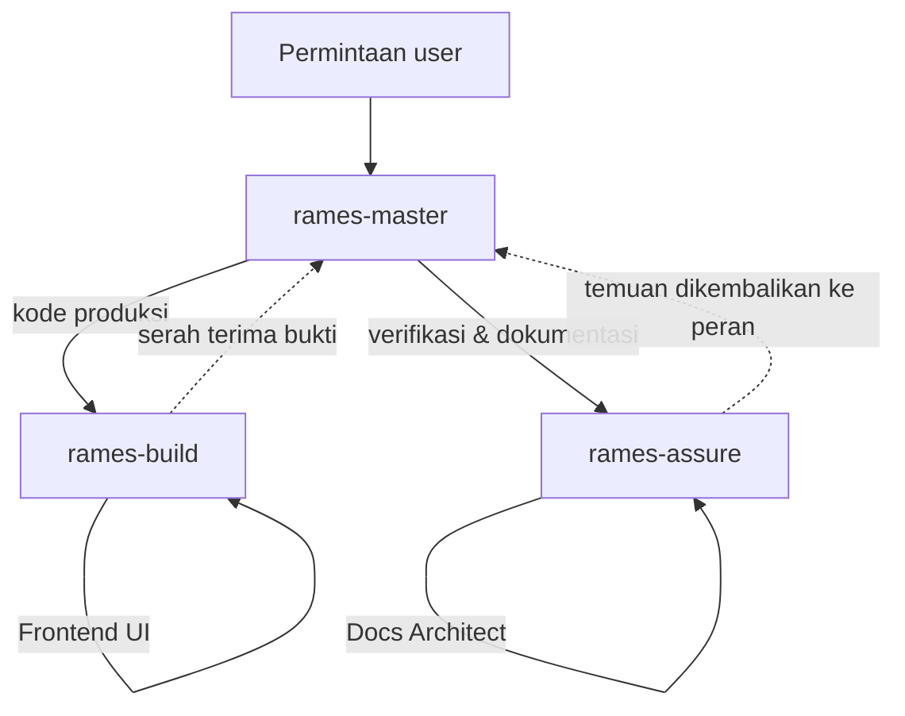

# Agent Rames untuk OpenCode V2

Folder `.opencode/agents/` berisi tim agent OpenCode untuk project **Rames** (deploy dashboard, Webman PHP 8.1+). Ini adalah **adaptasi** dari 7 custom agent VS Code Copilot di `.github/agents/` (yang tetap dipertahankan; lihat `.github/agents/README.md`).

Pola baru: **1 orkestrator + 2 tim** (dari semula 1 orkestrator + 6 spesialis berdomain tunggal). Tujuannya memangkas jumlah subagent tanpa kehilangan batas tanggung jawab, dengan domain digabung menjadi peran-peran di dalam tim.

## Daftar Agent

| File | Agent ID | Mode | Peran | Permissions |
|---|---|---|---|---|
| `rames-master.md` | `rames-master` | `all` | Orkestrator: pecah task, rutekan ke tim, koordinasi, rangkum bukti | Baca/edit/shell + boleh memanggil **hanya** `rames-build` & `rames-assure` |
| `rames-build.md` | `rames-build` | `subagent` | Tim implementasi, 4 peran: Backend PHP, Deploy & Docker, Auth & Security, Frontend UI | Edit/shell penuh, tapi tidak boleh mengedit `database/`, `apps/`, `nginx-status/`, `.github/`, `.opencode/`; tidak boleh memanggil subagent |
| `rames-assure.md` | `rames-assure` | `subagent` | Tim assurance independen, 2 peran: Verifier, Docs Architect | Baca/shell; edit hanya `*.md` dan `tests/*`; tidak boleh memanggil subagent |

> `rames-master` memakai `mode: all` agar bisa dipilih sebagai agent utama suatu sesi. Untuk mendelegasikan ke kedua tim ia **harus berjalan sebagai primary** — kedalaman nesting subagent OpenCode default adalah 1, sehingga orkestrator yang berjalan sebagai subagent tidak bisa menurunkan tim.

## Peta Perutean

Urutan yang disarankan untuk fitur lintas lapisan:
**Auth & Security (kontrak hak) → Backend PHP (endpoint & logika) → Deploy & Docker (bila menyentuh runtime) → Frontend UI (konsumsi endpoint) → Verifier (bukti) → Docs Architect (dokumentasi).**

## Cara Memakai

- **Agent utama**: pilih `rames-master` untuk pekerjaan multi-lapisan. Ia akan memanggil `rames-build`/`rames-assure` dengan menyebut peran.
- **Panggil tim langsung**: sebut agent di chat, mis.
  - *"pakai rames-build dengan Peran: Deploy & Docker untuk menyelidiki kenapa `compose up` gagal"*.
  - *"pakai rames-assure dengan Peran: Verifier untuk menguji perubahan ini"*.
- **Satu pemanggilan = satu peran.** Untuk pekerjaan lintas domain, pecah menjadi beberapa panggilan berurutan.

## Pemetaan dari Agent Lama

| Agent lama (`.github/agents/`) | Sekarang |
|---|---|
| Rames PM (Orkestrator) | `rames-master` |
| Rames Backend PHP | `rames-build` · Peran: Backend PHP |
| Rames Deploy & Docker | `rames-build` · Peran: Deploy & Docker |
| Rames Auth & Security | `rames-build` · Peran: Auth & Security |
| Rames Frontend UI | `rames-build` · Peran: Frontend UI |
| Rames Verifier | `rames-assure` · Peran: Verifier |
| Rames Docs Architect | `rames-assure` · Peran: Docs Architect |

Pemisahan **Build vs Assurance** sengaja dipilih agar aturan lama **"verifikasi tidak boleh dilakukan oleh penulis perubahan"** tetap terjaga: `rames-build` menulis kode produksi, `rames-assure` memverifikasi dan tidak pernah mengedit kode produksi.

## Konvensi Batas Domain

- **Otorisasi = satu pintu** (`AppAccess`).
- **Eksekusi proses = satu jalur** (`ProcessRunner` + `SigchldGuard`).
- **Kontrak endpoint** ditentukan Backend PHP; Frontend UI tidak mengubah bentuk respons.
- **Verifikasi bukan oleh penulis perubahan** — gunakan `rames-assure`.
- **Dokumentasi** (`SPECS.md`, `ARCHITECTURE.md`, customization agent) dikelola `rames-assure` · Peran: Docs Architect.

## Merawat Agent

1. `description` di frontmatter adalah permukaan penemuan agent (dipakai model untuk memilih subagent) — pertahankan frasa pemicu.
2. Frontmatter V2 hanya memakai field native: `description`, `mode`, `color`, `permissions`, `model`, `steps`, `hidden`. **Jangan** pakai field V1 (`tools`, `permission`, `disable`, `maxSteps`).
3. Aturan `permissions` bersifat *last match wins*; taruh aturan luas dulu, pengecualian spesifik setelahnya.
4. Jangan biarkan dua peran punya wilayah tumpang tindih; perbarui tabel & diagram di README ini bila berubah.
5. Konsistensi dokumentasi & frontmatter ditinjau oleh `rames-assure` · Peran: Docs Architect.
