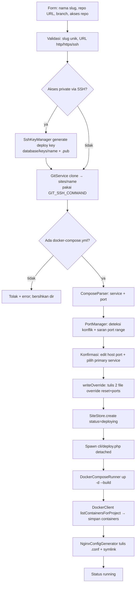

# ARCHITECTURE.md — Rames (Deploy Dashboard)

Dokumen ini menjelaskan **struktur kode** dan **cara kerja** project. Untuk spesifikasi kebutuhan & keputusan produk, lihat [`SPECS.md`](./SPECS.md).

---

## 1. Ringkasan

Rames (Phase 1) adalah aplikasi **Webman (PHP 8.1+)** yang berjalan **di dalam container Docker sebagai root**, mengelola:

- **Site** — project yang di-deploy dari repo Git berisi `docker-compose.yml`
- **Container** — hasil `docker compose` tiap site (dijalankan pada daemon Docker *host* lewat socket)
- **Reverse proxy** — config Nginx ditulis ke direktori host (di-mount), Nginx native di host mem-forward subdomain ke port site

Arsitektur disiapkan agar logika eksekusi (`DeployerInterface`) bisa diekstrak menjadi **agent HTTP terpisah** di fase berikutnya (multi-server) tanpa merombak controller/business logic.

---

## 2. Diagram Arsitektur (Phase 1)

```mermaid
flowchart TB
    subgraph Host
        N[Nginx native<br/>:80 / :443]
        DNS[DNS wildcard *.APP_DOMAIN]
        NAvail[/etc/nginx/sites-available]
        NEnab[/etc/nginx/sites-enabled]
        WH[Watcher host - inotifywait + nginx -s reload<br/>(belum dipasang)]
    end

    subgraph Dashboard[rames-webman container]
        App[Webman HTTP]
        Lib[app/library - logika bisnis]
        DClient[DockerClient - Engine API]
        DCRun[DockerComposeRunner - CLI compose]
        NGGen[NginxConfigGenerator]
        GSvc[GitService]
        Worker[cli/deploy.php - background worker]
    end

    Daemon[(Docker Engine host)]

    App --> Lib
    App -- spawn detached --> Worker
    Lib --> GSvc
    Lib --> DClient
    Lib --> DCRun
    Lib --> NGGen
    Worker --> DCRun
    Worker --> DClient
    Worker --> NGGen
    DClient -- unix socket --> Daemon
    DCRun -- unix socket --> Daemon
    Daemon --> SiteA[Site A containers]
    Daemon --> SiteB[Site B containers]
    NGGen -- tulis .conf --> NAvail
    NAvail -. symlink .-> NEnab
    NAvail -- notifikasi perubahan --> WH
    WH -- reload --> N
    DNS -.-> N
    N -- proxy_pass 127.0.0.1:host_port --> SiteA
    N -- proxy_pass 127.0.0.1:host_port --> SiteB
```

**Poin kunci:**
- Dashboard **tidak** menjalankan `nginx -s reload` langsung ke host via shell — ia hanya menulis file `.conf` ke direktori yang di-mount; reload diaktifkan watcher host (`nginx -t && nginx -s reload`, SPECS §8.3) atau, sementara watcher belum ada, via helper container `--pid host` yang me-chroot ke root host pada Docker socket (`NginxReloader`, SPECS §8.4).
- Semua operasi Docker dijalankan lewat `/var/run/docker.sock` yang di-mount → berjalan pada **daemon Docker host** (bukan daemon di dalam container).

---

## 3. Mode Menjalankan (Environment)

- Dashboard = container `rames-webman` (berjalan sebagai **root**), akses `http://host:{APP_PORT}`.
- Kode di-mount dengan path **sama dengan host** — `"${PWD}:${PWD}"` + `working_dir: ${PWD}`. Ini **krusial**: karena `docker compose` dieksekusi *di dalam container* tetapi daemon-nya *di host*, relative volume mount di `docker-compose.yml` milik site harus terselesaikan ke **path host yang valid**. Memakai `/app` membuat bind jadi `/app/sites/...` yang tidak dikenal daemon.
- `docker.sock` di-mount → dashboard mengeksekusi `docker compose` pada daemon host.
- Direktori Nginx host (`sites-available`/`sites-enabled`) di-mount → dashboard menulis file config; reload dilakukan watcher/manual di host.
- `/etc/letsencrypt` host di-mount → certbot (container) menulis sertifikat; nginx host membaca dari path yang sama.
- Container memakai `dns:` eksplisit (`DNS_1`/`DNS_2`) karena `/etc/resolv.conf` host pada environment ini bermasalah (symlink rusak) sehingga resolver internal Docker tak punya upstream.

---

## 4. Komponen & Lapisan

### 4.1 Lapisan HTTP — `app/controller/`

Controller hanya **mediator**: tidak memuat logika bisnis, tidak menyimpan state di properti (Webman persistent → `controller_reuse=false`), dan **tidak** memanggil `session()`/`request()` di konstruktor.

| Controller | Tanggung jawab |
|---|---|
| `AuthController` | Login/logout, session, regenerasi session id (anti fixation) |
| `SiteController` | Wizard create site, halaman detail & halaman versi (`/sites/{id}/versions`), aksi (rebuild/rollback/stop/start/delete dengan mode preserve/purge volume — tombol Delete di tab khusus "Hapus Site"), set/hapus custom domain, kelola environment variable site (simpan + auto-recreate, import `.env.example`), kelola external network (shared network lintas-site via compose override), endpoint polling status |
| `NginxController` | Halaman `/nginx` (global): status reload Nginx host terakhir + tombol Reload — Nginx bersifat global (berlaku untuk semua site), di luar detail site |
| `VolumeController` | Halaman `/volumes`: daftar volume ber-label compose + bersihkan volume **yatim** (ditinggalkan site yang dihapus dengan mode preserve) |
| `NetworkController` | Halaman `/networks`: daftar semua network Docker (built-in diberi label & dilindungi, milik site aktif ditandai "dikelola site"), buat shared network (bridge/overlay/macvlan + IPAM + flag attachable/internal), detail network (container terhubung + connect/disconnect), hapus network dengan proteksi berlapis (built-in / dipakai container / milik site aktif ditolak) |
| `UserController` | Kelola user (tambah/hapus, ganti password) |

### 4.2 Middleware — `app/middleware/`

| Middleware | Peran |
|---|---|
| `CsrfMiddleware` | Validasi token CSRF untuk semua POST/PUT/PATCH/DELETE |
| `AuthMiddleware` | Lindungi semua route kecuali `/login` & aset statis; JSON 401 untuk request `/api/*` yang tidak login |
| `StaticFile` | Tolak akses path berisi `/.` (bawaan webman) |

Terdaftar global di `config/middleware.php` dengan urutan: CSRF → Auth → StaticFile.

### 4.3 Lapisan Bisnis — `app/library/`

Semua logika bisnis ada di sini (controller tidak boleh berisi logika). Modul:

| Modul | Kelas | Peran |
|---|---|---|
| **Storage** | `JsonStore` | Baca/tulis JSON dengan `flock` + backup `.bak`; `update()` atomik (tulis in-place, ownership file host terjaga) |
| | `SiteStore` | CRUD entri site di `database/sites.json` |
| **Auth** | `UserStore` | CRUD user di `database/auth.json`; hash bcrypt, `password_verify` |
| **Support** | `ProcessRunner` | Eksekusi command eksternal via `proc_open` (**array + `bypass_shell`** → tanpa shell, bebas command injection) + timeout |
| **Git** | `GitService` | `git clone` (depth 1) & `git pull --ff-only`; mendukung repo private via deploy key SSH (`GIT_SSH_COMMAND`) |
| | `SshKeyManager` | Generate/read/hapus pasangan kunci SSH (deploy key per site) di `database/keys/` |
| **Docker** | `ComposeParser` | Parse `docker-compose.yml` (short/long syntax port, IP binding) via `symfony/yaml` |
| | `PortManager` | Deteksi konflik port terhadap `sites.json`, saran port dari range, validasi port |
| | `DockerClient` | Client Engine API (Guzzle + `CURLOPT_UNIX_SOCKET_PATH`): list/inspect container, list volume (per project / semua), list/inspect/buat network, connect/disconnect container ke network, hapus network, ping |
| | `DockerComposeRunner` | CLI `docker compose` untuk **orkestrasi**: up/down/build/stop/start/pull; `removeVolumes()` untuk `docker volume rm` (teardown selektif) |
| **Nginx** | `NginxConfigGenerator` | Render & tulis config `.conf` + symlink ke `sites-enabled`; `ensureWritable()` fail-fast; render multi server block per site (subdomain + custom domain, redirect 301, blok `listen 443 ssl`, `location /.well-known/acme-challenge/`) |
| | `NginxStatusReader` | Baca status reload terakhir watcher (`last-reload.json`) |
| | `NginxReloader` | Reload nginx HOST via helper container (`--pid host --privileged`, chroot ke root host) pada Docker socket; tulis `last-reload.json`; dipakai tombol "Reload Nginx" di halaman `/nginx` + auto-reload setelah set/hapus custom domain, deploy/rebuild, dan SSL (best-effort) |
| **SSL** | `SslIssuer` | Terbitkan/revoke sertifikat Let's Encrypt via certbot (HTTP-01 webroot / DNS-01 Cloudflare), cek kedaluwarsa cert |
| | `SslController` | Halaman `/ssl`: daftar domain (subdomain/custom) + status SSL + tombol Aktifkan SSL / Retry |
| **Deploy** | `DeployerInterface` | Abstraksi eksekusi deploy (siap diganti `HttpDeployer` untuk multi-server); termasuk `rollback()` dan `applyEnv()` (terapkan env var tanpa rebuild source) |
| `LocalDeployer` | Implementasi lokal: up → collect container → tulis config Nginx (termasuk custom domain & redirect subdomain); `rollback()` = fetch+checkout ref lama + rebuild, auto-restore ke versi aktif bila gagal, catat `deploy_history`; `applyEnv()` = tulis env + external networks + `up -d` (recreate); deploy/rebuild/rollback ikut `sync()` env + external networks |
| `EnvManager` | Kelola environment variable site: tulis managed env file (`database/env/{name}.env`, dipakai compose via `--env-file`) + override env (`docker-compose.override.env.yml`, inject `environment:` literal ke semua service); parse `.env.example` untuk import; `sync()` idempoten |
| `NetworkManager` | Kelola external network site: tulis `docker-compose.override.networks.yml` (deklarasi `external: true` + `networks: [default, <ext>]` ke semua service; merge compose `networks` union); `sync()` idempoten; dipanggil controller & `LocalDeployer` agar file konsisten dengan `sites.json` |
| | `DeployerFactory` | Satu-satunya titik pembuatan `DeployerInterface` |

### 4.4 Background Worker — `cli/deploy.php`

- Dipanggil detached oleh `SiteController` via **`pcntl_fork` + `pcntl_exec`** (bukan `proc_open`). Alasan: `proc_close()` memblokir request sampai worker selesai — build bisa berlangsung menit, sehingga timeout/refresh browser tampak "menggagalkan" deploy. Dengan fork + exec + `SIGCHLD=SIG_IGN`: request langsung kembali (hanya fork), worker berjalan detached (`posix_setsid`, stdio → `/dev/null`) dan tetap lanjut meski HTTP worker di-restart, serta tanpa zombie (kernel otomatis reap). Logging tetap oleh worker sendiri (`file_put_contents`).
- UI deploy/rebuild memakai **AJAX + polling**: `fetch` pada tombol (tanpa navigasi halaman) + polling `/api/sites/{id}/status` menampilkan progres live (progress bar + stage + pesan). Bila halaman di-refresh saat build berjalan, page mendeteksi status `deploying` (panel `data-busy`) lalu melanjutkan polling otomatis sampai `running`/`error`.
- Mode: `deploy`, `rebuild`, `rollback` (dengan argumen ref SHA). Pipeline per tahap menulis status ke `sites.json` (via `SiteStore->update`, `flock`), sehingga UI bisa *poll*:
  `deploying` → `build` → `collect` → `nginx` → `running` (atau `error`).
- Setelah selesai, persisten `containers` dan `deploy_history` kembali ke `sites.json`.
- Log per site: `runtime/logs/deploy/{siteId}.log`.
- Worker SSL: `cli/ssl.php` — jalankan `certbot certonly`, update `ssl_status`/`ssl_expires_at`, tulis ulang config Nginx dengan SSL (log `runtime/logs/ssl/{siteId}.log`).

### 4.5 Storage

- `database/auth.json` — array user (id, username, password_hash, created_at).
- `database/sites.json` — array site (struktur lengkap di SPECS §7.1): id, name, subdomain, repo_url, branch, local_path, primary_service, status, compose_files, auth_method, ssh_key, containers, timestamp, env (map KEY=value, SPECS §7.6).
- `database/keys/` — pasangan kunci SSH (deploy key per site, chmod 0600) + `known_hosts`; private key tidak pernah keluar server.
- `database/env/{name}.env` — managed env file per site (chmod 0600); dibaca docker compose via `--env-file`.
- Semua mutasi lewat `JsonStore->update()` dengan `flock` → aman dari race condition.
- Direktori `sites/`, `database/*.json`, `database/keys/`, `database/env/`, `nginx-status/` di-gitignore (data runtime).

---

## 5. Alur Utama

### 5.1 Create Site (end-to-end)



Detil penting:

- **Repo private via deploy key SSH**: sistem membangkitkan keypair ed25519 per site (`database/keys/{name}`) sebelum clone. Public key ditampilkan di form/konfirmasi untuk ditambahkan user sebagai Deploy Key repo (Settings → Deploy keys). Bila clone gagal karena key belum ditambahkan, form dirender ulang bersama public key (kunci dipakai ulang saat percobaan berikutnya). `git pull` saat Rebuild memakai key yang sama.
- **Override port dua lapis** (`writeOverride`): karena docker compose **menggabungkan** daftar `ports` (base + override, bukan mengganti), port bawaan repo harus di-reset dulu:
  1. `docker-compose.override.yml` → `ports: !reset []` (tag YAML, via `Symfony\Component\Yaml\Tag\TaggedValue`)
  2. `docker-compose.override.ports.yml` → `ports: [host:container]` (hasil edit user)
  → `compose_files` menyimpan ketiganya. File compose asli repo tetap bersih.
- Service **tanpa port exposed** (mis. `php-fpm`) dilewati di validasi port & tidak ditulis override; tidak bisa dipilih sebagai primary service.
- Langkah konfirmasi memanggil `ensureWritable()` (cek izin tulis direktori Nginx) agar gagal cepat dengan pesan jelas, bukan di tengah build.

### 5.2 Rebuild

`SiteController::rebuild` → spawn worker mode `rebuild` → `LocalDeployer::rebuild`: `git pull --ff-only` → `docker compose up -d --build` → collect container → tulis ulang config Nginx → status `running`.

### 5.3 Stop / Start

Sinkron via `DockerComposeRunner->stop()/start()` (cepat), lalu update status di `sites.json`.

### 5.4 Delete

Delete dua mode (modal konfirmasi di detail site):

- **Hapus & pertahankan volume** (default, aman): `LocalDeployer::teardown($site, $preserveVolumes)` → `docker compose down` (tanpa `-v`), lalu `docker volume rm` hanya volume project yang **tidak** dicentang (via `DockerClient::listVolumesForProject` + `DockerComposeRunner::removeVolumes`). Named volume yang dipertahankan akan **dipakai ulang otomatis** saat site dibuat ulang dengan nama yang sama (project name compose = nama site) — data DB tidak hilang.
- **Hapus total** (`mode=purge`): `LocalDeployer::teardown($site, null)` → `docker compose down -v` (semua named + anonymous volume terhapus permanen; butuh konfirmasi tambahan).

Lalu: hapus config Nginx (+ symlink) → hapus direktori `sites/{name}` → hapus entri dari `sites.json`. Volume **yatim** (project-nya sudah tidak ada di `sites.json`) dapat dilihat & dibersihkan di halaman `/volumes` (`VolumeController`).

### 5.5 Autentikasi

1. `/login` → `UserStore::verify` (`password_verify`, bcrypt).
2. Sukses → regenerasi session id → set `user` di session.
3. Semua route (kecuali `/login`) dilindungi `AuthMiddleware`.
4. Logout → hapus `user` + flush session.

### 5.6 Custom Domain & SSL per Domain

1. Halaman detail site → form **Set Custom Domain** (FQDN publik valid, unik di semua site, bukan subdomain sendiri).
2. Set → update `sites.json` (`custom_domain` + `custom_ssl_status=disabled`) → tulis ulang config Nginx: subdomain menjadi block redirect `301` ke `http(s)://{custom_domain}`, custom domain melayani app (`LocalDeployer::renderNginxConfig`).
3. Ganti/hapus custom domain → `SslIssuer::revoke()` mencabut sertifikat lama (no-op bila belum ada cert), lalu config ditulis ulang (subdomain kembali melayani app).
4. SSL custom domain → tombol di detail site & `/ssl` → spawn `cli/ssl.php <siteId> <domain>`; worker menentukan slot `custom_ssl` (bila domain = `custom_domain`) atau `ssl` (subdomain), menjalankan certbot, lalu tulis ulang config Nginx.

### 5.7 Rollback (kembali ke versi sebelumnya)

1. Setiap deploy/rebuild **sukses** mencatat `git rev-parse HEAD` ke `deploy_history` (field baru di `sites.json`, maks. 20 entri) — inilah checkpoint rollback. Rollback sendiri juga menambah entri (reversibel).
2. Halaman **Versi** (`/sites/{id}/versions`) menampilkan seluruh checkpoint; tombol **↶ Rollback** pada entri sukses/restored (bukan versi aktif). Detail site menampilkan 5 terakhir + link ke halaman versi. Guard: ditolak saat status `deploying` (busy).
3. `SiteController::rollback` → set `deploying` → spawn `cli/deploy.php <id> rollback <full_sha>` (detached).
4. `LocalDeployer::rollback`: `git fetch origin <sha>` (repo shallow `--depth 1` → SHA lama di-fetch dari remote) → `git checkout <sha>` → `docker compose up -d --build` → collect → tulis ulang config Nginx → `running`.
5. Bila build versi lama **gagal** → auto-`git checkout` kembali ke versi aktif sebelumnya + `up -d --build` (restore best-effort); bila restore gagal → status `error`.
6. Non-destruktif: volume Docker tidak dihapus (`down -v` tidak dijalankan). Override ports dashboard (`docker-compose.override*.yml`, untracked) dipertahankan — hanya source tracked yang ikut ke versi lama. Rebuild berikutnya memanggil `git checkout {branch}` dulu untuk keluar dari detached HEAD.
7. Unit test fitur: `tests/` (PHPUnit 10) — jalankan `composer test`. `DeployerFactory` mendukung override env `DEPLOYER_CLASS` (hook test) untuk fake deployer tanpa daemon Docker; `cli/deploy.php` mode rollback diuji end-to-end via subproses (`CliDeployRollbackTest`).

### 5.8 Kelola Network & Shared Network Lintas-Site

1. **Halaman `/networks`** (nav topbar, `NetworkController`): daftar semua network Docker dengan status — **built-in** (`bridge`/`host`/`none`/`ingress`/`docker_gwbridge`) diberi label & tidak bisa dihapus; network compose milik site aktif ditandai "dikelola site"; network yang dipakai container diblokir hapus (Engine menolak 409). Dari sini bisa **buat shared network** (driver bridge/overlay/macvlan + IPAM subnet/gateway/ip-range + flag `attachable`/`internal`), **hubungkan/putuskan container** (dengan alias network opsional), dan hapus network yang bebas.
2. **Tab Network di detail site** — koneksi **persisten** lintas-site: pilih shared network, `NetworkManager` menulis `docker-compose.override.networks.yml` (`networks: {name}: {external: true}` + tiap service `networks: [default, <ext>...]`; merge compose `networks` bersifat union sehingga network base dipertahankan), lalu `up -d` (recreate) tanpa rebuild. Koneksi ini tidak hilang saat Rebuild/Rollback.
3. **Catatan**: `docker network connect` manual (dari halaman detail network) **hilang** saat compose me-recreate container; untuk koneksi yang persisten gunakan tab Network di detail site.

---

## 6. Keputusan Teknis Penting

- **Anti command injection**: `ProcessRunner` memakai bentuk **array + `bypass_shell`** (langsung `execve`, tanpa shell) — lebih ketat daripada string + `escapeshellarg`.
- **Hybrid Docker**: CLI `docker compose` untuk orkestrasi (up/down/build), `DockerClient` (Engine API via unix socket) untuk operasi baca status. Ini menghindari SDK yang tak punya semantik `compose up`.
- **Overwrite port via `!reset`**: solusi atas perilaku merge daftar `ports` docker compose; butuh compose **v2.6+**.
- **JSON in-place write**: `JsonStore::update()` menulis pada file yang sudah ada (`fopen c+`) sehingga ownership file tetap milik host — nyaman saat file di-share host↔container.
- **Tanpa state lintas-request**: tidak ada property controller yang menyimpan data; semua state di session/file.
- **Mount path sama dengan host (`${PWD}:${PWD}`)**: syarat agar relative bind mount milik site terselesaikan ke path host oleh daemon.

---

## 7. Keamanan (Phase 1)

- Password bcrypt; tidak pernah plaintext / di-log.
- CSRF token untuk semua mutasi.
- Input divalidasi ketat (slug `[a-z0-9-]`, URL http/https, branch, port int 1–65535).
- Eksekusi command tanpa shell (lihat §6).
- Deploy key SSH per site: private key di `database/keys/` (chmod 0600, gitignored), hanya public key yang ditampilkan; `GIT_SSH_COMMAND` memakai `IdentitiesOnly=yes`, `StrictHostKeyChecking=accept-new`, dan `UserKnownHostsFile` milik sistem.
- SSL: sertifikat Let's Encrypt hanya diaktifkan untuk domain publik (`SslIssuer::isPublicDomain`); `/etc/letsencrypt` di-mount baca-tulis ke container; `CLOUDFLARE_CREDS` (API token) via file dengan izin ketat, bukan hard-coded.
- `docker.sock` di-mount adalah risiko yang disengaja; semua akses dashboard di balik autentikasi.
- Direktori Nginx host yang di-mount dibatasi hanya `sites-available/` + `sites-enabled/`.

---

## 8. Batasan & Future Work

- **Watcher reload Nginx belum ada** (SPECS §8.3) — otomatisasi via `inotifywait` dijadwalkan. Pengganti sementara: dashboard me-reload nginx host lewat Docker socket (`NginxReloader`) — tombol "Reload Nginx" + auto-reload setelah set/hapus custom domain, deploy/rebuild, dan SSL (best-effort, non-fatal).
- **SSL otomatis** (SPECS §8a) sudah diimplementasikan: halaman `/ssl` + worker `cli/ssl.php` menjalankan certbot di container (HTTP-01 webroot / DNS-01 Cloudflare). Otomasi renewal `certbot renew` di host tetap prasyarat manual.
- **Deteksi konflik port** hanya terhadap site terkelola sendiri (SPECS §7.2), bukan container eksternal di host.
- Ekstraksi `DeployerInterface` → agent HTTP terpisah (multi-server).
- Role & permission antar user.
- Log viewer real-time per container.
- Migrasi JSON → SQLite/RDBMS bila skala bertambah.
- Rootless Podman sebagai pengganti `docker.sock` untuk isolasi lebih baik.
