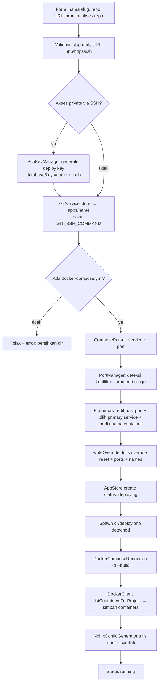

# ARCHITECTURE.md — Rames (Deploy Dashboard)

Dokumen ini menjelaskan **struktur kode** dan **cara kerja** project. Untuk spesifikasi kebutuhan & keputusan produk, lihat [`SPECS.md`](./SPECS.md).

---

## 1. Ringkasan

Rames (Phase 1) adalah aplikasi **Webman (PHP 8.1+)** yang berjalan **di dalam container Docker sebagai root**, mengelola:

- **App** — project yang di-deploy dari repo Git berisi `docker-compose.yml`
- **Container** — hasil `docker compose` tiap app (dijalankan pada daemon Docker *host* lewat socket)
- **Reverse proxy** — config Nginx ditulis ke direktori host (di-mount), Nginx native di host mem-forward subdomain ke port app

Arsitektur disiapkan agar logika eksekusi (`DeployerInterface`) bisa diekstrak menjadi **agent HTTP terpisah** di fase berikutnya (multi-server) tanpa merombak controller/business logic.

---

## 2. Diagram Arsitektur (Phase 1)

```mermaid
flowchart TB
    subgraph Host
        N[Nginx native<br/>:80 / :443]
        DNS[DNS wildcard *.APP_DOMAIN]
        NAvail[/etc/nginx/sites-available]
        NEnab[/etc/nginx/sites-enabled]
        WH[Watcher host - inotifywait + nginx -s reload<br/>(belum dipasang)]
    end

    subgraph Dashboard[rames-webman container]
        App[Webman HTTP]
        Lib[app/library - logika bisnis]
        DClient[DockerClient - Engine API]
        DCRun[DockerComposeRunner - CLI compose]
        NGGen[NginxConfigGenerator]
        GSvc[GitService]
        Worker[cli/deploy.php - background worker]
    end

    Daemon[(Docker Engine host)]

    App --> Lib
    App -- spawn detached --> Worker
    Lib --> GSvc
    Lib --> DClient
    Lib --> DCRun
    Lib --> NGGen
    Worker --> DCRun
    Worker --> DClient
    Worker --> NGGen
    DClient -- unix socket --> Daemon
    DCRun -- unix socket --> Daemon
    Daemon --> AppA[App A containers]
    Daemon --> AppB[App B containers]
    NGGen -- tulis .conf --> NAvail
    NAvail -. symlink .-> NEnab
    NAvail -- notifikasi perubahan --> WH
    WH -- reload --> N
    DNS -.-> N
    N -- proxy_pass 127.0.0.1:host_port --> AppA
    N -- proxy_pass 127.0.0.1:host_port --> AppB
```

**Poin kunci:**
- Dashboard **tidak** menjalankan `nginx -s reload` langsung ke host via shell — ia hanya menulis file `.conf` ke direktori yang di-mount; reload diaktifkan watcher host (`nginx -t && nginx -s reload`, SPECS §8.3) atau, sementara watcher belum ada, via helper container `--pid host` yang me-chroot ke root host pada Docker socket (`NginxReloader`, SPECS §8.4).
- Semua operasi Docker dijalankan lewat `/var/run/docker.sock` yang di-mount → berjalan pada **daemon Docker host** (bukan daemon di dalam container).

---

## 3. Mode Menjalankan (Environment)

- Dashboard = container `rames-webman` (berjalan sebagai **root**), akses `http://host:{APP_PORT}`.
- Kode di-mount dengan path **sama dengan host** — `"${PWD}:${PWD}"` + `working_dir: ${PWD}`. Ini **krusial**: karena `docker compose` dieksekusi *di dalam container* tetapi daemon-nya *di host*, relative volume mount di `docker-compose.yml` milik app harus terselesaikan ke **path host yang valid**. Memakai `/app` membuat bind jadi `/app/apps/...` yang tidak dikenal daemon.
- `docker.sock` di-mount → dashboard mengeksekusi `docker compose` pada daemon host.
- Direktori Nginx host (`sites-available`/`sites-enabled`) di-mount → dashboard menulis file config; reload dilakukan watcher/manual di host.
- `/etc/letsencrypt` host di-mount → certbot (container) menulis sertifikat; nginx host membaca dari path yang sama.
- Container memakai `dns:` eksplisit (`DNS_1`/`DNS_2`) karena `/etc/resolv.conf` host pada environment ini bermasalah (symlink rusak) sehingga resolver internal Docker tak punya upstream.

---

## 4. Komponen & Lapisan

### 4.1 Lapisan HTTP — `app/controller/`

Controller hanya **mediator**: tidak memuat logika bisnis, tidak menyimpan state di properti (Webman persistent → `controller_reuse=false`), dan **tidak** memanggil `session()`/`request()` di konstruktor.

| Controller | Tanggung jawab |
|---|---|
| `AuthController` | Login/logout, session, regenerasi session id (anti fixation), migrasi kepemilikan app lama (best-effort) |
| `AppController` | Wizard create app, halaman detail & halaman versi (`/apps/{id}/versions`), aksi (rebuild/rollback/stop/start/delete dengan mode preserve/purge volume — tombol Delete di tab khusus "Hapus App"), set/hapus custom domain, kelola environment variable app (simpan + auto-recreate, import `.env.example`), kelola external network (shared network lintas-app via compose override), kelola **nama container** (prefix `container_name`, §5.12), kelola **kepemilikan & sharing** (tab Akses: tambah/ubah/cabut member, transfer owner), endpoint polling status. Daftar app difilter ke app yang boleh diakses user |
| `TerminalController` | Terminal container (`docker exec`): buka sesi interaktif (open), stream output (SSE), kirim input, tutup sesi, dan one-shot run command; container divalidasi milik app **dan** user berhak (ability `terminal`); audit log ke `runtime/logs/terminal/` |
| `LogController` | Log container app (`docker logs`) untuk popup modal di detail app: `GET /api/apps/{id}/logs?container=&tail=`; ability `logs` (Viewer ke atas); nama container selalu divalidasi milik app (`AppContainers::resolve`) sebelum menyentuh Engine |
| `NginxController` | Halaman `/nginx` (global): status reload Nginx host terakhir + tombol Reload (khusus admin) — Nginx bersifat global (berlaku untuk semua app), di luar detail app |
| `DatabaseController` | Database manager (phpMyAdmin mini) + halaman `/database`. Daftar container difilter per kepemilikan app (non-admin: hanya app yang boleh diakses, tanpa container eksternal). **`findOwningApp()` adalah titik otorisasi tunggal** untuk semua endpoint DB (inspect/query/CRUD baris/user/dump) — koneksi Engine & kredensial hanya disentuh setelah otorisasi lolos |
| `VolumeController` | Halaman `/volumes`: daftar volume ber-label compose + bersihkan volume **yatim** (ditinggalkan app yang dihapus dengan mode preserve); daftar disaring ke app yang boleh diakses, purge hanya admin. Kolom **Ukuran** (storage terpakai per volume) dimuat asinkron dari `GET /api/volumes/usage` (`VolumeUsage::summarize` atas `GET /system/df`) agar render halaman tidak menunggu Engine menelusuri filesystem |
| `NetworkController` | Halaman `/networks`: daftar network Docker (built-in diberi label & dilindungi, milik app aktif ditandai "dikelola app"), buat shared network (bridge/overlay/macvlan + IPAM + flag attachable/internal), detail network (container terhubung + connect/disconnect), hapus network dengan proteksi berlapis (built-in / dipakai container / milik app aktif ditolak). Operasi global (buat/hapus/connect/disconnect) hanya admin; daftar disaring per app yang boleh diakses |
| `UserController` | Kelola user — **khusus admin**: tambah/hapus user, ubah role (admin/member), ganti password. Menghapus user **mengalihkan app miliknya** ke admin yang menghapus |
| `SslController` | Halaman `/ssl`: daftar domain (subdomain/custom) + status SSL + tombol Aktifkan SSL / Retry; spawn worker `cli/ssl.php` |
| `IndexController` | Halaman utama dashboard (`view('index/hello')`) |

### 4.2 Middleware — `app/middleware/`

| Middleware | Peran |
|---|---|
| `CsrfMiddleware` | Validasi token CSRF untuk semua POST/PUT/PATCH/DELETE |
| `AuthMiddleware` | Lindungi semua route kecuali `/login` & aset statis; JSON 401 untuk request `/api/*` yang tidak login; **menyinkronkan user session dengan `auth.json`** pada setiap request (user dihapus → sesi dibuang; role berubah → langsung berlaku) |
| `StaticFile` | Tolak akses path berisi `/.` (bawaan webman) |

Terdaftar global di `config/middleware.php` dengan urutan: CSRF → Auth → StaticFile.

### 4.3 Lapisan Bisnis — `app/library/`

Semua logika bisnis ada di sini (controller tidak boleh berisi logika). Modul:

| Modul | Kelas | Peran |
|---|---|---|
| **Storage** | `JsonStore` | Baca/tulis JSON dengan `flock` + backup `.bak`; `update()` atomik (tulis in-place, ownership file host terjaga) |
| | `AppStore` | CRUD entri app di `database/apps.json` + kepemilikan (`owner_id`, `members`): `addMember()`, `removeMember()`, `transferOwner()`, `transferAllFrom()`, `ownedBy()`, `assignMissingOwners()` |
| **Auth** | `UserStore` | CRUD user di `database/auth.json`; hash bcrypt, `password_verify`; **role global** `admin`/`member` (`roleOf()`, `isAdmin()`, `changeRole()`, `countAdmins()`, `listWithRoles()`) + migrasi lazy berkas lama (user pertama = admin) |
| | `AppAccess` | **Satu-satunya pintu otorisasi app**: `roleFor()`, `can(ability, app, user)`, `require()` (melempar `AppAccessDenied`), `visible()` (filter daftar app), `abilitiesFor()`; stateless (aman untuk worker persistent) |
| | `AppAccessDenied` | Exception `extends BusinessException` yang merender **404** (JSON untuk `/api/*`, halaman 404 untuk request biasa) — menyembunyikan keberadaan app milik user lain |
| | `OwnershipMigrator` | Migrasi idempoten: app tanpa `owner_id` di-assign ke admin pertama |
| **Support** | `ProcessRunner` | Eksekusi command eksternal via `proc_open` (**array + `bypass_shell`** → tanpa shell, bebas command injection) + timeout; memasang `SIGCHLD=SIG_DFL` selama proses hidup agar git/docker compose tidak kehilangan `waitpid()` dan exit code tetap terbaca (§4.4) |
| | `SigchldGuard` | Penjaga disposisi `SIGCHLD` worker persistent: `disableIgnore()`, `withDefault()`, `ignoreAndReap()`, `isIgnored()`; murni statik, no-op bila pcntl tidak tersedia (§4.4) |
| **Git** | `GitService` | `git clone` (depth 1) & `git pull --ff-only`; mendukung repo private via deploy key SSH (`GIT_SSH_COMMAND`) |
| | `SshKeyManager` | Generate/read/hapus pasangan kunci SSH (deploy key per app) di `database/keys/` |
| **Docker** | `ComposeParser` | Parse `docker-compose.yml` (short/long syntax port, IP binding) via `symfony/yaml` |
| | `PortManager` | Deteksi konflik port terhadap `apps.json`, saran port dari range, validasi port |
| | `DockerClient` | Client Engine API (Guzzle + `CURLOPT_UNIX_SOCKET_PATH`): list/inspect container, **log container `containerLogs()` (`/containers/{id}/logs`, respons multiplexed)**, list volume (per project / semua), **pemakaian disk `getDiskUsage()` (`/system/df`, sumber ukuran terpakai volume)**, list/inspect/buat network, connect/disconnect container ke network, hapus network, ping |
| | `ContainerLogs` | Pembersihan stream log multiplexed (`demultiplex()` — buang header 8 byte per frame; teks polos container TTY dikembalikan apa adanya) + normalisasi `tail` (`normalizeTail()`, `tailOptions()`); murni statik |
| | `AppContainers` | Resolusi container milik app: `resolve($app, $name)` (validasi nama — dipakai terminal & log) dan `defaultContainer($app)` (container service `primary_service`, else pertama) |
| | `AppPorts` | Resolusi port app: `all($app)` (gabungan semua port publish tiap container), `forContainer($container)` (**dedupe** — Engine mengembalikan satu entri `Ports[]` per alamat IP untuk publish dual-stack IPv4+IPv6, plus fallback field lama `internal_port`/`host_port`), `proxiedContainerPort($app)` (port yang di-proxy Nginx — menghormati `primary_port`, fallback port pertama service primary), `primaryHostPort($app)` (target `proxy_pass`; dipakai `LocalDeployer` & view detail), `hostPortFor()`; murni statik tanpa I/O |
| | `VolumeUsage` | Pemetaan & format ukuran volume dari `GET /system/df` (`map()`, `summarize()`, `human()` — satuan SI seperti `docker system df`); murni statik tanpa I/O sehingga mudah diuji |
| | `DockerComposeRunner` | CLI `docker compose` untuk **orkestrasi**: up/down/build/stop/start/pull; `removeVolumes()` untuk `docker volume rm` (teardown selektif) |
| | `DockerExec` | Eksekusi `docker exec` ke container app: one-shot `runCommand()` (`sh -c`, timeout) & sesi interaktif `openInteractive()` — PTY via `script` (util-linux) + IPC berbasis FIFO di `runtime/terminal/{token}/` (proses detached, aman lintas-worker); `writeInput()/readOutput()/isRunning()/closeSession()` |
| **Db** | `DbContainerDetector` | Deteksi container MySQL/MariaDB (image `mysql`/`mariadb`/`percona` atau env `MYSQL_*`/`MARIADB_*`). `detectAll($apps, $includeUnowned)`: memetakan container → app pemilik; `$includeUnowned=false` (halaman `/database` non-admin) hanya mengembalikan container milik app yang diberikan — container app user lain & eksternal tidak di-inspect maupun ditampilkan. `detectForApp()` untuk tab Database di detail app |
| | `DbClient` / `DbConnectionResolver` / `DbCredentialResolver` | Koneksi PDO ke MySQL/MariaDB di container (host+port dari inspect) & deteksi otomatis kredensial dari env app/container |
| | `DbDump` / `DbUserManager` | Export/import dump database dan kelola user MySQL (create/delete/grant/revoke) |
| **Nginx** | `NginxConfigGenerator` | Render & tulis config `.conf` + symlink ke `sites-enabled`; `ensureWritable()` fail-fast; render multi server block per app (subdomain + custom domain, redirect 301, blok `listen 443 ssl`, `location /.well-known/acme-challenge/`) |
| | `NginxStatusReader` | Baca status reload terakhir watcher (`last-reload.json`) |
| | `NginxReloader` | Reload nginx HOST via helper container (`--pid host --privileged`, chroot ke root host) pada Docker socket; tulis `last-reload.json`; dipakai tombol "Reload Nginx" di halaman `/nginx` + auto-reload setelah set/hapus custom domain, deploy/rebuild, dan SSL (best-effort) |
| **SSL** | `SslIssuer` | Terbitkan/revoke sertifikat Let's Encrypt via certbot (HTTP-01 webroot / DNS-01 Cloudflare), cek kedaluwarsa cert |
| **Deploy** | `DeployerInterface` | Abstraksi eksekusi deploy (siap diganti `HttpDeployer` untuk multi-server); termasuk `rollback()`, `apply()` (deploy ulang app mode compose tanpa git/build) dan `applyEnv()` (terapkan env var tanpa rebuild source) |
| | `ComposeSource` | Mode sumber app **compose** (create app dari file `docker-compose.yml` yang di-paste/di-upload, tanpa repo Git): `isCompose()`/`source()`, validasi & penyimpanan file unggahan (nama relatif aman, batas ukuran, tolak override generated), `assertDeployable()` (wajib `image:`, tolak `build:`), deteksi file utama, baca/tulis compose, daftar file sumber, serta `planHostPorts()` (port lama dipertahankan, konflik digeser via `PortManager`); murni statik |
| | `ComposeBinds` | Penyiapan **source bind mount** sebelum `docker compose up`: kumpulkan device volume bernama (`driver_opts` + `o: bind`) & bind mount service (short/long syntax), substitusi `${PWD}`/`${VAR}`, buat direktori yang belum ada di dalam direktori app, dan laporkan yang tidak bisa dibuat (file / di luar direktori app) sebagai petunjuk pada pesan error `compose up` (`missingHint()`); murni statik |
| | `ContainerNames` | Override **nama container** (`container_name`) per app (§5.12): skema `{prefix}-{service}`, validasi prefix, tolak service ber-replica, deteksi bentrok nama se-host (`usedFromEngine`/`usedFromApps`), serta `sync()`/`writeOverride()`/`removeOverride()` untuk `docker-compose.override.names.yml`; murni statik |
| `LocalDeployer` | Implementasi lokal: up → collect container → tulis config Nginx (termasuk custom domain & redirect subdomain); `rollback()` = fetch+checkout ref lama + rebuild, auto-restore ke versi aktif bila gagal, catat `deploy_history`; `applyEnv()` = tulis env + external networks + `up -d` (recreate); deploy/rebuild/rollback ikut `sync()` env + external networks |
| `EnvManager` | Kelola environment variable app: tulis managed env file (`database/env/{name}.env`, dipakai compose via `--env-file`) + override env (`docker-compose.override.env.yml`, inject `environment:` literal ke semua service); parse `.env.example` untuk import; `sync()` idempoten |
| `NetworkManager` | Kelola external network app: tulis `docker-compose.override.networks.yml` (deklarasi `external: true` + `networks: [default, <ext>]` ke semua service; merge compose `networks` union); `sync()` idempoten; dipanggil controller & `LocalDeployer` agar file konsisten dengan `apps.json` |
| | `DeployerFactory` | Satu-satunya titik pembuatan `DeployerInterface` |

### 4.4 Background Worker — `cli/deploy.php`

- Dipanggil detached oleh `AppController` via **`pcntl_fork` + `pcntl_exec`** (bukan `proc_open`). Alasan: `proc_close()` memblokir request sampai worker selesai — build bisa berlangsung menit, sehingga timeout/refresh browser tampak "menggagalkan" deploy. Request langsung kembali (hanya fork), worker berjalan detached (`posix_setsid`, stdio → `/dev/null`) dan tetap lanjut meski HTTP worker di-restart. Logging tetap oleh worker sendiri (`file_put_contents`).
- **Jebakan `SIGCHLD` (`SigchldGuard`)** — worker deploy & sesi terminal tidak pernah di-`wait`, jadi proses HTTP worker meng-ignore SIGCHLD (`SIG_IGN`) agar tidak ada zombie. Tetapi `SIG_IGN` **diwariskan melewati `fork` + `exec` dan menetap selama worker hidup** — semua proses yang di-spawn worker itu setelahnya ikut meng-ignore SIGCHLD. Akibatnya: (a) proses yang menunggu anaknya sendiri gagal `waitpid()` (ECHILD) — git → `git-remote-https`/index-pack, `script` → `docker exec`, `docker compose` → docker → `error: waitpid for git-remote-https failed: No child process` / `error: waitpid for --shallow-file failed: No child process` / `fatal: index-pack failed`; dan (b) `proc_close()` tidak bisa membaca exit code (selalu `-1`) sehingga perintah yang sukses dianggap gagal.
  Penangkalnya `app\library\Support\SigchldGuard`: `disableIgnore()`/`withDefault()` memasang `SIG_DFL` **sebelum** spawn (disposisi diwariskan saat `fork`, jadi harus berlaku sampai proses di-wait/`proc_close`) lalu `ignoreAndReap()` memulihkan pola auto-reap + membuang zombie sisa. Dipakai `ProcessRunner` (seluruh perintah git/docker), `DockerExec::openInteractive()`, dan `DbDump::runToFile()`. Di sisi worker anak, `SIGCHLD` di-reset ke `SIG_DFL` sebelum `pcntl_exec` agar `ProcessRunner` di dalam worker membaca exit code dengan benar.
- UI deploy/rebuild memakai **AJAX + polling**: `fetch` pada tombol (tanpa navigasi halaman) + polling `/api/apps/{id}/status` menampilkan progres live (progress bar + stage + pesan). Bila halaman di-refresh saat build berjalan, page mendeteksi status `deploying` (panel `data-busy`) lalu melanjutkan polling otomatis sampai `running`/`error`.
- Mode: `deploy`, `rebuild`, `rollback` (dengan argumen ref SHA), `apply` (app mode compose — `up -d` tanpa build, §5.1b). Pipeline per tahap menulis status ke `apps.json` (via `AppStore->update`, `flock`), sehingga UI bisa *poll*:
  `deploying` → `build` → `collect` → `nginx` → `running` (atau `error`).
- Setelah selesai, persisten `containers` dan `deploy_history` kembali ke `apps.json`.
- Log per app: `runtime/logs/deploy/{appId}.log`.
- Worker SSL: `cli/ssl.php` — jalankan `certbot certonly`, update `ssl_status`/`ssl_expires_at`, tulis ulang config Nginx dengan SSL (log `runtime/logs/ssl/{appId}.log`).

### 4.5 Storage

- `database/auth.json` — array user (id, username, password_hash, **role** `admin|member`, created_at). Berkas lama tanpa `role` dibaca sebagai user pertama = admin (tanpa menulis ulang berkas).
- `database/apps.json` — array app (struktur lengkap di SPECS §7.1): id, name, **source** (`git` default bila absen | `compose`), **owner_id**, **members** (map userId → {role, added_at, added_by}, SPECS §7.7), subdomain, repo_url, branch, local_path, primary_service, **container_prefix** (prefix nama container, SPECS §7.6a), status, compose_files, auth_method, ssh_key, containers, timestamp, env (map KEY=value, SPECS §7.6).
- `database/keys/` — pasangan kunci SSH (deploy key per app, chmod 0600) + `known_hosts`; private key tidak pernah keluar server.
- `database/env/{name}.env` — managed env file per app (chmod 0600); dibaca docker compose via `--env-file`.
- Semua mutasi lewat `JsonStore->update()` dengan `flock` → aman dari race condition.
- Direktori `apps/`, `database/*.json`, `database/keys/`, `database/env/`, `nginx-status/` di-gitignore (data runtime).

---

## 5. Alur Utama

### 5.1 Create App (end-to-end)



Detil penting:

- **Repo private via deploy key SSH**: sistem membangkitkan keypair ed25519 per app (`database/keys/{name}`) sebelum clone. Public key ditampilkan di form/konfirmasi untuk ditambahkan user sebagai Deploy Key repo (Settings → Deploy keys). Bila clone gagal karena key belum ditambahkan, form dirender ulang bersama public key (kunci dipakai ulang saat percobaan berikutnya). `git pull` saat Rebuild memakai key yang sama.
- **Override port dua lapis** (`writeOverride`): karena docker compose **menggabungkan** daftar `ports` (base + override, bukan mengganti), port bawaan repo harus di-reset dulu:
  1. `docker-compose.override.yml` → `ports: !reset []` (tag YAML, via `Symfony\Component\Yaml\Tag\TaggedValue`)
  2. `docker-compose.override.ports.yml` → `ports: [host:container]` (hasil edit user)
  → `compose_files` menyimpan ketiganya. File compose asli repo tetap bersih.
- **Lapis ketiga (opsional) = nama container** (§5.12): bila user mengisi *Prefix nama container*, `writeOverride()` menulis `docker-compose.override.names.yml` (`container_name: {prefix}-{service}` per service) dan menambahkannya ke `compose_files` setelah override ports.
- Service **tanpa port exposed** (mis. `php-fpm`) dilewati di validasi port & tidak ditulis override; tidak bisa dipilih sebagai primary service.
- **Port yang di-proxy dipilih user**: halaman konfirmasi menampilkan **satu baris per port** (service dengan >1 port — mis. web `9119` + gateway API `8642` — punya host port sendiri-sendiri, input `services[<svc>][ports][<containerPort>][host_port]`) dan satu radio *Trafik domain* (`primary` = `<service>:<port>`). Hasilnya disimpan sebagai `primary_service` + `primary_port` di `apps.json`; semua port tetap di-publish (port lain diakses langsung `http://<host>:<port>`). Target `proxy_pass` Nginx dihitung `AppPorts::primaryHostPort()` — `primary_port` diprioritaskan, fallback port pertama service untuk app lama (§4.3).
- Langkah konfirmasi memanggil `ensureWritable()` (cek izin tulis direktori Nginx) agar gagal cepat dengan pesan jelas, bukan di tengah build.

### 5.1b Create App — Mode "Compose (paste / upload)"

Cara kedua membuat app (SPECS §7.2a), untuk aplikasi yang memakai image **prebuilt** (tanpa build context):

1. Tab **Compose** di `/apps/create` → nama app + isi `docker-compose.yml` (paste di textarea) dan/atau file unggahan (`files[]`, multipart, boleh file pendukung seperti `nginx.conf`).
2. `AppController::composePreview` → `ComposeSource::store()` menulis file ke `apps/{name}` (validasi dulu: nama relatif aman tanpa `..`/absolut, tolak file override generated, batas ukuran) → `ComposeSource::assertDeployable()` (setiap service wajib `image:`, `build:` ditolak). Gagal = direktori dibersihkan + form dirender ulang dengan isi user.
3. Parse compose (`ComposeParser`) + resolusi konflik port (sama seperti mode git) → session `pending_app` → halaman konfirmasi yang sama → `confirmCreate` menyimpan `source: "compose"` (`repo_url`/`branch`/`auth_method` = `null`) lalu spawn worker `deploy` (tanpa langkah git).
4. Perubahan sumber berikutnya lewat tab **Compose** di detail app (ability `compose`, Operator ke atas) — lihat §5.2.

> **Bind mount**: `LocalDeployer::upCompose()` memanggil `ComposeBinds::ensure()` sebelum `up` — direktori source bind yang belum ada (mis. `device: ${PWD}/.hermes` atau `- ./data:/data`) dibuat otomatis di direktori app; bila `up` tetap gagal, pesan error diberi daftar source yang belum siap. `DockerComposeRunner` menyetel env `PWD` ke direktori app agar substitusi `${PWD}` deterministik.

### 5.2 Rebuild / Deploy Ulang

`AppController::rebuild` → spawn worker mode `rebuild` → `LocalDeployer::rebuild`:
- **Mode git**: `git pull --ff-only` → `docker compose up -d --build` → collect container → tulis ulang config Nginx → status `running`.
- **Mode compose** (tanpa repo): `docker compose up -d` **tanpa** `--build` → collect container → tulis ulang config Nginx → status `running`. Tombol di UI berlabel **Deploy Ulang** (tooltip menjelaskan tanpa build/git).

Perubahan compose untuk app mode compose lewat tab **Compose** di detail app: `AppController::saveCompose` memvalidasi isi (YAML + `image:`/tanpa `build:`) → menulis file (compose utama + file pendukung baru, hapus yang dicentang) → `ComposeSource::planHostPorts()` merencanakan host port (port lama per service dipertahankan, konflik dengan app lain digeser) → tulis ulang override port → spawn worker mode `apply` (`DeployerInterface::apply()` = `up -d` tanpa build + collect + tulis Nginx + riwayat).

### 5.3 Stop / Start

Sinkron via `DockerComposeRunner->stop()/start()` (cepat), lalu update status di `apps.json`.

### 5.4 Delete

Delete dua mode (modal konfirmasi di detail app):

- **Hapus & pertahankan volume** (default, aman): `LocalDeployer::teardown($app, $preserveVolumes)` → `docker compose down` (tanpa `-v`), lalu `docker volume rm` hanya volume project yang **tidak** dicentang (via `DockerClient::listVolumesForProject` + `DockerComposeRunner::removeVolumes`). Named volume yang dipertahankan akan **dipakai ulang otomatis** saat app dibuat ulang dengan nama yang sama (project name compose = nama app) — data DB tidak hilang.
- **Hapus total** (`mode=purge`): `LocalDeployer::teardown($app, null)` → `docker compose down -v` (semua named + anonymous volume terhapus permanen; butuh konfirmasi tambahan).

Lalu: hapus config Nginx (+ symlink) → hapus direktori `apps/{name}` → hapus entri dari `apps.json`. Volume **yatim** (project-nya sudah tidak ada di `apps.json`) dapat dilihat & dibersihkan di halaman `/volumes` (`VolumeController`).

### 5.5 Autentikasi

1. `/login` → `UserStore::verify` (`password_verify`, bcrypt).
2. Sukses → regenerasi session id → set `user` di session.
3. Semua route (kecuali `/login`) dilindungi `AuthMiddleware`.
4. Logout → hapus `user` + flush session.

### 5.6 Custom Domain & SSL per Domain

1. Halaman detail app → form **Set Custom Domain** (FQDN publik valid, unik di semua app, bukan subdomain sendiri).
2. Set → update `apps.json` (`custom_domain` + `custom_ssl_status=disabled`) → tulis ulang config Nginx: subdomain menjadi block redirect `301` ke `http(s)://{custom_domain}`, custom domain melayani app (`LocalDeployer::renderNginxConfig`).
3. Ganti/hapus custom domain → `SslIssuer::revoke()` mencabut sertifikat lama (no-op bila belum ada cert), lalu config ditulis ulang (subdomain kembali melayani app).
4. SSL custom domain → tombol di detail app & `/ssl` → spawn `cli/ssl.php <appId> <domain>`; worker menentukan slot `custom_ssl` (bila domain = `custom_domain`) atau `ssl` (subdomain), menjalankan certbot, lalu tulis ulang config Nginx.

### 5.7 Rollback (kembali ke versi sebelumnya)

> Hanya untuk app mode `source: "git"`. App mode `compose` (§5.1b) tidak punya checkpoint commit: `deploy_history` tetap dicatat sebagai log deployment (`sha` kosong), tetapi tombol Rollback & link *Semua versi* disembunyikan, route `/apps/{id}/versions` dialihkan ke detail app, dan `LocalDeployer::rollback()` menolak.

1. Setiap deploy/rebuild **sukses** mencatat `git rev-parse HEAD` ke `deploy_history` (field baru di `apps.json`, maks. 20 entri) — inilah checkpoint rollback. Rollback sendiri juga menambah entri (reversibel).
2. Halaman **Versi** (`/apps/{id}/versions`) menampilkan seluruh checkpoint; tombol **↶ Rollback** pada entri sukses/restored (bukan versi aktif). Detail app menampilkan 5 terakhir + link ke halaman versi. Guard: ditolak saat status `deploying` (busy).
3. `AppController::rollback` → set `deploying` → spawn `cli/deploy.php <id> rollback <full_sha>` (detached).
4. `LocalDeployer::rollback`: `git fetch origin <sha>` (repo shallow `--depth 1` → SHA lama di-fetch dari remote) → `git checkout <sha>` → `docker compose up -d --build` → collect → tulis ulang config Nginx → `running`.
5. Bila build versi lama **gagal** → auto-`git checkout` kembali ke versi aktif sebelumnya + `up -d --build` (restore best-effort); bila restore gagal → status `error`.
6. Non-destruktif: volume Docker tidak dihapus (`down -v` tidak dijalankan). Override ports dashboard (`docker-compose.override*.yml`, untracked) dipertahankan — hanya source tracked yang ikut ke versi lama. Rebuild berikutnya memanggil `git checkout {branch}` dulu untuk keluar dari detached HEAD.
7. Unit test fitur: `tests/` (PHPUnit 10) — jalankan `composer test`. `DeployerFactory` mendukung override env `DEPLOYER_CLASS` (hook test) untuk fake deployer tanpa daemon Docker; `cli/deploy.php` mode rollback diuji end-to-end via subproses (`CliDeployRollbackTest`).

### 5.8 Kelola Network & Shared Network Lintas-App

1. **Halaman `/networks`** (nav topbar, `NetworkController`): daftar semua network Docker dengan status — **built-in** (`bridge`/`host`/`none`/`ingress`/`docker_gwbridge`) diberi label & tidak bisa dihapus; network compose milik app aktif ditandai "dikelola app"; network yang dipakai container diblokir hapus (Engine menolak 409). Dari sini bisa **buat shared network** (driver bridge/overlay/macvlan + IPAM subnet/gateway/ip-range + flag `attachable`/`internal`), **hubungkan/putuskan container** (dengan alias network opsional), dan hapus network yang bebas.
2. **Tab Network di detail app** — koneksi **persisten** lintas-app: pilih shared network, `NetworkManager` menulis `docker-compose.override.networks.yml` (`networks: {name}: {external: true}` + tiap service `networks: [default, <ext>...]`; merge compose `networks` bersifat union sehingga network base dipertahankan), lalu `up -d` (recreate) tanpa rebuild. Koneksi ini tidak hilang saat Rebuild/Rollback.
3. **Catatan**: `docker network connect` manual (dari halaman detail network) **hilang** saat compose me-recreate container; untuk koneksi yang persisten gunakan tab Network di detail app.

### 5.9 Terminal Container (docker exec)

Tab **Container** di detail app menampilkan dua aksi per container (hanya saat status `running`):

- **⌁ Terminal** — shell interaktif penuh (xterm.js di browser). Klik → modal → `POST /api/apps/{id}/terminal/open` → proses `docker exec -it <container> <shell>` di-spawn detached dengan PTY (dibungkus `script -qf -c`, util-linux; variabel di-escape `escapeshellarg`) dan IPC berbasis **FIFO** di `runtime/terminal/{token}/` (`stdin` + `stdout`; stderr digabung).
  - **Output** di-stream ke browser via **SSE** (`GET .../stream`) memakai `Workerman\Timer` (non-blocking) + objek `ServerSentEvents`; event `output` berisi base64, event `close` saat proses berakhir.
  - **Input** keyboard dikirim via `POST .../input` → ditulis ke FIFO stdin. Resize terminal mengirim `stty cols X rows Y` ke shell.
  - Karena semua state hidup di file/FIFO + proses detached (bukan anak satu worker HTTP), **SSE dan POST boleh dilayani worker berbeda** (Webman multi-process) — tanpa state di memori shared.
  - Lifecycle: sesi ditutup saat modal ditutup / `beforeunload` (`POST .../close`), saat koneksi SSE drop (`$connection->onClose`), atau di-*prune* otomatis saat buka sesi baru (TTL `terminal_session_ttl`, batas `terminal_max_sessions`).
- **> Run** — perintah satu kali (non-interaktif): `POST .../run` → `docker exec <container> sh -c "<cmd>"` (array + `bypass_shell`, timeout `terminal_run_timeout`); output & exit code ditampilkan.

Keamanan: container wajib milik app (cek `apps.json` lalu Engine API label project) **dan** user wajib berhak (ability `terminal`), shell whitelist (`sh`/`bash`/`ash`/`zsh`), semua POST kena CSRF, endpoint di balik `AuthMiddleware`, dan tiap open/run/close dicatat ke `runtime/logs/terminal/{date}.log`.

### 5.10 Kepemilikan & Sharing App

1. **Create App** → pembuat otomatis menjadi `owner_id` app. App hanya terlihat oleh owner, member yang dibagikan, dan admin.
2. **Tab Akses** di detail app (owner/admin): pilih user + role (`viewer`/`operator`/`owner`) → `POST /apps/{id}/members`; ubah role memakai endpoint yang sama (upsert); cabut via `POST /apps/{id}/members/{userId}/remove`; pindah kepemilikan via `POST /apps/{id}/owner` (owner lama menjadi co-owner).
3. **Penegakan**: semua controller memanggil `AppAccess` (lihat §4.3). App yang tidak boleh diakses → **404** (`AppAccessDenied`), bukan 403, agar keberadaan app user lain tidak bocor. Perubahan hak berlaku pada request berikutnya (tanpa cache).
4. **Sesi**: `role` global user disimpan di session saat login; `AuthMiddleware` menyinkronkan session dengan `auth.json` tiap request — user yang dihapus langsung kehilangan akses (sesi dibuang) dan perubahan role (admin↔member) langsung berlaku tanpa login ulang. Sesi lama yang belum memuat `role` otomatis dilengkapi.
5. **Resource global**: daftar `/ssl`, `/database`, `/volumes`, `/networks` disaring ke app yang boleh diakses (`/database` juga menyembunyikan container eksternal untuk non-admin); volume yatim & operasi global (buat/hapus network, connect/disconnect, reload Nginx, purge volume) khusus admin.
6. **User dihapus**: seluruh app miliknya dialihkan ke admin yang menghapus (`AppStore::transferAllFrom`), keanggotaannya di app lain dibersihkan.
7. **Migrasi data lama**: `OwnershipMigrator` (dipanggil saat login & `make:admin`) atau `php webman app:assign-owner [username]` menugaskan app tanpa `owner_id` ke admin pertama.

### 5.11 Log Container (popup modal)

1. **Tombol**: `⧉ Log` di header detail app (container default = service `primary_service`) dan di tiap baris tabel tab **Container** (container baris itu). Modal log hanya dirender bila user punya ability `logs` dan app punya container.
2. **Isi modal** (`LogController` + `DockerClient`): dropdown container (diambil dari `apps.json`, container dari tombol baris otomatis ditambahkan bila belum ada di daftar), dropdown jumlah baris (50/200/500/1000/2000), toggle **Auto** (muat ulang tiap 3 detik), tombol muat ulang & salin, dan panel log monospace yang menempel ke bawah (auto-scroll hanya bila user sedang di dasar panel).
3. **Endpoint** `GET /api/apps/{id}/logs?container={nama}&tail={baris}` → `{code:0, data:{container, tail, text, at}}`. Log diambil dari Engine (`GET /containers/{id}/logs`, `stdout=1&stderr=1&timestamps=1`) lalu header stream multiplexed dibuang (`ContainerLogs::demultiplex()`); `tail` dibatasi `ContainerLogs::normalizeTail()` (maks 2000).
4. **Otorisasi**: ability `logs` = **Viewer ke atas** (membaca log tidak mengubah apa pun); app tanpa hak → 404, container yang tidak terdaftar milik app → 404 (`ContainerLogs`/`AppContainers` tidak pernah mempercayai nama container dari request).
5. **Tanpa state**: tidak ada sesi/interval di sisi server — polling dilakukan browser (interval dihentikan saat modal ditutup), sehingga aman pada worker Webman persistent.

### 5.12 Nama Container (override `container_name`)

Fitur opsional: memberi **prefix nama container** per app (SPECS §7.6a) — pasangan dari override host port, sehingga nama container stabil & mudah dikenali di `docker ps`.

1. **Input**: field *Prefix nama container* di halaman konfirmasi create (opsional; kosong = nama default compose `<app>_<service>_1`) dan form **Nama container** di tab Container detail app (ability `compose` = Operator ke atas). Skema `<prefix>-<service>` (kebab), prefix `^[a-z0-9]([a-z0-9-]*[a-z0-9])?$` maks 20 karakter.
2. **Validasi** (`AppController::resolveContainerPrefix`) berurutan: format prefix → tolak service ber-replica (`deploy.replicas`/`scale` > 1 tidak kompatibel dengan `container_name`) → **fail-fast bentrok nama**. Berbeda dari nama default compose, `container_name` **unik se-Docker host tanpa prefix project**, jadi nama final dicek lewat `usedContainerNames()` (Engine API `listContainers()`; cadangan `apps.json` bila Engine tidak terjangkau) — mencakup container app lain, container eksternal, dan container dashboard sendiri.
3. **File**: `apps/{name}/docker-compose.override.names.yml` (`ContainerNames::writeOverride()`), disisipkan ke `apps.json.compose_files` **setelah** override ports dan **sebelum** override network/env (`AppController::orderComposeFiles()`) — override env tetap paling akhir.
4. **Penerapan**: `ContainerNames::sync()` (idempoten) dipanggil di seluruh jalur `up` — `LocalDeployer::deploy/rebuild/rollback/applyCompose/applyEnv` — sehingga file di disk selalu konsisten dengan `apps.json`. Endpoint `POST /apps/{id}/container-names` menulis file → persist → recreate container via `DeployerInterface::applyEnv()` (`up -d` tanpa build; compose otomatis menggantikan container lama yang namanya berbeda, terverifikasi: recreate tanpa orphan).
5. **Tidak berdampak** pada orkestrasi: label `com.docker.compose.project` dan DNS antar-service (tetap nama service) tidak berubah, sehingga discovery container, config Nginx, teardown, dan volume tetap berjalan — nama baru terbaca saat *collect* (`LocalDeployer::getContainers()`).
6. **Risiko yang disadari**: mengubah nama = container diciptakan ulang (isi filesystem container hilang, named volume tetap), dan override ini menimpa `container_name` yang mungkin sudah ditulis di base compose repo.

---

## 6. Keputusan Teknis Penting

- **Anti command injection**: `ProcessRunner` memakai bentuk **array + `bypass_shell`** (langsung `execve`, tanpa shell) — lebih ketat daripada string + `escapeshellarg`.
- **Hybrid Docker**: CLI `docker compose` untuk orkestrasi (up/down/build), `DockerClient` (Engine API via unix socket) untuk operasi baca status. Ini menghindari SDK yang tak punya semantik `compose up`.
- **Overwrite port via `!reset`**: solusi atas perilaku merge daftar `ports` docker compose; butuh compose **v2.6+**.
- **JSON in-place write**: `JsonStore::update()` menulis pada file yang sudah ada (`fopen c+`) sehingga ownership file tetap milik host — nyaman saat file di-share host↔container.
- **Tanpa state lintas-request**: tidak ada property controller yang menyimpan data; semua state di session/file.
- **Mount path sama dengan host (`${PWD}:${PWD}`)**: syarat agar relative bind mount milik app terselesaikan ke path host oleh daemon.
- **Disposisi sinyal adalah state proses, bukan state request**: `SIGCHLD=SIG_IGN` yang dipasang untuk auto-reap anak detached bocor ke proses anak berikutnya (diwariskan melewati `exec`) — di worker persistent ini merusak `git`/`docker compose`. Setiap spawn yang membaca exit code wajib memakai `SigchldGuard` (§4.4).
- **`container_name` bersifat global**: nama container custom tidak mendapat prefix project Docker (beda dari nama default compose), sehingga wajib divalidasi unik se-host **sebelum** menulis override — kalau tidak, `compose up` gagal di tengah deploy (`Conflict. The container name ... is already in use`, §5.12).

---

## 7. Keamanan (Phase 1)

- Password bcrypt; tidak pernah plaintext / di-log.
- CSRF token untuk semua mutasi.
- **Ownership & role**: setiap app punya `owner_id` + `members`; semua akses diperiksa lewat `AppAccess` (satu pintu) di **setiap** endpoint — termasuk terminal, database manager, SSL, volume, dan network. Akses tidak sah → **404** (bukan 403) supaya keberadaan app user lain tidak bocor. Tombol di UI hanya lapisan kedua (server tetap menolak).
- **Kelola user khusus admin**; admin terakhir tidak bisa dihapus/diturunkan; menghapus user mengalihkan app miliknya ke admin.
- Operasi global (network, reload Nginx, purge volume) hanya admin.
- Input divalidasi ketat (slug `[a-z0-9-]`, URL http/https, branch, port int 1–65535).
- Eksekusi command tanpa shell (lihat §6).
- Deploy key SSH per app: private key di `database/keys/` (chmod 0600, gitignored), hanya public key yang ditampilkan; `GIT_SSH_COMMAND` memakai `IdentitiesOnly=yes`, `StrictHostKeyChecking=accept-new`, dan `UserKnownHostsFile` milik sistem.
- SSL: sertifikat Let's Encrypt hanya diaktifkan untuk domain publik (`SslIssuer::isPublicDomain`); `/etc/letsencrypt` di-mount baca-tulis ke container; `CLOUDFLARE_CREDS` (API token) via file dengan izin ketat, bukan hard-coded.
- `docker.sock` di-mount adalah risiko yang disengaja; semua akses dashboard di balik autentikasi.
- Direktori Nginx host yang di-mount dibatasi hanya `sites-available/` + `sites-enabled/`.

---

## 8. Batasan & Future Work

- **Watcher reload Nginx belum ada** (SPECS §8.3) — otomatisasi via `inotifywait` dijadwalkan. Pengganti sementara: dashboard me-reload nginx host lewat Docker socket (`NginxReloader`) — tombol "Reload Nginx" + auto-reload setelah set/hapus custom domain, deploy/rebuild, dan SSL (best-effort, non-fatal).
- **SSL otomatis** (SPECS §8a) sudah diimplementasikan: halaman `/ssl` + worker `cli/ssl.php` menjalankan certbot di container (HTTP-01 webroot / DNS-01 Cloudflare). Otomasi renewal `certbot renew` di host tetap prasyarat manual.
- **Deteksi konflik port** hanya terhadap app terkelola sendiri (SPECS §7.2), bukan container eksternal di host.
- Ekstraksi `DeployerInterface` → agent HTTP terpisah (multi-server).
- Role & permission antar user — Phase 1 memakai 4 tingkat role tetap (admin/owner/operator/viewer, §5.10); permission granular per-resource belum ada.
- Log viewer per container sudah ada (modal di detail app, §5.11) — masih **polling** (3 detik); streaming SSE seperti terminal belum ada.
- Migrasi JSON → SQLite/RDBMS bila skala bertambah.
- Rootless Podman sebagai pengganti `docker.sock` untuk isolasi lebih baik.
