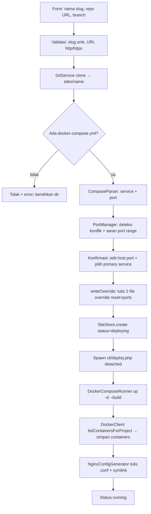

# ARCHITECTURE.md — Rames (Deploy Dashboard)

Dokumen ini menjelaskan **struktur kode** dan **cara kerja** project. Untuk spesifikasi kebutuhan & keputusan produk, lihat [`SPECS.md`](./SPECS.md).

---

## 1. Ringkasan

Rames (Phase 1) adalah aplikasi **Webman (PHP 8.1+)** yang berjalan **di dalam container Docker sebagai root**, mengelola:

- **Site** — project yang di-deploy dari repo Git berisi `docker-compose.yml`
- **Container** — hasil `docker compose` tiap site (dijalankan pada daemon Docker *host* lewat socket)
- **Reverse proxy** — config Nginx ditulis ke direktori host (di-mount), Nginx native di host mem-forward subdomain ke port site

Arsitektur disiapkan agar logika eksekusi (`DeployerInterface`) bisa diekstrak menjadi **agent HTTP terpisah** di fase berikutnya (multi-server) tanpa merombak controller/business logic.

---

## 2. Diagram Arsitektur (Phase 1)

```mermaid
flowchart TB
    subgraph Host
        N[Nginx native<br/>:80 / :443]
        DNS[DNS wildcard *.APP_DOMAIN]
        NAvail[/etc/nginx/sites-available]
        NEnab[/etc/nginx/sites-enabled]
        WH[Watcher host - inotifywait + nginx -s reload<br/>(belum dipasang)]
    end

    subgraph Dashboard[rames-webman container]
        App[Webman HTTP]
        Lib[app/library - logika bisnis]
        DClient[DockerClient - Engine API]
        DCRun[DockerComposeRunner - CLI compose]
        NGGen[NginxConfigGenerator]
        GSvc[GitService]
        Worker[cli/deploy.php - background worker]
    end

    Daemon[(Docker Engine host)]

    App --> Lib
    App -- spawn detached --> Worker
    Lib --> GSvc
    Lib --> DClient
    Lib --> DCRun
    Lib --> NGGen
    Worker --> DCRun
    Worker --> DClient
    Worker --> NGGen
    DClient -- unix socket --> Daemon
    DCRun -- unix socket --> Daemon
    Daemon --> SiteA[Site A containers]
    Daemon --> SiteB[Site B containers]
    NGGen -- tulis .conf --> NAvail
    NAvail -. symlink .-> NEnab
    NAvail -- notifikasi perubahan --> WH
    WH -- reload --> N
    DNS -.-> N
    N -- proxy_pass 127.0.0.1:host_port --> SiteA
    N -- proxy_pass 127.0.0.1:host_port --> SiteB
```

**Poin kunci:**
- Dashboard **tidak** menjalankan `nginx -s reload` langsung ke host — ia hanya menulis file `.conf` ke direktori yang di-mount; watcher di host yang memvalidasi & me-reload (`nginx -t && nginx -s reload`). Watcher ini belum diimplementasikan (lihat §8.3 SPECS).
- Semua operasi Docker dijalankan lewat `/var/run/docker.sock` yang di-mount → berjalan pada **daemon Docker host** (bukan daemon di dalam container).

---

## 3. Mode Menjalankan (Environment)

- Dashboard = container `rames-webman` (berjalan sebagai **root**), akses `http://host:{APP_PORT}`.
- Kode di-mount dengan path **sama dengan host** — `"${PWD}:${PWD}"` + `working_dir: ${PWD}`. Ini **krusial**: karena `docker compose` dieksekusi *di dalam container* tetapi daemon-nya *di host*, relative volume mount di `docker-compose.yml` milik site harus terselesaikan ke **path host yang valid**. Memakai `/app` membuat bind jadi `/app/sites/...` yang tidak dikenal daemon.
- `docker.sock` di-mount → dashboard mengeksekusi `docker compose` pada daemon host.
- Direktori Nginx host (`sites-available`/`sites-enabled`) di-mount → dashboard menulis file config; reload dilakukan watcher/manual di host.
- Container memakai `dns:` eksplisit (`DNS_1`/`DNS_2`) karena `/etc/resolv.conf` host pada environment ini bermasalah (symlink rusak) sehingga resolver internal Docker tak punya upstream.

---

## 4. Komponen & Lapisan

### 4.1 Lapisan HTTP — `app/controller/`

Controller hanya **mediator**: tidak memuat logika bisnis, tidak menyimpan state di properti (Webman persistent → `controller_reuse=false`), dan **tidak** memanggil `session()`/`request()` di konstruktor.

| Controller | Tanggung jawab |
|---|---|
| `AuthController` | Login/logout, session, regenerasi session id (anti fixation) |
| `SiteController` | Wizard create site, halaman detail, aksi (rebuild/stop/start/delete), endpoint polling status |
| `UserController` | Kelola user (tambah/hapus, ganti password) |

### 4.2 Middleware — `app/middleware/`

| Middleware | Peran |
|---|---|
| `CsrfMiddleware` | Validasi token CSRF untuk semua POST/PUT/PATCH/DELETE |
| `AuthMiddleware` | Lindungi semua route kecuali `/login` & aset statis; JSON 401 untuk request `/api/*` yang tidak login |
| `StaticFile` | Tolak akses path berisi `/.` (bawaan webman) |

Terdaftar global di `config/middleware.php` dengan urutan: CSRF → Auth → StaticFile.

### 4.3 Lapisan Bisnis — `app/library/`

Semua logika bisnis ada di sini (controller tidak boleh berisi logika). Modul:

| Modul | Kelas | Peran |
|---|---|---|
| **Storage** | `JsonStore` | Baca/tulis JSON dengan `flock` + backup `.bak`; `update()` atomik (tulis in-place, ownership file host terjaga) |
| | `SiteStore` | CRUD entri site di `database/sites.json` |
| **Auth** | `UserStore` | CRUD user di `database/auth.json`; hash bcrypt, `password_verify` |
| **Support** | `ProcessRunner` | Eksekusi command eksternal via `proc_open` (**array + `bypass_shell`** → tanpa shell, bebas command injection) + timeout |
| **Git** | `GitService` | `git clone` (depth 1) & `git pull --ff-only` |
| **Docker** | `ComposeParser` | Parse `docker-compose.yml` (short/long syntax port, IP binding) via `symfony/yaml` |
| | `PortManager` | Deteksi konflik port terhadap `sites.json`, saran port dari range, validasi port |
| | `DockerClient` | Client Engine API (Guzzle + `CURLOPT_UNIX_SOCKET_PATH`) untuk operasi **baca**: list/inspect container, ping |
| | `DockerComposeRunner` | CLI `docker compose` untuk **orkestrasi**: up/down/build/stop/start/pull |
| **Nginx** | `NginxConfigGenerator` | Render & tulis config `.conf` + symlink ke `sites-enabled`; `ensureWritable()` fail-fast |
| | `NginxStatusReader` | Baca status reload terakhir watcher (`last-reload.json`) |
| **Deploy** | `DeployerInterface` | Abstraksi eksekusi deploy (siap diganti `HttpDeployer` untuk multi-server) |
| | `LocalDeployer` | Implementasi lokal: up → collect container → tulis config Nginx |
| | `DeployerFactory` | Satu-satunya titik pembuatan `DeployerInterface` |

### 4.4 Background Worker — `cli/deploy.php`

- Dipanggil detached oleh `SiteController` lewat `proc_open` (stdout/stderr → log file, tanpa blokir worker HTTP).
- Pipeline per tahap menulis status ke `sites.json` (via `SiteStore->update`, `flock`), sehingga UI bisa *poll*:
  `deploying` → `build` → `collect` → `nginx` → `running` (atau `error`).
- Log per site: `runtime/logs/deploy/{siteId}.log`.

### 4.5 Storage

- `database/auth.json` — array user (id, username, password_hash, created_at).
- `database/sites.json` — array site (struktur lengkap di SPECS §7.1): id, name, subdomain, repo_url, branch, local_path, primary_service, status, compose_files, containers, timestamp.
- Semua mutasi lewat `JsonStore->update()` dengan `flock` → aman dari race condition.
- Direktori `sites/`, `database/*.json`, `nginx-status/` di-gitignore (data runtime).

---

## 5. Alur Utama

### 5.1 Create Site (end-to-end)



Detil penting:

- **Override port dua lapis** (`writeOverride`): karena docker compose **menggabungkan** daftar `ports` (base + override, bukan mengganti), port bawaan repo harus di-reset dulu:
  1. `docker-compose.override.yml` → `ports: !reset []` (tag YAML, via `Symfony\Component\Yaml\Tag\TaggedValue`)
  2. `docker-compose.override.ports.yml` → `ports: [host:container]` (hasil edit user)
  → `compose_files` menyimpan ketiganya. File compose asli repo tetap bersih.
- Service **tanpa port exposed** (mis. `php-fpm`) dilewati di validasi port & tidak ditulis override; tidak bisa dipilih sebagai primary service.
- Langkah konfirmasi memanggil `ensureWritable()` (cek izin tulis direktori Nginx) agar gagal cepat dengan pesan jelas, bukan di tengah build.

### 5.2 Rebuild

`SiteController::rebuild` → spawn worker mode `rebuild` → `LocalDeployer::rebuild`: `git pull --ff-only` → `docker compose up -d --build` → collect container → tulis ulang config Nginx → status `running`.

### 5.3 Stop / Start

Sinkron via `DockerComposeRunner->stop()/start()` (cepat), lalu update status di `sites.json`.

### 5.4 Delete

`LocalDeployer::teardown()`: `docker compose down -v` → hapus config Nginx (+ symlink) → hapus direktori `sites/{name}` → hapus entri dari `sites.json`.

### 5.5 Autentikasi

1. `/login` → `UserStore::verify` (`password_verify`, bcrypt).
2. Sukses → regenerasi session id → set `user` di session.
3. Semua route (kecuali `/login`) dilindungi `AuthMiddleware`.
4. Logout → hapus `user` + flush session.

---

## 6. Keputusan Teknis Penting

- **Anti command injection**: `ProcessRunner` memakai bentuk **array + `bypass_shell`** (langsung `execve`, tanpa shell) — lebih ketat daripada string + `escapeshellarg`.
- **Hybrid Docker**: CLI `docker compose` untuk orkestrasi (up/down/build), `DockerClient` (Engine API via unix socket) untuk operasi baca status. Ini menghindari SDK yang tak punya semantik `compose up`.
- **Overwrite port via `!reset`**: solusi atas perilaku merge daftar `ports` docker compose; butuh compose **v2.6+**.
- **JSON in-place write**: `JsonStore::update()` menulis pada file yang sudah ada (`fopen c+`) sehingga ownership file tetap milik host — nyaman saat file di-share host↔container.
- **Tanpa state lintas-request**: tidak ada property controller yang menyimpan data; semua state di session/file.
- **Mount path sama dengan host (`${PWD}:${PWD}`)**: syarat agar relative bind mount milik site terselesaikan ke path host oleh daemon.

---

## 7. Keamanan (Phase 1)

- Password bcrypt; tidak pernah plaintext / di-log.
- CSRF token untuk semua mutasi.
- Input divalidasi ketat (slug `[a-z0-9-]`, URL http/https, branch, port int 1–65535).
- Eksekusi command tanpa shell (lihat §6).
- `docker.sock` di-mount adalah risiko yang disengaja; semua akses dashboard di balik autentikasi.
- Direktori Nginx host yang di-mount dibatasi hanya `sites-available/` + `sites-enabled/`.

---

## 8. Batasan & Future Work

- **Watcher reload Nginx belum ada** (SPECS §8.3) — reload manual `sudo systemctl reload nginx`; otomatisasi via `inotifywait` dijadwalkan.
- **SSL otomatis** (SPECS §8a) belum diimplementasikan; struktur `needs_ssl`/`ssl_status` sudah disiapkan.
- **Deteksi konflik port** hanya terhadap site terkelola sendiri (SPECS §7.2), bukan container eksternal di host.
- Ekstraksi `DeployerInterface` → agent HTTP terpisah (multi-server).
- Role & permission antar user.
- Log viewer real-time per container.
- Migrasi JSON → SQLite/RDBMS bila skala bertambah.
- Rootless Podman sebagai pengganti `docker.sock` untuk isolasi lebih baik.
