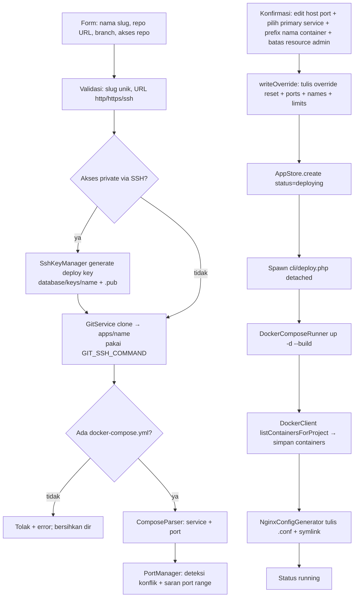
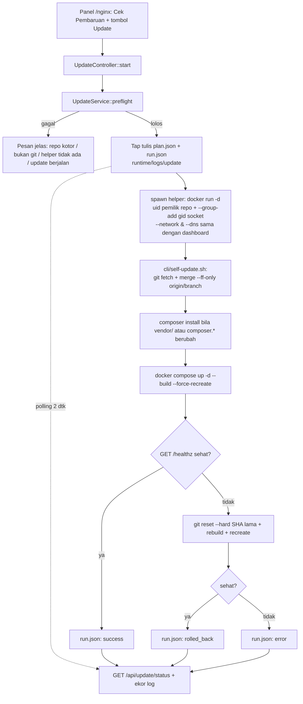
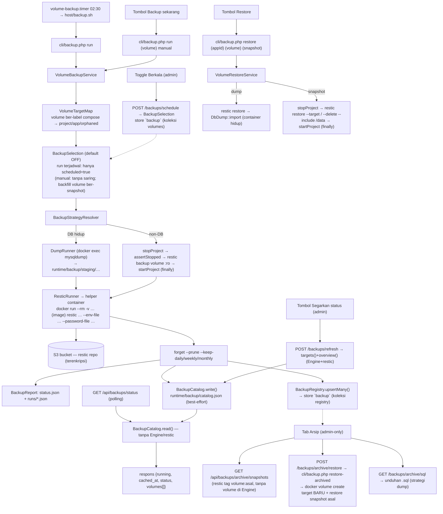
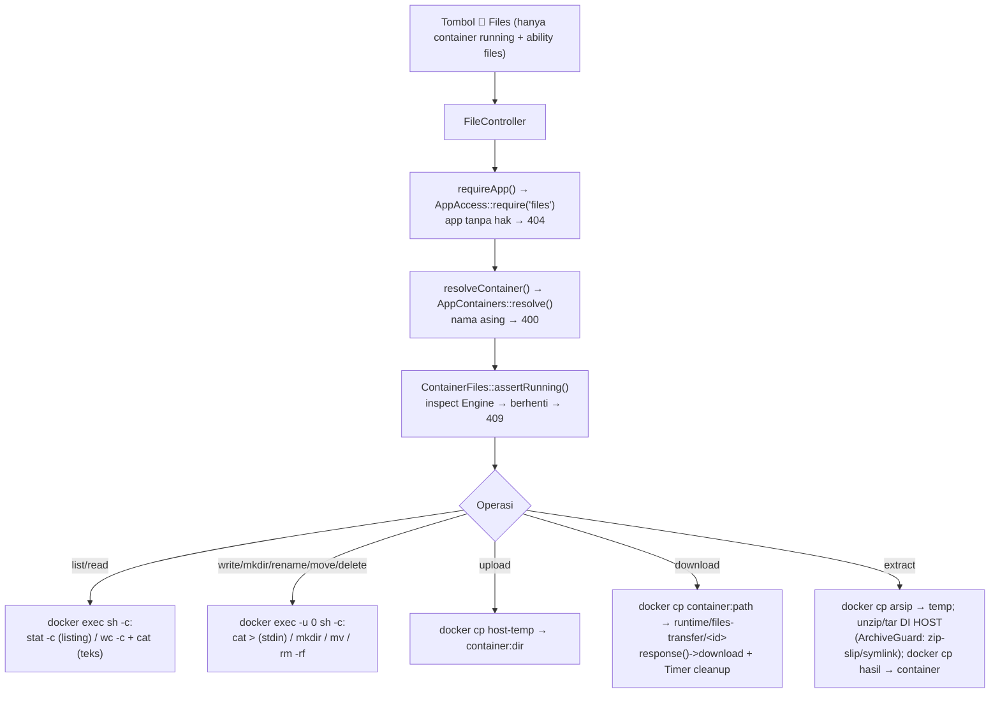
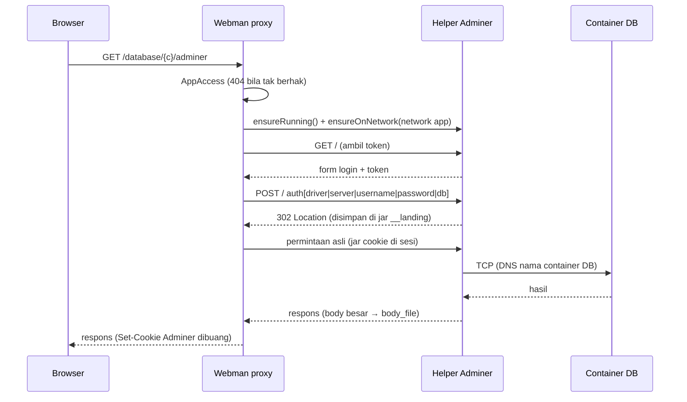
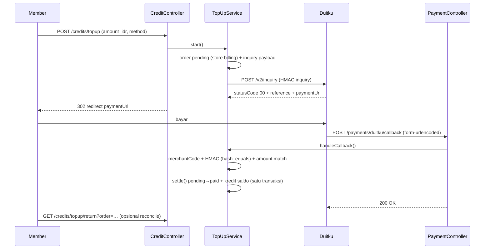
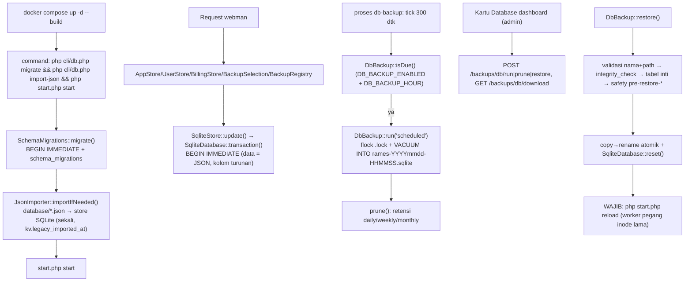

# ARCHITECTURE.md — Rames (Deploy Dashboard)

Dokumen ini menjelaskan **struktur kode** dan **cara kerja** project. Untuk spesifikasi kebutuhan & keputusan produk, lihat [`SPECS.md`](./SPECS.md).

---

## 1. Ringkasan

Rames (Phase 1) adalah aplikasi **Webman (PHP 8.1+)** yang berjalan **di dalam container Docker sebagai root**, mengelola:

- **App** — project yang di-deploy dari repo Git berisi `docker-compose.yml`
- **Container** — hasil `docker compose` tiap app (dijalankan pada daemon Docker *host* lewat socket)
- **Reverse proxy** — config Nginx ditulis ke direktori host (di-mount), Nginx native di host mem-forward subdomain ke port app

Arsitektur disiapkan agar logika eksekusi (`DeployerInterface`) bisa diekstrak menjadi **agent HTTP terpisah** di fase berikutnya (multi-server) tanpa merombak controller/business logic.

---

## 2. Diagram Arsitektur (Phase 1)

```mermaid
flowchart TB
    subgraph Host
        N[Nginx native<br/>:80 / :443]
        DNS[DNS wildcard *.APP_DOMAIN]
        NAvail[/etc/nginx/sites-available]
        NEnab[/etc/nginx/sites-enabled]
        WH[Watcher host - inotifywait + nginx -s reload<br/>(belum dipasang)]
    end

    subgraph Dashboard[rames-webman container]
        App[Webman HTTP]
        Lib[app/library - logika bisnis]
        DClient[DockerClient - Engine API]
        DCRun[DockerComposeRunner - CLI compose]
        NGGen[NginxConfigGenerator]
        GSvc[GitService]
        Worker[cli/deploy.php - background worker]
    end

    Daemon[(Docker Engine host)]

    App --> Lib
    App -- spawn detached --> Worker
    Lib --> GSvc
    Lib --> DClient
    Lib --> DCRun
    Lib --> NGGen
    Worker --> DCRun
    Worker --> DClient
    Worker --> NGGen
    DClient -- unix socket --> Daemon
    DCRun -- unix socket --> Daemon
    Daemon --> AppA[App A containers]
    Daemon --> AppB[App B containers]
    NGGen -- tulis .conf --> NAvail
    NAvail -. symlink .-> NEnab
    NAvail -- notifikasi perubahan --> WH
    WH -- reload --> N
    DNS -.-> N
    N -- proxy_pass 127.0.0.1:host_port --> AppA
    N -- proxy_pass 127.0.0.1:host_port --> AppB
```

**Poin kunci:**
- Dashboard **tidak** menjalankan `nginx -s reload` langsung ke host via shell — ia hanya menulis file `.conf` ke direktori yang di-mount; reload diaktifkan watcher host (`nginx -t && nginx -s reload`, SPECS §8.3) atau, sementara watcher belum ada, via helper container `--network host --pid host` yang me-chroot ke root host pada Docker socket (`NginxReloader`, SPECS §8.4).
- Semua operasi Docker dijalankan lewat `/var/run/docker.sock` yang di-mount → berjalan pada **daemon Docker host** (bukan daemon di dalam container).

---

## 3. Mode Menjalankan (Environment)

- Dashboard = container `rames-webman` (berjalan sebagai **root**), akses `http://host:{APP_PORT}`.
- Kode di-mount dengan path **sama dengan host** — `"${PWD}:${PWD}"` + `working_dir: ${PWD}`. Ini **krusial**: karena `docker compose` dieksekusi *di dalam container* tetapi daemon-nya *di host*, relative volume mount di `docker-compose.yml` milik app harus terselesaikan ke **path host yang valid**. Memakai `/app` membuat bind jadi `/app/apps/...` yang tidak dikenal daemon.
- `docker.sock` di-mount → dashboard mengeksekusi `docker compose` pada daemon host.
- Direktori Nginx host (`sites-available`/`sites-enabled`) di-mount → dashboard menulis file config; reload dilakukan watcher/manual di host.
- `/etc/letsencrypt` host di-mount → certbot (container) menulis sertifikat; nginx host membaca dari path yang sama.
- Named volume **`rames`** di-mount ke `/var/lib/rames` (di luar bind `${PWD}:${PWD}`) → menyimpan basis data SQLite `rames.sqlite` + snapshot backup-nya (§5.19); tidak hilang saat `git clean`/update dashboard. Berlabel `rames.role=dashboard-db` agar dikecualikan dari fitur backup volume app (§5.15).
- Container memakai `dns:` eksplisit (`DNS_1`/`DNS_2`) karena `/etc/resolv.conf` host pada environment ini bermasalah (symlink rusak) sehingga resolver internal Docker tak punya upstream.

---

## 4. Komponen & Lapisan

### 4.1 Lapisan HTTP — `app/controller/`

Controller hanya **mediator**: tidak memuat logika bisnis, tidak menyimpan state di properti (Webman persistent → `controller_reuse=false`), dan **tidak** memanggil `session()`/`request()` di konstruktor.

| Controller | Tanggung jawab |
|---|---|
| `AuthController` | Login/logout, session, regenerasi session id (anti fixation), migrasi kepemilikan app lama (best-effort) |
| `AppController` | Wizard create app (**tiga mode**: clone repo Git, paste/upload compose, dan **template** galeri siap-pakai §5.1c), halaman detail & halaman versi (`/apps/{id}/versions`), aksi (rebuild/rollback/stop/start/delete dengan mode preserve/purge volume — tombol Delete di tab khusus "Hapus App"), set/hapus custom domain, kelola environment variable app (simpan + auto-recreate, import `.env.example`), kelola external network (shared network lintas-app via compose override), kelola **nama container** (prefix `container_name`, §5.12), kelola **batas resource CPU/memori per service** (tab **Sumber Daya** — admin-only untuk mengubah, read-only untuk user lain, §5.12a), kelola **kepemilikan & sharing** (tab Akses: tambah/ubah/cabut member, transfer owner), endpoint polling status. Daftar app difilter ke app yang boleh diakses user. **Gerbang kredit** (`BillingGate`, §5.18) di **10 titik** (aktor exempt/admin ⇒ bebas; app milik admin ⇒ bebas untuk siapa pun; sisanya menilai aktor + pembayar/owner) — 2 jalur create (`confirmCreate`/`templateDeploy`, sebelum efek samping) + 8 jalur yang menyalakan/menciptakan container (`rebuild`/`rollback`/`start`/`saveCompose`/`saveEnv`/`saveNetworks`/`saveContainerNames`/`saveLimits`); pemilih CPU/RAM saat create kini juga untuk **owner/member** (plafon `BILLING_MAX_CPUS`/`BILLING_MAX_MEMORY_MB` via `Pricing::assertWithinCaps()`), sedangkan mengubah limit setelah app jadi tetap admin-only. **Anti-escape**: `transferOwner()` ke pemilik bebas tagihan (admin) atas app berjalan milik member ⇒ app dihentikan otomatis (§5.18) |
| `TerminalController` | Terminal container (`docker exec`): buka sesi interaktif (open), stream output (SSE), kirim input, tutup sesi, dan one-shot run command; container divalidasi milik app **dan** user berhak (ability `terminal`); audit log ke `runtime/logs/terminal/` |
| `LogController` | Log container app (`docker logs`) untuk popup modal di detail app: `GET /api/apps/{id}/logs?container=&tail=`; ability `logs` (Viewer ke atas); nama container selalu divalidasi milik app (`AppContainers::resolve`) sebelum menyentuh Engine |
| `FileController` | File manager container (§5.16): jelajah/`read`/`write`/`mkdir`/`rename`/`delete`/`upload`/`download`/`extract` untuk container app yang **berjalan**; ability `files` (operator+); container divalidasi `AppContainers::resolve` (jalur sama dengan `TerminalController`); semua logika bisnis di `app\library\Files\*` (controller hanya mediator — envelope `{code:0,data}` / `{code:<status>,msg}`, audit ke `runtime/logs/files/`) |
| `NginxController` | Halaman `/nginx` (global): status reload Nginx host terakhir + tombol Reload (khusus admin) — Nginx bersifat global (berlaku untuk semua app), di luar detail app. **Admin-only → 404 non-admin** (`index()` melempar `AppAccessDenied`; seam `isAdmin()`), dan menu **Config** disembunyikan dari member di UI |
| `DatabaseController` | Halaman `/database`: daftar container DB (difilter kepemilikan app — non-admin tanpa container eksternal) + **reverse proxy Adminer** per container (`/database/{container}/adminer…`, §5.17). **`findOwningApp()` adalah titik otorisasi tunggal** (dipakai daftar & proxy): koneksi Engine, helper, dan kredensial hanya disentuh setelah otorisasi lolos; penolakan `AppAccessDenied` → **404**. Proxy hanya mediator ke `app\library\Adminer\*` (state hanya di sesi; tanpa properti controller) |
| `VolumeController` | Halaman `/volumes`: daftar volume ber-label compose + bersihkan volume **yatim** (ditinggalkan app yang dihapus dengan mode preserve); daftar disaring ke app yang boleh diakses, purge hanya admin. Kolom **Ukuran** (storage terpakai per volume) dimuat asinkron dari `GET /api/volumes/usage` (`VolumeUsage::summarize` atas `GET /system/df`) agar render halaman tidak menunggu Engine menelusuri filesystem |
| `BackupController` | Halaman `/backups` + API backup volume ke S3 (§5.15): `GET /api/backups/status` (**cache-read** — tanpa Engine/restic), `GET /api/backups/snapshots`, `POST /backups/run` (ability `backup`), `POST /backups/restore` (ability `restore`), serta `POST /backups/refresh` & `POST /backups/schedule` (**admin global** — non-admin → **404**). Endpoint **arsip** (§5.15): `GET /api/backups/archive/snapshots`, `POST /backups/archive/restore`, `GET /backups/archive/sql` — semuanya **admin-only → 404** non-admin. Respons status disanitasi `publicStatus()` (daftar-putih — `volumes`/`error` mentah dibuang) + baris volume disaring `BackupAccess::visible()`; flag `scheduled` di-merge **segar** saat respons (`withScheduled()`); `data.archived` (riwayat volume terhapus) **admin-only** (`[]` untuk non-admin) dengan `restorable` per baris (`archivedRows()`). Halaman panduan `GET /backups/guide` (**admin-only → 404** non-admin) merender Markdown repo `host/restic-setup.md` lewat `Markdown::toHtml()` (helper statik `guideHtml()`; fail-safe `''` bila berkas tak ada/kosong/tak terbaca) ke view `backup/guide.php` (kotak `.guide-content`, **tanpa** `backup.js`) |
| `NetworkController` | Halaman `/networks`: daftar network Docker (built-in diberi label & dilindungi, milik app aktif ditandai "dikelola app"), buat shared network (bridge/overlay/macvlan + IPAM + flag attachable/internal), detail network (container terhubung + connect/disconnect), hapus network dengan proteksi berlapis (built-in / dipakai container / milik app aktif ditolak). Operasi global (buat/hapus/connect/disconnect) hanya admin; daftar disaring per app yang boleh diakses |
| `MonitorController` | Halaman global `/monitor` (nav sidebar) + `GET /api/monitor/overview` (metrik host + seluruh container) & `GET /api/monitor/host` (metrik host saja, untuk polling ringan kartu host — tanpa Engine). Read-only, tanpa state, tanpa CSRF. Otorisasi bertingkat: admin melihat semua container di host (termasuk container eksternal), user lain hanya container milik app yang boleh diakses (§5.13) |
| `UserController` | Kelola user — **khusus admin**: tambah/hapus user, ubah role (admin/member), ganti password, serta **set/hapus `email`** user (`POST /users/{id}/email`, prasyarat top-up Duitku §5.18); halaman `/users` menampilkan saldo kredit read-only (`CreditAccount::allBalances()`). Menghapus user **mengalihkan app miliknya** ke admin yang menghapus; bila pemilik lama pihak yang ditagih (member) & billing aktif, app hasil transfer yang masih hidup **dihentikan otomatis** (anti-escape billing — `AppStopper::stopTransferredToExemptOwner`, §5.18) |
| `CreditController` | Halaman & aksi kredit (§5.18): `GET /credits` (member = saldo/pemakaian/ledger/top-up **via modal** `#topupModal`; admin = semua user + deposit + penagihan manual), `POST /credits/deposit` & `POST /credits/charge` (**admin-only → 404** non-admin), `POST /credits/email` (**warisan/BC** — UI kini memakai `/profile/email`; hanya email user login — anti IDOR), `POST /credits/topup` + `GET /credits/topup/return` (order milik user login; 404 bila bukan), `GET /api/credits/methods` (satu-satunya jalur yang menyentuh jaringan, dipanggil JS saat **modal top-up pertama dibuka** — `shown.bs.modal`, bukan saat load): sebelum menambah `group`, kanal **disaring ulang** `DuitkuClient::isAllowedMethod()` (**defense-in-depth** — kanal di luar allowlist/`HARD_EXCLUDE_METHODS`, mis. `VC`/`OL`, tak bisa tampil walau `paymentMethods()` regresi); tiap item `data` diberi key **`group`** (`PaymentMethodCatalog::decorate()`) dan daftar **diurutkan per grup kanonik** (stabil di dalam grup); payload view `GET /credits` memuat **`methodGroups`** (`[{label,codes:[…]}]`, dari `groupedCodes()`) di samping `methods` lama (kompatibilitas/fallback). Mediator murni: seluruh logika di `app\library\Billing\*`; tanpa state properti lintas-request. Untuk admin, `topupIssues()` (dari `DuitkuClient::configurationIssues()`) menjelaskan **alasan top-up nonaktif** di `/credits` (member tidak melihat detail infrastruktur) |
| `ProfileController` | Halaman **Profil** self-service (`GET /profile`, semua user login; view `app/view/profile/index.php`): kartu **Edit profil** (form email → `POST /profile/email`, `maxlength=50`) + kartu **Akun** baca-saja (username, badge peran, saldo). **Anti-IDOR**: `id`/`user_id` dari request diabaikan mutlak — id selalu dari `current_user()`. Mediator murni: validasi email (≤50 karakter + `FILTER_VALIDATE_EMAIL`) **tidak diduplikasi** — didelegasikan penuh ke `UserStore::setEmail()`; email kosong = hapus; input non-skalar (`email[]=…`) → flash + redirect `/profile` (**bukan** 500); sukses/gagal selalu redirect `/profile`. Seam pengujian `UserStore` berpath temp; tanpa state properti lintas-request |
| `PaymentController` | Callback pembayaran Duitku **publik** (`POST /payments/duitku/callback`, §5.18): verifikasi `TopUpService::handleCallback()` (merchantCode + signature HMAC `hash_equals` + kecocokan amount + idempotensi) lalu memetakan hasil ke status HTTP (404 fitur/kredensial mati; 400 payload cacat; 403 verifikasi gagal; 200 `OK` tentatif agar Duitku tidak retry). Tanpa session, tanpa data sensitif di respons; audit ringkas ke `runtime/logs/billing/` |
| `SslController` | Halaman `/ssl`: daftar domain (subdomain/custom) + status SSL + tombol Aktifkan SSL / Retry; spawn worker `cli/ssl.php` |
| `IndexController` | Halaman utama dashboard (`view('index/hello')`) |
| `HealthController` | `GET /healthz` (**publik**, §5.14): status + SHA/branch dari `.git` (tanpa proses git) — dipakai helper self-update untuk memutuskan sehat/rollback, dan bisa dipakai monitoring eksternal |
| `UpdateController` | Endpoint self-update dashboard (§5.14): `GET /api/update/status` (semua user login), `POST /api/update/check`, `POST /api/update/start`, `POST /api/update/rollback` (admin). Panel-nya di halaman `/nginx` |

### 4.2 Middleware — `app/middleware/`

| Middleware | Peran |
|---|---|
| `CsrfMiddleware` | Validasi token CSRF untuk semua POST/PUT/PATCH/DELETE. **Dua pengecualian sempit (path-presisi, larangan repo #17):** (1) proxy Adminer `#^/database/[^/]+/adminer(/|$)#`; (2) **callback Duitku** `#^/payments/duitku/callback$#` — **eksak & hanya POST** (pengecualian Adminer tidak dilebarkan; route lain termasuk `/credits/deposit` tetap wajib token). Callback diverifikasi di `PaymentController` (signature HMAC + amount + idempotensi, tanpa session) |
| `AuthMiddleware` | Lindungi semua route kecuali `/login` & aset statis; JSON 401 untuk request `/api/*` yang tidak login; **menyinkronkan user session dengan store `auth`** pada setiap request (user dihapus → sesi dibuang; role berubah → langsung berlaku). `PUBLIC_PATHS` memuat **`/payments/duitku/callback`** (path eksak, tanpa sesi — Duitku pengirim mesin tanpa cookie kita; keamanannya dari verifikasi di controller, bukan autentikasi) |
| `StaticFile` | Tolak akses path berisi `/.` (bawaan webman) |

Terdaftar global di `config/middleware.php` dengan urutan: CSRF → Auth → StaticFile.

### 4.3 Lapisan Bisnis — `app/library/`

Semua logika bisnis ada di sini (controller tidak boleh berisi logika). Modul:

| Modul | Kelas | Peran |
|---|---|---|
| **Storage** | `SqliteDatabase` | Handle PDO SQLite tunggal (per berkas, per proses, §5.19): PRAGMA `journal_mode=WAL`/`synchronous=NORMAL`/`foreign_keys=ON`/`busy_timeout=5000`, transaksi `BEGIN IMMEDIATE` re-entrant (`transaction()`), `snapshot()` (`VACUUM INTO`), `integrityCheck()` (`PRAGMA integrity_check`), migrasi otomatis sekali per proses, impor legacy otomatis saat koneksi pertama (`maybeImportLegacy()`, best-effort), kunci cache handle = **identitas berkas** (`realpath#dev:ino`) sehingga berkas yang di-restore dibuka ulang; `reset()` untuk tes |
| | `SqliteStore` | API identik `JsonStore` (`path()`/`read()`/`write()`/`update()`) di atas SQLite: kolom `data` = dokumen JSON (**sumber kebenaran**) + kolom turunan terindeks + `ord` (urutan list); satu store = 1..N koleksi (list bila `idField` terisi, map via `path`). `update()` = satu transaksi (baca→mutator→tulis balik) |
| | `SchemaMigrations` | Definisi kanonik store→koleksi (`storeDefinitions()`) + migrasi berversi (`schema_migrations`, `LATEST`); nama tabel fisik `{store}_{koleksi}` (`tableName()`, mis. `apps_apps`, `auth_users`, `billing_users`, `billing_usage`, `billing_orders`, `backup_volumes`, `backup_registry`); nama kolom turunan dari dot-path (`.`→`_`) |
| | `JsonImporter` | Impor **sekali** `database/{apps,auth,billing,backup}.json` → SQLite (idempoten lewat flag `kv.legacy_imported_at`; store yang sudah berisi baris tidak ditimpa; berkas JSON lama **tidak** dihapus) + `exportToJson()` untuk rollback ke JSON |
| | `DbBackup` | Snapshot `VACUUM INTO` ke `{db_backup_dir}/rames-YYYYmmdd-HHMMSS.sqlite` + retensi harian/pekanan/bulanan (`keep_*`, pola `forget --keep-*`), mutex `flock` non-blocking (`<dir>/.lock`; busy → `skipped`), `restore()` defensif (basename+`realpath`, `integrity_check`, tabel inti `apps_apps`/`auth_users`/`billing_users`, safety snapshot `pre-restore-*`, ganti berkas atomik, `SqliteDatabase::reset()`), `isDue()`, `list()`/`download()`; `state.json` di `runtime/db-backup/` |
| | `JsonStore` | Baca/tulis **JSON cache runtime** (bukan data domain) dengan `flock` + salinan `<file>.bak`; `update()` atomik (tulis in-place, ownership file host terjaga). Dipakai `UpdateState` (check.json), state network Adminer, `BackupCatalog`/`BackupReport`, `DbBackup::state()` |
| | `AppStore` | CRUD entri app di **store `apps` (SQLite, §5.19)** + kepemilikan (`owner_id`, `members`): `addMember()`, `removeMember()`, `transferOwner()`, `transferAllFrom()`, `ownedBy()`, `assignMissingOwners()`; `path()` = path berkas `.sqlite` |
| **Auth** | `UserStore` | CRUD user di store `auth` (SQLite); hash bcrypt, `password_verify`; **role global** `admin`/`member` (`roleOf()`, `isAdmin()`, `changeRole()`, `countAdmins()`, `listWithRoles()`) + migrasi lazy dokumen lama (user pertama = admin) |
| | `AppAccess` | **Satu-satunya pintu otorisasi app**: `roleFor()`, `can(ability, app, user)`, `require()` (melempar `AppAccessDenied`), `visible()` (filter daftar app), `abilitiesFor()`; stateless (aman untuk worker persistent). Ability `limits` (batas CPU/memori per service, §5.12a) eksklusif admin |
| | `AppAccessDenied` | Exception `extends BusinessException` yang merender **404** (JSON untuk `/api/*`, halaman 404 untuk request biasa) — menyembunyikan keberadaan app milik user lain |
| | `OwnershipMigrator` | Migrasi idempoten: app tanpa `owner_id` di-assign ke admin pertama |
| **Support** | `ProcessRunner` | Eksekusi command eksternal via `proc_open` (**array + `bypass_shell`** → tanpa shell, bebas command injection) + timeout; memasang `SIGCHLD=SIG_DFL` selama proses hidup agar git/docker compose tidak kehilangan `waitpid()` dan exit code tetap terbaca (§4.4) |
| | `SigchldGuard` | Penjaga disposisi `SIGCHLD` worker persistent: `disableIgnore()`, `withDefault()`, `ignoreAndReap()`, `isIgnored()`; murni statik, no-op bila pcntl tidak tersedia (§4.4) |
| | `Markdown` | Konversi **Markdown → HTML aman** untuk panduan template (§5.1c): `toHtml()` (statik murni, `html_input=escape` + `allow_unsafe_links=false` + `ExternalLinkExtension` → tautan eksternal `target="_blank"`/`rel="noopener noreferrer"`; converter juga mendaftarkan `TableExtension` → **tabel pipe GFM**, selain `CommonMarkCoreExtension` + `ExternalLinkExtension`); input kosong/whitespace **atau** kegagalan apa pun → `''` (panduan tak boleh menggagalkan halaman). Converter dibangun sekali (lazy static) |
| **Git** | `GitService` | `git clone` (depth 1) & `git pull --ff-only`; mendukung repo private via deploy key SSH (`GIT_SSH_COMMAND`) |
| | `SshKeyManager` | Generate/read/hapus pasangan kunci SSH (deploy key per app) di `database/keys/` |
| **Docker** | `ComposeParser` | Parse `docker-compose.yml` (short/long syntax port, IP binding) via `symfony/yaml` |
| | `PortManager` | Deteksi konflik port terhadap `apps.json`, saran port dari range, validasi port |
| | `DockerClient` | Client Engine API (Guzzle + `CURLOPT_UNIX_SOCKET_PATH`): list/inspect container, **log container `containerLogs()` (`/containers/{id}/logs`, respons multiplexed)**, **monitoring `containersOverview()` (`/containers/{id}/stats` + `/json` untuk banyak container sekaligus — fan-out paralel `CurlMultiHandler`, karena satu `stats` butuh ±1 detik)**, list volume (per project / semua), **pemakaian disk `getDiskUsage()` (`/system/df`, sumber ukuran terpakai volume)**, list/inspect/buat network, connect/disconnect container ke network, hapus network, ping |
| | `ContainerLogs` | Pembersihan stream log multiplexed (`demultiplex()` — buang header 8 byte per frame; teks polos container TTY dikembalikan apa adanya) + normalisasi `tail` (`normalizeTail()`, `tailOptions()`); murni statik |
| | `AppContainers` | Resolusi container milik app: `resolve($app, $name)` (validasi nama — dipakai terminal, log, & file manager) dan `defaultContainer($app)` (container service `primary_service`, else pertama) |
| | `AppPorts` | Resolusi port app: `all($app)` (gabungan semua port publish tiap container), `forContainer($container)` (**dedupe** — Engine mengembalikan satu entri `Ports[]` per alamat IP untuk publish dual-stack IPv4+IPv6, plus fallback field lama `internal_port`/`host_port`), `proxiedContainerPort($app)` (port yang di-proxy Nginx — menghormati `primary_port`, fallback port pertama service primary), `primaryHostPort($app)` (target `proxy_pass`; dipakai `LocalDeployer` & view detail), **`hasHostPort($app)`** (penentu "app punya target `proxy_pass`": `false` ⇒ app tanpa vhost/subdomain, §5.1), `hostPortFor()`; murni statik tanpa I/O |
| | `VolumeUsage` | Pemetaan & format ukuran volume dari `GET /system/df` (`map()`, `summarize()`, `human()` — satuan SI seperti `docker system df`); murni statik tanpa I/O sehingga mudah diuji |
| | `ContainerStats` | Penafsiran `stats` + `inspect` menjadi baris monitoring (CPU% ala `docker stats`, memori dikurangi page cache cgroup, uptime dari `StartedAt`, restart count, health, PID) + `aggregate()` untuk total; murni statik tanpa I/O supaya rumusnya teruji |
| **Files** | `PathGuard` | Validasi & normalisasi path/nama file manager container — murni statik tanpa I/O (teruji tanpa Docker). `normalize()` (wajib absolut, selesaikan `.`/`..`, tolak keluar akar + karakter kontrol), `assertDeletable()` (tolak akar `/`), `assertName()` (tolak `/`/`\`, awalan `-`, `.`/`..`, > 255 byte), `resolveChild()`, `parentOf()`, `contains()`. Semua path dari request **wajib** lewat sini sebelum masuk `docker exec`/`docker cp` |
| | `TextContent` | Deteksi berkas teks vs biner + batas edit: `isBinary()` (NUL / bukan UTF-8 / rasio kontrol > 1%), `isTooLarge()` (batas `MAX_TEXT_BYTES` = **2 MiB**); murni statik |
| | `ArchiveGuard` | Validasi arsip sebelum/tanpa ekstraksi: `kind()` (`.zip`/`.tar.gz`/`.tgz`), `entryError()`/`unsafeEntry()` (**zip-slip** — tolak entri absolut/drive Windows/komponen `..`), `parseZipTotal()` (`unzip -l`), `escapingSymlink()` (symlink keluar direktori ekstraksi ditolak), `measure()` (`MAX_ENTRIES` = 10000, `MAX_EXTRACT_BYTES` = 1 GiB) |
| | `ListingParser` | Parse keluaran `stat -c` dari dalam container → daftar entri direktori; pemisah kendali field US (`\x1f`) & record RS (`\x1e`) dipilih karena nama berkas boleh memuat spasi. `typeOf()` memetakan deskripsi tipe GNU **&** BusyBox, `sortEntries()` (direktori dulu, lalu nama case-insensitive); murni statik |
| | `FileError` | Exception domain file manager yang membawa status HTTP (`public readonly int $status`); `FileController` memetakannya langsung ke `{code:<status>,msg}` (akses tidak sah tetap di `AppAccessDenied` → 404) |
| | `FilesInput` | Penerjemah field request → parameter operasi (logika murni, satu sumber kontrak dengan UI `public/js/app-files.js`): `text()` (`text` fallback `content`; kedua absen → 400), `mkdirTarget()` (`path` induk + `name`), `renameTarget()` (`to` diprioritaskan, fallback `name`), `moveSource()` (tolak akar `/`), `moveTarget()` (`path` sumber + `dest` direktori + `name` opsional; tolak tujuan di dalam sumber) |
| | `ContainerFiles` | Seluruh logika bisnis file manager (controller hanya mediator). Guard `assertRunning()` (container hidup → else **409**); baca `list()`/`read()`; mutasi `write()`/`mkdir()`/`rename()`/`move()`/`delete()`; transfer `uploadOne()`/`downloadToTemp()`/`extract()`; temp `cleanup()`/`scheduleCleanup()` (`Workerman\Timer`) + `prune()`. **Semua operasi `docker exec` sebagai root** (`ROOT_USER = '0'`) agar tidak `permission denied`; entri **baru** dari exec dipulihkan kepemilikannya ke user image (`ownerSpec()` dari inspect `Config.User` + `restoreOwner()` best-effort non-rekursif; `missingAncestors()` untuk rantai `mkdir -p`). `move()` validasi berurutan sebelum efek samping (404 sumber, 400 tujuan, 409 bentrok) lalu `mv` sebagai root. `docker cp` unggah/unduh **tidak** menerima `-u` (kepemilikan tetap user image). `docker exec` lewat `DockerExec` (array + `sh -c` **di dalam container**, tiap argumen `escapeshellarg`), perintah host (`docker cp`/`unzip`/`tar`) lewat `ProcessRunner` (array + `bypass_shell`); byte ditransfer via `runtime/files-transfer/` (bukan memori PHP); parser listing portabel Alpine (BusyBox) & Debian (GNU); timeout `deploy.files_timeout`/`deploy.files_transfer_timeout` |
| **System** | `HostUsage` | Metrik host — "total VM" halaman `/monitor`: CPU% (delta jiffies dua sampel `/proc/stat`), memori (`MemTotal`/`MemAvailable`), load, uptime, jumlah CPU; murni statik, path `/proc` bisa di-override (`HOST_PROC_PATH`), file tak terbaca → `null` (UI menampilkan N/A) |
| **Monitor** | `ResourceCollector` | Perakit data monitoring: aturan visibilitas container (hanya project app yang boleh diakses; container eksternal hanya admin) + penggabungan keluaran Engine menjadi baris siap tampil; statik, container ID di-resolve live (tanpa ubah `apps.json`) |
| | `DockerComposeRunner` | CLI `docker compose` untuk **orkestrasi**: up/down/build/stop/start/pull; `removeVolumes()` untuk `docker volume rm` (teardown selektif) |
| | `DockerExec` | Eksekusi `docker exec` ke container app: one-shot `runCommand()` (`sh -c`, timeout, opsi `$user` opt-in) & sesi interaktif `open()` — PTY via `script` (util-linux) + IPC berbasis FIFO di `runtime/terminal/{token}/` (proses detached, aman lintas-worker); `writeInput()/readOutput()/isRunning()/closeSession()`. **Resolusi shell** (`resolveShell()`, §5.9): permintaan eksplisit → whitelist `ALLOWED_SHELLS`; `''`/`SHELL_AUTO` → probe container (`SHELL_PROBE_COMMAND`) → `shellFromProbe()` (murni, prioritas `SHELL_PROBE_PRIORITY` = `bash`>`ash`>`sh`), gagal probe → `sh`. Env sesi `TERM=xterm-256color` |
| **Db** | `DbContainerDetector` | **Dua tingkat klasifikasi (jangan dicampur)**: (a) `isDbContainer()`/`detectAll()`/`detectForApp()` = heuristik murah image (`mysql`/`mariadb`/`percona`) **atau** env `MYSQL_*`/`MARIADB_*`, dipakai halaman `/database` (**tanpa** exec); (b) `isDumpableForBackup()` = kelayakan untuk pemilihan strategi backup — image DB → `true`; sinyal env-only (image bukan DB) diverifikasi benar-benar punya `mysqldump`/`mariadb-dump` (`canRunDumpTool()`, memoize per id, timeout 10 dtk, gagal → `false` → strategi `snapshot`). `detectAll($apps, $includeUnowned)`: memetakan container → app pemilik; `$includeUnowned=false` (halaman `/database` non-admin) hanya mengembalikan container milik app yang diberikan — container app user lain & eksternal tidak di-inspect maupun ditampilkan. `detectForApp()` untuk tab Database di detail app |
| | `DbConnectionResolver` / `DbCredentialResolver` | Resolusi **alamat & kredensial** koneksi DB: host+port internal dari inspect (`internalPort()`) & kredensial dari env app/container — prioritas pasangan user aplikasi (`MYSQL_USER`/`MARIADB_USER`/`DB_USERNAME`/`DB_USER`) di atas root. Dipakai backup (`DumpRunner`/`DbDump`) **dan** proxy Adminer (§5.17). Tidak ada lagi klien PDO di dalam dashboard (`DbClient` dihapus) |
| | `DbDump` | Export/import **dump logis** database (dipakai backup/restore volume, §5.15). **Guard tool**: bila `mysqldump`/`mariadb-dump` (export) atau `mysql`/`mariadb` (import) tidak ada di container → pesan jelas ke stderr + `exit 127` (bukan `sh: --host=… not found`). **Higiene kredensial**: password **tidak pernah** di string command/argv host — dikirim sebagai **baris pertama stdin** (`IFS= read -r __pw`) lalu hanya dipakai sebagai `MYSQL_PWD` untuk pemanggilan tool (`export()` menulis baris password ke pipe; `import()` mengirim `password"\n"+SQL`). Batasan: password tak boleh mengandung newline. Timeout restore `deploy.db_import_timeout`. Kelola user DB kini lewat Adminer (§5.17), bukan modul sendiri (`DbUserManager` dihapus) |
| **Adminer** | `AdminerHelper` | Helper container Adminer standalone (§5.17): jalankan/pastikan `docker run -d` (`--restart unless-stopped` **tanpa** `--rm`, label `rames.role=adminer-helper`, `PHP_CLI_SERVER_WORKERS`, log `json-file` dibatasi) pada network **internal** `rames-helpers`; attach dashboard + helper ke network app target; `baseUrl()` = `http://<container>:8080`; static murni `buildRunArgv()`/`targetNetwork()`/`databaseHost()`; spawn lewat `ProcessRunner` + `SigchldGuard`. **Prune oportunis** `pruneIdleNetworks()`/`ensureOffNetwork()` melepas network app yang idle ≥ `adminer_network_ttl` (catatan `runtime/adminer-helper/networks.json`, `0700`/`0600`, tanpa kredensial via `JsonStore`) — dipanggil dari `ensureRunning()`; network `rames-helpers` tak pernah dilepas |
| | `AdminerProxy` (+ `LimitedTempSink`, `AdminerTempDir`, `AdminerProxyError`, `AdminerProxyLimitExceeded`) | Reverse proxy HTTP **satu permintaan** ke helper: auto-login **sisi server** (`GET /` ambil token → `POST /` `auth[…]` → `Location` disimpan sebagai landing), jar cookie **di sesi** (bukan browser; `Set-Cookie` & hop-by-hop dibuang), `X-Forwarded-Prefix` (HTML Adminer **tidak** disunting), klien Guzzle `HandlerStack`+`CurlHandler` eksplisit + `expect=>false`, `stream=>true` + `LimitedTempSink` (batas 64 MiB, byte ke berkas temp), pemulihan sesi basi **sekali** (GET pulih; mutasi gagal → `session_expired` 409). `normalizePath()` menolak bentuk ter-encode `%2e`/`%2f`/`%5c`; header `X-Forwarded-*` klien dibuang & `X-Forwarded-Proto`/`For` dibentuk dari konteks dashboard. `AdminerTempDir` = berkas respons `runtime/adminer-proxy/` direktori `0700`/berkas `0600`, prune TTL 3600 s. Stateless — jar by-reference dari pemanggil |
| **Nginx** | `NginxConfigGenerator` | Render & tulis config `.conf` + symlink ke `sites-enabled`; `ensureWritable()` fail-fast; render multi server block per app (subdomain + custom domain, redirect 301, blok `listen 443 ssl`, `location /.well-known/acme-challenge/`); **serve block HTTP 80 & HTTPS 443 meneruskan WebSocket** (`proxy_http_version 1.1` + `proxy_set_header Upgrade`/`Connection`), sedangkan redirect block & blok ACME tetap bersih (tanpa direktif WS) |
| | `NginxRoutes` | **Satu sumber kebenaran** bentuk data rute proxy tambahan per app (`apps.json` `nginx_routes`, §5.6a): `normalize()`/`parse()` **fail-fast** (validasi ketat `path` absolut + `target` http(s) tanpa userinfo/query/`..`, batas `MAX` = 20, tolak `/`, prefix `/.well-known` yang dicadangkan ACME, segmen `..` pada `path` — dicek terpisah dari regex agar `.` tetap sah, mis. `/a.b/` diterima, dan duplikat). `parse()` memvalidasi **per baris** sehingga kesalahan format/isi menyebut **nomor baris textarea** (`Baris N: …`); kesalahan lintas-entri (duplikat, `MAX`) muncul dari `normalize()` akhir tanpa nomor baris tetapi menyebut nilai path. Sedangkan `all($app)` **best-effort** (entri rusak dilewati, rute valid tetap dipakai, hasil ≤ `MAX`, tanpa throw → data `apps.json` rusak tidak menggagalkan deploy); `toText()` untuk textarea. Murni statik & stateless |
| | `NginxConfigGuard` | Penjaga penyimpanan rute proxy dengan alur "uji dulu, rollback bila gagal" (§5.6a): `applyRoutes($appId, $routes)` = snapshot rute lama → `AppStore::update()` → `DeployerInterface::writeNginxConfig()` → `NginxReloader::reload()`; bila tulis config atau uji/reload gagal → pulihkan `nginx_routes` lama + tulis ulang config lama (best-effort), host tidak di-reload. **Tidak pernah melempar**: selalu mengembalikan 4 kunci `{ok, reloaded, rolled_back, error}`; `rolled_back=false` + `PERINGATAN: rollback gagal` = pemulihan `apps.json` gagal (rute baru tertinggal), dan `rolled_back=true` + `PERINGATAN: config lama gagal ditulis ulang` = rute pulih tetapi config di disk bisa belum bersih. Instance (dependensi disuntikkan: `NginxReloader`/`DeployerInterface`/`AppStore`) & tanpa state lintas-request. `applySubdomain($appId, $subdomain)` (§5.6b) memakai pola sama: snapshot `SUBDOMAIN_STATE_KEYS` (`subdomain` + `ssl_status`/`ssl_stage`/`ssl_message`/`ssl_error`/`ssl_expires_at`/`needs_ssl`) → simpan label + reset status SSL → tulis config → reload; gagal ⇒ `rollbackState()` memulihkan state **dan** config lama (reload tidak dipanggil bila tidak ada config valid) |
| | `NginxStatusReader` | Baca status reload terakhir watcher (`last-reload.json`) |
| | `NginxReloader` | Reload nginx HOST via helper container (`--network host --pid host --privileged`, chroot ke root host) pada Docker socket; `--network host` wajib agar resolusi DNS & konektivitas uji identik dengan nginx host (chroot membaca `/etc/resolv.conf` host — mis. `nameserver 127.0.0.1`; SPECS §8.4); tulis `last-reload.json`; dipakai tombol "Reload Nginx" di halaman `/nginx` + auto-reload setelah set/hapus custom domain, deploy/rebuild, dan SSL (best-effort) |
| **SSL** | `SslIssuer` | Terbitkan/revoke sertifikat Let's Encrypt via certbot (HTTP-01 webroot / DNS-01 Cloudflare), cek kedaluwarsa cert |
| **Deploy** | `DeployerInterface` | Abstraksi eksekusi deploy (siap diganti `HttpDeployer` untuk multi-server); termasuk `rollback()`, `apply()` (deploy ulang app mode compose tanpa git/build) dan `applyEnv()` (terapkan env var tanpa rebuild source) |
| | `ComposeSource` | Mode sumber app **compose** (create app dari file `docker-compose.yml` yang di-paste/di-upload, tanpa repo Git): `isCompose()`/`source()`, validasi & penyimpanan file unggahan (nama relatif aman, batas ukuran, tolak override generated), `assertDeployable()` (wajib `image:`, tolak `build:`), deteksi file utama, baca/tulis compose, daftar file sumber, serta `planHostPorts()` (port lama dipertahankan, konflik digeser via `PortManager`). **Pemilik tunggal urutan kanonik `compose_files`** — `orderFiles()` (base → `docker-compose.override.yml` reset → `.override.ports.yml` → `.override.names.yml` → `.override.limits.yml` → sisa override generated pada urutan asli, env paling akhir; duplikat & nama kosong dibuang); `AppController::orderComposeFiles()` hanya mendelegasikan ke sini. Juga `filterMissingGenerated($dir, $files)` — membuang **entri daftar** override generated (`GENERATED_PREFIX`) yang filenya sudah tidak ada di disk, tanpa pernah membuang base dan tanpa mengembalikan daftar kosong (§5.12a GOTCHA). Juga `declaresPorts($dir, $files)` — "apakah compose app mem-publikasikan `ports:`?" (mengabaikan `ports: !reset []`) untuk prasyarat Nginx sebelum container ada (§5.1). Murni statik |
| | `ComposeBinds` | Penyiapan **source bind mount** sebelum `docker compose up`: kumpulkan device volume bernama (`driver_opts` + `o: bind`) & bind mount service (short/long syntax), substitusi `${PWD}`/`${VAR}`, buat direktori yang belum ada di dalam direktori app, dan laporkan yang tidak bisa dibuat (file / di luar direktori app) sebagai petunjuk pada pesan error `compose up` (`missingHint()`); murni statik |
| | `ContainerNames` | Override **nama container** (`container_name`) per app (§5.12): skema `{prefix}-{service}`, validasi prefix, tolak service ber-replica, deteksi bentrok nama se-host (`usedFromEngine`/`usedFromApps`), serta `sync()`/`writeOverride()`/`removeOverride()` untuk `docker-compose.override.names.yml`; murni statik |
| | `ResourceLimits` | Override **batas maksimum CPU/memori per service** per app (§5.12a, SPECS §7.6b): field `limits` (map service → `{cpus, memory_mb}`), `normalize()`/`of()`, **`fromInput($posted, $services)`** (validasi whitelist service terhadap base compose + normalkan + buang entri tidak aktif — dipakai controller via `AppController::resolveLimits()`), `services()`/`detect()` (whitelist service + rencana keluarga field mengikuti base compose), `writeOverride()`/`removeOverride()`/`sync()` untuk `docker-compose.override.limits.yml`, dan **`persist($store, $app, $dir, $posted)`** — satu transaksi transparan: validasi nilai selalu dulu → parse base **hanya bila ada batas aktif** → tulis/hapus file → baru persist `limits`+`compose_files` (urutan via `ComposeSource::orderFiles()`); gagal tulis ⇒ state app tidak berubah. Fail-fast bila base compose tidak konsisten antar keluarga field Compose. Murni statik |
| `SubdomainManager` | Kebijakan & penerapan **subdomain app** (§5.6b, SPECS §7.11): field `apps.json.subdomain` menyimpan **label** slug; FQDN efektif dirakit `app_subdomain_of()`. `normalize()` (trim+lowercase), `isValidLabel()` (delegasi `app_subdomain_valid()`), `assertAvailable($label, $name, $excludeId)` (keunikan atas **FQDN efektif** app lain — termasuk fallback `name` — + bentrok `custom_domain`), dan `change($appId, $label)` = orkestrasi validasi → `NginxConfigGuard::applySubdomain()` (uji+rollback). `change()` mengembalikan `{ok,noop,effective,previous,reloaded,rolled_back,error}`; label kosong = hapus field (kembali ke `name`); idempoten (FQDN sama → `noop`). Stateless, dependensi disuntikkan (`AppStore` + opsional `NginxConfigGuard`) |
| `LocalDeployer` | Implementasi lokal: up → collect container → tulis config Nginx (termasuk custom domain & redirect subdomain); `rollback()` = fetch+checkout ref lama + rebuild, auto-restore ke versi aktif bila gagal, catat `deploy_history`; `applyEnv()` = tulis env + external networks + `up -d` (recreate); deploy/rebuild/rollback ikut `sync()` env + external networks + nama container + batas resource (§5.12a). `teardown()` (§5.4): lepas **container asing** (`detachForeignContainers()` — container di network project yang **bukan** milik project, mis. helper `rames-adminer`/dashboard) **sebelum** `compose down` agar network project bisa dihapus; container project tak pernah dilepas; kegagalan pembersihan network **non-fatal** → `PERINGATAN` ke `runtime/logs/deploy/teardown.log` |
| `EnvManager` | Kelola environment variable app: tulis managed env file (`database/env/{name}.env`, dipakai compose via `--env-file`) + override env (`docker-compose.override.env.yml`, inject `environment:` literal ke semua service); parse `.env.example` untuk import; `sync()` idempoten |
| **Template** | `TemplateCatalog` | Katalog **template app siap-pakai** (§5.1c) dari folder repo `templates/<slug>/` (`template.yml` + `docker-compose.yml` + `guide.md` + `files/`): `all()`/`find()`/`require()` (template rusak dikembalikan dengan `valid=false` + pesan error agar galeri menampilkannya, bukan menghilangkannya), validasi (image prebuilt tanpa `build:`, tolak `container_name` & replica > 1 & `name:` level atas — nama container/project dikelola dashboard per app; `ports:` opsional; tiap `${VAR}` tanpa default wajib dideklarasikan di `env[]`), `readGuide()` (baca `guide.md` ke kunci `guide`; batas `GUIDE_MAX_BYTES`, **non-fatal** — file hilang/kosong/terlalu besar/gagal baca → `''` dan `valid` **tidak** terpengaruh), `materialize()` (tulis compose + file pendukung ke direktori app lewat `ComposeSource::store()`; `guide.md` **tidak** ikut), serta `resolveEnv()`/`generatedKeys()` (nilai input → default → auto-generate rahasia → tolak bila wajib). Instance-based seperti `EnvManager` (path bisa di-override → mudah diuji) |
| `NetworkManager` | Kelola external network app: tulis `docker-compose.override.networks.yml` (deklarasi `external: true` + `networks: [default, <ext>]` ke semua service; merge compose `networks` union); `sync()` idempoten; dipanggil controller & `LocalDeployer` agar file konsisten dengan `apps.json` |
| | `DeployerFactory` | Satu-satunya titik pembuatan `DeployerInterface` |
| **Update** | `RepoInfo` | Pembacaan keadaan repo Git dashboard: `sha()`/`branch()`/`remoteUrl()` dibaca **langsung dari `.git`** (tanpa proses → murah untuk `/healthz`), sedangkan `headCommit()`/`trackedChanges()`/`untrackedFiles()` memakai git CLI dengan `-c safe.directory=<root>` (dashboard root ≠ pemilik berkas). `remoteHead()` = `git ls-remote` yang **tidak menyentuh repo lokal**; `compareUrl()` menyusun tautan compare GitHub/GitLab. Seluruh parser dipisah statik agar teruji |
| | `UpdateState` | Dua berkas status dengan **satu penulis masing-masing** (§5.14): `runtime/update/check.json` (ditulis dashboard) & `runtime/logs/update/run.json` + `<id>.log` (ditulis helper). Menyediakan pembacaan ternormalisasi, `isRunning()`, `finalize()` untuk run yang ditinggalkan helper, daftar/ekor log (nama divalidasi & dikurung di `run_dir`), serta serah-terima kepemilikan direktori ke uid pemilik repo agar helper bisa menulis |
| | `UpdateChecker` | Cek pembaruan = bandingkan SHA HEAD lokal dengan `git ls-remote origin refs/heads/<branch>` (tanpa `fetch` → tidak menulis objek/ref sebagai root); menulis `check.json` yang dibaca badge nav & panel. Kegagalan (jaringan/remote/detached HEAD) dikembalikan sebagai pesan, bukan exception |
| | `UpdateService` | Orkestrasi: `selfContext()` (inspect container dashboard sendiri via Engine → image, project, service, network, `dns`) untuk membangun perintah `docker run` helper (`buildHelperCommand()`, array tanpa shell, uid pemilik repo + `--group-add` gid socket), `preflight()` (fail-fast: repo bersih, branch, helper ada, tidak ada run berjalan), `start()` (tulis plan + status awal lalu spawn helper detached), `panel()` (ringkasan UI + deteksi run macet) |
| **Backup** | `VolumeBackupService` | Orkestrasi **satu run** backup volume → S3 via restic (§5.15): ambil `BackupRunLock`, enumerasi target (`VolumeTargetMap`), proses **serial per app** (dump untuk container DB hidup, snapshot untuk volume non-DB via stop→snapshot→start dengan start ulang di `finally`), retensi `forget --keep-*` per volume, tulis `BackupReport`; staging dibersihkan di `finally`. Tanpa state lintas-request. Pada run **terjadwal** (`trigger=schedule`, tanpa `volumes` eksplisit) hanya volume bertanda `scheduled=true` yang diproses (`BackupSelection`); `volumes` eksplisit (manual) **tidak** disaring. `catalog()` = baca cache `BackupCatalog` **tanpa** Engine/restic (dipakai `GET /api/backups/status`); `refreshCatalog()` = hitung live (`targets()`+`overview()`) lalu tulis cache; akhir run menulis cache **best-effort** (kegagalan cache tidak menggagalkan run). Kedua jalur cache ini juga memanggil `BackupSelection::backfill()` untuk baris `snapshots > 0` (seleksi berkala default **OFF**/opt-in → volume ber-snapshot otomatis tetap terjadwal). `snapshotCountsByVolume()` (dipakai `overview()` saat refresh/akhir run) memakai timeout **pendek** `SNAPSHOT_COUNT_TIMEOUT` (15 dtk) — **bukan** `VOLUME_BACKUP_TIMEOUT` (3600 dtk) — agar S3 lambat/down tidak menggantung UI; timeout → jumlah snapshot `0`. Akhir run juga mencatat riwayat permanen tiap volume `ok` (`recordRegistry()` → `BackupRegistry`); `refreshCatalog()`/akhir run menyinkronkan jumlah snapshot + prune (`syncRegistryCounts()`; guard peta-kosong §5.15) lalu mem-backfill riwayat volume ber-snapshot yang belum tercatat (`backfillRegistry()` → `BackupRegistry::backfill()`); `archived()` = entri riwayat yang **bukan** volume katalog (murni baca berkas, dipakai tab **Arsip**) |
| | `BackupSelection` | Flag seleksi backup **berkala per volume** (opt-in) di store `backup` (SQLite), koleksi `volumes` (tabel `backup_volumes`, §5.19) — dahulu `database/backup.json`: `isScheduled()` (**default OFF**/opt-in bila entri/kunci `scheduled` absen), `setScheduled()` (validasi nama volume fail-fast lalu tulis via `SqliteStore::update`), `backfill(array $names)` (untuk nama **tanpa entri eksplisit** → tulis `{"scheduled":true,"updated_at":<ISO>,"updated_by":"system"}` dalam satu `SqliteStore::update`; validasi nama via `VolumeStateGuard::assertVolumeName` **sebelum** menulis; idempotent — entri eksplisit ON/OFF tidak ditimpa), `explicit()` (entri yang pernah ditulis UI, untuk memulihkan toggle). Memo **per instance** (instance dibuat per request/run — bukan properti lintas-request); path `.sqlite` bisa di-override saat tes |
| | `BackupRegistry` | Riwayat permanen volume yang **pernah ter-backup** (agar volume yang sudah dihapus tetap bisa dipulihkan, §5.15): **berbagi store `backup`** dengan `BackupSelection` tetapi **hanya** menyentuh koleksi `registry` (`volumes` milik seleksi) — satu store, dua koleksi. Entri: `project, app_id, app_name, strategy, first_backed_up_at, last_backed_up_at, last_snapshot, snapshots, bytes`. `upsertMany()` (satu `SqliteStore::update`; `first_backed_up_at` dipertahankan, field absen mempertahankan nilai lama), `backfill()` (idempotent — sisipkan entri awal untuk volume ber-`snapshots > 0` yang **belum tercatat**; `last_snapshot: null`, `bytes: 0`, `first_/last_backed_up_at` dari `at`/sekarang; nama invalid dibuang; hanya koleksi `registry` disentuh — dipanggil `VolumeBackupService::backfillRegistry()` **setelah** `syncCounts()`, §5.15), `read()`, `syncCounts()` (segarkan `snapshots` + **prune** entri yang snapshot-nya habis — **kecuali** peta counts kosong `[]` = "tidak diketahui" ⇒ mutasi **tidak** dijalankan, GOTCHA §5.15), `remove()`. Stateless; path `.sqlite` bisa di-override saat tes |
| | `BackupCatalog` | Cache baris ringkasan volume di `runtime/backup/catalog.json` (gitignored): `read()` (tanpa Engine/restic; berkas absen ⇒ `volumes=[]`, `cached_at=null`), `write($rows)` (menyegel `cached_at`). Baris disanitasi ke daftar-putih kunci (`name, project, app_id, app_name, orphaned, strategy, container_state, last_run_at, last_ok, last_message, snapshots`) — kunci di luar daftar dibuang. Ditulis **hanya** saat run selesai atau tombol Segarkan — **bukan** saat polling. Stateless; path bisa di-override saat tes |
| | `VolumeRestoreService` | Restore sadar-strategi (§5.15): **dump** → `restic restore` ke direktori sementara lalu `DbDump::import()` ke container DB hidup; **snapshot** → `stopProject` → `restic restore --target / --delete --include /data` pada volume `rw` → `startProject` (`finally`). Fail-fast (nama volume, id snapshot, snapshot ada, kepemilikan) sebelum efek samping; **tanpa** `docker volume rm`. Mendukung **restore arsip** ke volume **baru** (§5.15): `planArchiveRestore()` (gate murni dipakai bersama controller & CLI), `archiveVolumeCreateArgv()`/`archiveVolumeRemoveArgv()` (argv `docker volume create`/`rm` statik murni), `extractSnapshotSql()` (unduh `.sql` dari snapshot dump) |
| | `ResticRunner` | Pembungkus restic di **helper container** (`docker run --rm … <image> restic …`): argv dibangun **array** lewat method statik murni (`build*Argv()`, teruji `tests/ResticArgvTest.php`), passphrase via `--password-file` (`/restic-password:ro`), kredensial S3 via `--env-file`, **DNS helper via `--dns`** (diisi `HelperImageResolver`), validasi regex nama volume/id snapshot, timeout `VOLUME_BACKUP_TIMEOUT`; operasi `backup`/`snapshots`/`restore`/`forget`/`check` |
| | `BackupStrategyResolver` | Statik murni: pilih `dump` (penanda `is_db` — dari `DbContainerDetector::isDumpableForBackup()` — **dan** container hidup) vs `snapshot` (sisanya; `VOLUME_BACKUP_DB_DUMP_ENABLED=false` ⇒ selalu snapshot) |
| | `VolumeStateGuard` | Penjaga keadaan: `containersForVolume()` (Engine filter `volume=<n>`, penanda `is_db` dari **`DbContainerDetector::isDumpableForBackup()`** — sadar-kapabilitas, bukan heuristik tampilan), `assertStopped()` (tolak snapshot bila ada container `running`), `stopProject()`/`startProject()` (`docker compose stop\|start`, **tanpa** `-v`); validasi nama volume/project |
| | `VolumeTargetMap` | Statik murni: pemetaan volume ber-label `com.docker.compose.project` → `{name, project, app_id, app_name, orphaned}` + `filterAccessible()` |
| | `BackupAccess` | Satu pintu otorisasi backup: mendelegasikan ke `AppAccess` (tidak menyalin role); volume yatim hanya admin global; `visible()` menyaring daftar |
| | `CredentialEnvFile` | Env-file kredensial S3 **per-run** (chmod 0600 **sebelum** tulis, dihapus di `finally`, `sweepStale()` sisa run crash) — satu sumber kebenaran backup & restore. Baris ditulis **mentah** `KEY=VALUE` **tanpa kutip** (wajib: `docker run --env-file` tidak mengupas kutip) + normalisasi `\r`/`\n` |
| | `HelperImageResolver` | Penentu image helper: override `VOLUME_BACKUP_IMAGE` → image container dashboard (inspect diri sendiri) → fail-fast; keputusan murni `choose()`. Inspect yang sama juga mengambil **DNS dashboard** (`HostConfig.Dns`) lewat `dns()`/`chooseDns()` (satu panggilan Engine, memoize; best-effort `[]` bila Engine tak terjangkau/DNS kosong) untuk diteruskan `ResticRunner` sebagai `--dns` |
| | `DumpRunner` | Dump logis container DB (memakai `DbDump`/`DbCredentialResolver`/`DbConnectionResolver`) ke `runtime/backup/staging/{project}/{timestamp}/`; kredensial lewat `MYSQL_PWD` |
| | `BackupRunLock` | `flock(LOCK_EX\|LOCK_NB)` pada `runtime/backup/run.lock` — cegah run harian vs manual tumpang tindih; `withLock()` |
| | `BackupReport` | Baca/tulis `runtime/backup/status.json` + `runs/*.json` via `JsonStore`; daftar-putih kunci + redaksi pola kredensial |
| **Billing** | `Pricing` | Statik murni tanpa I/O — satu sumber rumus harga: `rates()`, `hourlyCredits()`, `hourlyCreditsForService()`, `estimate()`, `requiredDeposit()`, `format()`, `assertWithinCaps()` (plafon `BILLING_MAX_CPUS`/`BILLING_MAX_MEMORY_MB` — **hanya ditegakkan untuk member**, app/aktor bebas tagihan dikecualikan), `defaultCpus()`/`defaultMemoryMb()` |
| | `BillingStore` | Penyimpanan store `billing` di SQLite (**terpisah** dari `apps`/`auth`, §4.5/§5.19) via `SqliteStore`: `users()`, `usage()`, `orders()`, `update()`; normalisasi (4 kunci, saldo 2 desimal, prune ledger `BILLING_LEDGER_KEEP`). `$path` di konstruktor = seam tes |
| | `CreditAccount` | Operasi saldo di atas `BillingStore`: `balance()`, `allBalances()`, `ledger()` (terbaru dulu), `deposit(userId, amount, by, note, type, reference)` (validasi jenis `deposit|topup|adjust`, nol ditolak, cap `BILLING_ADMIN_DEPOSIT_MAX`), `charge()` / `applyCharge()` (potongan boleh membuat saldo negatif; `applyCharge` menerima `&$data` agar atomik dengan reset periode) |
| | `UsageMeter` | Meteran per app: `sample(seconds, now)` = akrual inkremental hanya app `running` milik owner non-admin (admin gratis), `period` diinisialisasi tanpa retroaktif; `summary()` = ringkasan pemakaian berjalan untuk UI (`hourly`, `estimate_month`). Harga via `Pricing`, parsing limit via `ResourceLimits` |
| | `Invoicer` | Penagihan periode: `runDue()` (baris `period < bulan berjalan`) & `runNow(period)`; `close()` memotong saldo + tulis ledger `charge` + reset akumulasi + prune baris app terhapus dalam **satu** `JsonStore::update()` (idempoten); kebijakan `stop` via callback `$stopApps` (tanpa menyentuh Docker) |
| | `BillingGate` | Satu-satunya pintu gerbang kredit: `isEnabled()`, `isExempt(user)`/`roleIsExempt(user, store)` (satu sumber kebenaran "bebas tagihan" — role ter-resolve, admin legacy tanpa field `role` tetap bebas, store tak terbaca ⇒ paling ketat), `requiredFor(limits)`, `assertCanCreate(limits, user)`, `assertCanStart(app, user)`; admin & `BILLING_ENABLED=false` bebas; saldo penanggung biaya `< required` → `InsufficientCredits`. **Bukan otorisasi** (AppAccess tetap 404) |
| | `BillingPeriod` | Statik murni util periode `YYYY-MM` zona `app.default_timezone` (Asia/Jakarta): `current()`, `label()`, `isBefore()`, `previous()`, `nextPeriodStart()`, `daysIn()`, `dayOfMonth()` — satu sumber nama/urutan periode |
| | `InsufficientCredits` | `extends BusinessException` (kode **402**): `render()` → JSON `{code:402,msg}` untuk `/api/*`/AJAX, else flash + redirect `/credits`. Blokir **fungsional**, bukan error server |
| | `BillingRunner` | Orkestrator satu tick (dipakai proses timer & `cli/billing.php`): urutan `expired` → `sampled` → `invoiced` (hanya bila `invoiceDayReached()`) → `reconciled`; callable top-up/logger di-inject (tanpa Docker/jaringan langsung). `meterInterval()` dari `BILLING_SAMPLE_SECONDS` (`0` = meteran mati); `invoiceDayReached()` memakai `BillingPeriod::dayOfMonth()` dengan tanggal **dijepit 1–28** (`BILLING_INVOICE_DAY`) |
| | `AppStopper` | Penghenti app otomatis: `stopOwnedBy($userId, $apps = [], ?string $reason = null)` saat saldo negatif (kebijakan `stop`) — hanya status `running`/`deploying` (idempoten), lewat `DeployerInterface::stop()` (`DeployerFactory`); `$reason` dipakai untuk `message` app **dan** log (`null` ⇒ `REASON` = saldo negatif). Juga **anti-escape pengalihan kepemilikan**: `shouldStopOnTransfer()` (keputusan murni) + `stopForBillingEscape()` (pengalihan manual) + `stopTransferredToExemptOwner()` (hapus user), keduanya memakai `REASON_TRANSFER`. Kegagalan satu app tidak menggagalkan app lain; log ke `runtime/logs/billing/` (`billing_log_path` = seam tes) |
| | `DuitkuClient` | Klien Duitku Web API v2 (Guzzle + `CurlHandler`, timeout di-cap ≤30 dtk, klien injectable): `inquiry()`, `transactionStatus()`, `paymentMethods()` (cache → API → cache kedaluwarsa → fallback allowlist), `isAllowedMethod()` (+ `HARD_EXCLUDE_METHODS`), `isConfigured()` (= `configurationIssues() === []`), `configurationIssues()` (alasan Bahasa Indonesia untuk diagnostik admin), `allowsHttp()` (`BILLING_DUITKU_ALLOW_HTTP`, opt-in uji lokal), `deriveReturnUrl()` (return URL kosong ⇒ origin callback + `/credits/topup/return`, termasuk port); `sanitize()` membuang API key dari pesan. Tanpa state lintas-request |
| | `DuitkuSignature` | Statik murni penandatanganan **HMAC-SHA256 hex lowercase**: `inquiry()`, `status()`, `methods()`, `callback()`, `verifyCallback()` (`hash_equals`, case-insensitive), `datetime()` (format `Y-m-d H:i:s`) |
| | `DuitkuError` | `extends RuntimeException` membawa `httpStatus` (0 = masalah jaringan/konfigurasi) & `duitkuMessage`; pesan **tidak boleh** memuat API key |
| | `PaymentMethodCatalog` | Statik murni tanpa I/O — **satu sumber kebenaran** pengelompokan kanal (gateway Duitku **tidak** mengirim kategori): `OTHER='Lainnya'`, `GROUPS` (urutan kanonik `<optgroup>`: Virtual Account/E-Wallet/QRIS/Retail/Lainnya), `group(code, name='')` (tabel kode lokal + petunjuk nama; tak dikenal ⇒ fail-safe `OTHER`, kode asing tak dipaksa masuk grup bank), `decorate()` (tambah key `group`, key lain utuh), `grouped()` (urut kanonik, grup kosong dilewati, stabil), `groupedCodes()` (`[{label,codes}]`, dedupe/uppercase, buang kode non-`[A-Z0-9]{2}`); tabel kode mengikuti **nama resmi gateway** (`SP`→QRIS, `FT`→Retail) & ada tes pembanding jalur statis vs payload |
| | `TopUpOrder` | State order top-up di store `billing` (koleksi `orders`): `create()` (validasi nominal/metode, cap `BILLING_TOPUP_MAX_PENDING`, expiry lokal opsional), `attachPayment()`, `find()`/`findForUser()`/`pendingForUser()`/`allPending()`, `markFailed()`/`markExpired()`/`expireStale()`, `settle()` (**idempoten** `pending → paid`, callback `$onTransition` untuk kredit atomik), `touchChecked()` |
| | `TopUpService` | Orkestrasi top-up: `start()` (order + inquiry + `markFailed` bila gagal), `handleCallback()` (merchantCode → signature → order → amount → `00` settle/`01` failed; **tidak melempar** untuk input invalid), `reconcile()` (throttle `BILLING_DUITKU_STATUS_MIN_INTERVAL`), `findForUser()`, `creditsFor()`, `customerVaName()` (≤20 alfanumerik); kredit ditulis **inline** di transaksi `settle()` (§6) |

### 4.4 Background Worker — `cli/deploy.php`

- Dipanggil detached oleh `AppController` via **`pcntl_fork` + `pcntl_exec`** (bukan `proc_open`). Alasan: `proc_close()` memblokir request sampai worker selesai — build bisa berlangsung menit, sehingga timeout/refresh browser tampak "menggagalkan" deploy. Request langsung kembali (hanya fork), worker berjalan detached (`posix_setsid`, stdio → `/dev/null`) dan tetap lanjut meski HTTP worker di-restart. Logging tetap oleh worker sendiri (`file_put_contents`).
- **Jebakan `SIGCHLD` (`SigchldGuard`)** — worker deploy & sesi terminal tidak pernah di-`wait`, jadi proses HTTP worker meng-ignore SIGCHLD (`SIG_IGN`) agar tidak ada zombie. Tetapi `SIG_IGN` **diwariskan melewati `fork` + `exec` dan menetap selama worker hidup** — semua proses yang di-spawn worker itu setelahnya ikut meng-ignore SIGCHLD. Akibatnya: (a) proses yang menunggu anaknya sendiri gagal `waitpid()` (ECHILD) — git → `git-remote-https`/index-pack, `script` → `docker exec`, `docker compose` → docker → `error: waitpid for git-remote-https failed: No child process` / `error: waitpid for --shallow-file failed: No child process` / `fatal: index-pack failed`; dan (b) `proc_close()` tidak bisa membaca exit code (selalu `-1`) sehingga perintah yang sukses dianggap gagal.
  Penangkalnya `app\library\Support\SigchldGuard`: `disableIgnore()`/`withDefault()` memasang `SIG_DFL` **sebelum** spawn (disposisi diwariskan saat `fork`, jadi harus berlaku sampai proses di-wait/`proc_close`) lalu `ignoreAndReap()` memulihkan pola auto-reap + membuang zombie sisa. Dipakai `ProcessRunner` (seluruh perintah git/docker), `DockerExec::open()` (sesi terminal), dan `DbDump::runToFile()`. Di sisi worker anak, `SIGCHLD` di-reset ke `SIG_DFL` sebelum `pcntl_exec` agar `ProcessRunner` di dalam worker membaca exit code dengan benar.
- UI deploy/rebuild memakai **AJAX + polling**: `fetch` pada tombol (tanpa navigasi halaman) + polling `/api/apps/{id}/status` menampilkan progres live (progress bar + stage + pesan). Bila halaman di-refresh saat build berjalan, page mendeteksi status `deploying` (panel `data-busy`) lalu melanjutkan polling otomatis sampai `running`/`error`.
- Mode: `deploy`, `rebuild`, `rollback` (dengan argumen ref SHA), `apply` (app mode compose — `up -d` tanpa build, §5.1b). Pipeline per tahap menulis status ke `apps.json` (via `AppStore->update`, `flock`), sehingga UI bisa *poll*:
  `deploying` → `build` → `collect` → `nginx` → `running` (atau `error`).
- Setelah selesai, persisten `containers` dan `deploy_history` kembali ke `apps.json`.
- Log per app: `runtime/logs/deploy/{appId}.log`.
- Worker SSL: `cli/ssl.php` — jalankan `certbot certonly`, update `ssl_status`/`ssl_expires_at`, tulis ulang config Nginx dengan SSL (log `runtime/logs/ssl/{appId}.log`).
- **Self-update dashboard** (§5.14) — bukan worker PHP, melainkan **helper container** yang di-spawn `UpdateService` (`docker run -d`, detached, di luar compose project) dan menjalankan `cli/self-update.sh` di dalam repo: `git fetch`/`merge --ff-only` → `composer install` (bila perlu) → `docker compose up -d --build --force-recreate` → tunggu `/healthz` → rollback otomatis (`git reset --hard` + rebuild) bila versi baru tidak sehat. Status ditulis oleh `cli/update-report.php` (PHP mandiri tanpa autoload, ikut disalin ke `/tmp` agar stabil saat kode berubah oleh `git pull`).
- **Worker billing (§5.18)** — dua jalur memakai `BillingRunner`: **proses timer** `app/process/BillingProcess.php` (registrasi `config/process.php`, pola `UpdateCheckProcess`: `Timer::add(FIRST_DELAY=30, …, false)` lalu `Timer::add(BILLING_SAMPLE_SECONDS, …)`; `BILLING_ENABLED=false`/`BILLING_SAMPLE_SECONDS=0` ⇒ tanpa timer; semua `Throwable` ditangkap & dicatat ke `runtime/logs/billing/` agar worker persistent tidak mati) dan **CLI** `cli/billing.php` (`status|sample|tick|invoice [--period=YYYY-MM]|expire`) untuk operasi manual/verifikasi (mis. via `docker exec` bila dashboard sempat mati). Wiring callable top-up (expire/reconcile) **lazy** — hanya bila `BILLING_TOPUP_ENABLED` + merchant code + API key terisi, sehingga gateway tidak pernah disentuh saat fitur mati.
- **Worker deploy `cli/deploy.php` cek gerbang kredit sadar-aktor** (§5.18, pertahanan berlapis): `AppController::spawnWorker()` meneruskan **id aktor** sebagai `argv[4]` (`currentActorId()`; `ref` `argv[3]` selalu diisi — string kosong bila bukan rollback — agar posisi argumen stabil), lalu worker menjalankan **paritas penuh** dengan controller: **aktor admin ⇒ bebas**, **app milik admin ⇒ bebas untuk siapa pun**, selain itu dinilai berurutan **aktor → pembayar/owner** (`BillingGate::assertCanStart()`; `actor`/`owner` di-resolve `findPublicById`, owner tak diketahui ⇒ jatuh ke aktor). Gagal ⇒ app ditandai `status=error` + pesan `BILLING: …`, exit non-zero (tanpa efek samping). Bila aktor **tidak** dikirim (pemanggil lama/`argv[4]` kosong) perilaku lama dipertahankan: worker menilai **hanya penanggung biaya/owner** (jangan mengunci app). Id aktor tampak di **`argv` proses worker** (bukan rahasia — jalur audit `ps`/log `runtime/logs/deploy/{appId}.log`).
- **Worker backup DB (§5.19)** — proses timer `app/process/DbBackupProcess.php` (registrasi `config/process.php`, `count=1`): `Timer::add(FIRST_DELAY=45, …, false)` lalu `Timer::add(300, …)`; tiap tick memeriksa `DbBackup::isDue()` (fitur aktif + jam `DB_BACKUP_HOUR` terlewati + belum ada run/snapshot hari ini) → `run('scheduled')`. `DB_BACKUP_ENABLED=false` ⇒ tanpa timer; semua `Throwable` ditangkap & dicatat ke `runtime/logs/db-backup/` agar worker persistent tidak mati. Proses **baru** ⇒ butuh **restart** (bukan `reload`) saat pertama kali di-deploy. Selain timer, `cli/db.php` menyediakan operasi manual/verifikasi (`status|migrate|import-json|export-json|integrity|backup|list|prune|restore`).

### 4.5 Storage

> Konvensi: sebutan `apps.json`/`auth.json`/`billing.json`/`backup.json` di bagian lain dokumen ini merujuk pada store SQLite terkait (§5.19) — kecuali eksplisit menyebut berkas **warisan** yang diimpor sekali.

- **Basis data SQLite (`rames.sqlite`)** — semua data domain (§5.19): `config('deploy.sqlite_file')` (default `<RAMES_DB_DIR>/rames.sqlite`; di produksi = isi named volume `rames` → `/var/lib/rames`). Satu berkas memuat store `apps`, `auth`, `billing`, `backup`; tabel `{store}_{koleksi}`; dokumen JSON di kolom `data` (**sumber kebenaran**) + kolom turunan terindeks + `ord`. Berkas DB + sidecar WAL/SHM di-gitignore (`database/*.sqlite*`) — tidak pernah ter-commit.
- **WARNING — DB di dalam direktori repo = salah deploy** (§5.19): memperbarui kode tanpa **recreate** kontainer (`docker compose up -d`, atau tombol **Update** yang menjalankan `compose up --build --force-recreate`) membuat env `RAMES_DB_DIR` + mount volume tidak berlaku → DB jatuh ke default `base_path()/database/rames.sqlite` (**di dalam repo**). Saat kontainer di-recreate kemudian, volume `rames` masih kosong → impor ulang JSON lama, dan perubahan yang terjadi di DB "di dalam repo" itu **hilang**. Penangkal: selalu recreate (jangan hanya `restart`/`reload`); `php cli/db.php status` mencetak `WARNING` bila `file` berada di dalam `base_path()`.
- store `apps` (tabel `apps_apps`) — dokumen app (struktur lengkap di SPECS §7.1): id, name, **source** (`git` default bila absen | `compose`), **template** (`{slug,title}` untuk app hasil template §5.1c, null untuk lain), **owner_id**, **members** (map userId → {role, added_at, added_by}, SPECS §7.7), subdomain, repo_url, branch, local_path, primary_service, **container_prefix** (prefix nama container, SPECS §7.6a), status, compose_files, auth_method, ssh_key, containers, timestamp, env (map KEY=value, SPECS §7.6), **limits** (map service → `{cpus, memory_mb}`, SPECS §7.6b). Kolom turunan terindeks: `name`, `owner_id`, `status`, `source`, `subdomain`.
- store `auth` (tabel `auth_users`) — dokumen user (id, username, password_hash, **role** `admin|member`, created_at, email). Dokumen lama tanpa `role` dibaca sebagai user pertama = admin (dokumen tidak ditulis ulang). Kolom turunan terindeks: `username`, `role`, `email`.
- `database/{apps,auth,billing,backup}.json` — berkas JSON **warisan** (tidak dihapus): diimpor **sekali** ke SQLite saat koneksi pertama (`DB_IMPORT_LEGACY_JSON`, flag `kv.legacy_imported_at`, §5.19); bisa diekspor balik via `php cli/db.php export-json`.
- `templates/<slug>/` — definisi template create app (§5.1c): `template.yml` (metadata + deklarasi env), `docker-compose.yml` (image prebuilt), `guide.md` (panduan Markdown opsional, dibaca `TemplateCatalog::readGuide()` — katalog-only, **tidak** di-materialize), `files/` (file pendukung). Ikut versi repo (bukan data runtime) → dikelola admin/dev lewat git.
- `host/restic-setup.md` — panduan setup backup volume ke S3 (Markdown **repo**, bukan data runtime) yang dirender **di dalam UI** pada `GET /backups/guide` (admin-only, §5.15): dibaca `BackupController::guideHtml()` → `Markdown::toHtml()` (satu pintu sanitasi), tampil sebagai kotak `.guide-content`; ikut versi repo lewat git, **tidak** disalin ke app.
- `database/keys/` — pasangan kunci SSH (deploy key per app, chmod 0600) + `known_hosts`; private key tidak pernah keluar server.
- `database/env/{name}.env` — managed env file per app (chmod 0600); dibaca docker compose via `--env-file`.
- `apps/{name}/docker-compose.override.limits.yml` — override **batas CPU/memori** generated (`ResourceLimits`, SPECS §7.6b/§5.12a); ditulis/dihapus mengikuti field `limits` di store `apps`.
- `runtime/update/check.json` — cache hasil cek pembaruan dashboard (§5.14), ditulis proses `update-check`/tombol **Cek Pembaruan**; dibaca badge nav tiap render halaman (tanpa jaringan).
- `runtime/logs/update/` — `run.json` (status update terakhir/sedang berjalan) + `<id>.log` (keluaran mentah git/composer/compose/curl), ditulis helper self-update.
- `runtime/backup/` — state backup volume (§5.15, gitignored): `status.json` (run terakhir, dibaca UI), `runs/*.json` (riwayat, retensi), `run.lock` (`flock`), `staging/` (dump logis sementara), `restore/` (kerja restore), `tmp/` (env-file kredensial per-run 0600), `catalog.json` (cache baris ringkasan — dibaca `GET /api/backups/status`, ditulis saat run/Segarkan).
- `runtime/db-backup/state.json` — status run/prune/restore terakhir backup DB SQLite (§5.19, ditulis `DbBackup` via `JsonStore`).
- `runtime/files-transfer/` — berkas temp transfer **file manager container** (§5.16, gitignored): staging unduh/unggah/ekstraksi lewat `docker cp`; tiap operasi memakai subdirektori acak, dibersihkan `Workerman\Timer` (unduhan, setelah respons di-stream) + `prune()` (sisa yatim > 1 jam).
- `runtime/logs/files/{date}.log` — audit operasi file manager (JSON per baris: `ts`, `user`, `app`, `app_id`, `container`, `action`).
- store `backup` (tabel `backup_volumes` + `backup_registry`) — **dua koleksi** (§5.15, §5.19) — dahulu satu berkas `database/backup.json` berisi dua kunci: koleksi `volumes` = seleksi backup **berkala per volume** (`BackupSelection`) dan `registry` = riwayat permanen volume yang **pernah ter-backup** (`BackupRegistry`, agar volume yang sudah dihapus tetap bisa dipulihkan). Bentuk entri: `volumes` `{"<nama>":{"scheduled":bool,"updated_at":ISO,"updated_by":id}}`; `registry` `{"<nama>":{"project":str,"app_id":?str,"app_name":?str,"strategy":str,"first_backed_up_at":ISO,"last_backed_up_at":ISO,"last_snapshot":?str,"snapshots":int,"bytes":int}}`. Untuk `volumes`, entri/kunci `scheduled` absen ⇒ default **OFF** (opt-in): volume tidak ikut run harian sampai entri eksplisit ditulis. Pengecualian: volume **ber-snapshot > 0** di-`backfill()` otomatis ke `scheduled=true` (`updated_by="system"`) saat `refreshCatalog()`/akhir run; entri eksplisit tidak ditimpa. Untuk `registry`, tiap volume `ok` dicatat akhir run; entri dipangkas saat snapshot habis — **kecuali** peta counts kosong (`[]`)/`null` yang dianggap "tidak diketahui" (GOTCHA §5.15). **Catatan**: `POST /backups/refresh` **menulis** koleksi ini (via `backfill()` + `syncRegistryCounts()`), bukan hanya `runtime/backup/catalog.json`.
- store `billing` (tabel `billing_users`/`billing_usage`/`billing_orders`) — **kredit/billing** (§5.18, §5.19) — dahulu `database/billing.json`: `users` (saldo + ledger per user), `usage` (akumulasi meteran per app + snapshot `name`/`owner_id`), `orders` (order top-up Duitku). Semua mutasi lewat satu transaksi `SqliteStore::update()` (`BillingStore`); bentuk kanonik `{version,users,usage,orders}` dipertahankan.
- `database/restic/password` — passphrase restic (chmod 0600, gitignored), dirujuk `RESTIC_PASSWORD_FILE` (§5.15).
- Data domain ditulis lewat `SqliteStore::update()` (satu transaksi `BEGIN IMMEDIATE`) → atomik tanpa penulisan parsial; **cache runtime JSON** lewat `JsonStore::update()` dengan `flock` → aman dari race condition.
- Direktori `apps/`, `database/*.json`, `database/*.sqlite*`, `database/keys/`, `database/env/`, `nginx-status/` di-gitignore (data runtime).

### 4.6 Lapisan View & Aset Statis — `app/view/` + `public/`

View PHP native (mesin `Raw`, tanpa build step/bundler). **Shell halaman dikelola terpusat di dua partial**: `app/view/partials/header.php` membuka `<body>` lalu menulis `<aside id="appSidebar" class="app-sidebar offcanvas-lg offcanvas-start">` (brand + `nav.sidebar-nav` + `.sidebar-user`) dan membuka `.app-main`; `app/view/partials/footer.php` menutup `</main>`, footer, lalu `
` penutup `.app-main`. Semua view cukup meng-`include` kedua partial — kontrak include ini **tidak berubah** saat layout berganti.

- **Halaman detail app dipecah per tab/fitur** — `app/view/app/partials/detail-*.php` (21 partial); `app/view/app/detail.php` tinggal *page shell* + indeks `include` (~185 baris): `detail-setup.php` (derivasi variabel: `$abilities`/`$canX`, overlay `$containers`, konteks compose/limits), `detail-tabs-nav.php`, `detail-tab-{info,domain,env,limits,network,db,containers,deploy,compose,access,delete}.php`, `detail-modal-{delete,guide,terminal,run,files,log}.php`, `detail-scripts-inline.php`, dan `detail-scripts.php`. Shell halaman (page-head, alert read-only, panel progres, `#app-actions`) sengaja tetap di berkas utama. Partial di-`include` dengan **scope yang sama** sehingga variabel berkas utama tetap terlihat — konsekuensinya **`partials/detail-setup.php` WAJIB include pertama** (partial lain memakai variabel turunannya) dan setiap pasangan `<?php if … ?>`…`<?php endif; ?>` harus berada di partial yang sama.
  - **GOTCHA/WAJIB — partial adalah potong–tempel byte-exact; whitespace keluaran rapuh.** Baris include berbentuk `…; ?>` dan PHP **menelan satu newline** setelah `?>`, sehingga menambah/menghapus baris kosong di sekitar include — atau meng-indent ulang isi partial — akan **menggeser whitespace HTML** (dan `guide_html`/teks lain yang peka). Penangkal: jangan merapikan partial tanpa memverifikasi keluaran; render halaman sebelum & sesudah perubahan lalu bandingkan **byte-per-byte** (harness render di luar HTTP untuk beberapa skenario), bukan sekadar memeriksa tampilan di browser.
- **Menu dikelola di satu partial** (Apps, SSL, Volumes, Networks, Backup, Monitor, Database, Config[+ badge `update`], Users[bila admin]). **WAJIB**: view lain **tidak boleh** menyentuh/menduplikasi nav — menambah/mengubah item cukup di `partials/header.php`; state aktif lewat variabel `$active` + `aria-current="page"`.
- **Ikon menu = inline SVG, tanpa library ikon/CDN.** Tiap item `nav.sidebar-nav` merender `` (SVG line-art `viewBox="0 0 24 24"`, 18×18, `stroke="currentColor"`, `aria-hidden="true"`) lalu `` (teks); `<a>` membawa **`data-label`** (label untuk popover rail, lihat di bawah) + `aria-label` — **bukan** `title`. Peta ikon `$__navIcons` dan `$__burger` dikumpulkan di `partials/header.php`. **DILARANG menambah library ikon/webfont/CDN** — ikon wajib inline SVG (tanpa dependensi runtime, ikut `currentColor` saat aktif/hover).
- **Lipat sidebar (desktop ≥ 992px)**: tombol `.sidebar-toggle[data-sidebar-toggle]` paling kiri `.app-sidebar-head` (kelas `d-none d-lg-inline-flex`, `aria-controls="appSidebar"`) men-toggle class **`body.sidebar-collapsed`** lewat `public/js/layout.js` (vanilla, tanpa dependensi). Kondisi rail menyempitkan `.app-sidebar` → **72px**, `.app-main { margin-left: 72px }`, menyembunyikan `.nav-label`/badge/`.brand`/`sidebar-user-*`/`.sidebar-logout`, dan memusatkan ikon. Pilihan dipersist di `localStorage['rames.sidebar']` (`'collapsed'`/`'expanded'`); skrip inline di `partials/header.php` (sebelum `<aside>`) menerapkan class **sebelum paint** (anti-flash), lalu `layout.js` menyinkronkan `aria-expanded`/`aria-label` tombol. Kegagalan `localStorage` (mode privat/storage penuh) diabaikan, bukan error.
- **Popover label menu saat rail terlipat (murni CSS, tanpa JS baru)**: di rail (≥ 992px, `body.sidebar-collapsed`) `.nav-label` disembunyikan, jadi tiap `a.nav-link` membawa **`data-label`** yang dirender ulang sebagai *popover* lewat `content: attr(data-label)` pada `.nav-link::after` (bubble ke kanan ikon; `left: calc(100% + 10px)`, `white-space: nowrap`) ditambah `.nav-link::before` (panah kecil penunjuk ikon). Popover tampil saat **`:hover`** dan **`:focus-visible`** (transisi `opacity .14s ease` + geser `translateX`), `pointer-events: none`, `z-index: 1080` (**relatif di dalam stacking context `.app-sidebar`** — bukan nilai efektif global; lihat sub-bullet berikut).
  - **`z-index: 1030` pada `.app-sidebar` (≥ 992px) WAJIB.** Popover (`.nav-link::after`) berada di dalam stacking context `.app-sidebar`; tanpa `z-index` pada elemen sidebar (semula `auto`), card/konten `.app-main` yang datang **belakangan di DOM** melukis **di atas** sidebar sehingga popover (dan sidebar) terhalang. Nilai `1030` = layer "fixed" Bootstrap: di atas seluruh konten halaman, **di bawah** `.offcanvas` (`1045`) dan `.modal` (`1055`) agar dialog tetap menutupi sidebar. **Lever-nya adalah `z-index` elemen `.app-sidebar`, bukan `::after`** — `z-index: 1080` pada `::after` hanya berlaku relatif di dalam stacking context sidebar, jadi ia **tidak** dapat mengangkat popover melewati card `.app-main`. Aturan ini **hanya** berlaku di dalam `@media (min-width: 992px)`; drawer offcanvas mobile (< 992px) tidak terpengaruh.
  - **`body.sidebar-collapsed .sidebar-nav { overflow: visible; }` WAJIB.** `.sidebar-nav` adalah satu-satunya elemen peng-clip di jalur rail (`overflow-y: auto`; `.offcanvas-lg` pada ≥ lg tidak menyetel `overflow`), sedangkan popover menggantung ke kanan melewati rail 72px — tanpa `overflow: visible` popover terpotong. `overflow` **hanya** dilonggarkan di mode rail; saat sidebar terbuka nilainya tetap `auto` (menu tetap scrollable) dan popover tidak dirender.
  - `@media (prefers-reduced-motion: reduce)` mematikan transisi `::before`/`::after` (bersama transisi `width`/`margin-left` shell).
- **Burger mobile (< 992px)**: `.sidebar-burger` di **kiri** topbar (`<button data-bs-toggle="offcanvas" data-bs-target="#appSidebar">`) membuka drawer offcanvas via `bootstrap.bundle.min.js` — **tanpa JS kustom**.
- **Topbar mobile**: `<header class="topbar sticky-top d-lg-none">` (brand + tombol hamburger di atas) hanya tampil < 992px.
- **Responsif**: komponen Bootstrap `offcanvas-lg offcanvas-start` — < 992px sidebar menjadi **drawer offcanvas**; ≥ 992px (`@media (min-width: 992px)` di `public/css/app.css`) sidebar `position: fixed` selebar **264px** dan `.app-main` digeser `margin-left: 264px`. Tanpa library/JS baru (`bootstrap.bundle.min.js` sudah dimuat).
- **Gaya & aset**: kelas `.app-sidebar`/`.app-sidebar-head`/`.sidebar-nav`/`.sidebar-user`/`.sidebar-user-name`/`.sidebar-user-badge`/`.sidebar-logout`/`.app-main`/`.nav-ico`/`.nav-label`/`.sidebar-toggle`/`.sidebar-burger`/`.brand-text` di `public/css/app.css`; `.topbar`/`.brand`/`.avatar`/`.footer` dipertahankan (`.topbar` kini khusus topbar mobile). Transisi `width`/`margin-left` **`.18s ease`**, dimatikan `@media (prefers-reduced-motion: reduce)`. JS: `public/js/layout.js` (dimuat di `partials/footer.php`) + `app-terminal.js`/`app-files.js`/`backup.js`/`monitor.js`/`update.js` per halaman. Mengubah layout = sentuh kedua partial + CSS/JS, **bukan** 20 view.
  - **WAJIB — naikkan `?v=N` setiap mengubah `app-terminal.js`/`app-files.js`.** Gejala: JS baru sudah di disk tetapi browser tetap memakai versi lama (perilaku fitur tidak berubah walau hard refresh tidak selalu cukup, mis. ter-cache agresif/proxy). Sebab: `app/view/app/partials/detail-scripts.php` memuat `<script src="/js/app-terminal.js?v=N">`/`app-files.js?v=N` — query `?v=` adalah **satu-satunya** cache-buster (tanpa hash/nama ber-hash di URL). Penangkal: **setiap** perubahan `public/js/app-terminal.js` atau `app-files.js` **wajib** menaikkan `?v=` di `detail-scripts.php` (versi saat ini: `app-terminal.js?v=6`, `app-files.js?v=2`); file JS/CSS lain tanpa `?v=` cukup hard refresh.
- **Breadcrumb — partial `app/view/partials/breadcrumb.php` (presentasi murni, satu sumber kebenaran).** Partial membaca variabel **`$breadcrumbs`** = array item berbentuk `['label' => string, 'href' => string|null]`; item **terakhir** = halaman aktif → dirender **tanpa** tautan (`href => null`) + `aria-current="page"` dan class `.active`; item lain ber-`href` menjadi `<a>`. Semua label/href lewat `e()`. Markup: `nav[aria-label="Breadcrumb"]` → `ol.breadcrumb` (komponen Bootstrap) berisi `li.breadcrumb-item`. **Titik render**: `partials/header.php` meng-include partial ini **tepat setelah `<main class="container-fluid …">` dan sebelum blok flash**, hanya bila `!empty($breadcrumbs)` — kontrak include `<main>`/`.app-main` **tidak berubah**, dan halaman tanpa `$breadcrumbs` tidak menampilkan breadcrumb. Karena variabel view berbagi scope dengan include, halaman cukup men-set `$breadcrumbs` **sebelum** `include …/partials/header.php`.
- **Gaya `.breadcrumb`** di `public/css/app.css` (`font-size: 12.5px`; divider `›` lewat `--bs-breadcrumb-divider: "\203A"`; `--bs-breadcrumb-item-padding-x: .5rem`; `--bs-breadcrumb-margin-bottom: 0`): tautan warna sekunder (`--bs-secondary-color`) → hover/focus-visible `--accent2`; item `.active` warna `--bs-body-color` + tebal. Memakai variabel Bootstrap dan **tidak** menyentuh `.page-head`.
- **Penggantian tautan back tingkat halaman**: tautan "kembali ke induk" (mis. `← Daftar Apps`, `← Apps`, `← Daftar Database`, `← Networks`, `← Detail app`, `← Semua Template`, `← Kembali ke Apps`) **dihapus** dan digantikan breadcrumb. **Form-action** `Batal`/`Kembali` **di dalam form tetap** (bagian alur form, bukan navigasi hierarki). Halaman **tanpa** breadcrumb (tidak punya tautan ke induk): `/apps`, `/database`, `/users`, `error/404`.
- **Halaman ber-breadcrumb (13)** dan rantainya:

| Route | Rantai `$breadcrumbs` |
|---|---|
| `/apps/{id}` | `Apps` → `{app name}` |
| `/apps/{id}/versions` | `Apps` → `{app name}` → `Versi` |
| `/apps/create/template/{slug}` | `Apps` → `Template` (`/apps/create?mode=template`) → `{template title}` |
| `/apps/create` | `Apps` → `Buat App` |
| `/apps/create/confirm` | `Apps` → `Buat App` → `Konfirmasi` |
| `/backups/guide` | `Apps` → `Backup` → `Panduan` |
| `/networks` | `Apps` → `Networks` |
| `/networks/{name}` | `Apps` → `Networks` → `{name}` |
| `/ssl` | `Apps` → `SSL` |
| `/volumes` | `Apps` → `Volumes` |
| `/backups` | `Apps` → `Backup` |
| `/monitor` | `Apps` → `Monitor` |
| `/nginx` | `Apps` → `Config` |

> **WAJIB — halaman ber-breadcrumb men-set `$breadcrumbs` sebelum `include …/partials/header.php`, dan item terakhir (halaman aktif) ber-`href => null`.** Gejala: breadcrumb tidak tampil, atau item aktif muncul sebagai tautan yang bisa diklik ke dirinya sendiri. Sebab: partial hanya dirender bila `!empty($breadcrumbs)`, dan posisi aktif ditentukan dari **urutan array** (`array_key_last`), bukan dari `href`. Penangkal: set array lengkap (item induk ber-`href`, item terakhir `href => null`) di atas `include` header; jangan bergantung pada `$breadcrumbs` yang mungkin di-set halaman lain.
> **GOTCHA — jangan menyisakan kolom kanan `page-head` kosong saat tombol opsional tak dirender.** Gejala: `page-head` tampak berlubang/tidak seimbang ketika tombol Panduan (atau tombol log) tidak ada, karena `
` pembungkus tombol tetap tercetak walau isinya kosong. Sebab: breadcrumb menggantikan tautan back, sehingga `page-head` pada sebagian halaman hanya punya tombol opsional di kolom kanan. Penangkal: bungkus kolom kanan itu dengan kondisi — sudah dilakukan di `app/view/app/detail.php` (`if ((($guideHtml ?? '') !== '') || ($logContainer !== null && $logContainer !== ''))`) dan `app/view/app/template.php` (`if (($guide_html ?? '') !== '')`).
> **DILARANG — menambah CDN/library breadcrumb.** Breadcrumb wajib memakai komponen Bootstrap (`nav`/`ol.breadcrumb`) + CSS tema di `public/css/app.css`; jangan menarik library/plugin breadcrumb dari CDN atau bundler baru.

> **WAJIB — semua aturan `body.sidebar-collapsed` tetap di dalam `@media (min-width: 992px)`.** Gejala: di layar < 992px drawer offcanvas menyempit/menghilangkan label, atau `.app-main` tiba-tiba di-dorong `margin-left: 72px`. Sebab: pada mobile `.app-main` mengikuti alur normal (bukan `position: fixed`), sehingga aturan rail yang bocor merusak layout. Penangkal: setiap selector `body.sidebar-collapsed …` hanya di dalam blok `@media (min-width: 992px)`, termasuk yang menyembunyikan `.nav-label`, aturan popover (`::before`/`::after`, `content: attr(data-label)`), dan `overflow: visible` pada `.sidebar-nav`.
> **GOTCHA — rail 72px menyembunyikan teks via `display: none`, bukan menghapus `<a>`.** Karena `.nav-label` di-`display: none` saat rail, link **wajib** mempertahankan `aria-label` agar ikon tetap punya nama aksesibel; SVG tetap `aria-hidden="true"`/`focusable="false"` agar ikon tidak diumumkan ganda. **WAJIB**: label popover diambil dari **`data-label`** (bukan `title`) — memakai `title` akan memunculkan **tooltip native + popover CSS sekaligus** (tooltip ganda) saat hover.
> **GOTCHA — jangan turunkan/naikkan `z-index` `.app-sidebar` melewati `1045` (offcanvas) / `1055` (modal).** Gejala: rail/popover menimpa latar dialog sehingga dialog tidak lagi menutupi sidebar. Sebab: nilai > `1045` mengangkat stacking context sidebar di atas layer offcanvas/modal Bootstrap. Sebab lain (arah turun): menghapus/menaikkan ke `auto` mengembalikan bug popover terhalang card `.app-main`. Penangkal: **pertahankan `1030`** — cukup untuk mengangkat sidebar di atas konten halaman, tetap di bawah dialog.

---

## 5. Alur Utama

### 5.1 Create App (end-to-end)

```mermaid
flowchart TD
    A[Form: nama slug, repo URL, branch, akses repo] --> B[Validasi: slug unik, URL http/https/ssh]
    B --> B1{Akses private via SSH?}
    B1 -- ya --> B2[SshKeyManager generate deploy key<br/>database/keys/name + .pub]
    B2 --> C[GitService clone → apps/name<br/>pakai GIT_SSH_COMMAND]
    B1 -- tidak --> C
    C --> D{Ada docker-compose.yml?}
    D -- tidak --> E[Tolak + error; bersihkan dir]
    D -- ya --> F[ComposeParser: service + port]
    F --> G[PortManager: deteksi konflik + saran port range]
    H[Konfirmasi: edit host port + pilih primary service + prefix nama container + batas resource admin]
    H --> I[writeOverride: tulis override reset + ports + names + limits]
    I --> J[AppStore.create status=deploying]
    J --> K[Spawn cli/deploy.php detached]
    K --> L[DockerComposeRunner up -d --build]
    L --> M[DockerClient listContainersForProject → simpan containers]
    M --> N[NginxConfigGenerator tulis .conf + symlink]
    N --> O[Status running]
```

Detil penting:

- **Repo private via deploy key SSH**: sistem membangkitkan keypair ed25519 per app (`database/keys/{name}`) sebelum clone. Public key ditampilkan di form/konfirmasi untuk ditambahkan user sebagai Deploy Key repo (Settings → Deploy keys). Bila clone gagal karena key belum ditambahkan, form dirender ulang bersama public key (kunci dipakai ulang saat percobaan berikutnya). `git pull` saat Rebuild memakai key yang sama.
- **Override port dua lapis** (`writeOverride`): karena docker compose **menggabungkan** daftar `ports` (base + override, bukan mengganti), port bawaan repo harus di-reset dulu:
  1. `docker-compose.override.yml` → `ports: !reset []` (tag YAML, via `Symfony\Component\Yaml\Tag\TaggedValue`)
  2. `docker-compose.override.ports.yml` → `ports: [host:container]` (hasil edit user)
  → `compose_files` menyimpan ketiganya. File compose asli repo tetap bersih.
- **Lapis ketiga (opsional) = nama container** (§5.12): bila user mengisi *Prefix nama container*, `writeOverride()` menulis `docker-compose.override.names.yml` (`container_name: {prefix}-{service}` per service) dan menambahkannya ke `compose_files` setelah override ports. Bila user **admin** mengisi batas resource di halaman konfirmasi (§5.12a), `ResourceLimits::writeOverride()` menulis `docker-compose.override.limits.yml` yang disisipkan **setelah** override nama dan **sebelum** override network/env. Urutan kanonik akhir dimiliki **satu** kelas, `ComposeSource::orderFiles()` (`AppController::orderComposeFiles()` hanya mendelegasi).
- Service **tanpa port exposed** (mis. `php-fpm`) dilewati di validasi port & tidak ditulis override; tidak bisa dipilih sebagai primary service. Bila **tidak ada satu pun** service yang mem-publish port (mis. server database yang hanya dipakai internal), app tetap bisa dibuat/di-deploy: `primary_service`/`primary_port` dibiarkan kosong dan app **tidak dibuatkan vhost/subdomain**.
- **Port yang di-proxy dipilih user**: halaman konfirmasi menampilkan **satu baris per port** (service dengan >1 port — mis. web `9119` + gateway API `8642` — punya host port sendiri-sendiri, input `services[<svc>][ports][<containerPort>][host_port]`) dan satu radio *Trafik domain* (`primary` = `<service>:<port>`). Hasilnya disimpan sebagai `primary_service` + `primary_port` di `apps.json`; semua port tetap di-publish (port lain diakses langsung `http://<host>:<port>`). Target `proxy_pass` Nginx dihitung `AppPorts::primaryHostPort()` — `primary_port` diprioritaskan, fallback port pertama service untuk app lama (§4.3).
- Langkah konfirmasi memanggil `ensureWritable()` (cek izin tulis direktori Nginx) agar gagal cepat dengan pesan jelas, bukan di tengah build — **hanya bila ada service ber-`ports:`**; app tanpa port tidak menyentuh direktori Nginx, jadi direktori itu tidak boleh menggagalkan deploy-nya.
- **App tanpa host port = tanpa vhost/subdomain** (`AppPorts::hasHostPort()`, satu pintu untuk deployer & view): seluruh langkah Nginx (`ensureNginxPrecondition()` + `writeNginxConfig()`) dilewati dan config lama **dibuang** (supaya tidak menyisakan vhost menunjuk port mati) — berlaku di deploy/rebuild/rollback/apply, saat set/hapus custom domain, dan di worker SSL (`cli/ssl.php`); logger menulis pesan jujur `Tidak ada host port terpublish — app tidak di-proxy ke domain`. `LocalDeployer::ensureNginxPrecondition()` menilai dari container yang sudah ada (`hasHostPort`) **atau** deklarasi `ports:` compose (`ComposeSource::declaresPorts`, untuk deploy pertama). Ini juga menutup kondisi container yang **tidak jalan**: Engine tidak melaporkan port untuk container berhenti, sehingga app dianggap tanpa port — deploy tidak lagi gagal dengan pesan menyesatkan `Tidak ada host port untuk app ...` (status container yang sebenarnya tetap terlihat di tab Container). Perubahan port di compose (tab Compose) otomatis mengembalikan/menghapus domain pada Deploy Ulang.

### 5.1b Create App — Mode "Compose (paste / upload)"

Cara kedua membuat app (SPECS §7.2a), untuk aplikasi yang memakai image **prebuilt** (tanpa build context):

1. Tab **Compose** di `/apps/create` → nama app + isi `docker-compose.yml` (paste di textarea) dan/atau file unggahan (`files[]`, multipart, boleh file pendukung seperti `nginx.conf`).
2. `AppController::composePreview` → `ComposeSource::store()` menulis file ke `apps/{name}` (validasi dulu: nama relatif aman tanpa `..`/absolut, tolak file override generated, batas ukuran) → `ComposeSource::assertDeployable()` (setiap service wajib `image:`, `build:` ditolak). Gagal = direktori dibersihkan + form dirender ulang dengan isi user.
3. Parse compose (`ComposeParser`) + resolusi konflik port (sama seperti mode git) → session `pending_app` → halaman konfirmasi yang sama → `confirmCreate` menyimpan `source: "compose"` (`repo_url`/`branch`/`auth_method` = `null`) lalu spawn worker `deploy` (tanpa langkah git).
4. Perubahan sumber berikutnya lewat tab **Compose** di detail app (ability `compose`, Operator ke atas) — lihat §5.2.

> **Bind mount**: `LocalDeployer::upCompose()` memanggil `ComposeBinds::ensure()` sebelum `up` — direktori source bind yang belum ada (mis. `device: ${PWD}/.hermes` atau `- ./data:/data`) dibuat otomatis di direktori app; bila `up` tetap gagal, pesan error diberi daftar source yang belum siap. `DockerComposeRunner` menyetel env `PWD` ke direktori app agar substitusi `${PWD}` deterministik.

### 5.1c Create App — Mode "Template" (galeri siap-pakai)

Cara ketiga membuat app: memilih **template** yang sudah disiapkan di folder repo `templates/<slug>/` — app docker-ready (image prebuilt) plus deklarasi variabel environment-nya. Di `/apps/create`, urutan link mode adalah **Template**, **Clone repo Git**, **Compose (paste / upload)**; mode aktif ditandai pada navigasi dan default tetap **Clone repo Git**. Tujuannya satu klik, tanpa menempel compose dan tanpa menebak env.

```mermaid
flowchart TD
    A[Link mode: Template -> Clone repo Git -> Compose<br/>default Clone repo Git] --> B[TemplateCatalog::all<br/>grid tile: logo lokal/fallback + nama + category]
    B --> C[Klik tile -> modal detail<br/>deskripsi, category, image, port, domain, env/files]
    C --> D{Valid?}
    D -->|Tidak| E[Status/error di modal<br/>Deploy disabled]
    D -->|Ya| F[Deploy -> form existing<br/>/apps/create/template/slug]
    F --> G[POST /apps/create/template/slug]
    G --> H[TemplateCatalog::resolveEnv:<br/>input -> default -> generate rahasia]
    H --> I[TemplateCatalog::materialize:<br/>compose + files/ -> apps/name]
    I --> J[PortManager::resolve:<br/>port template dijaga, konflik digeser]
    J --> K[writeOverride port + nama container<br/>prefix = nama app (+ limits admin)]
    K --> L[EnvManager::write + writeOverride<br/>+ persist env ke apps.json]
    L --> M[AppStore.create source=compose<br/>template=slug + spawn worker deploy]
    M --> N[Halaman detail: polling progres<br/>deploying -> running]
```

- **Definisi template** (folder repo, bukan UI): `template.yml` (title/description/category/icon/docs_url, `env[]` = `{key,label,help,default,secret,generate,required}`, `primary` = `{service,port}`, `files[]`), `docker-compose.yml` (semua service `image:`, tanpa `build:`), `files/` (file pendukung yang di-bind mount).
- **Aturan yang ditegakkan `TemplateCatalog`** (lihat §4.3): tanpa `build:`/`container_name`/`name:`/replica > 1, `ports:` **opsional**, dan tiap `${VAR}` tanpa default wajib dideklarasikan di `env[]` — mencegah app jalan dengan variabel kosong (docker compose hanya memberi warning, bukan error).
- **Satu app = satu salinan materialized**: `materialize()` memakai jalur `ComposeSource::store()` (validasi nama file & compose identik dengan mode paste/upload) sehingga app hasil template adalah **app mode compose biasa** — sumbernya bisa diedit lewat tab Compose lalu Deploy Ulang. Template tidak di-*re-sync* setelah create (tanpa rollback, §5.7).
- **Nama container & port**: template dilarang menulis `container_name` (nama dikelola dashboard: `{nama_app}-{service}`, §5.12) dan host port diresolusi otomatis (`PortManager::resolve()` — port bawaan template dipertahankan bila bebas, konflik digeser dari rentang `PORT_RANGE_START`–`PORT_RANGE_END`), sehingga template yang sama bisa dipakai berkali-kali tanpa saling bentrok.
- **Env**: nilai dari form → `default` template → auto-generate (rahasia acak hex) → tolak bila `required`; hasilnya ditulis ke `database/env/{name}.env` + `docker-compose.override.env.yml` **dan** dipersist ke `apps.json.env` (kalau tidak, `EnvManager::sync()` di `LocalDeployer` akan menghapus file env saat deploy).
- **Daftar dan detail UI**: galeri berupa grid tile thumbnail yang menampilkan logo image lokal atau fallback icon, nama, dan category; klik tile membuka modal berisi deskripsi, category, image, port, target domain, jumlah env/file, validitas/error, dan dokumentasi. Modal detail memakai tab **Detail | Panduan**. URL dokumentasi hanya ditautkan untuk skema `http`/`https`; Deploy aktif hanya untuk template valid. Tombol valid membuka form dan route create template yang sudah ada; form serta empty state tidak berubah.
- **Panduan template (`guide.md`)**: alurnya `templates/<slug>/guide.md` → `TemplateCatalog::readGuide()` (kunci `guide`, non-fatal) → `app\library\Support\Markdown::toHtml()` (statik murni; mendukung heading, daftar, kode, tautan, dan **tabel pipe GFM**) → `guide_html`/`guideHtml` yang disuntik `AppController` → view. Tampil di **tiga tempat**: (a) tab **Panduan** pada modal detail galeri (`app/view/app/create.php`, `guide_html` per template; tanpa panduan → pesan fallback), (b) modal `#template-guide-modal` di form deploy (`app/view/app/template.php`), dan (c) modal `#app-guide-modal` di detail app (`app/view/app/detail.php`, `guideHtml` hanya bila entri `apps.json` app punya `template.slug` **dan** template masih ada di katalog — dibaca dalam `try/catch` agar kegagalan katalog tidak menggagalkan halaman detail). Modal tidak dirender bila panduan kosong (form/detail). **Keamanan**: `html_input=escape` (HTML mentah di Markdown di-escape, bukan dirender), `allow_unsafe_links=false` (tautan `javascript:`/`data:` ditolak), dan `ExternalLinkExtension` (`target="_blank"` + `rel="noopener noreferrer"` untuk tautan eksternal). Karena output sudah tersanitasi, view merender `guide_html`/`guideHtml` **tanpa `e()`**. Seluruh template bawaan (14) menyertakan `guide.md` — ditegakkan test `TemplateCatalogTest::testShippedTemplatesHaveGuide`, **bukan** `valid=false`, supaya template pihak ketiga tanpa panduan tetap dapat di-deploy.
- **Aset logo galeri**: logo produk yang tersedia dari Dashboard Icons dibundel lokal dari [Dashboard Icons](https://dashboardicons.com/) dan [repo dashboard-icons](https://github.com/homarr-labs/dashboard-icons), tanpa pemuatan CDN saat runtime. WAHA memakai logo resmi WAHA lokal karena belum ditemukan di Dashboard Icons; Wabaileys memakai fallback icon karena logonya belum ditemukan. Ghost memakai PNG (katalog menyediakan PNG/WebP), dan view memilih ekstensi sesuai aset.
- **Jalur create bersama**: `AppController::createAndDeploy()` menulis file (override port/nama + limits untuk admin + env) **sebelum** entri `apps.json` dibuat, lalu spawn worker — dipakai baik oleh halaman konfirmasi (mode git/compose) maupun deploy template, sehingga kegagalan tidak meninggalkan app setengah jadi.
- **Hak akses**: membuat app (termasuk dari template) terbuka untuk semua user yang sudah login — sama seperti dua mode create lain; app otomatis dimiliki pembuatnya (§5.10). Mengubah/menambah template bukan operasi UI: hanya lewat file di repo (admin/dev).
- **Template service database** (`templates/mysql`, `templates/mariadb`): app **tanpa port host** (tanpa vhost/subdomain, port 3306 tidak diteruskan ke host) — dikelola lewat `/database` (proxy Adminer, §5.17: helper internal menyambung sendiri ke network app) atau dengan menambahkan `ports:` lewat tab Compose bila DB perlu dijangkau dari host / app lain. Dua hal WAJIB saat menambah/mengubah template ini:
  1. **DILARANG mendeklarasikan `MYSQL_USER`/`MARIADB_USER`** (alias `DB_USERNAME`/`DB_USER`). `DbCredentialResolver` mengutamakan pasangan user aplikasi di atas root, sehingga menambahkannya membuat sesi Adminer `/database` **dan dump backup otomatis** berjalan sebagai user ber-hak-terbatas (mis. `mysqldump` kehilangan objek yang butuh hak admin) — bukan lagi soal panel kehilangan hak admin UI. Template karena itu **hanya** menyediakan password root; user aplikasi dibuat dari **dalam Adminer** `/database`.
  2. Host port di compose template ditulis ulang dashboard (§5.1c) — deklarasi `127.0.0.1:` pada `ports:` **hilang** (override port selalu menulis `host:container`), jadi jangan mengandalkannya untuk membatasi akses; gunakan firewall.
  Verifikasi empiris: `mysql:8.4` menyediakan `mysqladmin` (healthcheck `mysqladmin ping -h 127.0.0.1`, tanpa kredensial), sedangkan `mariadb:11.4` **tidak** menyediakannya — healthcheck-nya memakai `healthcheck.sh --connect --innodb_initialized` bawaan image. Keduanya memberi `root@'%'` (default `*_ROOT_HOST` = `%`) sehingga dashboard/klien luar bisa terhubung sebagai root.
- **Template `outline`** (`templates/outline`): Outline memakai image prebuilt dengan PostgreSQL 18 dan Redis; port container `3000` dipublish untuk reverse proxy Nginx Rames, dengan host port dikelola seperti template lain. `URL` publik harus cocok dengan domain/subdomain app yang diatur di Rames, termasuk custom domain yang telah dikonfigurasi. Login memakai OIDC dengan automatic discovery dan wajib menerima issuer URL, client ID, serta client secret dari provider eksternal; tidak ada login lokal username/password. Template meng-auto-generate `SECRET_KEY`, `UTILS_SECRET`, dan password PostgreSQL yang kosong. Named volumes mempertahankan data PostgreSQL dan local file storage Outline. SMTP tidak wajib untuk basic OIDC login. Referensi: `docs_url` template mengarah ke [Outline Docker](https://docs.getoutline.com/s/hosting/doc/docker-7pfeLP5a8t), sedangkan kontrak OIDC dijelaskan di [Outline OIDC](https://docs.getoutline.com/s/hosting/doc/oidc-8CPBm6uC0I). Callback URI spesifik tidak ditetapkan di dokumentasi ini.
- **Template `nocodb`** (`templates/nocodb`): satu service `nocodb/nocodb:latest`, port container `8080` untuk reverse proxy Rames, metadata internal SQLite dengan named volume `nocodb-data` di `/usr/app/data`, dan `NC_AUTH_JWT_SECRET` auto-generated. Template ini tidak menyertakan database target atau meminta kredensial target saat create. Setelah deploy, pengguna menambahkan MySQL/MariaDB existing sebagai external data source dari UI NocoDB; SQLite metadata internal bukan datasource target dan koneksi tidak otomatis. Target wajib routable dari container NocoDB. Untuk DB app Compose Rames lain, attach kedua app ke shared external network lewat konfigurasi network Rames. Gunakan user DB dengan privilege minimum dan jangan expose port DB publik tanpa alasan. Referensi koneksi: [NocoDB Connect to Data Source](https://nocodb.com/docs/product/integrations/data-sources/connect-to-data-source).
- **Template `adminer`** (`templates/adminer`): satu service `adminer` memakai image prebuilt `adminer:6` (varian *standalone*) dengan port container `8080` untuk reverse proxy Rames (host port dikelola seperti template lain). **Stateless tanpa volume**: image hanya menyajikan antarmuka dan tidak menyimpan kredensial (diisi user di halaman login), sehingga `Hapus App` + purge tidak menghapus data apa pun. Tiga env form ber-`default`: `ADMINER_DEFAULT_SERVER` (`host.docker.internal` — nilai awal kolom Server), `ADMINER_DESIGN` (`pepa-linha`), dan `TZ` (`Asia/Jakarta`). Compose memakai `extra_hosts host.docker.internal:host-gateway` (pola sama dengan `openclaw`) agar DB yang port-nya dipublish di host dapat dijangkau dari container, bukan loopback container itu sendiri. Driver yang tersedia langsung: MySQL/MariaDB (`mysqli`), PostgreSQL (`pdo_pgsql`), SQLite (`pdo_sqlite`), dan MS SQL (`pdo_dblib`); Oracle/Firebird/MongoDB butuh ekstensi PHP tambahan (`oci8`/`interbase`/`mongodb`) yang tidak dipasang, sedangkan SimpleDB & Elasticsearch tidak tersedia di Adminer 6 (teks README Docker Hub sudah basi); plugin lewat `ADMINER_PLUGINS` dari tab Compose, tidak dipakai default. Menghubungkan ke DB: attach app ini + app DB ke shared external network lewat tab Network lalu isi Server dengan nama container DB, publish port DB di host lalu pakai `host.docker.internal`, atau hostname/IP remote yang port-nya terbuka. App ini **bukan** pengganti halaman `/database` (khusus MySQL/MariaDB).
- **Template `raisfast`** (`templates/raisfast`): satu service `ghcr.io/raisfast/raisfast:latest`, port container `9898` dipublish untuk reverse proxy Nginx (host port dikelola seperti template lain), named volume `raisfast-data` di `/app/storage` (default `STORAGE_ROOT_DIR` image) menyimpan SQLite `storage/db/raisfast.db`, uploads, dan logs. Template berjalan `APP_ENV=production` sehingga `JWT_SECRET` non-default dibuat otomatis dan `CORS_ORIGINS` diambil dari `${BASE_URL}` (interpolasi compose memakai `--env-file` milik `EnvManager`); `BASE_URL` dan `APP_KEY` wajib diisi user. **GOTCHA**: `APP_KEY` harus base64 dari tepat 32 byte (AES-256-GCM) dan image tidak dapat mem-persist `.env` otomatis, jadi `APP_KEY` tidak boleh di-`generate` template (generator hanya hex) dan nilainya harus stabil. Referensi: `docs_url` mengarah ke https://www.raisfast.com/en/docs.
- **Template rusak tampil apa adanya**: `all()` mengembalikan `valid=false` + pesan error yang ditampilkan pada modal detail, dengan tombol Deploy dinonaktifkan, supaya admin tahu template mana yang perlu diperbaiki.

> **GOTCHA — `guide.md` tidak pernah ikut ke direktori app.** Gejala: panduan tampil di galeri/form/detail tapi tidak ada `apps/{name}/guide.md` (dan memang tidak seharusnya ada). Sebab: `guide.md` bukan bagian `files[]`, dan `materialize()` hanya menyalin `docker-compose.yml` + file di `files/`. Penangkal: panduan adalah **metadata katalog** — ubah di `templates/<slug>/guide.md` (repo) dan jangan mengandalkannya tersalin ke app.
>
> **DILARANG menambahkan `e()` di sekitar `guide_html`/`guideHtml`.** Output `Markdown::toHtml()` **sudah tersanitasi** (`html_input=escape` + tolak tautan tidak aman); membungkusnya dengan `e()` akan menampilkan HTML sebagai teks mentah. Sebaliknya, penulis `guide.md` **tidak** boleh mengandalkan HTML mentah (`<script>`, ``, dst.) — semuanya di-escape, bukan dirender. Jaga `Markdown::toHtml()` sebagai satu-satunya pintu render (duplikasi konverter tanpa `escape`/`allow_unsafe_links=false` = jalur XSS).

### 5.2 Rebuild / Deploy Ulang

`AppController::rebuild` → spawn worker mode `rebuild` → `LocalDeployer::rebuild`:
- **Mode git**: `git pull --ff-only` → `docker compose up -d --build` → collect container → tulis ulang config Nginx → status `running`.
- **Mode compose** (tanpa repo): `docker compose up -d` **tanpa** `--build` → collect container → tulis ulang config Nginx → status `running`. Tombol di UI berlabel **Deploy Ulang** (tooltip menjelaskan tanpa build/git).

Perubahan compose untuk app mode compose lewat tab **Compose** di detail app: `AppController::saveCompose` memvalidasi isi (YAML + `image:`/tanpa `build:`) → menulis file (compose utama + file pendukung baru, hapus yang dicentang) → `ComposeSource::planHostPorts()` merencanakan host port (port lama per service dipertahankan, konflik dengan app lain digeser) → tulis ulang override port → spawn worker mode `apply` (`DeployerInterface::apply()` = `up -d` tanpa build + collect + tulis Nginx + riwayat).

### 5.3 Stop / Start

Sinkron via `DockerComposeRunner->stop()/start()` (cepat), lalu update status di `apps.json`.

### 5.4 Delete

Delete dua mode (modal konfirmasi di detail app):

- **Hapus & pertahankan volume** (default, aman): `LocalDeployer::teardown($app, $preserveVolumes)` → `docker compose down` (tanpa `-v`), lalu `docker volume rm` hanya volume project yang **tidak** dicentang (via `DockerClient::listVolumesForProject` + `DockerComposeRunner::removeVolumes`). Named volume yang dipertahankan akan **dipakai ulang otomatis** saat app dibuat ulang dengan nama yang sama (project name compose = nama app) — data DB tidak hilang.
- **Hapus total** (`mode=purge`): `LocalDeployer::teardown($app, null)` → `docker compose down -v` (semua named + anonymous volume terhapus permanen; butuh konfirmasi tambahan).

**Sebelum `docker compose down`**, `LocalDeployer::detachForeignContainers()` melepas container **di luar project** yang menempel di network project (mis. helper `rames-adminer`, dashboard `rames-webman`, helper backup) — tanpa menghentikan/menghapusnya. Tanpa ini network project tidak bisa dihapus ("Resource is still in use" → `removeNetwork` **403**) sehingga **Hapus App gagal**. Container milik project **tidak pernah** dilepas (label `com.docker.compose.project`); network app lain tidak disentuh; gagal lepas satu container dicatat, teardown lanjut (juga diulang di jalur `teardownViaApi()`). Kegagalan penghapusan network **tidak lagi** menggagalkan penghapusan app: dicatat sebagai **PERINGATAN** ke `runtime/logs/deploy/teardown.log` (jalur produksi tanpa logger) — karena exception di sini membuat `AppController::delete()` menandai "Gagal menghapus" **tanpa** menghapus record app (app setengah mati: container sudah bersih, entri tetap ada). Operator diberi tahu sisa resource untuk dibereskan dari halaman `/networks`.

Lalu: hapus config Nginx (+ symlink) → hapus direktori `apps/{name}` → hapus entri dari `apps.json`. Volume **yatim** (project-nya sudah tidak ada di `apps.json`) dapat dilihat & dibersihkan di halaman `/volumes` (`VolumeController`).

### 5.5 Autentikasi

1. `/login` → `UserStore::verify` (`password_verify`, bcrypt).
2. Sukses → regenerasi session id → set `user` di session.
3. Semua route (kecuali `/login`) dilindungi `AuthMiddleware`.
4. Logout → hapus `user` + flush session.

### 5.6 Custom Domain & SSL per Domain

1. Halaman detail app → form **Set Custom Domain** (FQDN publik valid, unik di semua app, bukan subdomain sendiri). App **tanpa host port** ditolak lebih dulu dengan pesan jelas (tidak ada target `proxy_pass`) — subdomain & SSL-nya memang tidak berlaku (§5.1).
2. Set → update `apps.json` (`custom_domain` + `custom_ssl_status=disabled`) → tulis ulang config Nginx: subdomain menjadi block redirect `301` ke `http(s)://{custom_domain}`, custom domain melayani app (`LocalDeployer::renderNginxConfig`).
3. Ganti/hapus custom domain → `SslIssuer::revoke()` mencabut sertifikat lama (no-op bila belum ada cert), lalu config ditulis ulang (subdomain kembali melayani app).
4. SSL custom domain → tombol di detail app & `/ssl` → spawn `cli/ssl.php <appId> <domain>`; worker menentukan slot `custom_ssl` (bila domain = `custom_domain`) atau `ssl` (subdomain), menjalankan certbot, lalu tulis ulang config Nginx.

### 5.6a Rute proxy tambahan per app (Simpan & Terapkan + rollback)

> Terkait: SPECS §8.2a. Field `apps.json` `nginx_routes`; blok `location ^~ <path>` di-render `NginxConfigGenerator::render()` **hanya** di serve block (HTTP 80 & HTTPS 443).

1. Detail app → kartu **Rute Proxy Tambahan** (ability `routes` = operator ke atas; `AppController::findApp($id, 'routes')` → tanpa hak = **404**). App tanpa host port (`AppPorts::hasHostPort`, §5.1) ditolak lebih dulu dengan pesan prasyarat — **sebelum** efek samping apa pun.
2. `POST /apps/{id}/routes` → `AppController::saveRoutes`: textarea (`<path> <target>` per baris; baris `#` = komentar; kosong = `[]` = hapus semua) di-parse `NginxRoutes::parse()` (fail-fast). Kesalahan **per baris** (format maupun isi) menyebut **nomor baris textarea** (`Baris N: …`); kesalahan **lintas-entri** (duplikat `path`, batas `MAX`) berasal dari `normalize()` akhir tanpa nomor baris tetapi menyebut nilai path-nya.
3. `NginxConfigGuard::applyRoutes($id, $routes)` menjalankan transaksi "uji dulu":
   - snapshot `nginx_routes` lama (mentah);
   - `AppStore::update()` menyimpan rute baru;
   - `DeployerInterface::writeNginxConfig()` menulis ulang config app — rute dirender lewat `NginxRoutes::all()` di `LocalDeployer::renderNginxConfig()`;
   - `NginxReloader::reload()` (`nginx -t` + reload host, §5.6/§8.4).
4. **Bila gagal** (tulis config melempar, atau uji/reload menolak) → guard **rollback**: pulihkan `nginx_routes` ke nilai lama + tulis ulang config lama; host **tidak** di-reload. `applyRoutes()` **tidak pernah melempar** — selalu mengembalikan 4 kunci `{ok, reloaded, rolled_back, error}`:
   - `rolled_back=true` = rute lama berhasil dipulihkan di `apps.json`;
   - `rolled_back=false` + `error` memuat `PERINGATAN: rollback gagal: …` = pemulihan `apps.json` gagal → rute baru tetap tersimpan;
   - `rolled_back=true` + `error` memuat `PERINGATAN: config lama gagal ditulis ulang: … (periksa/Deploy Ulang)` = `apps.json` pulih tetapi config di disk bisa tetap versi baru.
   Controller menerjemahkan hasil menjadi flash + `redirect('/apps/{id}')`; konsumen **wajib** menampilkan `error`, bukan hanya membaca `rolled_back`. **Alasan**: `nginx -t` memvalidasi seluruh config host; config invalid yang tertinggal di disk memblokir reload nginx **seluruh host** (semua app + renewal SSL) karena watcher sengaja tidak reload saat validasi gagal (§8.3) — rollback wajib.
5. Regenerate lain (deploy/rebuild/rollback/SSL) juga memanggil `NginxRoutes::all()` di `renderNginxConfig()`, sehingga rute ikut ditulis ulang otomatis tanpa langkah tambahan.

**Jebakan (ringkas; rinci di SPECS §8.2a)**: G1 `target` hostname wajib resolvable dari host Nginx; G2 `/.well-known` dicadangkan (jangan timpa blok ACME); G3 `setDomain`/`removeDomain`/`cli/ssl.php` (& deploy) **belum** lewat guard (rute hanya ter-render, tanpa rollback transaksional); G4 rollback best-effort — `rolled_back=true` **tidak** menjamin file config di disk bersih, dan kegagalan rollback `apps.json` (`rolled_back=false`) meninggalkan rute baru tersimpan; G5 tanpa lock per-app (dua simpan bersamaan bisa *lost update*); G7 `all()` best-effort vs `normalize()`/`parse()` fail-fast; G8 non-atomik terhadap crash (proses mati antara persist & reload → jalankan ulang/Deploy Ulang).

**Pengujian**: `tests/NginxRoutesTest.php`, `tests/NginxConfigGuardTest.php`, `tests/NginxConfigGeneratorTest.php`.

### 5.6b Ubah Subdomain app (label terpisah dari nama)

> Terkait: SPECS §7.11, §8.1. Field `apps.json.subdomain` menyimpan **label** slug (mis. `blog-x7k2`), bukan FQDN. FQDN efektif dirakit `app_subdomain_of($app)` = `{label}.{APP_DOMAIN}`, fallback `{name}.{APP_DOMAIN}` bila field kosong; nilai lama berupa FQDN penuh (mengandung titik) dihormati apa adanya (tanpa migrasi data).

1. Tab **Domain & SSL** di detail app (ability `domain` = operator+; `AppController::findApp($id, 'domain')` → tanpa hak = **404**) menyediakan input label subdomain + tombol simpan (AJAX ke `POST /apps/{id}/subdomain`; fallback form biasa = flash + redirect). App tanpa host port (`AppPorts::hasHostPort`, §5.1) ditolak lebih dulu dengan pesan prasyarat.
2. `AppController::setSubdomain` (controller mediator) membuat `SubdomainManager` + `NginxConfigGuard` lalu memanggil `SubdomainManager::change($appId, $label)`:
   - **validasi** format label (`app_subdomain_valid()`: `[a-z0-9-]`, awal/akhir alfanumerik, maks 63) + keunikan atas **FQDN efektif** semua app lain (termasuk app yang memakai fallback `name`) + bentrok `custom_domain` (`assertAvailable()`);
   - **idempoten**: FQDN efektif sama dengan lama → `noop`, tanpa efek samping;
   - `NginxConfigGuard::applySubdomain($appId, $label|null)`: snapshot `SUBDOMAIN_STATE_KEYS` → `AppStore::update()` menyimpan label + **reset status SSL** → `DeployerInterface::writeNginxConfig()` → `NginxReloader::reload()` (`nginx -t` + reload host).
3. **Bila gagal** → `rollbackState()` memulihkan `SUBDOMAIN_STATE_KEYS` ke nilai lama **dan** menulis ulang config lama (best-effort); reload **tidak** dipanggil bila config tidak sempat ditulis. `applySubdomain()` **tidak melempar** — selalu mengembalikan `{ok, reloaded, rolled_back, error}`.
4. **Respons**: JSON sukses `{code:0,noop,subdomain,previous,reloaded,message}`; gagal `{code:1,error,subdomain}`. Permintaan non-JSON → `flash_set` + `redirect('/apps/{id}')`.
5. **Reset SSL wajib**: sertifikat Let's Encrypt terikat nama domain lama → `ssl_status=disabled`, `ssl_stage`/`ssl_message`/`ssl_error`/`ssl_expires_at` = `null`, `needs_ssl=false`. Berkas sertifikat **tidak** dihapus/dipindah; user menerbitkan ulang lewat tab SSL.
6. **Alur create** (git §5.1 / compose §5.1b / template §5.1c) menerima field `subdomain` opsional: divalidasi format + keunikan (`assertSubdomainAvailable()`) **sebelum menyentuh disk**, disimpan di session `pending_app['subdomain']` hanya bila tidak kosong, lalu diteruskan `createAndDeploy()`. Halaman konfirmasi menampilkan FQDN efektif **read-only** (view tidak merender field `subdomain`); form create mem-prefill `{nama}-{6 alfanumerik acak}` dengan *dirty flag* + `pattern`/`maxlength=63` yang identik `app_subdomain_valid()`.

> **GOTCHA — sertifikat SSL lama tidak valid setelah subdomain berubah.** Gejala: app yang tadinya HTTPS kini gagal verifikasi/`ERR_CERT_COMMON_NAME_INVALID` setelah subdomain diganti. Sebab: sertifikat Let's Encrypt terikat pada **nama domain** (`{domain}/live/…`), bukan pada app; mengganti subdomain membuat cert lama tidak cocok. Penangkal: status SSL di-reset otomatis saat subdomain berubah — **terbitkan ulang** sertifikat di tab SSL (berkas cert lama sengaja **tidak** dihapus agar rollback/domain lama tetap bisa dipakai).

**Pengujian**: `tests/SubdomainTest.php` (helper `app_subdomain_of`/`_label`/`_is_custom`/`_valid` + `SubdomainManager::assertAvailable()`/`change()`), `tests/NginxConfigGuardTest.php` (rollback `applySubdomain`).

### 5.7 Rollback (kembali ke versi sebelumnya)

> Hanya untuk app mode `source: "git"`. App mode `compose` (§5.1b) tidak punya checkpoint commit: `deploy_history` tetap dicatat sebagai log deployment (`sha` kosong), tetapi tombol Rollback & link *Semua versi* disembunyikan, route `/apps/{id}/versions` dialihkan ke detail app, dan `LocalDeployer::rollback()` menolak.

1. Setiap deploy/rebuild **sukses** mencatat `git rev-parse HEAD` ke `deploy_history` (field baru di `apps.json`, maks. 20 entri) — inilah checkpoint rollback. Rollback sendiri juga menambah entri (reversibel).
2. Halaman **Versi** (`/apps/{id}/versions`) menampilkan seluruh checkpoint; tombol **↶ Rollback** pada entri sukses/restored (bukan versi aktif). Detail app menampilkan 5 terakhir + link ke halaman versi. Guard: ditolak saat status `deploying` (busy).
3. `AppController::rollback` → set `deploying` → spawn `cli/deploy.php <id> rollback <full_sha>` (detached).
4. `LocalDeployer::rollback`: `git fetch origin <sha>` (repo shallow `--depth 1` → SHA lama di-fetch dari remote) → `git checkout <sha>` → `docker compose up -d --build` → collect → tulis ulang config Nginx → `running`.
5. Bila build versi lama **gagal** → auto-`git checkout` kembali ke versi aktif sebelumnya + `up -d --build` (restore best-effort); bila restore gagal → status `error`.
6. Non-destruktif: volume Docker tidak dihapus (`down -v` tidak dijalankan). Override ports dashboard (`docker-compose.override*.yml`, untracked) dipertahankan — hanya source tracked yang ikut ke versi lama. Rebuild berikutnya memanggil `git checkout {branch}` dulu untuk keluar dari detached HEAD.
7. Unit test fitur: `tests/` (PHPUnit 10) — jalankan `composer test`. `DeployerFactory` mendukung override env `DEPLOYER_CLASS` (hook test) untuk fake deployer tanpa daemon Docker; `cli/deploy.php` mode rollback diuji end-to-end via subproses (`CliDeployRollbackTest`).

### 5.8 Kelola Network & Shared Network Lintas-App

1. **Halaman `/networks`** (nav sidebar, `NetworkController`): daftar semua network Docker dengan status — **built-in** (`bridge`/`host`/`none`/`ingress`/`docker_gwbridge`) diberi label & tidak bisa dihapus; network compose milik app aktif ditandai "dikelola app"; network yang dipakai container diblokir hapus (Engine menolak 409). Dari sini bisa **buat shared network** (driver bridge/overlay/macvlan + IPAM subnet/gateway/ip-range + flag `attachable`/`internal`), **hubungkan/putuskan container** (dengan alias network opsional), dan hapus network yang bebas.
2. **Tab Network di detail app** — koneksi **persisten** lintas-app: pilih shared network, `NetworkManager` menulis `docker-compose.override.networks.yml` (`networks: {name}: {external: true}` + tiap service `networks: [default, <ext>...]`; merge compose `networks` bersifat union sehingga network base dipertahankan), lalu `up -d` (recreate) tanpa rebuild. Koneksi ini tidak hilang saat Rebuild/Rollback.
3. **Catatan**: `docker network connect` manual (dari halaman detail network) **hilang** saat compose me-recreate container; untuk koneksi yang persisten gunakan tab Network di detail app.

### 5.9 Terminal Container (docker exec)

Tab **Container** di detail app menampilkan dua aksi per container (hanya saat status `running`):

- **⌁ Terminal** — shell interaktif penuh (xterm.js di browser). Klik → modal → `POST /api/apps/{id}/terminal/open` → proses `docker exec -it <container> <shell>` di-spawn detached dengan PTY (dibungkus `script -qf -c`, util-linux; variabel di-escape `escapeshellarg`) dan IPC berbasis **FIFO** di `runtime/terminal/{token}/` (`stdin` + `stdout`; stderr digabung). **Shell dipilih server** (`DockerExec::resolveShell()`): tombol **tidak** lagi memaksa `data-shell="sh"`; klien mengirim `shell=''` (auto) → server memprobe container (`bash` > `ash` > `sh`) dan mengembalikan `shell` hasil resolusi di respons `open` — UI menampilkan `user@container · shell` dari **hasil server**, bukan dari input. **User default = `root`** (`TerminalController` mengisi `user='root'` bila klien tidak mengirim apa pun; ability `terminal` = operator+ yang memang sudah memegang shell penuh). Permintaan eksplisit `shell`/`user` dari klien tetap dihormati (whitelist `ALLOWED_SHELLS`), dan audit mencatat user efektif.
  - **Output** di-stream ke browser via **SSE** (`GET .../stream`) memakai `Workerman\Timer` (non-blocking); respons memakai **`Transfer-Encoding: chunked`** dan tiap frame dikirim sebagai objek `Chunk` berisi `ServerSentEvents` (event `output` base64, `close` saat proses berakhir, `cycle` saat server mengakhiri satu siklus koneksi, `gone` saat sesi sudah tidak ada, plus komentar `keepalive`). Ada heartbeat tiap `SSE_HEARTBEAT_SECONDS`, siklus koneksi ≤ `SSE_CYCLE_SECONDS` (klien reconnect otomatis via `retry`), dan deteksi sesi macet (proses hidup tapi tak pernah mengeluarkan output).
    - **WAJIB chunked**: `Webman\App::send()` hanya memakai jalur `$connection->send()` (tanpa `close()`) bila respons `Transfer-Encoding: chunked`. Untuk request ber-`Connection: close` / HTTP/1.0 — yaitu **default `proxy_http_version 1.0` nginx** pada proxy apa pun yang berdiri di depan endpoint SSE ini — respons non-chunked ditutup seketika: header SSE terkirim, lalu **nol event**.
      - **Catatan cakupan**: vhost **app** yang ditulis `NginxConfigGenerator` (§4.3) kini memakai `proxy_http_version 1.1` + header `Upgrade`/`Connection`, tetapi dashboard Rames **sendiri** tidak dilayani vhost generator itu — ia diekspos langsung lewat port (`docker-compose.yml`, `${APP_PORT}:8787`). Bila dashboard diletakkan di belakang nginx milik pengguna dengan default HTTP/1.0, jebakan ini tetap berlaku untuk SSE terminal dashboard.
    - **WAJIB `Webman\Http\Response`** (bukan `Workerman\Protocols\Http\Response`, yang merupakan induknya): pipeline middleware (`App::collectCallbacks`) dan `App::send()` mengenali tipe hanya lewat `instanceof Webman\Http\Response`. Memakai induknya membuat respons di-*stringify* lalu dibungkus ulang sebagai `Content-Type: text/html;charset=utf-8` → `EventSource` menolak dengan `MIME type ... is not text/event-stream`. Dijaga `tests/TerminalStreamContractTest.php`.

  - **Input** keyboard dikirim via `POST .../input` → ditulis ke FIFO stdin. Resize terminal mengirim `stty cols X rows Y` ke shell.
  - Karena semua state hidup di file/FIFO + proses detached (bukan anak satu worker HTTP), **SSE dan POST boleh dilayani worker berbeda** (Webman multi-process) — tanpa state di memori shared.
  - Lifecycle: **koneksi SSE drop bukan akhir sesi** (proxy boleh memutus koneksi lama; `EventSource` menyambung ulang otomatis). Sesi berakhir lewat `POST .../close` (modal ditutup / `beforeunload`), proses yang keluar, atau *prune* lazily saat sesi baru dibuka: proses mati, umur > `terminal_session_ttl`, atau tanpa aktivitas > `terminal_idle_timeout` (penanda `activity` diperbarui oleh stream yang terpasang & tiap input/output). Direktori sesi yang baru dibuat dilindungi `PRUNE_GRACE_SECONDS` supaya prune worker lain tidak menghapusnya di jendela antara `mkdir` dan penulisan metadata. Batas sesi serentak: `terminal_max_sessions`.
  - **Jebakan produksi** (terbukti empiris lewat nginx dengan `proxy_http_version 1.0` bawaan):
    1. respons SSE non-chunked → koneksi ditutup seketika, **nol output** sampai ke browser (lihat catatan chunked di atas);
    2. menutup sesi dari handler `onClose` koneksi SSE → setiap reconnect `EventSource` menjawab **404** (`Sesi terminal tidak ditemukan atau sudah berakhir`) dan terminal mati permanen, padahal secara lokal (akses langsung port, HTTP/1.1 keep-alive) semuanya tampak normal;
    3. membalas **JSON 404** untuk token yang tidak dikenal → browser menolak (`MIME type is not text/event-stream`) dan retry tanpa henti, karena itu jalur ini membalas SSE berisi event `gone`.
- **> Run** — perintah satu kali (non-interaktif): `POST .../run` → `docker exec <container> sh -c "<cmd>"` (array + `bypass_shell`, timeout `terminal_run_timeout`); output & exit code ditampilkan. **User mengikuti kebijakan yang sama dengan sesi** (`TerminalController::resolveUser()`): default `root`, permintaan eksplisit dihormati, validasi satu sumber di `DockerExec::assertUser()`; audit mencatat user efektif. Tanpa ini `Run` justru `permission denied` atas berkas milik root padahal operator bisa membuka sesi root.

Keamanan: container wajib milik app (cek `apps.json` lalu Engine API label project) **dan** user wajib berhak (ability `terminal`), shell whitelist (`sh`/`bash`/`ash`/`zsh`), semua POST kena CSRF, endpoint di balik `AuthMiddleware`, dan tiap open/run/close dicatat ke `runtime/logs/terminal/{date}.log` termasuk **user** efektif. Default user = `root` (kebijakan dashboard: ability `terminal` = operator+ yang sudah memegang shell penuh). Env sesi memakai `TERM=xterm-256color` (bukan `xterm`) agar readline/ncurses & 256 warna bekerja.

> **GOTCHA — container tanpa `bash`/`ash` tidak punya Tab-completion.** Gejala: tombol Tab di terminal tidak melengkapi apa pun (dan `ls --color`/prompt 256 warna tidak jalan) pada image Debian/Alpine tertentu. Sebab: pada Debian/Ubuntu `/bin/sh` adalah **dash** (tanpa readline), dan Alpine tanpa paket bash hanya punya **BusyBox ash/sh**; probe ke `bash` menyelesaikannya bila bash ada, tetapi bila tidak ada apa pun selain `sh`, `sh` = **fail-safe**. Penangkal: biarkan `shell=''` (auto) — server memprobe (`bash` > `ash` > `sh`, `DockerExec::resolveShell()`/`shellFromProbe()`), dan UI menampilkan catatan keterbatasan bila hasil resolusi = `sh`; **jangan** memasang binary tambahan ke container user untuk sekadar memaksa completion (di luar tanggung jawab dashboard).

**Pengujian**: `tests/TerminalShellProbeTest.php` (`shellFromProbe()` + `resolveShell()` via fake `DockerExec`), `tests/TerminalUserPolicyTest.php` (kebijakan user `open`/`run` root; seam `dockerExec()` + `tests/FakeTerminalController.php`), `tests/TerminalStreamContractTest.php`, `tests/SigchldGuardTest.php`.

### 5.10 Kepemilikan & Sharing App

1. **Create App** → pembuat otomatis menjadi `owner_id` app. App hanya terlihat oleh owner, member yang dibagikan, dan admin.
2. **Tab Akses** di detail app (owner/admin): pilih user + role (`viewer`/`operator`/`owner`) → `POST /apps/{id}/members`; ubah role memakai endpoint yang sama (upsert); cabut via `POST /apps/{id}/members/{userId}/remove`; pindah kepemilikan via `POST /apps/{id}/owner` (owner lama menjadi co-owner).
3. **Penegakan**: semua controller memanggil `AppAccess` (lihat §4.3). App yang tidak boleh diakses → **404** (`AppAccessDenied`), bukan 403, agar keberadaan app user lain tidak bocor. Perubahan hak berlaku pada request berikutnya (tanpa cache).
4. **Sesi**: `role` global user disimpan di session saat login; `AuthMiddleware` menyinkronkan session dengan store `auth` tiap request — user yang dihapus langsung kehilangan akses (sesi dibuang) dan perubahan role (admin↔member) langsung berlaku tanpa login ulang. Sesi lama yang belum memuat `role` otomatis dilengkapi.
5. **Resource global**: daftar `/ssl`, `/database`, `/volumes`, `/networks` disaring ke app yang boleh diakses (`/database` juga menyembunyikan container eksternal untuk non-admin); volume yatim & operasi global (buat/hapus network, connect/disconnect, reload Nginx, purge volume) khusus admin. Batas resource app (`limits`, §5.12a) juga khusus admin — owner/operator/viewer hanya melihat nilai read-only.
6. **User dihapus**: seluruh app miliknya dialihkan ke admin yang menghapus (`AppStore::transferAllFrom`), keanggotaannya di app lain dibersihkan.
7. **Migrasi data lama**: `OwnershipMigrator` (dipanggil saat login & `make:admin`) atau `php webman app:assign-owner [username]` menugaskan app tanpa `owner_id` ke admin pertama.

### 5.11 Log Container (popup modal)

1. **Tombol**: `⧉ Log` di header detail app (container default = service `primary_service`) dan di tiap baris tabel tab **Container** (container baris itu). Modal log hanya dirender bila user punya ability `logs` dan app punya container.
2. **Isi modal** (`LogController` + `DockerClient`): dropdown container (diambil dari `apps.json`, container dari tombol baris otomatis ditambahkan bila belum ada di daftar), dropdown jumlah baris (50/200/500/1000/2000), toggle **Auto** (muat ulang tiap 3 detik), tombol muat ulang & salin, dan panel log monospace yang menempel ke bawah (auto-scroll hanya bila user sedang di dasar panel).
3. **Endpoint** `GET /api/apps/{id}/logs?container={nama}&tail={baris}` → `{code:0, data:{container, tail, text, at}}`. Log diambil dari Engine (`GET /containers/{id}/logs`, `stdout=1&stderr=1&timestamps=1`) lalu header stream multiplexed dibuang (`ContainerLogs::demultiplex()`); `tail` dibatasi `ContainerLogs::normalizeTail()` (maks 2000).
4. **Otorisasi**: ability `logs` = **Viewer ke atas** (membaca log tidak mengubah apa pun); app tanpa hak → 404, container yang tidak terdaftar milik app → 404 (`ContainerLogs`/`AppContainers` tidak pernah mempercayai nama container dari request).
5. **Tanpa state**: tidak ada sesi/interval di sisi server — polling dilakukan browser (interval dihentikan saat modal ditutup), sehingga aman pada worker Webman persistent.

### 5.12 Nama Container (override `container_name`)

Fitur opsional: memberi **prefix nama container** per app (SPECS §7.6a) — pasangan dari override host port, sehingga nama container stabil & mudah dikenali di `docker ps`.

1. **Input**: field *Prefix nama container* di halaman konfirmasi create (opsional; kosong = nama default compose `<app>_<service>_1`) dan form **Nama container** di tab Container detail app (ability `compose` = Operator ke atas). Skema `<prefix>-<service>` (kebab), prefix `^[a-z0-9]([a-z0-9-]*[a-z0-9])?$` maks 20 karakter.
2. **Validasi** (`AppController::resolveContainerPrefix`) berurutan: format prefix → tolak service ber-replica (`deploy.replicas`/`scale` > 1 tidak kompatibel dengan `container_name`) → **fail-fast bentrok nama**. Berbeda dari nama default compose, `container_name` **unik se-Docker host tanpa prefix project**, jadi nama final dicek lewat `usedContainerNames()` (Engine API `listContainers()`; cadangan `apps.json` bila Engine tidak terjangkau) — mencakup container app lain, container eksternal, dan container dashboard sendiri.
3. **File**: `apps/{name}/docker-compose.override.names.yml` (`ContainerNames::writeOverride()`), disisipkan ke `apps.json.compose_files` **setelah** override ports dan **sebelum** override limits/network/env — urutan kanonik dimiliki `ComposeSource::orderFiles()` (`AppController::orderComposeFiles()` hanya mendelegasi); override env tetap paling akhir.
4. **Penerapan**: `ContainerNames::sync()` (idempoten) dipanggil di seluruh jalur `up` — `LocalDeployer::deploy/rebuild/rollback/applyCompose/applyEnv` — sehingga file di disk selalu konsisten dengan `apps.json`. Endpoint `POST /apps/{id}/container-names` menulis file → persist → recreate container via `DeployerInterface::applyEnv()` (`up -d` tanpa build; compose otomatis menggantikan container lama yang namanya berbeda, terverifikasi: recreate tanpa orphan).
5. **Tidak berdampak** pada orkestrasi: label `com.docker.compose.project` dan DNS antar-service (tetap nama service) tidak berubah, sehingga discovery container, config Nginx, teardown, dan volume tetap berjalan — nama baru terbaca saat *collect* (`LocalDeployer::getContainers()`).
6. **Risiko yang disadari**: mengubah nama = container diciptakan ulang (isi filesystem container hilang, named volume tetap), dan override ini menimpa `container_name` yang mungkin sudah ditulis di base compose repo.

### 5.12a Batas Resource (CPU & Memori) per Service

Fitur admin (SPECS §7.6b): menetapkan **batas maksimum** CPU & memori **per service** sebuah app lewat tab **Sumber Daya** detail app — ditulis sebagai override generated, bukan mengubah `docker-compose.yml` repo.

1. **Input**: kartu *Batas Sumber Daya* di **halaman konfirmasi** create (mode git/compose) & **form template** (keduanya hanya dirender untuk admin, prefill dari compose repo), plus tabel editable di **tab Sumber Daya** detail app (`POST /apps/{id}/limits`). Non-admin melihat tabel **read-only**. Ability `limits` = **admin global** (satu pintu `AppAccess`; penolakan → **404**).
2. **Validasi** (logika di library: `ResourceLimits::fromInput($posted, $services)`; controller `AppController::resolveLimits()` hanya mediator, sesuai larangan #5): nama service di-whitelist terhadap **base compose** (nama dari POST tak dipercaya); nilai divalidasi `ResourceLimits::normalize()` — `cpus` numerik `> 0` & `<= 1024`, `memory_mb` digit murni (tanpa satuan) `>= 6` & `<= 1048576`; entri yang kedua nilainya kosong dibuang (tidak aktif). Gagal = tidak ada file/state yang berubah. Jalur create memakai `fromInput()` yang sama, sehingga aturan validasi tidak terduplikasi. **Bentuk input** dinilai dari **nilai entri**, bukan bentuk list: setiap service wajib map `{cpus, memory_mb}`, dan entri yang nilainya skalar/list ditolak dengan pesan format yang menyebut key-nya (key numerik murni seperti service bernama `0` tetap sah).
3. **File & urutan**: `apps/{name}/docker-compose.override.limits.yml` (`ResourceLimits::writeOverride()`), disisipkan ke `apps.json.compose_files` **setelah** override ports/nama dan **sebelum** override network/env. Urutan kanonik dimiliki **satu** kelas — `ComposeSource::orderFiles()` (base → `docker-compose.override.yml` reset → `.override.ports.yml` → `.override.names.yml` → `.override.limits.yml` → sisa override generated pada urutan asli, env paling akhir); `AppController::orderComposeFiles()` hanya mendelegasi. Override env tetap paling akhir agar menang atas repo.
4. **Alur simpan (`POST /apps/{id}/limits`, tab Sumber Daya)**: `ResourceLimits::persist()` menjalankan satu transaksi transparan — (a) **validasi nilai selalu lebih dulu** (`normalize()` dijalankan bahkan pada jalur mengosongkan, agar input invalid tidak diam-diam diabaikan); (b) base compose diparse **hanya bila ada batas aktif** (`services()` + whitelist service); (c) tulis/hapus file override; (d) **baru** persist `limits` + `compose_files` ke `apps.json`. Gagal tulis ⇒ state app tidak berubah sama sekali (tanpa penulisan parsial); field lain (`status`/`message`/`containers`) tidak disentuh. Controller hanya memanggil library, lalu recreate via `DeployerInterface::applyEnv()` (`up -d` tanpa build) — kegagalan recreate tidak membatalkan penyimpanan (flash error, recovery via Rebuild). Mengubah batas = container diciptakan ulang (named volume tetap).
4a. **Penerapan berulang**: `ResourceLimits::sync()` (idempoten) dipanggil di seluruh jalur `up` — `LocalDeployer::deploy/rebuild/rollback/applyCompose/applyEnv` — sehingga file di disk selalu konsisten dengan `apps.json` (dan **dihapus** bila tidak ada batas aktif, agar limit lama tidak tetap berlaku).
5. **Keluarga field ditiru dari base compose** (bukan pilihan bebas): `ResourceLimits::detect()` memetakan tiap service ke rencana tulis `legacy` (`cpus`/`mem_limit`), `modern` (`deploy.resources.limits.*`), atau **keduanya** — lihat GOTCHA di bawah. Base compose yang tidak konsisten (nilai beda antar keluarga, atau key legacy canonical tanpa pasangan modern padahal blok `limits` ada) **ditolak lebih dulu** (fail-fast, file tidak ditulis).
6. **Semantik kosong**: field kosong = tidak diatur dashboard → key tidak ditulis → nilai compose repo tetap berlaku. **Tidak** memakai `!reset` untuk menghapus limit repo. **Mengosongkan seluruh batas tetap berhasil walau base compose sedang tidak terbaca** (mis. `git pull` gagal / repo rusak): jalur kosong sengaja **tidak** mem-parse base — file override dihapus, `limits` = `null`, entri `.override.limits.yml` dibuang dari `compose_files`, tanpa error. Sebaliknya, **menetapkan batas aktif fail-fast** bila base compose tidak terbaca (`Base compose tidak ditemukan: …` / `Tidak ada service pada base compose app.`). App lama tanpa field `limits` aman (tanpa migrasi).

> **GOTCHA — Compose menolak campuran keluarga field dengan nilai berbeda.** Gejala: `docker compose up`/`config` gagal dengan `services.<x>: can't set distinct values on 'cpus' and 'deploy.resources.limits.cpus': invalid compose project`. Sebab: Compose (v5.5.1, non-swarm) memperlakukan key legacy `cpus`/`mem_limit` dan blok modern `deploy.resources.limits.*` sebagai sumber yang **harus sepakat**: begitu sebuah service punya blok `deploy.resources.limits` (key **apa pun** di dalamnya — termasuk untuk resource lain) dan key legacy canonical untuk resource yang sama, pasangan modern-nya **wajib** ada bernilai identik. Tag `!override` **tidak** menolong. Penangkal: `ResourceLimits` meniru keluarga field base compose **per service** — base modern → tulis modern; base modern **dan** memakai key legacy canonical → tulis keduanya (nilai identik); base tanpa blok `deploy.resources.limits` → tulis legacy (portabel, terbukti tanpa warning deprecation). Blok `reservations` dan key legacy "saudara" (`cpu_shares`, `mem_reservation`, …) **tidak** memicu aturan ini.
>
> **DILARANG memakai `--compatibility`** untuk fitur ini: flag itu mengubah penamaan project/container (merusak `container_prefix`, §5.12) — bukan solusi masalah keluarga field.
>
> **GOTCHA — nama service numerik murni (mis. `0`) tidak bisa ditulis sebagai override.** `symfony/yaml` (`Yaml::dump()`) tidak merepresentasikan key service numerik sebagai map — key numerik berurutan keluar sebagai *sequence*, key numerik lain keluar tanpa kutip (`0:`) sehingga terbaca int, dan `docker compose` menolak `services`. Penangkal: `ResourceLimits::writeOverride()` **fail-fast sebelum menulis file** dengan pesan yang meminta service diganti nama di base compose (prinsip fail-fast sebelum efek samping).
>
> **Deteksi gaya diulang setiap `sync()`**, bukan hanya saat simpan: base compose app repo Git bisa berubah gaya setelah `git pull`/rollback.
>
> **GOTCHA — entri override generated yang yatim di `compose_files` melumpuhkan seluruh orkestrasi app.** Gejala: `docker compose -f docker-compose.override.<x>.yml …` gagal `no such file or directory`, sehingga deploy/stop/start/rebuild/rollback app itu rusak — **padahal app sendiri sehat** dan file compose lainnya lengkap. Sebab: `apps.json.compose_files` masih memuat **entri** override generated yang file-nya sudah **dihapus dari disk** (mis. `AppStore::update()` gagal tepat setelah `unlink()` — file hilang, daftar belum diperbarui — atau edit manual `apps.json`); karena `docker compose -f <file-hilang>` menolak jalan, semua jalur yang memakainya ikut mati. Penangkal: `ComposeSource::filterMissingGenerated($dir, $files)` dipanggil `LocalDeployer::resolveComposeFiles()` **setelah** `repairStaleOverrides()` — dan **semua** jalur compose (`deploy/rebuild/rollback/apply/applyEnv/stop/start`) lewat satu method itu. Entri berawalan `ComposeSource::GENERATED_PREFIX` yang tidak ada di disk dibuang (entri kosong/blank juga), sementara **base compose (`docker-compose.yml`) tidak pernah dibuang** — base yang hilang wajib tetap muncul agar compose memberi error yang jelas (fail-fast) — dan daftar hasil **tidak pernah kosong** (fallback: base pertama, lalu `docker-compose.yml`). Bedakan perannya dari `repairStaleOverrides()`: yang itu menyaring **isi** file override stale (service yang sudah tidak ada di base) dan **tidak pernah menghapus file**; `filterMissingGenerated()` menyaring **entri daftar**, murni (hanya `is_file()`), tanpa efek samping dan tanpa exception.

### 5.13 Monitoring Resource Container & Total VM

Halaman global **`/monitor`** (nav sidebar — bukan di detail app) menampilkan pemakaian resource tiap container dan ringkasan "total VM".

1. **Sumber data**: metrik host dari `/proc` (`HostUsage`) dan metrik container dari Engine (`stats?stream=false` + `inspect`) — tidak ada field baru di `apps.json` dan tidak ada state di server.
2. **Paralel**: `DockerClient::containersOverview()` mengambil `stats` **dan** `inspect` semua container sekaligus lewat `CurlMultiHandler`. Satu `stats` butuh ±1 detik (daemon mengambil dua sampel CPU); serial 19 container ≈ 19 detik vs paralel ≈ 2,5 detik (terukur). Kegagalan satu container diisolasi (`error` per container), tidak mengosongkan halaman.
3. **Halaman & endpoint**: `MonitorController::index` merender kerangka (`view/monitor/index.php` + `partials/panel.php`), lalu `public/js/monitor.js` memanggil `GET /api/monitor/overview` sekali saat halaman dibuka; tombol **Refresh** memuat ulang semuanya. Kartu **host** dipoll tiap `MONITOR_POLL_MS` (default 7 detik) lewat `GET /api/monitor/host` — endpoint ini **hanya** membaca `/proc` (±0,25 detik) sehingga tidak membebani Engine, berbeda dari `stats` container. Interval hidup **hanya selama halaman terbuka**: dijeda saat tab tidak terlihat (dan disegarkan sekali saat kembali), dimatikan saat halaman ditinggalkan — tanpa permintaan latar belakang. Tabel container tidak ikut dipoll. Halaman tidak punya state di server (tidak ada cache/interval server-side).
4. **Isi**: kartu CPU host (dengan vCPU), memori host (terpakai/total/tersedia), agregat container (jumlah, jalan, CPU, memori), uptime host, total volume terpakai (angka disk diambil dari `GET /api/volumes/usage` yang sudah disaring hak akses, karena `/system/df` mahal); tabel per container berisi status (+ badge health), uptime, restart count, CPU%, memori (terpakai/limit + bar), dan PID.
5. **Otorisasi bertingkat**: admin melihat **semua** container di host (container di luar compose project dashboard ditandai *eksternal*); user lain hanya menerima container milik app yang boleh diakses (`AppAccess::visible()`), persis seperti `/volumes`, `/database`, dan `/networks`. Penyaringan dilakukan di sisi server (`ResourceCollector`), bukan sekadar menyembunyikan di UI.
6. **Nilai jujur**: container idle dilaporkan `0%` (dua sampel valid walau delta nol), sedangkan data yang memang tak ada (container berhenti, `precpu_stats` kosong, `/proc` tak terbaca) dilaporkan **N/A** — bukan 0 yang menyesatkan.
7. **Tanpa mount tambahan**: `/proc` di dalam container dashboard sudah menampilkan nilai host (Docker tidak men-*namespace*-kan `stat`/`meminfo`/`loadavg`); `HOST_PROC_PATH` disediakan bila host memakai lxcfs.

### 5.14 Self-Update Dashboard (update rames dari UI)

Menggantikan alur "SSH → `git pull`". Panel ada di halaman **`/nginx`** (menu nav **Config**) (+ badge `update` di nav sidebar untuk admin, dibaca dari `check.json` tanpa jaringan).

```mermaid
flowchart TD
    A[Panel /nginx: Cek Pembaruan + tombol Update] --> B[UpdateController::start]
    B --> C[UpdateService::preflight]
    C -- gagal --> C1[Pesan jelas: repo kotor / bukan git / helper tidak ada / update berjalan]
    C -- lolos --> D[Tap tulis plan.json + run.json<br/>runtime/logs/update]
    D --> E[spawn helper: docker run -d<br/>uid pemilik repo + --group-add gid socket<br/>--network & --dns sama dengan dashboard]
    E --> F[cli/self-update.sh:<br/>git fetch + merge --ff-only origin/branch]
    F --> G[composer install bila vendor/ atau composer.* berubah]
    G --> H[docker compose up -d --build --force-recreate]
    H --> I{GET /healthz sehat?}
    I -- ya --> J[run.json: success]
    I -- tidak --> K[git reset --hard SHA lama + rebuild + recreate]
    K --> L{sehat?}
    L -- ya --> M[run.json: rolled_back]
    L -- tidak --> N[run.json: error]
    D -. polling 2 dtk .-> O[GET /api/update/status + ekor log]
    J --> O
    M --> O
    N --> O
```

**Poin kunci**
- **Helper container, bukan worker PHP** (sama seperti `NginxReloader`): `docker compose up` akan me-recreate container dashboard — proses di dalamnya akan mematikan dirinya sendiri di tengah pekerjaan (container lama di-stop lebih dulu, jadi kegagalan di jendela itu meninggalkan dashboard mati). Helper hidup di luar lifecycle itu.
- **Helper berjalan sebagai pemilik repo** (`--user <uid>:<gid>` + `--group-add <gid socket Docker>`): `git pull` sebagai root meninggalkan berkas milik root di repo milik user host (merusak `git pull` dari SSH berikutnya) dan git menolak repo ber-owner lain saat dijalankan root (`detected dubious ownership`). UID/GID diambil dari `fileowner()`/`filegroup()` direktori repo, gid socket dari socket Docker.
- **DNS & network diwarisi dari container dashboard** (dibaca dari `inspect` diri sendiri): daemon Docker tidak mewarisi `dns:` compose dan pada sebagian host `/etc/resolv.conf` host rusak → tanpa `--dns` helper tidak bisa resolve remote Git. Network yang sama juga membuat nama container dashboard resolve → target `/healthz` tanpa bergantung `APP_PORT`.
- **`--force-recreate`**: bila perubahan hanya kode PHP (image identik karena kode di bind-mount), compose TIDAK men-ciptakan ulang container — proses lama tetap memakai kelas di memori dan kode baru tidak aktif.
- **Cek pembaruan tanpa `fetch`**: `git ls-remote` tidak menulis ke `.git` (lihat §6); jumlah commit tertinggal tidak dihitung, UI menautkan halaman compare remote.
- **Kepemilikan berkas status diserahkan ke helper**: `runtime/logs/update/` di-`chown` ke uid pemilik repo saat dashboard (root) membuatnya; satu penulis per berkas (`check.json` = dashboard, `run.json` = helper) → tidak ada perebutan.
- **Guard**: repo kotor → update ditolak (daftar berkas ditampilkan); `check` boleh semua user login, `update`/`rollback` admin; rollback hanya setelah update **berhasil**; run yang ditinggalkan helper ditutup `error` saat panel dibaca (UI tidak macet).

### 5.15 Backup Volume Harian ke S3 (restic)

Halaman **`/backups`** (nav **Backup**) mem-backup volume Docker milik app ke object storage (S3) via **restic** — **terpisah** dari backup data dashboard §8g. Meniru pola `NginxReloader`/`UpdateService`: restic **tidak** dijalankan di container dashboard (tidak melihat filesystem volume app), melainkan di **helper container**. Spesifikasi: `SPECS.md` §8h.

Kontrak: `GET /backups` (halaman), `GET /api/backups/status` (**cache-read** — tanpa Engine/restic), `GET /api/backups/snapshots?volume=…`, `POST /backups/run` (ability `backup`), `POST /backups/restore` (ability `restore`), `POST /backups/refresh` & `POST /backups/schedule` (**admin global**), serta endpoint **arsip** `GET /api/backups/archive/snapshots?volume=…`, `POST /backups/archive/restore`, `GET /backups/archive/sql?volume=&snapshot=` (**admin-only**). Ability `backup` = operator, `restore` = owner; penolakan **404** (satu pintu `BackupAccess` → `AppAccess`); non-admin memanggil refresh/schedule/arsip → **404**, bukan 403.

```mermaid
flowchart TD
    T["volume-backup.timer 02:30 → host/backup.sh"] --> CLI["cli/backup.php run"]
    U[Tombol Backup sekarang] --> CLI2["cli/backup.php run (volume) manual"]
    R2[Tombol Restore] --> CLI3["cli/backup.php restore (appId) (volume) (snapshot)"]
    CLI --> SVC[VolumeBackupService]
    CLI2 --> SVC
    SVC --> TGT["VolumeTargetMap<br/>volume ber-label compose → project/app/orphaned"]
    TGT --> SELF["BackupSelection (default OFF)<br/>run terjadwal: hanya scheduled=true<br/>(manual: tanpa saring; backfill volume ber-snapshot)"]
    SELF --> RES[BackupStrategyResolver]
    RES -- "DB hidup" --> DUMP["DumpRunner (docker exec mysqldump)<br/>→ runtime/backup/staging/…"]
    RES -- "non-DB" --> SNAP["stopProject → assertStopped → restic backup volume :ro → startProject (finally)"]
    DUMP --> REST["ResticRunner → helper container<br/>docker run --rm -v … (image) restic … --env-file … --password-file …"]
    SNAP --> REST
    REST --> S3[("S3 bucket — restic repo (terenkripsi)")]
    REST --> FORGET["forget --prune --keep-daily/weekly/monthly"]
    FORGET --> REP["BackupReport: status.json + runs/*.json"]
    FORGET --> CATW["BackupCatalog.write()<br/>runtime/backup/catalog.json (best-effort)"]
    RF["Tombol Segarkan status (admin)"] --> REF["POST /backups/refresh → targets()+overview() (Engine+restic)"]
    REF --> CATW
    ST["GET /api/backups/status (polling)"] --> CAT["BackupCatalog.read() — tanpa Engine/restic"]
    CATW --> CAT
    CAT --> RESP["respons {running, cached_at, status, volumes[]}"]
    SCH["Toggle Berkala (admin)"] --> SELW["POST /backups/schedule → BackupSelection<br/>store `backup` (koleksi volumes)"]
    SELW -.-> SELF
    CLI3 --> RSVC[VolumeRestoreService]
    RSVC -- dump --> IMP["restic restore → DbDump::import (container hidup)"]
    RSVC -- snapshot --> RS["stopProject → restic restore --target / --delete --include /data → startProject (finally)"]
    FORGET --> REGW["BackupRegistry.upsertMany()<br/>→ store `backup` (koleksi registry)"]
    AR["Tab Arsip (admin-only)"] --> ASN["GET /api/backups/archive/snapshots<br/>(restic tag volume:asal, tanpa volume di Engine)"]
    AR --> ACR["POST /backups/archive/restore → cli/backup.php restore-archived<br/>→ docker volume create target BARU + restore snapshot asal"]
    AR --> AQL["GET /backups/archive/sql → unduhan .sql (strategi dump)"]
    REGW -.-> AR
```

**Poin kunci**
1. **Cakupan = named volume ber-label `com.docker.compose.project` saja** (`VolumeTargetMap`). Bind mount host & anonymous volume di luar cakupan. Volume **yatim** (project tak ada di `apps.json`) tetap di-backup sampai retensi habis, tetapi hanya admin yang melihat/memulihkannya.
2. **Dua strategi konsistensi (D1)** dipilih `BackupStrategyResolver` (statik murni): `dump` bila container DB **layak-dump** (`DbContainerDetector::isDumpableForBackup()` — image DB, atau sinyal env DB yang **terbukti** punya binary dump) **dan** hidup; `snapshot` untuk sisanya (fallback aman bila DB mati, container env-only tanpa tool, atau `VOLUME_BACKUP_DB_DUMP_ENABLED=false`).
3. **Serial per app**: `VolumeBackupService::processProject()` mengelompokkan volume per project; fase 1 dump (tanpa downtime), lalu fase 2 snapshot dengan `stop → snapshot → start` **sekali per app** (`docker compose stop\|start` tanpa `-v`, dibatasi `VOLUME_BACKUP_STOP_TIMEOUT`).
4. **Start ulang dijamin `finally`**: penanda `stoppedForBackup` di-set **sebelum** stop sehingga bila stop gagal di tengah, `startProject()` tetap dipanggil; app tidak pernah ditinggalkan mati. Kegagalan satu volume tidak menular (dicatat per baris).
5. **Staging & lock**: dump logis ke `runtime/backup/staging/{project}/{timestamp}/` (dibersihkan `DumpRunner::cleanup()` di `finally`); `BackupRunLock` mencegah run harian vs manual tumpang tindih.
6. **UI**: `view/backup/index.php` (kerangka) + `public/js/backup.js` (polling `GET /api/backups/status` tiap `data-interval`, dijeda saat `document.hidden`, dibersihkan `pagehide`/`beforeunload`); tombol **Backup sekarang** (per volume), **Restore** (konfirmasi ketik nama volume), **Segarkan status** yang **admin-only** (`POST /backups/refresh` — memicu live + tulis cache); kolom **Berkala** (toggle interaktif untuk admin, badge read-only untuk non-admin); footer menampilkan `cached_at`. Modal daftar snapshot read-only. Halaman memakai **dua tab**: **Volume aktif** (tabel di atas) & **Arsip** (**admin-only**) — riwayat volume terhapus dengan aksi **Lihat snapshot**, **Restore ke volume baru…** (prefill nama asli), dan **Unduh SQL** (entri strategi `dump`), plus modal daftar snapshot arsip & modal restore. Tombol = lapisan kedua, server tetap menolak.
7. **Worker detached**: controller spawn `cli/backup.php` via `pcntl_fork` + `pcntl_exec` (bukan `proc_open` yang memblokir request sampai selesai).
8. **Status cache-read**: `GET /api/backups/status` **tidak** memanggil Docker Engine/restic — ia membaca cache `BackupCatalog` (`runtime/backup/catalog.json`) + status run/lock; kolom "Status container"/"Snapshot" baru akurat setelah run atau tombol **Segarkan status**. Cache ditulis akhir run (**best-effort**) & saat Segarkan (`refreshCatalog()` = `targets()` + `overview()`).
9. **Seleksi berkala per volume**: `BackupSelection` (store `backup`, koleksi `volumes`, §5.19; default **OFF**/opt-in) menentukan volume mana yang ikut run **terjadwal** (`trigger=schedule`, tanpa `volumes` eksplisit); filter ini **murni membaca** store `backup` (tanpa panggilan Engine/restic tambahan). `volumes` eksplisit (manual) **tidak** disaring. Volume ber-snapshot (`snapshots > 0`) tanpa entri eksplisit di-`backfill()` otomatis ke ON oleh `refreshCatalog()`/akhir run. Flag `scheduled` **tidak** disimpan di cache — di-merge segar saat respons (`BackupController::withScheduled()`).
10. **Riwayat & restore volume arsip**: tiap volume `ok` dicatat permanen (`VolumeBackupService::recordRegistry()` → `BackupRegistry`, store `backup` koleksi `registry`) sehingga volume yang sudah dihapus (app dihapus total) tetap bisa dipulihkan; `refreshCatalog()`/akhir run menyegarkan jumlah snapshot & **memangkas** entri yang snapshot-nya habis (`syncRegistryCounts()`). `archived()` = entri registry ∩ **bukan** volume di katalog (murni baca store, tanpa Engine/restic); tiap baris diberi `restorable = (strategy==='snapshot' && snapshots>0)`. **Restore arsip** membuat **volume Docker BARU** ber-label compose-project (bukan menimpa volume lama) lalu memulihkan snapshot (tag nama volume **asal**) via worker detached `cli/backup.php restore-archived`; arsip strategi `dump` **tidak** dapat direstore ke volume → gunakan **Unduh SQL**. Seluruh endpoint arsip **admin-only** (non-admin → **404**); `data.archived` pada status/refresh bernilai `[]` untuk non-admin.
   - **Backfill riwayat**: `refreshCatalog()`/akhir run **juga** memanggil `VolumeBackupService::backfillRegistry()` → `BackupRegistry::backfill()` (idempotent; hanya koleksi `registry`) untuk volume ber-`snapshots > 0` yang **belum tercatat** — menutup celah snapshot yang dibuat **sebelum** fitur arsip ada, sehingga volume tetap bisa direstore dari tab **Arsip** walau app+volumenya dihapus lebih dulu. **Urutan penting**: backfill dijalankan **setelah** `syncRegistryCounts()` — bila dibalik, `syncCounts()` dapat mem-prune entri yang baru di-backfill (entri belum ada di peta counts live). Entri hasil backfill memakai `last_snapshot: null` & `bytes: 0` (timestamp dari `last_run_at` baris, atau waktu sekarang) ⇒ tombol **Unduh SQL** belum tersedia sampai run berikutnya mencatat snapshot id lewat `recordRegistry()`; tombol **Restore** tetap muncul selama `snapshots > 0`.

> **WAJIB — image dashboard harus memuat `restic`.** Seluruh run restic terjadi di **helper container** yang memakai image dashboard (`Dockerfile` memasang paket `restic` Alpine). Instalasi yang container-nya dibuat sebelum fitur ini **wajib rebuild image** (`docker compose up -d --build`) sebelum dipakai; bukti `docker exec <container> restic version`. Override image helper lewat `VOLUME_BACKUP_IMAGE` (`HelperImageResolver`: override → inspect image dashboard sendiri → fail-fast, **tidak** menebak nama image).

> **WAJIB — snapshot filesystem hanya saat container berhenti.** restic mem-backup volume yang di-bind `:ro`; `VolumeStateGuard::assertStopped()` menolak snapshot bila ada container `running` yang me-mount volume (Engine filter `volume=<n>`), dan `VOLUME_BACKUP_REQUIRE_STOPPED=true` (default) menjaga restore snapshot. **Tidak ada jalur paksa dari UI** — run harian selalu `stop → snapshot → start`.

> **GOTCHA — helper container nge-bind volume, jadi binary restic harus ada di IMAGE HELPER (bukan sekadar di dashboard).** Gejala: `exec: "restic": executable file not found` / `restic: not found` saat run. Sebab: restic dipanggil **di dalam** helper (`docker run … <image> restic …`), sedangkan `ResticRunner` hanya menyusun argv — tidak memasang binary. Penangkal: pastikan image helper (dashboard, atau `VOLUME_BACKUP_IMAGE`) benar-benar memuat restic; `HelperImageResolver` fail-fast bila image tak bisa ditentukan, tetapi **tidak** memverifikasi isi image.

> **GOTCHA — kredensial S3 tidak boleh masuk argv; passphrase restic harus file.** `docker run -e AWS_SECRET_ACCESS_KEY=…` bocor ke `ps`. `CredentialEnvFile` menulis env-file **0600 per-run** (chmod **sebelum** menulis isi) dan `ResticRunner` meneruskannya via `--env-file`; passphrase lewat `--password-file` dengan file di-mount `/restic-password:ro`. Sisa env-file dari run yang crash dibersihkan `sweepStale()`; semuanya dihapus dari `finally` (backup & restore). **DILARANG** menyematkan kredensial di `RESTIC_REPOSITORY` (nilai repo masuk argv → terlihat `ps`).

> **GOTCHA — `docker run --env-file` tidak mengupas kutip; tulis env-file mentah `KEY=VALUE`.** Gejala: `restic gagal: Stat(<config/>) failed: Stat: Access Denied …` padahal kredensial benar. Sebab: `CredentialEnvFile` dulu menulis `AWS_ACCESS_KEY_ID="…"`; `docker run --env-file` (beda dari `docker compose env_file:` yang mengupas kutip) meneruskan kutip sebagai **bagian nilai** → tanda tangan S3 mengandung `"` → `Access Denied`. Penangkal: `CredentialEnvFile::create()` menulis baris **mentah** `KEY=VALUE` (tanpa kutip) + membuang `\r`/`\n` (satu baris = satu variabel). **DILARANG** menambahkan kutip pada env-file yang dikonsumsi `docker run --env-file`.

> **WAJIB — helper restic butuh `--dns` eksplisit dari container dashboard.** Gejala: halaman `/backups` macet di "Memuat …"; `restic` menggantung / `GET /api/backups/status` tak kembali (bukan kasus `RESTIC_REPOSITORY belum dikonfigurasi`). Sebab: pada sebagian host `/etc/resolv.conf` adalah symlink rusak sehingga resolver internal Docker tak punya upstream; hanya **service dashboard** yang punya blok `dns:` di `docker-compose.yml`, sedangkan helper `docker run --rm` **tidak** mewarisinya. Penangkal: `HelperImageResolver` mengambil `HostConfig.Dns` dari inspect container dashboard (**satu** panggilan Engine, `chooseDns()` murni, best-effort) dan `ResticRunner::buildHelperArgv()` meneruskannya sebagai `--dns` (backup, snapshots, restore, forget, check). **WAJIB** mempertahankan blok `dns:` pada service dashboard saat deployment.

> **GOTCHA — deteksi container DB untuk backup harus sadar-kapabilitas, bukan hanya env.** Gejala: volume non-DB yang container-nya mewarisi env `MYSQL_*` (mis. `ghost` mendapat `MYSQL_ROOT_PASSWORD`) dipilih untuk strategi `dump` → `Export gagal (exit 127): sh: --host=127.0.0.1: not found` → volume tak ter-backup. Sebab: `DbContainerDetector::isDbContainer()` cocok lewat env `MYSQL_*` walau image bukan image DB dan container tak punya binary dump. Penangkal: `isDumpableForBackup()` — image DB → `true`; env-only → diverifikasi `command -v mysqldump || command -v mariadb-dump` (memoize, timeout 10 dtk, gagal → `false` → strategi `snapshot`). `isDbContainer()` **tidak** berubah → konsekuensinya container env-only seperti Ghost **tetap terdaftar** di `/database` (nuansa yang disengaja: klasifikasi tampilan ≠ kelayakan dump).

> **WAJIB — hitung snapshot untuk ringkasan status memakai timeout pendek.** `VolumeBackupService::snapshotCountsByVolume()` (dipakai `overview()` saat tombol **Segarkan**/akhir run — **bukan** polling cache) memakai `SNAPSHOT_COUNT_TIMEOUT` (**15 dtk**), **bukan** `VOLUME_BACKUP_TIMEOUT` (3600 dtk): ini pemuatan interaktif, jadi S3 lambat/tak terjangkau tidak boleh mengunci. Timeout → jumlah snapshot `0` (ringkasan tetap kembali).

> **GOTCHA — namespace env `VOLUME_BACKUP_*`/`RESTIC_*`/`AWS_*` (§8h) terpisah dari `DB_BACKUP_*` (§8i).** `VOLUME_BACKUP_*` mengatur backup **volume app** ke S3 (restic); `DB_BACKUP_*` mengatur snapshot **basis data dashboard** SQLite. Env lama `BACKUP_ENABLED`/`BACKUP_RETENTION` (salinan `.bak` per berkas data) **sudah tidak ada** — jangan memakai nama itu. Konfigurasi backup volume **hanya** dibaca dari `config('deploy.volume_backup_*')`/`restic_*`/`aws_*` (`config/deploy.php`).

> **GOTCHA — restore snapshot menimpa (termasuk menghapus berkas basi) tanpa `docker volume rm`.** `restic restore --target / --delete --include /data` menulis ulang isi volume di tempat; `--delete` **wajib** disertai `--include /data` (restic menolak `--delete` tanpa filter) agar penghapusan terbatas pada isi volume, bukan filesystem helper. Container app di-stop sebelum restore dan di-start ulang `finally`. Berkas yang tidak ada di snapshot **hilang** — karena itu ability `restore` = owner + konfirmasi ganda (ketik nama volume).

> **GOTCHA — `/backups` menampilkan data CACHE, bukan live.** Gejala: kolom **Status container**/**Snapshot** tidak berubah walau container baru saja start/stop — seolah UI "nyangkut". Sebab: `GET /api/backups/status` sengaja **tidak** menyentuh Docker Engine/restic (agar polling murah) — ia membaca `BackupCatalog` hasil run/Segarkan terakhir. Penangkal: akui ini perilaku cache; minta **Segarkan status** (admin) atau tunggu run berikutnya; footer menampilkan `cached_at`. **Jangan** mengira baris per-volume itu live.

> **WAJIB — refresh status mahal & wajib admin-only.** `POST /backups/refresh` memicu Engine + `restic snapshots` (S3) atas **SEMUA** volume dan menulis **cache bersama** (`BackupCatalog`), jadi ia hanya boleh dipicu **admin global** (non-admin → **404**, bukan 403). **Jangan** membuka endpoint ini ke semua user login: N pemanggil = N pass Engine+S3 dan balapan tulis cache. `VOLUME_BACKUP_ENABLED=false` → **422** tanpa menyentuh Engine (fail-fast sebelum efek samping).

> **DILARANG — jangan kirim `status.json` mentah ke klien.** `BackupReport::readStatus()` memuat `volumes[]` (nama/error volume run terakhir — bisa milik app user lain) & `error`. `BackupController::publicStatus()` menyaring ke daftar-putih (`running, started_at, finished_at, duration_ms, status, trigger, totals`) — **`volumes` & `error` dibuang**; baris per-volume dikirim terpisah **setelah** disaring `BackupAccess::visible()` lalu di-merge `scheduled`. Semua respons status **wajib** lewat `publicStatus()` (termasuk untuk non-admin).

> **GOTCHA — seleksi Berkala ≠ policy snapshot.** Flag **Berkala** per volume (`BackupSelection`) hanya memengaruhi run **terjadwal** (timer `trigger=schedule`): volume bertanda `scheduled=false` dilewati run harian (default kini **OFF**/opt-in — volume baru **tidak** ikut sampai diaktifkan atau di-`backfill()` karena sudah punya snapshot). Ia **tidak** mengubah `VOLUME_BACKUP_SNAPSHOT_POLICY` (`stop`/`skip`) maupun aksi **manual** — tombol **Backup sekarang** dan `volumes` eksplisit **tidak** disaring seleksi. Mematikan Berkala bukan berarti volume tak akan di-backup saat manual.

> **WAJIB (operasional) — pasca-upgrade, `backfill()` belum berjalan sebelum run/refresh pertama.** Gejala: run terjadwal pertama setelah upgrade memproses **0 volume** namun berstatus `ok` (seolah delay satu siklus). Sebab: store `backup` (koleksi `volumes`) masih kosong ⇒ semua volume default **OFF**; `BackupSelection::backfill()` hanya dijalankan saat `refreshCatalog()` (tombol **Segarkan status**) atau **di akhir** run. Penangkal: **admin** menekan **Segarkan status** sekali setelah upgrade (memicu backfill volume ber-snapshot), atau mencentang volume yang diinginkan; volume **baru** memang opt-in.

> **CATATAN — `POST /backups/refresh` menulis store `backup` (koleksi `volumes`).** `refreshCatalog()` selain menyegarkan `runtime/backup/catalog.json` juga memanggil `backfill()` sehingga endpoint ini **memutasi seleksi** (admin-only; hanya menandai volume yang punya snapshot, tidak menimpa entri eksplisit). Jangan menganggap refresh hanya membaca.

> **DILARANG (diperkuat) — jangan menyimpan state seleksi backup di store `apps`.** Seleksi berkala tetap di store `backup` (`BackupSelection`, §5.15/§5.19): store `apps` tidak berubah dan seleksi bersifat global per-**nama volume** (bukan per-app).

> **Default OFF ≠ policy.** Flag `scheduled` hanya memengaruhi run **terjadwal**; manual/eksplisit (`volumes`) bebas — tidak disaring seleksi dan tidak mengubah `VOLUME_BACKUP_SNAPSHOT_POLICY`.

> **GOTCHA — arsip strategi `dump` tidak bisa direstore ke volume; gunakan Unduh SQL.** Gejala: tombol **Restore** tidak muncul / `POST /backups/archive/restore` menolak **422** untuk volume yang aslinya container DB. Sebab: backup `dump` adalah `.sql` logis, bukan snapshot filesystem — restore-nya butuh container DB hidup (buat ulang app dulu). Penangkal: `VolumeRestoreService::planArchiveRestore()` memblokir `strategy !== 'snapshot'` dengan **422** + pesan mengarahkan ke **Unduh SQL** (`GET /backups/archive/sql`), dan `restorable=false` untuk baris dump (`BackupController::archivedRows()`).

> **WAJIB — jangan prune riwayat saat peta counts kosong (`[]`).** Gejala: seluruh riwayat hilang dari tab **Arsip** setelah refresh/run padahal snapshot masih ada di S3. Sebab: repo restic yang terjangkau tetapi kosong / salah bucket mengembalikan peta counts `[]`, yang **tak dapat dibedakan** dari "seluruh snapshot habis"; mem-prune berdasarkan itu akan menghapus semua entri. Penangkal: `BackupRegistry::syncCounts()` memperlakukan peta kosong `[]` sebagai **"tidak diketahui" ⇒ mutasi tidak dijalankan sama sekali** (bukan hanya jangan prune); peta `null` bahkan **tidak** dipanggilkan (dilewati lebih dulu oleh `VolumeBackupService::syncRegistryCounts()`). Prune hanya sah bila peta non-kosong. Konsekuensi yang disengaja: repo benar-benar kosong → entri tertinggal `snapshots: 0` tanpa tombol Restore (lebih aman daripada kehilangan riwayat); pembersihan manual lewat `remove()`. `BackupRegistry::syncCounts([])` karenanya **no-op**.

> **WAJIB — seluruh endpoint arsip admin-only (404), bukan 403.** `GET /api/backups/archive/snapshots`, `POST /backups/archive/restore`, dan `GET /backups/archive/sql` memberi **404** ke non-admin (satu pintu `is_admin()`; keberadaan endpoint tidak bocor), dan `data.archived` pada `GET /api/backups/status`/`POST /backups/refresh` bernilai `[]` untuk non-admin (`archivedRows(..., false)`). **DILARANG** menaruh cek otorisasi hanya di view/tombol — server tetap menolak.

### 5.16 File Manager Container (docker exec + docker cp)

Tab **Container** di detail app menampilkan tombol **📁 Files** di tiap baris container — hanya bila container `running` **dan** user punya ability `files` (operator+). Klik → modal `#files-modal` (`public/js/app-files.js`): breadcrumb + daftar isi, editor teks, tombol unggah (multi + progres), unduh, mkdir, rename, **pindah**, hapus, ekstrak. Target = **container app yang berjalan** (dipilih seperti Log/Terminal), bukan volume Docker. Spesifikasi produk: `SPECS.md` §7.9.

Kontrak route: `GET /api/apps/{id}/files` (list), `GET …/files/read`, `GET /apps/{id}/files/download`, `POST /apps/{id}/files/{write,mkdir,rename,move,delete,upload,extract}` (10 rute). Semua di balik `AuthMiddleware`; POST kena CSRF; envelope `{code:0,data}` / `{code:<status>,msg}` (unduh = respons file). Parameter `container` divalidasi `AppContainers::resolve()` — **jalur yang sama** dengan `TerminalController`/`LogController`.

```mermaid
flowchart TD
    B["Tombol 📁 Files (hanya container running + ability files)"] --> C[FileController]
    C --> R["requireApp() → AppAccess::require('files')<br/>app tanpa hak → 404"]
    R --> RC["resolveContainer() → AppContainers::resolve()<br/>nama asing → 400"]
    RC --> G["ContainerFiles::assertRunning()<br/>inspect Engine → berhenti → 409"]
    G --> OP{Operasi}
    OP -- list/read --> E1["docker exec sh -c:<br/>stat -c (listing) / wc -c + cat (teks)"]
    OP -- write/mkdir/rename/move/delete --> E2["docker exec -u 0 sh -c:<br/>cat &gt; (stdin) / mkdir / mv / rm -rf"]
    OP -- upload --> T1["docker cp host-temp → container:dir"]
    OP -- download --> T2["docker cp container:path → runtime/files-transfer/&lt;id&gt;<br/>response()->download + Timer cleanup"]
    OP -- extract --> T3["docker cp arsip → temp; unzip/tar DI HOST<br/>(ArchiveGuard: zip-slip/symlink); docker cp hasil → container"]
```

**Poin kunci**
- **Controller tipis, otorisasi sebelum efek samping**: `requireApp()` (app + `AppAccess::require('files')`) dan `resolveContainer()` dijalankan **sebelum** instance `ContainerFiles` menyentuh Engine/docker; `FileError` dipetakan ke `{code:<status>,msg}` (pesan spesifik dipertahankan karena dipakai UI), `InvalidArgumentException` → **400**, exception **tak terduga** → **500 generik** + detail dicatat `Log::error` (tidak pernah bocor ke klien), dan `AppAccessDenied` dibiarkan merender **404** (tidak ditangkap `run()`). Semua logika bisnis ada di `app\library\Files\*`; perilaku envelope ini dikunci test `tests/FileControllerEnvelopeTest.php`.
- **Container wajib berjalan → 409 fail-fast** (`assertRunning()` via `DockerClient::inspectContainer()`): dashboard **tidak** membuat container sementara dan **tidak** menyentuh volume Docker langsung — termasuk untuk `list`/`read`/`download`.
- **Semua `docker exec` file manager sebagai root** (`ContainerFiles::ROOT_USER = '0'` → `docker exec -u 0`): user default image (mis. `www-data`/`node`) tidak berizin atas berkas milik user lain maupun bind mount milik root host (`permission denied`). Kompensasi: entri **baru** hasil `exec` (write/mkdir/move/ekstrak) dipulihkan ke user image via `ownerSpec()` (dari inspect `Config.User`) + `restoreOwner()` (best-effort, **non-rekursif**; `missingAncestors()` untuk rantai `mkdir -p`).
- **`move()` — validasi sebelum efek samping**: `FilesInput::moveTarget()` menolak akar `/` (`moveSource()`), tujuan di dalam sumber/diri sendiri, dan nama tak valid (`PathGuard::assertName`); `ContainerFiles::move()` lalu mengecek sumber ada (**404**) → tujuan direktori (**400**) → tidak bentrok (**409**) **sebelum** `mv` (sebagai root). Route `POST /apps/{id}/files/move` (ability `files`) mengembalikan `{code:0,data:{from,to}}`. UI memakai penjelajah folder tujuan (bukan `window.prompt`), folder sumber/descendant dirender non-klik, dan confirm di-disable untuk no-op/descendant/nama ber-`/`.
- **Transfer byte tidak lewat memori PHP**: unggah → `docker cp` dari berkas temp unggahan ke `container:dir`; unduh → `docker cp` dari `container:path` ke `runtime/files-transfer/<id>/` lalu `response()->download()`; ekstrak → `docker cp` arsip ke temp, ekstrak **di host**, lalu `docker cp` hasilnya ke container. `memory_limit` dibiarkan **128 MiB**.
- **Ekstraksi di host, bukan di container app**: `ContainerFiles::extract()` memakai `unzip`/`tar` **host dashboard** (paket `unzip` ada di `Dockerfile`) karena container app belum tentu punya tool itu. Sebelum ekstrak: `ArchiveGuard::unsafeEntry()` menolak entri ber-**path absolut**/drive Windows/`..` (zip-slip), dan `escapingSymlink()` menolak symlink yang menunjuk keluar direktori ekstraksi; setelah ekstrak `measure()` membatasi `MAX_ENTRIES` (10000) & `MAX_EXTRACT_BYTES` (1 GiB).
- **Listing portabel**: perintah listing memakai `stat -c` per entri (field US `\x1f`, record RS `\x1e`) agar bekerja di **Alpine/BusyBox** *dan* **Debian/GNU**; `ListingParser` memetakan deskripsi tipe kedua varian dan mengurutkan direktori lebih dulu.
- **UI anti-XSS & bebas kebocoran state**: `public/js/app-files.js` **tidak pernah** menaruh nama/path dari server sebagai `innerHTML` (selalu `textContent`/`createElement`); token CSRF dari `<meta name="csrf-token">`; XHR/unggahan dibatalkan saat modal ditutup / `pagehide`.

> **WAJIB — jangan membaca/menulis berkas besar lewat PHP.** Gejala: unggah/unduh berkas puluhan MiB memicu `Allowed memory size exhausted` atau worker mati. Sebab: `file_get_contents()`/`cat` ke variabel PHP memuat seluruh byte ke memori (`memory_limit` = 128 MiB) dan `docker cp` lewat pipe PHP menambah salinan kedua. Penangkal: transfer **selalu** lewat `docker cp` + berkas temp `runtime/files-transfer/` (`ContainerFiles::downloadToTemp()`/`uploadOne()`/`extract()`); perintah teks (`cat`/`wc -c`) hanya untuk berkas ≤ 2 MiB.

> **GOTCHA — berkas temp unduhan tidak boleh dihapus sinkron.** Gejala: unduhan gagal/terpotong (`file not found`) acak untuk sistem yang sibuk. Sebab: `response()->download()` membaca berkas **setelah** handler kembali (Workerman meng-stream respons setelahnya), jadi `cleanup()` di akhir handler menghapus berkas sebelum terkirim. Penangkal: `scheduleCleanup()` menunda penghapusan lewat `Workerman\Timer` (default 300 dtk); bila Timer tak tersedia (tanpa event loop) sisa direktori dibersihkan `prune()` (yatim > 1 jam) pada operasi transfer berikutnya.

> **WAJIB — path & nama tervalidasi sebelum masuk `docker exec`/`docker cp`.** Gejala: opsi diinterpretasi sebagai argumen (mis. nama berawalan `-`), atau perintah pecah karena karakter kontrol. Sebab: nama/path berasal dari request. Penangkal: `PathGuard::normalize()` (wajib absolut, `.`/`..` diselesaikan, NUL/CR/LF ditolak), `assertName()` (tanpa `/`/`\`, tanpa awalan `-`, `.`/`..`, ≤ 255 byte), `assertDeletable()` (tolak akar `/`); perintah `docker exec` dijalankan array + `sh -c` **di dalam container** dengan setiap argumen di-`escapeshellarg`; perintah host array + `bypass_shell` (tanpa shell host).

> **WAJIB — root di file manager adalah batas keamanan, bukan kenyamanan.** Gejala: berkas/bind mount milik root host tampak bisa diubah/dihapus dari UI (padahal sebelumnya `permission denied`). Sebab: semua `docker exec` file manager memakai `-u 0` agar operasi konsisten lintas image. Penangkal: ability `files` tetap **operator+** (jangan turunkan ke viewer) + audit `runtime/logs/files/{date}.log`; sadari bahwa operator di app apa pun bisa menyentuh berkas yang di-bind ke container app itu.

> **GOTCHA — `docker cp` tidak menerima `-u` (kepemilikan unggahan tetap user image).** Gejala: berkas yang diunggah dimiliki user image, sedangkan berkas yang dibuat lewat edit/mkdir dimiliki user image juga karena dipulihkan — tetapi restore itu **tidak** berlaku untuk `docker cp`. Sebab: `docker cp` tidak punya opsi `-u` dan menulis sebagai user proses daemon. Penangkal: jangan mengandalkan `docker cp` menghasilkan pemilik tertentu; pemulihan kepemilikan (`restoreOwner()`) hanya menyasar entri yang dibuat lewat `exec` (`write`/`mkdir`/`move`/ekstrak), bukan unggahan.

> **GOTCHA — `mv` lintas device (layer container → bind mount) menyalin sebagai root.** Gejala: entri yang dipindahkan dari layer container ke bind mount host berubah pemilik (milik root), padahal setelah pindah diharapkan tetap user image. Sebab: `mv` lintas filesystem = salin+hapus, dijalankan sebagai root, dan `rename`/`mv` sengaja **tanpa** hook `chown` otomatis (untuk menghindari perubahan kepemilikan yang tidak diminta pada berkas user). Penangkal: bila pemilik penting, buat/ubah berkas di dalam target bind mount (bukan pindah lintas device) atau perbaiki `chown` manual lewat Terminal.

> **WAJIB — batas unggah 64 MiB baru berlaku setelah image dashboard di-build ulang.** Batas dijaga tiga tempat: `config/server.php` (`max_package_size` = **68 MiB**, menampung overhead multipart), `Dockerfile` (`upload_max_filesize=64M`, `post_max_size=68M`, paket `unzip`), dan batas klien `public/js/app-files.js` (**64 MiB**). Gejala: berkas ~64 MiB ditolak `413`/`400` padahal batas klien lolos. Sebab: perubahan `Dockerfile`/`config` hanya aktif setelah image di-build ulang & container di-deploy ulang, dan bila dashboard berada di belakang vhost Nginx milik pengguna, `client_max_body_size` vhost itu harus memadai — jika tidak, Nginx membalas **413 sebelum** request sampai ke PHP. Penangkal: rebuild + deploy ulang image dashboard, lalu selaraskan `client_max_body_size` vhost.

**Pengujian**: `tests/FilePathsTest.php` (`PathGuard`), `tests/FileTextContentTest.php` (`TextContent`), `tests/FileArchiveGuardTest.php` (zip-slip/symlink), `tests/FileListingParserTest.php` (parser BusyBox/GNU), `tests/FileInputTest.php` (kontrak field UI↔controller), `tests/FileMoveTest.php` (validasi `move`), `tests/ContainerFilesRootUserTest.php` (semua `exec` `-u 0` + pemulihan owner; fake `DockerExec`/client). Smoke render view + uji Compose tiri memakai direktori temp, bukan data runtime nyata.

### 5.17 Database / Adminer — helper container + reverse proxy

Halaman `/database` memakai **Adminer** (`adminer:6`) yang dijalankan di **helper container** tanpa port publik, bukan klien SQL di dalam dashboard. Alur: browser → Webman (`AuthMiddleware` + `CsrfMiddleware` + `AppAccess`) → **reverse proxy HTTP** (`AdminerProxy`) → helper `rames-adminer` (`php -S`, dijangkau via DNS nama container) → container DB (TCP, lewat network app yang di-attach). Otorisasi **sebelum** efek samping; penolakan → **404** (`findOwningApp()`).

```mermaid
sequenceDiagram
    participant B as Browser
    participant W as Webman proxy
    participant H as Helper Adminer
    participant D as Container DB
    B->>W: GET /database/{c}/adminer
    W->>W: AppAccess (404 bila tak berhak)
    W->>H: ensureRunning() + ensureOnNetwork(network app)
    W->>H: GET / (ambil token)
    H-->>W: form login + token
    W->>H: POST / auth[driver|server|username|password|db]
    H-->>W: 302 Location (disimpan di jar __landing)
    W->>H: permintaan asli (jar cookie di sesi)
    H->>D: TCP (DNS nama container DB)
    D-->>H: hasil
    H-->>W: respons (body besar → body_file)
    W-->>B: respons (Set-Cookie Adminer dibuang)
```

- **Daftar** `/database` (GET) memakai `DbContainerDetector::detectAll()` tanpa exec; baris **Kelola →** hanya untuk ability `database` (operator+).
- **Proxy** (`AdminerHelper` + `AdminerProxy`): nama container dari request divalidasi milik app (`AppContainers::resolve`) & tidak dipercaya; kredensial dari `DbCredentialResolver`; host DB = nama container (`AdminerHelper::databaseHost()`).
- **Jar Adminer di sesi server** (kunci `adminer:<container>`), bukan browser; `Set-Cookie` Adminer tidak pernah diteruskan, cookie sesi Rames tidak pernah dikirim ke helper.
- **Mode manual**: kredensial tak terdeteksi ⇒ helper diberi `?server=<host:port>` sehingga **halaman login Adminer** tampil dengan Server ter-prefill (bukan error/409).
- **Batas umur attach**: `ensureRunning()` menjalankan `pruneIdleNetworks()` — network app yang idle ≥ `adminer_network_ttl` (`ADMINER_NETWORK_TTL`, default **1800** detik; `0` = nonaktif) dilepas via `ensureOffNetwork()`; network `rames-helpers` **tidak pernah** dilepas. Waktu pakai dicatat di `runtime/adminer-helper/networks.json` (direktori `0700`/berkas `0600`, **tanpa** kredensial, lewat `JsonStore`).
- **Pengerasan**: `normalizePath()` menolak `..`, path absolut, `\\`, `//`, karakter kontrol, dan bentuk ter-encode `%2e`/`%2f`/`%5c` (case-insensitive). Berkas respons temp `runtime/adminer-proxy/` dibuat direktori **0700** / berkas **0600** (`AdminerTempDir`), dipangkas TTL 3600 s (juga saat `ensureRunning()`).
- **Header ke helper**: `X-Forwarded-*`/`Forwarded`/`X-Real-IP` kiriman **klien dibuang** (`CLIENT_FORWARDED_HEADERS`); proxy menyetel sendiri `X-Forwarded-Prefix` (konfigurasi prefix), `X-Forwarded-Proto` (konteks dashboard via `adminerProxyContext()` — TLS listener dashboard, atau `X-Forwarded-Proto: https` dari **peer internal**), dan `X-Forwarded-For` (`REMOTE_ADDR` dashboard, satu IP valid). `X-Forwarded-Host` tidak pernah dikirim; `Referer`/`Origin` ditulis ulang ke host helper.

> **WAJIB — helper harus berbagi network dengan dashboard & dijangkau lewat nama container.** Gejala: `cURL error 6: Could not resolve host: rames-adminer` atau koneksi timeout dari dashboard. Sebab: bila dashboard dan helper tidak berada di network Docker yang sama, DNS nama container gagal; IP antar-bridge tidak routable. Penangkal: `AdminerHelper::ensureRunning()` membuat network **internal** `rames-helpers` (`AdminerHelper` **dan** `deploy.dashboard_container` di-attach) dan `baseUrl()` memakai nama container, bukan IP.

> **WAJIB — helper hanya boleh menempel di network app sesaat; pahami risiko sisa.** Gejala: helper `rames-adminer` (Adminer **tanpa auth**) terus terlihat container lain di network app dan **punya egress** ke jaringan itu. Sebab: agar helper bisa menjangkau container DB via DNS, ia harus di-attach ke network app — yang **bukan** `internal`. Penangkal: `ADMINER_NETWORK_TTL` (default 1800 dtk) + attach hanya saat `/database` diakses, dijalankan `pruneIdleNetworks()` dari `ensureRunning()`. **Risiko sisa yang diterima**: prune **oportunistik** (tanpa scheduler) ⇒ bila tidak ada request `/database` berikutnya, network bisa tetap menempel **lebih lama dari TTL**; pemilik residual = **operasi** (turunkan `ADMINER_NETWORK_TTL` bila perlu jendela lebih pendek). Jangan menghapus TTL/prune ini.

> **GOTCHA — `DockerClient::connectContainerToNetwork()` TIDAK idempoten.** Gejala: pembukaan Adminer berulang gagal `403 endpoint … already exists`. Sebab: `POST /networks/{id}/connect` menolak container yang sudah terhubung. Penangkal: `AdminerHelper::attach()` **selalu** membaca `NetworkSettings.Networks` lebih dulu (lewati bila sudah ada) **dan** tetap menangkap error `already exists` sebagai sukses (race) — jangan hapus guard ini.

> **DILARANG — menggabungkan `--rm` dengan `--restart`.** Gejala: helper tidak pernah jalan, `docker create` keluar **exit 125** (`Conflicting options: --restart and --rm`). Sebab: dua opsi itu saling eksklusif. Penangkal: `buildRunArgv()` memakai `--restart unless-stopped` **tanpa** `--rm`; lifecycle eksplisit (`remove()` lalu `run` bila image berubah). Test `AdminerHelperTest::testRunArgvNeverCombinesRmWithRestart` menjaganya.

> **GOTCHA — token form Adminer terikat sesi; POST dari sesi basi tidak bisa diulang sukses.** Gejala: setelah Adminer login ulang, aksi user (query/import) hilang tanpa penjelasan. Sebab: `get_token()`/`verify_token()` Adminer mengikat token ke sesi, jadi memasok token baru ke body user akan melemahkan CSRF Adminer (dan melebarkan pengecualian CSRF kita). Penangkal: **GET** memulihkan sesi otomatis (login ulang sekali, permintaan diulang); request yang **mengubah data** dengan sesi basi ⇒ proxy mengembalikan `session_expired` dan controller merender view Rames **`db/session-expired`** berstatus **409** (input user harus diulang). Percobaan pertama & kedua **tidak ber-efek samping** (halaman login = Adminer belum memproses form). **Jangan** menambahkan tombol "kirim ulang" (token tetap basi).

> **DILARANG — melebarkan pengecualian CSRF proxy.** Gejala: celah CSRF untuk route non-Adminer. Sebab: `CsrfMiddleware::isAdminerProxyPath()` hanya boleh cocok untuk `#^/database/[^/]+/adminer(/|$)#` dan **sebelum** `$request->post()` (agar body multipart import diteruskan mentah via `rawBody()`). Penangkal: pertahankan pola path-presisi; kompensasi lain (`AuthMiddleware` global, otorisasi `AppAccess` di controller, cookie sesi `SameSite=lax` yang **ditegakkan** `config/session.php` `'same_site' => 'lax'` — kosong = tanpa atribut, hanya default browser —, cookie Adminer tidak ke browser) **wajib** tetap ada. **Catatan operator**: `'secure' => false` (cookie belum dipaksa HTTPS). Test: `tests/CsrfExemptAdminerProxyTest.php`.

> **DILARANG — menyunting HTML Adminer.** Gejala: tautan/aset Adminer rusak setelah upgrade image atau XSS dari patch string. Sebab: Adminer menghasilkan URL relatif; prefix proxy diberitahu lewat header `X-Forwarded-Prefix` sehingga `path` cookie & URL sudah benar tanpa menyentuh body. Penangkal: **jangan** rewrite HTML; kirim `X-Forwarded-Prefix: <prefix>` dan biarkan Adminer membentuk URL relatif. (Proxy hanya menormalkan status halaman login yang membawa `?username=` dari `403` → `200`, tanpa mengubah body.)

> **WAJIB — klien Guzzle dibangun dengan `HandlerStack`+`CurlHandler` eksplisit & `expect => false`.** Gejala: opsi `curl` per-request diabaikan, atau setiap POST tertunda ~1 detik. Sebab: Guzzle 8 mengganti handler saat `stream => true`, dan `curl`/`CURLOPT_*` per-request dilarang; `php -S` tidak menjawab `100-continue` sehingga body menunggu. Penangkal: konstruktor `AdminerProxy` menyusun `HandlerStack::create(new CurlHandler())`, `expect => false`, `allow_redirects => false`, `http_errors => false`, `decode_content => false`, `Accept-Encoding: identity`.

> **GOTCHA — tidak ada streaming inkremental; dump/import besar wajib lewat jalur lain.** Gejala: impor/ekspor besar timeout atau `413`, TTFB lama. Sebab: `adminer_proxy_timeout` **di-cap ≤30 detik** dan `adminer_proxy_max_bytes` (default 64 MiB, ditegakkan **saat menulis** oleh `LimitedTempSink` + `on_headers`) membatalkan transfer; tidak ada streaming inkremental (TTFB = durasi unduh penuh). Penangkal: arahkan dump/import besar ke fitur **Volume/backup** (§5.15) atau tab **Terminal** (`AdminerProxy::LIMIT_MESSAGE`); jangan menaikkan batas proxy untuk mengakalinya.

> **GOTCHA — `403` dari Adminer ≠ kebijakan `404` repo.** Gejala: user mengira app miliknya hilang, atau sebaliknya otorisasi bocor. Sebab: Adminer memakai `403` untuk galat autentikasinya sendiri (`auth_error()`), sedangkan kebijakan dashboard adalah **404** menyembunyikan keberadaan app user lain — keduanya berbeda lapisan. Penangkal: otorisasi app tetap di controller (`AppAccess` → 404); `403` Adminer hanya muncul di dalam area yang sudah lolos otorisasi (mis. `?username=` di URL) dan dinormalkan menjadi halaman biasa.

**Gap verifikasi (diterima)**: jalur pengembalian body hasil proxy via `Webman\Http\Response::withFile()` + pembersihan berkas temp `Timer` (unduhan/ekspor besar) **belum** tercakup uji otomatis/verifikasi ber-sesi (butuh login dashboard) — **sudah diuji manual oleh pemilik**, namun setiap perubahan di jalur itu (`AdminerProxy` + `withFile()`/`Timer`) **wajib diuji manual lagi di browser**.

**Pengujian**: `tests/AdminerHelperTest.php` (argv/`targetNetwork`/`databaseHost`), `tests/AdminerProxyTest.php` (normalisasi path/limits/header/jar), `tests/AdminerProxyForwardTest.php` (auto-login, sesi basi, mode manual; fake `tests/FakeAdminerHandler.php`), `tests/CsrfExemptAdminerProxyTest.php` (pengecualian sempit), `tests/AdminerNetworkTtlTest.php` (prune TTL/`ensureOffNetwork`/izin temp), `tests/AdminerForwardContextTest.php` (konteks `X-Forwarded-Proto`/`For` anti-spoof).

---

### 5.18 Kredit, Deposit & Penagihan Resource (billing)

Fitur role `member` (SPECS §7.12): saldo kredit pra-bayar membiayai pemakaian CPU/RAM app. Seluruh logika di `app\library\Billing\*` (§4.3) + `app\process\BillingProcess.php`/`cli/billing.php` (§4.4); controller & worker hanya mediator/pemicu. Data di `database/billing.json` (§4.5).

**(i) Create app dengan pemilihan limit + gerbang kredit**
1. Owner/member (dan admin) boleh memilih CPU/RAM saat create — kartu *Batas Sumber Daya* di halaman konfirmasi & form template kini dirender untuk `canManage` (= user login), bukan `is_admin()` saja; input diberi `max` = plafon.
2. Server tetap sumber kebenaran: `Pricing::assertWithinCaps($limits)` menolak nilai > `BILLING_MAX_CPUS`/`BILLING_MAX_MEMORY_MB` **fail-fast** (sebelum efek samping). Bila member tidak mengirim limit, `AppController::defaultLimitsFor()` mengisi basis limit default per service (**anti-lubang harga**).
3. `BillingGate` menegakkan gerbang pada jalur app-lama (`AppController::billingAssertCanStart`) dengan **urutan keputusan final** (kebijakan produk: **admin bebas kredit & app milik admin tidak dibatasi kredit siapa pun**): (1) `$user === null` ⇒ `return` (penilaian owner diserahkan `cli/deploy.php`); (2) **aktor exempt (admin) ⇒ diizinkan**, tak pernah diblokir — dijaga `BillingGate::isExempt()`; (3) **penanggung biaya** (`billingPayerFor()` = `owner_id`, fallback aktor) **exempt (app milik admin) ⇒ diizinkan untuk siapa pun**; (4) aktor `member` wajib bersaldo; (5) bila pembayar ≠ aktor, pihak pembayar juga dinilai. Ini **menggantikan** aturan lama "dua pihak": admin **tidak** bisa ditolak, dan app milik admin bebas untuk operator member tanpa saldo. **Yang tetap berlaku**: member tanpa saldo tetap diblokir untuk app miliknya; operator member tetap diblokir bila owner member kekurangan saldo. Gerbang yang sama hadir di `confirmCreate` & `templateDeploy` (`assertCanCreate`, early-return bila aktor exempt lalu menilai limit pilihan) + **8 jalur app-lama** (`rebuild`/`rollback`/`start`/`saveCompose`/`saveEnv`/`saveNetworks`/`saveContainerNames`/`saveLimits`) = **10 titik** di `AppController`; `cli/deploy.php` mengulang cek dengan **paritas penuh**: `spawnWorker()` mengirim id aktor via `argv[4]`, worker memakai urutan penilaian **aktor → pembayar/owner** dengan pengecualian exempt yang sama (aktor admin **atau** owner admin ⇒ dilewati), lalu menilai **aktor lebih dulu** (`$actor ?? $owner`) dan **owner** hanya bila berbeda dari aktor; tanpa aktor (pemanggil lama) worker menilai **hanya penanggung biaya/owner** — sehingga controller & worker **tidak berbeda putusan**.

**(ii) Meteran tick** (`UsageMeter::sample`, §4.4)
`BillingProcess` (atau `cli/billing.php sample`) memanggil `sample(BILLING_SAMPLE_SECONDS)`: untuk tiap app `running` milik owner non-admin, `credits_pending += (seconds/3600) × Pricing::hourlyCredits(ResourceLimits::of($app))`, `seconds_pending += seconds`, `name`/`owner_id` disegarkan. `period` diinisialisasi ke bulan berjalan saat baris pertama dibuat (tanpa tagihan retroaktif). Inkremental (bukan selisih timestamp) ⇒ tahan restart worker; perubahan limit di tengah bulan otomatis ter-prorata.

**(iii) Penagihan (tanggal `BILLING_INVOICE_DAY`) + auto-stop** (`Invoicer::runDue`)
`BillingRunner::tick()` menjalankan `runDue()` **hanya bila `invoiceDayReached()`** — `BillingPeriod::dayOfMonth()` ≥ `BILLING_INVOICE_DAY` yang **dijepit 1–28**. Baris `usage` dengan `period < bulan berjalan` ditagih dalam **satu** `JsonStore::update()`: potong saldo owner (`CreditAccount::applyCharge`), tulis ledger `charge` (rincian per app), reset `period`+akumulasi, prune baris app yang sudah dihapus. Idempoten. **Catch-up**: bila dashboard mati pada tanggal itu, hari berikutnya tetap menagih (periode tertunggak tetap terpilih). Setelah potongan, `applyStopPolicy()` memanggil callback `AppStopper::stopOwnedBy()` bila saldo owner `< 0` **dan** `BILLING_PAYMENT_POLICY='stop'` — semua app owner yang masih `running`/`deploying` dihentikan (`DeployerInterface::stop()`, `status=stopped`, alasan di `message`). Penagihan manual (`POST /credits/charge`, `php cli/billing.php invoice [--period=YYYY-MM]`) **tidak** menunggu tanggal itu.

**(iii-b) Anti-escape pengalihan kepemilikan** (`AppStopper::shouldStopOnTransfer`/`stopForBillingEscape`/`stopTransferredToExemptOwner`)
Pada `AppController::transferOwner()`: bila `BILLING_ENABLED` aktif **dan** app masih hidup (`running`/`deploying`) **dan** pemilik lama adalah pihak yang ditagih (member) **dan** pemilik baru bebas tagihan (admin) ⇒ app **dihentikan** (`stopForBillingEscape()`, `status=stopped`, `message`=`REASON_TRANSFER`) + flash info; admin dapat menyalakannya kembali (admin gratis). **Jalur hapus user** (`UserController::delete()`) memakai aturan yang sama: `ownedBy($id)` + `previousOwnerBillable` dihitung **sebelum** `transferAllFrom()`/hapus, lalu `stopTransferredToExemptOwner($appsBefore, true, true)` menghentikan app hasil transfer yang masih hidup (flash menyebut jumlah). Menutup celah app berjalan tanpa akrual setelah dialihkan ke pemilik bebas tagihan. Alasan `message` dibedakan per sebab (`REASON` = saldo negatif, `REASON_TRANSFER` = pengalihan). `billingPayerFor()` juga defensif (`catch (\Throwable)` → jatuh ke aktor bila `auth.json` tak terbaca — N7).

**(iv) Deposit manual admin** — `POST /credits/deposit` (admin-only → 404 non-admin)
`CreditController::deposit()` memetakan nominal positif → `CreditAccount::deposit(..., type='deposit')`, negatif → `type='adjust'`; validasi & cap `BILLING_ADMIN_DEPOSIT_MAX` di library. `POST /credits/charge` (admin) memicu `Invoicer::runNow`/`runDue` manual dengan kebijakan auto-stop yang sama.

**(v) Top-up mandiri Duitku + callback + settle idempoten**

```mermaid
sequenceDiagram
    participant M as Member
    participant C as CreditController
    participant S as TopUpService
    participant D as Duitku
    participant P as PaymentController
    M->>C: POST /credits/topup (amount_idr, method)
    C->>S: start()
    S->>S: order pending (store billing) + inquiry payload
    S->>D: POST /v2/inquiry (HMAC inquiry)
    D-->>S: statusCode 00 + reference + paymentUrl
    C-->>M: 302 redirect paymentUrl
    M->>D: bayar
    D->>P: POST /payments/duitku/callback (form-urlencoded)
    P->>S: handleCallback()
    S->>S: merchantCode + HMAC (hash_equals) + amount match
    S->>S: settle() pending→paid + kredit saldo (satu transaksi)
    P-->>D: 200 OK
    M->>C: GET /credits/topup/return?order=… (opsional reconcile)
```

- `TopUpService::start()` memvalidasi email user (prasyarat), membuat order `pending`, membangun payload inquiry lengkap, lalu `DuitkuClient::inquiry()`; gagal ⇒ order `markFailed` (tidak meninggalkan pending yatim). Sukses ⇒ 302 ke `paymentUrl`. `returnUrl` kosong diturunkan `DuitkuClient::deriveReturnUrl()` dari origin `callbackUrl` (skema+host+port) + `/credits/topup/return`; `callbackUrl` non-https/relatif ⇒ `isConfigured()=false` ⇒ top-up 404 (fail-safe).
- `PaymentController::callback()` (publik, tanpa session) memanggil `TopUpService::handleCallback()`: urutan verifikasi merchantCode → signature HMAC `hash_equals` → order ada → **amount cocok** → `resultCode='00'` settle+kredit / `'01'` failed. **Idempoten**: kredit hanya pada transisi `belum paid → paid`; transisi + saldo + ledger dalam **satu** `BillingStore::update()` (lewat `TopUpOrder::settle($onTransition)`).
- `GET /credits/topup/return` hanya membaca order **milik user login** (lain → 404) dan opsional `reconcile()` (throttle `BILLING_DUITKU_STATUS_MIN_INTERVAL`) — kebenaran saldo **tidak** disimpulkan dari redirect browser.
- **Fail-safe**: `BILLING_TOPUP_ENABLED=false` atau kredensial tidak lengkap ⇒ tombol top-up disembunyikan, `POST /credits/topup` & callback **404**, sedangkan deposit manual admin tetap berfungsi. Untuk **admin**, `CreditController::topupIssues()` (`DuitkuClient::configurationIssues()`) menampilkan `alert-info` "Top-up online belum aktif" + daftar alasan di `/credits` (sebelumnya senyap); member tidak melihat detail infrastruktur.
- **UI kredit**: tombol top-up di kartu saldo `/credits` membuka **modal** `#topupModal` (form `#credits-topup`, submit modal-footer memakai `form="credits-topup"`); daftar metode (`GET /api/credits/methods`) dimuat **sekali saat modal pertama dibuka** (`shown.bs.modal`) — bukan saat page load. Opsi metode dirender **terkelompok `<optgroup>` per jenis kanal**: render awal server dari `methodGroups` (label = nama grup, opsi = **kode** kanal, pra-JS; fallback daftar `<option>` datar `methods`), lalu JS menggantinya dengan **nama + biaya** dari gateway **mengikuti urutan grup dari payload** (`credits.js` bucket `Object.create(null)`, tanpa tabel kode→grup hardcode); cache-buster `credits.js?v=4`. Bila email user kosong tombol top-up **tidak** ditampilkan (alasan + tautan ke `/profile`). Email diubah di halaman **Profil** (`POST /profile/email`); `POST /credits/email` hanya **warisan/BC**.
- **`BILLING_DUITKU_ALLOW_HTTP` (default `false`)**: callback `http://` diterima **hanya** bila `true` (`allowsHttp()`) — opt-in uji lokal (mis. `http://localhost:8123/...`); default produksi **wajib https**. Status order tetap dapat diselesaikan lewat `transactionStatus` ("Cek status").

> **GOTCHA — meteran berbasis tick, bukan akrual host.** Bila dashboard mati, tick hilang ⇒ tagihan **under-count** (tidak pernah over-charge). App yang dihentikan otomatis berhenti diakru begitu `status=stopped`. Penangkal: jalankan `php cli/billing.php tick`/`sample` manual (mis. via `docker exec`) setelah dashboard hidup lagi.

> **WAJIB — callback Duitku harus dibalas HTTP 200.** Respons non-200 memicu Duitku **retry sampai 5×**; `PaymentController` karena itu membalas 200 `OK` untuk semua payload yang **diproses** (status apa pun), dan hanya 400 (payload cacat) / 403 (verifikasi gagal) / 404 (fitur-kredensial mati) untuk kasus lain — tanpa detail internal.

> **DILARANG — mempoll `transactionStatus` agresif.** Melewati hit-rate Duitku ⇒ diblokir ±1 jam. Re-konsiliasi **wajib** menghormati jeda `BILLING_DUITKU_STATUS_MIN_INTERVAL` per order & batas `BILLING_DUITKU_STATUS_MAX_PER_TICK` per tick (keduanya sudah ditegakkan `TopUpService::reconcile` & `BillingRunner`).

> **GOTCHA — `adjust` negatif tidak memicu auto-stop seketika.** Auto-stop hanya berjalan di jalur penagihan/tick berikutnya saat saldo `< 0` (satu aturan, bukan efek samping `adjust`).

> **WAJIB — view `confirm`/`template` memakai `canManage` dari controller, bukan `is_admin()`.** Sejak owner/member boleh memilih limit saat create, kartu *Batas Sumber Daya* dirender untuk semua user login; admin tetap `canManage=true` dan tak dibatasi plafon, sedangkan penegakan plafon tetap `Pricing::assertWithinCaps()` di server.

> **DILARANG — menduplikasi tabel kode→grup kanal di JS atau view.** Kategori kanal hidup **hanya** di `PaymentMethodCatalog` (`GROUPS`/`group()`); UI mengikuti **urutan grup dari server** (key `group` per item `/api/credits/methods` & payload `methodGroups` `GET /credits`). **Gejala bila dilanggar**: saat allowlist admin (`BILLING_DUITKU_METHODS`) berubah atau gateway menambah kanal, kanal **berpindah/tergabung salah** karena urutan render server (`<optgroup>` pra-JS) dan urutan JS berbeda. **Sebab**: Duitku tidak mengirim kategori, sehingga tabel lokal adalah satu-satunya kebenaran. **Penangkal**: bentuk `<optgroup>` selalu dari urutan `group` payload (bucket `Object.create(null)` di `credits.js`, tanpa peta hardcode).

**Pengujian**: `tests/BillingPricingTest.php`, `tests/BillingStoreTest.php`, `tests/CreditAccountTest.php`, `tests/UsageMeterTest.php`, `tests/InvoicerTest.php`, `tests/BillingGateTest.php`, `tests/BillingPeriodTest.php`, `tests/BillingRunnerTest.php`, `tests/AppStopperTest.php`, `tests/TopUpOrderTest.php`, `tests/TopUpServiceTest.php`, `tests/DuitkuSignatureTest.php`, `tests/DuitkuClientTest.php`, `tests/DuitkuMethodCatalogTest.php`, `tests/DuitkuCredentialHygieneTest.php`, `tests/PaymentCallbackTest.php`, `tests/CreditControllerTest.php`, `tests/PaymentMethodCatalogTest.php`, `tests/AppControllerBillingGateTest.php`, `tests/AppControllerBillingContextTest.php`, `tests/CliDeployBillingGateTest.php` (12 tes), `tests/CsrfExemptPaymentCallbackTest.php`, `tests/ProfileControllerTest.php`, `tests/UserStoreEmailTest.php`.

---

### 5.19 Penyimpanan SQLite & Backup DB Dashboard

Spesifikasi produk: `SPECS.md` §8i. Data domain dashboard (app/user/billing/seleksi+riwayat volume) disimpan di **satu berkas SQLite** `rames.sqlite` (named volume `rames` → `/var/lib/rames`), menggantikan berkas JSON lama. **Cache runtime tetap JSON** (`JsonStore`) — lihat §4.5.

```mermaid
flowchart TD
    BOOT["docker compose up -d --build"] --> CMD["command: php cli/db.php migrate && php cli/db.php import-json && php start.php start"]
    CMD --> MIG["SchemaMigrations::migrate()<br/>BEGIN IMMEDIATE + schema_migrations"]
    MIG --> IMP["JsonImporter::importIfNeeded()<br/>database/*.json → store SQLite (sekali, kv.legacy_imported_at)"]
    IMP --> START["start.php start"]
    REQ["Request webman"] --> STORE["AppStore/UserStore/BillingStore/BackupSelection/BackupRegistry"]
    STORE --> SS["SqliteStore::update() → SqliteDatabase::transaction()<br/>BEGIN IMMEDIATE (data = JSON, kolom turunan)"]
    TICK["proses db-backup: tick 300 dtk"] --> DUE["DbBackup::isDue() (DB_BACKUP_ENABLED + DB_BACKUP_HOUR)"]
    DUE -- ya --> RUN["DbBackup::run('scheduled')<br/>flock .lock + VACUUM INTO rames-YYYYmmdd-HHMMSS.sqlite"]
    RUN --> PRUNE["prune(): retensi daily/weekly/monthly"]
    UI["Kartu Database dashboard (admin)"] --> RUN2["POST /backups/db/run|prune|restore, GET /backups/db/download"]
    REST["DbBackup::restore()"] --> CHK["validasi nama+path → integrity_check → tabel inti → safety pre-restore-*"]
    CHK --> SWAP["copy→rename atomik + SqliteDatabase::reset()"]
    SWAP --> RELOAD["WAJIB: php start.php reload (worker pegang inode lama)"]
```

**Poin kunci**
1. **Satu berkas, banyak store**: `SchemaMigrations::storeDefinitions()` mendefinisikan store→koleksi; tabel fisik `{store}_{koleksi}` (mis. `apps_apps`, `auth_users`, `billing_users`, `backup_volumes`). Kolom `data` menyimpan dokumen JSON lengkap (**sumber kebenaran**); kolom turunan (mis. `name`/`owner_id`) hanya indeks kueri.
2. **Transaksi `BEGIN IMMEDIATE`**: `SqliteStore::update()` (baca→mutator→tulis balik) berjalan dalam satu transaksi re-entrant (`SqliteDatabase::transaction()`); exception ⇒ rollback penuh. PRAGMA: WAL + `synchronous=NORMAL` + `foreign_keys=ON` + `busy_timeout=5000`.
3. **Urutan boot fail-fast**: `docker-compose.yml` `command:` menjalankan `php cli/db.php migrate && php cli/db.php import-json` **sebelum** `php start.php start` (tanpa `|| true`) — server tidak pernah start dengan skema/DB yang belum siap.
4. **Impor legacy sekali**: `SqliteDatabase::maybeImportLegacy()` (koneksi pertama, bila `DB_IMPORT_LEGACY_JSON=true` + flag `kv.legacy_imported_at` belum ada) memanggil `JsonImporter`; berkas JSON lama **tidak** dihapus; `php cli/db.php export-json` = jalur rollback. Kegagalan impor otomatis dicatat ke runtime, **tidak** mematikan worker.
5. **Backup berkala**: proses `db-backup` (tick 300 dtk) → `DbBackup::run('scheduled')` = `VACUUM INTO` snapshot + `prune()` (retensi `keep_daily/weekly/monthly`, snapshot terbaru selalu dipertahankan). Mutex `flock` non-blocking pada `<backup_dir>/.lock` — run yang tumpang tindih **dilewati** (`skipped=busy`), bukan error.
6. **Restore defensif**: `DbBackup::restore()` memvalidasi **sebelum** efek samping (basename+`realpath`, `integrity_check`, tabel inti wajib `apps_apps`/`auth_users`/`billing_users`), membuat safety snapshot `pre-restore-*`, lalu mengganti berkas secara **atomik** (copy→rename) dan `SqliteDatabase::reset()`. Tidak me-reload worker.
7. **UI admin-only**: kartu "Database dashboard (SQLite)" di `/backups` + route `POST /backups/db/run|prune|restore`, `GET /backups/db/download` — non-admin → **404** (satu pintu `BackupController::isAdmin()`).
8. **Volume dashboard dikecualikan**: named volume `rames` ber-label `rames.role=dashboard-db`; `VolumeTargetMap::isDashboardVolume()` membuangnya dari target backup/restore/schedule §5.15 **dan** `VolumeController` membuangnya dari daftar `/volumes` + peta purge (kalau tidak, kebijakan snapshot `stop` dapat menghentikan dashboard sendiri / tombol purge menghapus volume DB).
9. **`db-backup` = proses BARU**: butuh **restart** kontainer (`php start.php restart -d`), bukan `reload`, saat pertama kali di-deploy (pola sama dengan proses persistent lain, §4.4).

> **GOTCHA — setelah restore snapshot, worker masih memegang handle PDO ke inode lama.** Gejala: data DB tampak "kembali lama" setelah restore padahal berkas `.sqlite` di disk sudah snapshot baru (atau tulisan baru tidak terlihat). Sebab: worker persistent membuka koneksi PDO sekali (cache handle per `realpath#dev:ino`, poin 6); berkas diganti (rename atomik) membuat inode baru, tapi proses lama memegang handle ke inode lama. Penangkal: **WAJIB** `docker exec rames-webman php start.php reload` setelah restore; UI/CLI hanya menampilkan peringatan, tidak me-reload. `DbBackup::restore()` sudah memanggil `SqliteDatabase::reset()` (membuang cache handle **proses pemanggil**), tetapi worker **lain** tetap harus reload.

> **WAJIB — proses `db-backup` yang baru butuh restart, bukan reload.** Gejala: backup harian tidak pernah jalan setelah upgrade walau `DB_BACKUP_ENABLED=true`. Sebab: `config/process.php` menambah proses baru; worker persistent memuat daftar proses saat boot sehingga `reload` (hot-reload kode) **tidak** menambahkan proses. Penangkal: `docker exec rames-webman php start.php restart -d` (atau recreate kontainer) sekali setelah deploy.

> **GOTCHA — `busy_timeout=5000` + mutex backup: backup/restore panjang membuat request menunggu.** `PRAGMA busy_timeout=5000` menahan penulis maks ±5 dtk saat `VACUUM INTO`/restore memegang kunci tulis; snapshot terjadwal vs restore vs CLI **diserialkan** mutex `flock` (`skipped=busy` **bukan** error). Jangan menormalkan `skipped:busy` sebagai kegagalan.

> **DILARANG — meng-backup/mem-purge named volume `rames` lewat fitur volume app (§5.15).** Volume DB dashboard **bukan** volume app; ia dikecualikan lewat label `rames.role=dashboard-db`.

**Pengujian**: `tests/SqliteDatabaseTest.php`, `tests/SqliteStoreTest.php`, `tests/DomainStoreSqliteTest.php`, `tests/JsonImporterTest.php`, `tests/LegacyAutoImportTest.php`, `tests/SqliteConcurrencyTest.php`, `tests/DbBackupTest.php`, `tests/DbBackupUiTest.php` (helper `tests/Support/SqliteFixture.php`).

---

## 6. Keputusan Teknis Penting

- **Anti command injection**: `ProcessRunner` memakai bentuk **array + `bypass_shell`** (langsung `execve`, tanpa shell) — lebih ketat daripada string + `escapeshellarg`.
- **Hybrid Docker**: CLI `docker compose` untuk orkestrasi (up/down/build), `DockerClient` (Engine API via unix socket) untuk operasi baca status. Ini menghindari SDK yang tak punya semantik `compose up`.
- **Overwrite port via `!reset`**: solusi atas perilaku merge daftar `ports` docker compose; butuh compose **v2.6+**.
- **JSON in-place write (cache runtime)**: `JsonStore::update()` (kini hanya untuk cache runtime, §4.5) menulis pada file yang sudah ada (`fopen c+`) sehingga ownership file tetap milik host — nyaman saat file di-share host↔container.
- **SQLite untuk data domain, JSON untuk cache** (§5.19): data app/user/billing/seleksi+riwayat pindah ke satu berkas SQLite (named volume `rames`) dengan `data` = dokumen JSON + kolom turunan terindeks; mutasi atomik `BEGIN IMMEDIATE`. Cache yang bisa dibangun ulang (`check.json`, `catalog.json`/`status.json`/`runs/*.json`, state Adminer, state backup DB) tetap JSON agar tidak menambah beban tulis DB.
- **Kunci cache koneksi = identitas berkas (`realpath#dev:ino`)** (§5.19): handle PDO di-cache per proses per berkas; menyertakan inode membuat berkas yang **diganti** (restore/rename atomik) otomatis dianggap berbeda → koneksi dibuka ulang + skema diverifikasi ulang, sekaligus mencegah worker memakai handle inode basi setelah restore.
- **Impor legacy sekali, bukan migrasi dua arah otomatis** (§5.19): `JsonImporter` menyalin `database/*.json` ke SQLite **sekali** (flag `kv.legacy_imported_at`), berkas JSON lama tidak dihapus; rollback eksplisit lewat `php cli/db.php export-json`. Mencegah dua sumber kebenaran berjalan bersamaan.
- **Backup DB via `VACUUM INTO` + mutex `flock`** (§5.19): snapshot konsisten tanpa menghentikan worker; `<backup_dir>/.lock` (non-blocking) menyerialkan snapshot/prune/restore — run yang tumpang tindih **dilewati** (`skipped=busy`), bukan error; retensi meniru `restic forget --keep-*`.
- **Tanpa state lintas-request**: tidak ada property controller yang menyimpan data; semua state di session/file.
- **Mount path sama dengan host (`${PWD}:${PWD}`)**: syarat agar relative bind mount milik app terselesaikan ke path host oleh daemon.
- **Disposisi sinyal adalah state proses, bukan state request**: `SIGCHLD=SIG_IGN` yang dipasang untuk auto-reap anak detached bocor ke proses anak berikutnya (diwariskan melewati `exec`) — di worker persistent ini merusak `git`/`docker compose`. Setiap spawn yang membaca exit code wajib memakai `SigchldGuard` (§4.4).
- **`container_name` bersifat global**: nama container custom tidak mendapat prefix project Docker (beda dari nama default compose), sehingga wajib divalidasi unik se-host **sebelum** menulis override — kalau tidak, `compose up` gagal di tengah deploy (`Conflict. The container name ... is already in use`, §5.12).
- **Override batas resource meniru keluarga field base compose**: Compose menolak mencampur key legacy (`cpus`/`mem_limit`) dengan `deploy.resources.limits.*` bernilai beda dan `!override` tidak menolong, jadi `ResourceLimits` memilih keluarga field **per service** mengikuti base — legacy untuk base tanpa blok `deploy.resources.limits` (portabel, terbukti tanpa warning deprecation), modern bila base sudah memakai blok itu, dan keduanya (nilai identik) bila base memakai keduanya (§5.12a).
- **Deteksi gaya limit diulang tiap `sync()`**: base compose app repo Git bisa berubah gaya setelah `git pull`/rollback, sehingga keluarga field tidak boleh di-cache dan `ResourceLimits` dijalankan ulang di setiap jalur `up` (§5.12a).
- **Urutan `compose_files` & entri yatim punya satu penjaga**: urutan kanonik dimiliki **satu** kelas (`ComposeSource::orderFiles()` — base → reset → ports → names → limits → sisa generated pada urutan asli, env paling akhir; `AppController::orderComposeFiles()` hanya mendelegasi), dan sebelum `docker compose -f …` dijalankan, `LocalDeployer::resolveComposeFiles()` membuang entri override generated yang file-nya sudah tidak ada (`ComposeSource::filterMissingGenerated()`) — tanpa itu satu entri yatim membuat seluruh perintah compose gagal `no such file or directory` (§5.12a GOTCHA).
- **Proses tidak boleh me-recreate container yang menjalankannya** (§5.14): update dashboard dijalankan helper container terpisah; kalau dijalankan dari proses di dalam container target, container lama di-stop lebih dulu dan kegagalan di jendela itu meninggalkan dashboard mati.
- **`git ls-remote`, bukan `git fetch`, untuk cek pembaruan**: fetch menulis objek/ref ke `.git` sebagai root (dashboard = root, repo = milik user host) dan meninggalkan berkas milik root yang membuat `git pull` dari SSH gagal; selain itu repo "kotor" karena status berubah — padahal update justru butuh repo bersih.
- **restic di helper container, bukan di dashboard** (§5.15): dashboard tidak melihat filesystem named volume app, jadi backup/restore memakai `docker run --rm` yang nge-bind volume target (`:ro` untuk backup, `rw` untuk restore). Konsekuensinya binary restic harus ada di **image helper** (`Dockerfile`), kredensial diteruskan lewat `--env-file`/`--password-file` (file, bukan argv) agar tidak bocor ke `ps`, dan helper **tidak** mewarisi `dns:` compose sehingga `--dns` diambil dari inspect dashboard (`HelperImageResolver`) — sama seperti `UpdateService::selfContext()`.
- **Helper Nginx WAJIB berbagi network namespace host** (`--network host`, SPECS §8.4): helper `NginxReloader` me-chroot ke root host sehingga `nginx -t` membaca `/etc/resolv.conf` **host**, tetapi tanpa netns host `127.0.0.1` di dalam helper menunjuk loopback container — bila host memakai resolver lokal (`nameserver 127.0.0.1`, mis. systemd-resolved/dnsmasq), resolusi DNS gagal dan `nginx -t` menolak vhost `proxy_pass` hostname yang sebenarnya sah (`[emerg] host not found in upstream`) → false negative + rollback padahal config valid. **Konsekuensi**: resolusi & konektivitas uji identik dengan nginx host; risiko tambahan nihil karena helper sudah `--privileged` dan meng-mount `/:/host`.
- **Backup volume memakai namespace env terpisah dari backup DB**: `VOLUME_BACKUP_*`/`RESTIC_*`/`AWS_*` (§5.15) vs `DB_BACKUP_*` (§8i) — jangan digabung atau saling membajak nama.
- **Status backup dibaca dari cache, bukan live** (§5.15): `GET /api/backups/status` di-poll tiap `data-interval`, jadi menyentuh Engine + restic S3 tiap poll akan membuat halaman menggantung saat S3 lambat. Cache `BackupCatalog` ditulis akhir run & saat admin menekan **Segarkan** — satu-satunya jalur yang mengizinkan muat live.
- **Seleksi backup berkala disimpan di store terpisah** (store `backup`, koleksi `volumes`, `BackupSelection`, §5.15/§5.19), bukan di store `apps`: store `apps` tidak berubah, seleksi bersifat global per-**nama volume** (bukan per-app), dan default **OFF** (opt-in) — hanya volume yang **eksplisit** diaktifkan, atau di-`backfill()` karena sudah punya snapshot, yang ikut run harian; mencegah volume baru ikut terjadwal tanpa sengaja.
- **GOTCHA — kelas PHP tidak hot-reload di worker persistent**: perubahan `app/library/**`/controller kadang tidak berefek (mis. data baru tidak tampil) walaupun file di disk sudah benar. **Sebab**: worker Webman memuat kelas **sekali** saat boot; `controller_reuse=false` hanya soal state antar-request, **bukan** hot-reload kode. **Penangkal**: `docker exec rames-webman php start.php reload` setelah mengubah kelas yang dipakai runtime (view `app/view/**`/CSS tidak perlu — cukup hard refresh).
- **Rute proxy per app disimpan terstruktur, bukan snippet Nginx mentah** (§5.6a): bentuk `[{path, target}]` + validasi ketat `NginxRoutes` membuat dashboard tetap bisa memvalidasi & membatasi (maks 20 rute, path absolut, `/.well-known` dicadangkan untuk ACME, tolak `..`/userinfo/query) **sebelum** menulis config. Snippet mentah (`include`/`server`/`listen`/`server_name` dari user) sengaja tidak didukung — config rusak bukan sekadar app itu mati, karena `nginx -t` memvalidasi seluruh host (lihat §8, future work).
- **Penyimpanan rute wajib lewat `NginxConfigGuard` (uji + rollback)** (§5.6a): menulis config lalu mengandalkan watcher saja tidak aman karena watcher sengaja **tidak** reload saat `nginx -t` gagal (§8.3) — config rusak tetap tertinggal di disk dan memblokir reload berikutnya untuk **seluruh** host. Guard karena itu menyimpan secara transaksional: `nginx -t`/reload dulu, dan bila gagal `nginx_routes` + config lama dipulihkan. `applyRoutes()` **tidak melempar** — selalu mengembalikan `{ok, reloaded, rolled_back, error}`; karena rollback itu sendiri best-effort, `rolled_back` hanya berarti `apps.json` pulih (bukan jaminan file config di disk bersih), sehingga konsumen **wajib** menampilkan `error` (yang memuat `PERINGATAN` saat rollback gagal sebagian).

- **Subdomain disimpan sebagai label, bukan FQDN** (§5.6b, SPECS §7.11): `apps.json.subdomain` = label slug, FQDN efektif dirakit `app_subdomain_of()`. Dengan begitu subdomain bisa diubah tanpa mengganti `name` (yang dipakai sebagai nama project compose & direktori app); fallback ke `name` menjaga kompatibilitas app lama (tanpa migrasi), dan nilai lama ber-FQDN tetap dihormati. Penyimpanan memakai guard transaksional yang sama dengan rute (§5.6a/§5.6b) agar config Nginx invalid tidak pernah tertinggal (memblokir reload **seluruh** host); status SSL di-reset karena sertifikat terikat nama domain lama.
- **Shell terminal dipilih server (auto), bukan dipaksa klien** (§5.9): `DockerExec::resolveShell()` memprobe container (`bash`>`ash`>`sh`) sehingga Debian/dash & Alpine/BusyBox sama-sama dapat shell terbaik yang tersedia; `sh` = fail-safe (tanpa readline), dan dashboard **tidak** memasang binary tambahan ke container user.
- **File manager berjalan sebagai root (batas = ability `files`)** (§5.16): user image tidak berizin atas berkas milik user lain / bind mount root host, sehingga semua `docker exec` memakai `-u 0`; kompensasinya kepemilikan entri **baru** dipulihkan best-effort (`ownerSpec()`/`restoreOwner()`) dan operator+ adalah batas keamanan (viewer tidak boleh). `mv` lintas device & `docker cp` sengaja **tanpa** hook `chown`.
- **Transfer byte file manager lewat `docker cp` + berkas temp, bukan memori PHP** (§5.16): unggah/unduh/ekstrak memindahkan berkas di luar proses PHP (`memory_limit` 128 MiB tidak dinaikkan), dengan direktori temp `runtime/files-transfer/` yang dibersihkan `Workerman\Timer` (unduhan) + `prune()` (sisa yatim).
- **Ekstraksi arsip file manager dilakukan di host dashboard** (§5.16), bukan di container app: `unzip`/`tar` belum tentu tersedia di container app. Arsip divalidasi `ArchiveGuard` (tolak entri absolut/drive Windows/`..` **dan** symlink yang keluar dari direktori ekstraksi — zip-slip) sebelum/sesudah ekstraksi, lalu hasilnya disalin balik via `docker cp`.
- **Perintah file manager bebas shell** (§5.16): `docker exec` dibangun array + `sh -c` **di dalam container** dengan tiap argumen `escapeshellarg` (path/nama sudah dinormalisasi `PathGuard`), sedangkan perintah host (`docker cp`/`unzip`/`tar`) array + `bypass_shell` — tidak ada shell host yang merangkai string.
- **Container file manager wajib berjalan** (§5.16): operasi ditolak **409 fail-fast** (`assertRunning()`) bila container berhenti — dashboard tidak membuat container sementara maupun menyentuh volume Docker langsung; parser listing file manager sengaja portabel **BusyBox & GNU** (`stat -c`) agar Alpine & Debian sama-sama jalan.
- **Kredit top-up ditulis inline di dalam transaksi `TopUpOrder::settle()`** (§5.18), bukan memanggil `CreditAccount::deposit()`: `deposit()` membuka sendiri `SqliteStore::update()` (satu transaksi `BEGIN IMMEDIATE`), sehingga memanggilnya di dalam `settle()` yang sudah berada dalam transaksi akan menulis bersarang. `TopUpService::creditTopUp(&$data, …)` mereplikasi bentuk entri ledger `topup` milik `deposit(...,'topup',$reference)` (ditambah field `idr` = nominal rupiah nyata yang dibayar) tetapi langsung pada `&$data` transaksi yang sedang berjalan → transisi order + saldo + ledger atomik dalam **satu** transaksi.
- **Kurs top-up default 1:1 + provenance `idr` di ledger** (§5.18): `BILLING_TOPUP_IDR_PER_CREDIT` default **`1`** (Rp1 = 1 kredit) ⇒ angka `BILLING_RATE_CPU_PER_CORE_HOUR`/`BILLING_RATE_RAM_PER_GB_HOUR` = rupiah/jam. Kredit konversi **dibekukan di order** (`orders.<id>.credits`) sehingga mengubah kurs tidak mengubah order lama, dan entri ledger `topup` menyimpan `idr` (nominal nyata dibayar, dijaga `BillingStore::normalizeLedgerEntry`). View `/credits` **tidak menebak** padanan rupiah entri `topup` tanpa `idr` — menampilkan angka salah lebih buruk daripada tidak menampilkan.
- **Gerbang kredit: aktor exempt dikecualikan lebih dulu, lalu pembayar/owner** (§5.18): `AppController::billingAssertCanStart()` mengecualikan **aktor bebas tagihan (admin)** lebih dulu — admin **tidak pernah** diblokir kredit; lalu **app milik pihak bebas tagihan (admin) ⇒ diizinkan untuk siapa pun** (termasuk operator member tanpa saldo); baru sisanya dinilai: aktor `member` (wajib bersaldo) dan `owner/penanggung biaya` (`billingPayerFor()`: `owner_id`, fallback aktor) bila berbeda. Konsekuensinya admin bisa menyalakan app member bersaldo negatif; app itu **tetap** diakru & tetap dihentikan lagi oleh kebijakan `stop` (bukan jalur gratis). **Perubahan kebijakan ini menggantikan** aturan lama "admin yang mengoperasikan app milik member tetap bisa ditolak". Deteksi "bebas tagihan" memakai **role ter-resolve** (`BillingGate::roleIsExempt()`): admin legacy tanpa field `role` tetap bebas, store tak terbaca ⇒ tidak exempt (paling ketat). Worker `cli/deploy.php` kini **berparitas penuh**: `spawnWorker()` meneruskan id aktor (`argv[4]`), dan worker memakai urutan penilaian **aktor → pembayar/owner** dengan pengecualian exempt yang sama — aktor admin **atau** owner admin ⇒ dilewati; selain itu **aktor dinilai lebih dulu** (`$actor ?? $owner`) lalu **owner** bila berbeda dari aktor. Tanpa aktor (pemanggil lama/`argv[4]` kosong) worker menilai **hanya penanggung biaya/owner**. Ini menutup N2 lama (worker kini ikut menilai aktor pada kasus app tanpa owner/owner tak dikenal) sehingga putusan controller & worker konsisten.
- **Signature Duitku = HMAC-SHA256** (§5.18): Duitku mengobsoletkan MD5/SHA-256 biasa (changelog Apr 2026); satu skema sah = `hash_hmac('sha256', …)` hex lowercase, diverifikasi `hash_equals`.
- **`billing_log_path` = seam pengujian** (§5.18): log meteran/auto-stop/callback/CLI menulis ke `runtime/logs/billing/` (default) atau direktori override — tes memakai path temp sehingga tidak pernah menyentuh log produksi.
- **Penagihan digerbang tanggal `BILLING_INVOICE_DAY` (dijepit 1–28)** (§5.18): `BillingRunner::invoiceDayReached()` mencegah penagihan periode berjalan terlalu dini bila batas bulan timezone dashboard berbeda dari timezone proses; catch-up tetap terjadi karena `runDue()` memilih periode **tertunggak** (`period < bulan berjalan`).
- **Pengalihan kepemilikan ke pemilik bebas tagihan = pemakaian gratis ⇒ dihentikan** (§5.18): `AppStopper::shouldStopOnTransfer()` (keputusan murni, teruji) memisahkan aturan dari efek samping; `stopForBillingEscape()` (pengalihan manual) & `stopTransferredToExemptOwner()` (hapus user) memakai jalur stop yang sama dengan auto-stop saldo negatif (satu pintu `DeployerInterface::stop()`, tanpa Docker mentah), dengan **alasan `message` dibedakan** (`REASON` = saldo negatif, `REASON_TRANSFER` = pengalihan) via parameter `$reason` `stopOwnedBy()`.

---

## 7. Keamanan (Phase 1)

- Password bcrypt; tidak pernah plaintext / di-log.
- CSRF token untuk semua mutasi.
- **Ownership & role**: setiap app punya `owner_id` + `members`; semua akses diperiksa lewat `AppAccess` (satu pintu) di **setiap** endpoint — termasuk terminal, database manager, SSL, volume, dan network. Akses tidak sah → **404** (bukan 403) supaya keberadaan app user lain tidak bocor. Tombol di UI hanya lapisan kedua (server tetap menolak).
- **Kelola user khusus admin**; admin terakhir tidak bisa dihapus/diturunkan; menghapus user mengalihkan app miliknya ke admin.
- Operasi global (network, reload Nginx, purge volume) hanya admin.
- **Batas resource** (§5.12a): ability `limits` = **admin saja** (satu pintu `AppAccess`); owner/operator/viewer hanya melihat nilai read-only. Nama service dari POST tidak dipercaya (whitelist dari base compose), nilai divalidasi ketat, dan base compose yang tidak konsisten antar keluarga field ditolak **sebelum** menulis file. `--compatibility` dilarang untuk fitur ini.
- **Monitoring** (`/monitor`): daftar container disaring di sisi server — non-admin hanya menerima container app yang boleh diakses, container eksternal (dan angka host yang rinci) hanya untuk admin; endpoint read-only (GET) sehingga tidak butuh CSRF dan tidak mengubah apa pun.
- **Backup DB dashboard** (§5.19): seluruh route `POST /backups/db/run|prune|restore` & `GET /backups/db/download` **admin-only** (non-admin → **404**, satu pintu `BackupController::isAdmin()`). `restore()` defensif — validasi nama (basename) + `realpath` prefix (tolak traversal **sebelum** menyentuh berkas), `PRAGMA integrity_check`, tabel inti wajib ada, dan safety snapshot `pre-restore-*` dibuat **sebelum** mengganti berkas; penggantian atomik (copy→rename) + `SqliteDatabase::reset()`. Snapshot & berkas DB berada di named volume `rames` (bukan di repo), gitignored (`database/*.sqlite*` bila `RAMES_DB_DIR` diarahkan ke repo). Backup/restore diserialkan mutex `flock` (non-blocking).
- **Backup volume** (§5.15): ability `backup` = operator, `restore` = owner (destruktif); satu pintu `BackupAccess`→`AppAccess`, penolakan **404**, volume yatim hanya admin. `POST /backups/refresh` & `POST /backups/schedule` hanya **admin global** (non-admin → 404); respons status disanitasi `publicStatus()` (daftar-putih — `volumes`/`error` mentah **dibuang**) dan baris volume disaring `BackupAccess::visible()` sehingga **cache bersama tidak bocor lintas-app**. Kredensial S3 hanya lewat env-file 0600 (`--env-file`) & passphrase restic lewat `--password-file` (`:ro`) — tidak pernah di argv/`ps`, log, atau JSON; nama volume & id snapshot divalidasi regex sebelum masuk argv helper; semua spawn array + `bypass_shell` + `SigchldGuard`. Snapshot filesystem **hanya** sah saat container berhenti (`VolumeStateGuard`), tanpa jalur paksa dari UI. Endpoint **arsip** (`archive/snapshots`, `archive/restore`, `archive/sql`) & `data.archived` **admin-only** (non-admin → 404 / `[]`); restore arsip membuat volume **baru** ber-label project (volume lama tidak disentuh) dan unduhan `.sql` memakai nama aman (`safeDownloadName()`) + `X-Content-Type-Options: nosniff` dengan direktori temp dibersihkan `finally`.
- **Database / Adminer** (§5.17): ability `database` = operator (satu pintu `AppAccess`, penolakan **404**); nama container dari request tidak dipercaya (`AppContainers::resolve`) dan koneksi Engine/kredensial hanya disentuh **setelah** otorisasi. Helper Adminer **tanpa port publik**, hanya di network **internal** `rames-helpers` (`internal: true`) dan dijangkau lewat nama container; kredensial DB **tidak pernah** ke argv helper maupun ke browser — jar cookie Adminer hidup di sesi server, `Set-Cookie` Adminer dibuang, cookie sesi Rames tidak diteruskan ke helper. Pengecualian CSRF dibatasi **path-presisi** `#^/database/[^/]+/adminer(/|$)#` (dicek sebelum `post()` agar multipart utuh) dengan kompensasi `AuthMiddleware` global + otorisasi controller + cookie `SameSite=lax` (ditegakkan `config/session.php`; `'secure' => false` — belum dipaksa HTTPS). Attach helper ke network app dibatasi umur `ADMINER_NETWORK_TTL` (prune oportunistik) — **risiko sisa**: selama menempel, helper punya egress & halaman login Adminer (tanpa auth) terlihat container lain di network itu (mitigasi & pemilik di §5.17). Berkas temp respons `runtime/adminer-proxy/` ber-`0700`/`0600`; header `X-Forwarded-*` dari klien dibuang & dibentuk ulang dari konteks dashboard. Batas: timeout proxy **≤ 30 detik** & ukuran respons (default 64 MiB) — dump/import besar diarahkan ke Volume/backup atau Terminal.
- Input divalidasi ketat (slug `[a-z0-9-]`, URL http/https, branch, port int 1–65535).
- **File manager container** (§5.16): ability `files` = operator (satu pintu `AppAccess`, penolakan **404** — operator sudah memegang shell penuh di container yang sama sehingga tidak menambah kuasa). Nama container dari request tidak dipercaya (`AppContainers::resolve`); path wajib absolut & dinormalisasi `PathGuard` dan nama entri tidak boleh memuat `/` atau diawali `-` sebelum masuk `docker exec`/`docker cp`; argumen `docker exec` di-`escapeshellarg` (array + `sh -c` di dalam container), perintah host array + `bypass_shell`; ekstraksi arsip di **host** dengan proteksi zip-slip/symlink keluar (`ArchiveGuard`); byte via berkas temp `runtime/files-transfer/` yang dibersihkan `Workerman\Timer`/`prune()` (bukan ke memori PHP); operasi hanya ke container **berjalan** (berhenti → **409**), tanpa container sementara/volume langsung. Berkas biner → **415**, teks > 2 MiB → **413**. **Semua `docker exec` dijalankan sebagai root** (`-u 0`) agar tidak `permission denied`; konsekuensinya operator+ dapat memodifikasi berkas/bind mount root host lewat UI — batasnya ability `files` (operator+) + audit `runtime/logs/files/{date}.log` (jangan turunkan ke viewer).
- **Template** (§5.1c): definisi template hanya dari folder repo `templates/` (bukan input user/unggahan), nama file pendukung divalidasi relatif & aman, file override generated ditolak, dan nilai rahasia dari template (auto-generate) hanya tersimpan di `database/env/{name}.env` (chmod 0600, gitignored) — tidak pernah masuk repo atau `apps.json` versi kode. Env hasil deploy tetap dipersist di `apps.json.env` seperti env yang diisi user lewat tab Environment.
- Eksekusi command tanpa shell (lihat §6).
- **Self-update** (§5.14): hanya **admin** yang bisa menjalankan update/rollback (cek pembaruan boleh semua user login); update ditolak selama repo punya perubahan belum di-commit (agar pekerjaan lokal tidak tertimpa); helper berjalan sebagai pemilik repo (bukan root) dengan akses socket Docker via `--group-add`; nilai dari plan (SHA/branch/path) divalidasi & diteruskan sebagai argv terpisah (tanpa shell). `GET /healthz` **publik** tetapi hanya mengembalikan `{ok, service, sha, branch, time}` — SHA repo dashboard (repositori publik pada instalasi default) tanpa data instalasi.
- Deploy key SSH per app: private key di `database/keys/` (chmod 0600, gitignored), hanya public key yang ditampilkan; `GIT_SSH_COMMAND` memakai `IdentitiesOnly=yes`, `StrictHostKeyChecking=accept-new`, dan `UserKnownHostsFile` milik sistem.
- SSL: sertifikat Let's Encrypt hanya diaktifkan untuk domain publik (`SslIssuer::isPublicDomain`); `/etc/letsencrypt` di-mount baca-tulis ke container; `CLOUDFLARE_CREDS` (API token) via file dengan izin ketat, bukan hard-coded.
- `docker.sock` di-mount adalah risiko yang disengaja; semua akses dashboard di balik autentikasi.
- Direktori Nginx host yang di-mount dibatasi hanya `sites-available/` + `sites-enabled/`.
- **Rute proxy tambahan** (§5.6a): disimpan terstruktur (bukan snippet mentah) & divalidasi ketat `NginxRoutes` (maks 20, path absolut, `/.well-known` dicadangkan, tolak `..`/userinfo/query), ability `routes` = operator (satu pintu `AppAccess`, tolak **404**). Penyimpanan transaksional lewat `NginxConfigGuard` (uji `nginx -t` + rollback) agar config invalid tidak pernah tertinggal — config rusak memblokir reload nginx **seluruh** host. `applyRoutes()` tidak melempar: kegagalan rollback dilaporkan lewat `error` (dengan `PERINGATAN` bila pemulihan gagal sebagian), jadi UI **wajib** menampilkan `error` dan tidak boleh menganggap `rolled_back=true` berarti disk sudah bersih. Guard **belum** mencakup `setDomain`/`removeDomain`/`cli/ssl.php` yang masih `applyNginxConfig()` langsung (SPECS §8.2a G3). **Catatan**: jalur subdomain (§5.6b) **sudah** lewat `NginxConfigGuard::applySubdomain()` (transaksional + rollback), bukan jalur `applyNginxConfig()` langsung.
- **Subdomain app** (§5.6b): ability `domain` = operator (satu pintu `AppAccess`, tolak **404**); label divalidasi `app_subdomain_valid()` + keunikan atas FQDN efektif semua app & bentrok `custom_domain` **sebelum** menyimpan; perubahan disimpan transaksional lewat `NginxConfigGuard::applySubdomain()` (uji `nginx -t` + rollback state/config) agar config invalid tidak tertinggal; status SSL subdomain di-reset karena sertifikat terikat nama domain lama (berkas cert tidak dihapus).
- **Callback pembayaran Duitku** (§5.18): pengecualian CSRF **kedua & sempit** `#^/payments/duitku/callback$#` (hanya **POST**, path eksak — pengecualian Adminer tidak dilebarkan) + path publik eksak `AuthMiddleware::PUBLIC_PATHS`. Pertahanan: HMAC-SHA256 `hash_equals` + kecocokan amount + idempotensi + tanpa session. Respons polos tanpa data sensitif (200 `OK`; 400/403/404 tanpa detail). Fitur/kredensial mati ⇒ **404**.
- **Higienitas kredensial billing** (§5.18): `BILLING_DUITKU_API_KEY` hanya lewat `.env`/`config()`; `DuitkuClient::sanitize()` mengganti kemunculannya dengan `[redacted]`, dan `DuitkuCredentialHygieneTest` menjaga agar tidak bocor ke log/pesan/view/JSON.
- **Anti-escape pengalihan kepemilikan** (§5.18): app berjalan yang dipindah dari pemilik ditagih (member) ke pemilik bebas tagihan (admin) **dihentikan otomatis** — berlaku pada pengalihan manual (`AppStopper::stopForBillingEscape`) **dan** hapus user (`UserController::delete()` → `stopTransferredToExemptOwner`), `message`=`REASON_TRANSFER` — agar tidak ada pemakaian gratis tanpa akrual; `billingPayerFor()` defensif `catch (\Throwable)` ⇒ jatuh ke aktor bila `auth.json` tak terbaca (N7; `AuthMiddleware` tetap penjaga utama).
- **Gerbang kredit bukan otorisasi** (§5.18): `BillingGate` menilai **satu user per panggilan** (`assertCanStart`/`assertCanCreate`); **orkestrasi dua subjek** (**aktor lalu pembayar/owner**) berada di `AppController::billingAssertCanStart()` **dan** di worker `cli/deploy.php` — dengan pengecualian exempt (aktor admin **atau** app milik admin) dikecualikan lebih dulu, sehingga admin **tidak pernah** diblokir & app milik admin bebas untuk siapa pun (blokir fungsional 402/redirect). `AppAccess` tetap satu-satunya pintu (penolakan **404**). Aksi admin-only (`/credits/deposit`, `/credits/charge`) → non-admin **404**; `POST /profile/email` (jalur utama; `POST /credits/email` dipertahankan sebagai **warisan/BC**) hanya email user login sendiri dan input non-skalar (`email[]=…`) ditolak tanpa menghapus email lama; `GET /credits/topup/return` hanya order milik user login. Callback pembayaran menerima field non-skalar sebagai **400** (bukan 500).

---

## 8. Batasan & Future Work

- **Watcher reload Nginx belum ada** (SPECS §8.3) — otomatisasi via `inotifywait` dijadwalkan. Pengganti sementara: dashboard me-reload nginx host lewat Docker socket (`NginxReloader`) — tombol "Reload Nginx" + auto-reload setelah set/hapus custom domain, deploy/rebuild, dan SSL (best-effort, non-fatal).
- **Self-update** (§5.14) baru sebatas tombol manual: belum ada penjadwalan (cron/timer yang benar-benar menjalankan update), notifikasi hasil, changelog terstruktur (hanya tautan compare remote), dan migrasi skema SQLite antar-rilis (versi tunggal `LATEST=1`, §5.19) belum ada — perubahan skema rilis berikutnya butuh migrasi baru di `SchemaMigrations`. Bila dashboard tetap tidak sehat setelah rollback otomatis, pemulihan manual lewat SSH tetap perlu.
- **SSL otomatis** (SPECS §8a) sudah diimplementasikan: halaman `/ssl` + worker `cli/ssl.php` menjalankan certbot di container (HTTP-01 webroot / DNS-01 Cloudflare). Otomasi renewal `certbot renew` di host tetap prasyarat manual.
- **Subdomain app** (§5.6b): perubahan subdomain **tidak** menerbitkan ulang sertifikat otomatis — status SSL subdomain di-reset dan user menerbitkan ulang lewat tab SSL (sertifikat terikat nama domain lama; berkas cert sengaja tidak dihapus). Belum ada migrasi massal subdomain per-app maupun validasi panjang **FQDN total** (hanya label ≤ 63; `APP_DOMAIN` di luar kendali dashboard).
- **Deteksi konflik port** hanya terhadap app terkelola sendiri (SPECS §7.2), bukan container eksternal di host.
- Ekstraksi `DeployerInterface` → agent HTTP terpisah (multi-server).
- Role & permission antar user — Phase 1 memakai 4 tingkat role tetap (admin/owner/operator/viewer, §5.10); permission granular per-resource belum ada.
- Log viewer per container sudah ada (modal di detail app, §5.11) — masih **polling** (3 detik); streaming SSE seperti terminal belum ada.
- Monitoring resource sudah ada di halaman global `/monitor` (§5.13) — kartu host dipoll tiap `MONITOR_POLL_MS` (default 7 detik) **hanya selama halaman terbuka**, sedangkan container masih **snapshot** (dipicu tombol Refresh); belum ada historis/grafik/alerting, angka disk hanya volume (image & build cache belum), I/O network/block belum ditampilkan, dan detail app **tidak** memuat panel monitoring (endpoint per app bisa ditambahkan dengan `ResourceCollector::collect([$app], false)` bila nanti diperlukan).
- **Batas resource** (§5.12a) sebatas **hard limit** per service (tanpa `reservations`) — bukan jaminan/kuota host: total limit bisa melebihi kapasitas host. Belum ada `!reset` untuk **menghapus** limit yang ditulis base compose repo (mengosongkan field hanya mengembalikan ke nilai repo), dan kompatibilitas keluarga field baru terverifikasi pada Compose v5.5.1 non-swarm. Sisa risiko: `compose_files` bisa menunjuk override limits yang sudah dihapus bila `AppStore::update()` gagal tepat setelah penghapusan (pola sama dengan override env/nama) — **dimitigasi defensif** oleh `ComposeSource::filterMissingGenerated()` di `LocalDeployer::resolveComposeFiles()` (§5.12a GOTCHA), sehingga entri yatim tidak pernah diteruskan ke `docker compose -f`.
- **Penyimpanan data domain** sudah pindah JSON → SQLite (§5.19); cache runtime (check/catalog/status/runs/state) **tetap** berformat JSON. Batasan yang tersisa: snapshot backup DB ditulis ke `db_backup_dir` (default di dalam volume `rames` yang sama) — **belum** ada salinan off-site/`restic` untuk DB dashboard (yang ada hanya backup **volume app** ke S3, §5.15); restore **wajib** diikuti `php start.php reload`; impor `database/*.json` hanya **sekali** (bukan sinkronisasi dua arah).
- **Template**: galeri hanya untuk create app baru — belum ada *upgrade* app yang sudah ada ke versi template terbaru, belum ada katalog dari sumber eksternal (registry/marketplace) atau template berbasis repo Git (template saat ini khusus compose prebuilt, §5.1c), dan template tidak bisa dikelola dari UI (masih file di repo, §4.5).
- **File manager container** (§5.16) sebatas operasi berkas pada container **hidup**: operasi berjalan **sebagai root** (`-u 0`) sehingga berkas/bind mount root host terjangkau, tetapi UI **belum** menyediakan kontrol permission/owner eksplisit (`chmod`/`chown`) maupun editor binary/hex, kompresi, atau pencarian isi berkas; pemulihan kepemilikan hanya best-effort untuk entri **baru** hasil `exec` (bukan unggahan `docker cp`), dan `mv` lintas device sengaja tanpa `chown`. Format arsip terbatas `.zip`/`.tar.gz`/`.tgz`; daftar direktori dipotong di `MAX_LIST_ENTRIES` = 5000 entri (ditandai `truncated`); editor teks dibatasi 2 MiB & menolak berkas biner (415). Deteksi biner bersifat heuristik (NUL / non-UTF-8 / rasio karakter kontrol) — berkas teks dengan encoding non-UTF-8 ditolak.
- Rootless Podman sebagai pengganti `docker.sock` untuk isolasi lebih baik.
- **Snippet Nginx mentah per app (Lapis B) belum ada** — §5.6a sengaja hanya mendukung rute **terstruktur** (path + target) agar dashboard bisa memvalidasi & membatasi sebelum menulis config; `include`/`server`/`listen`/`server_name` dari user tidak diizinkan (config invalid memblokir reload nginx seluruh host). Guard rollback juga belum mencakup `setDomain`/`removeDomain`/`cli/ssl.php` (SPECS §8.2a G3), belum ada lock per-app untuk penyimpanan rute yang bersamaan (SPECS §8.2a G5 — hanya `JsonStore::update()` yang terkunci, urutan snapshot→persist→reload→rollback tetap bisa *lost update*), dan penyimpanan belum **atomik terhadap crash** (SPECS §8.2a G8): proses yang mati antara persist `apps.json` dan reload/rollback bisa meninggalkan rute tersimpan sementara config di disk belum konsisten — penangkal sementara = jalankan ulang Simpan & Terapkan / Deploy Ulang.
- **Kredit & penagihan** (§5.18) sebatas meteran **tick inkremental** — dashboard mati ⇒ tick hilang ⇒ **under-count** (bukan over-charge); belum ada refund/void top-up, rate limiting top-up (diganti cap `BILLING_TOPUP_MAX_PENDING`), atau rekonsiliasi tagihan berbasis riwayat Docker (`StartedAt`). IP allowlist callback Duitku **tidak** ditegakkan di PHP (dashboard di balik Nginx host ⇒ `REMOTE_ADDR` bukan IP asli) — ditawarkan opsional di level Nginx host, pertahanan utama tetap HMAC. `adjust` negatif tidak langsung memicu auto-stop (baru saat `Invoicer`/tick menutup periode yang punya pemakaian tertunggak, bila saldo `< 0`; halaman `/credits` kini menampilkan hint ini). Penagihan periode digerbang tanggal `BILLING_INVOICE_DAY` (dijepit 1–28) dengan catch-up. **N2 (tertutup sejak worker berparitas penuh)**: dulu app tanpa owner/owner tak dikenal → controller menolak aktor member sementara worker (hanya menilai owner) meloloskan; kini `cli/deploy.php` menerima id aktor (`argv[4]`) dan menilai **aktor → pembayar/owner** (urutan exempt sama) sehingga putusan controller & worker konsisten — hanya pemanggil lama tanpa `argv[4]` yang tetap menilai owner saja. **Anti-escape pengalihan kepemilikan**: app berjalan yang dialihkan ke pemilik bebas tagihan (manual `transferOwner` **atau** hapus user) dihentikan otomatis (`REASON_TRANSFER`). **N7 (defensif)**: `billingPayerFor()` jatuh ke aktor bila `auth.json` tak terbaca (`AuthMiddleware` tetap penjaga utama). **I2 (pengecualian disengaja)**: `AppStore::assignMissingOwners()` (dipakai `AuthController`/`command/AssignOwner`/`command/MakeAdmin`) **tidak** memicu stop — hanya menyentuh app ber-`owner_id` kosong yang memang **tidak pernah diakru** (`UsageMeter` melewatinya), sehingga tidak menghapus akrual berjalan & tidak menciptakan escape.
