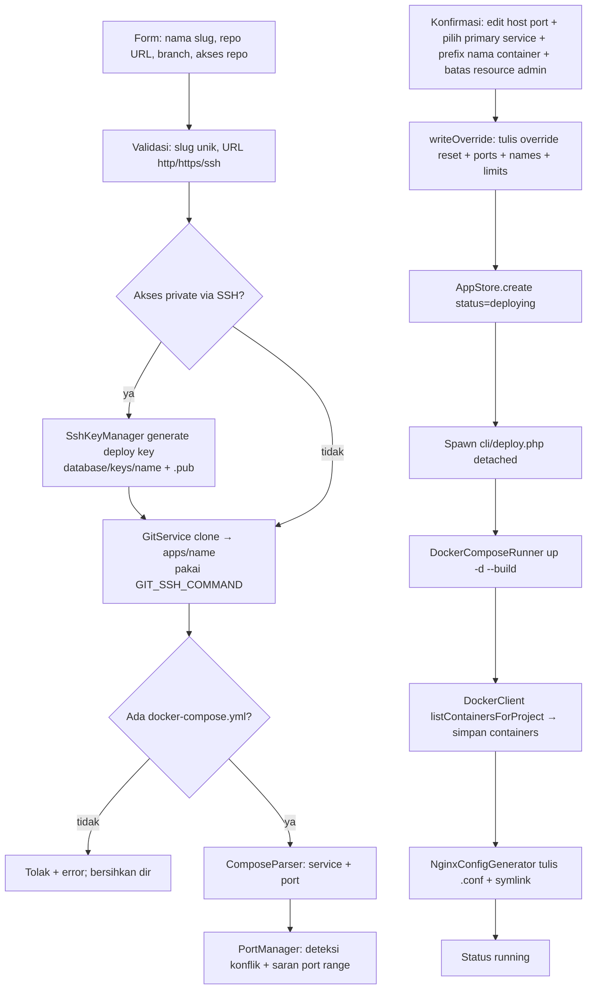
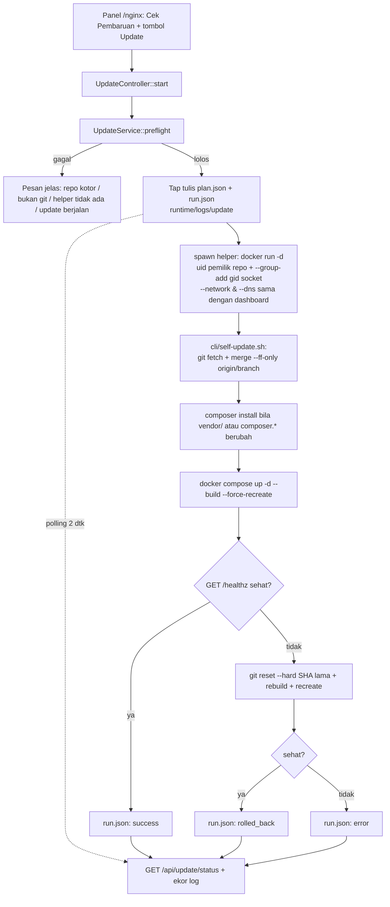
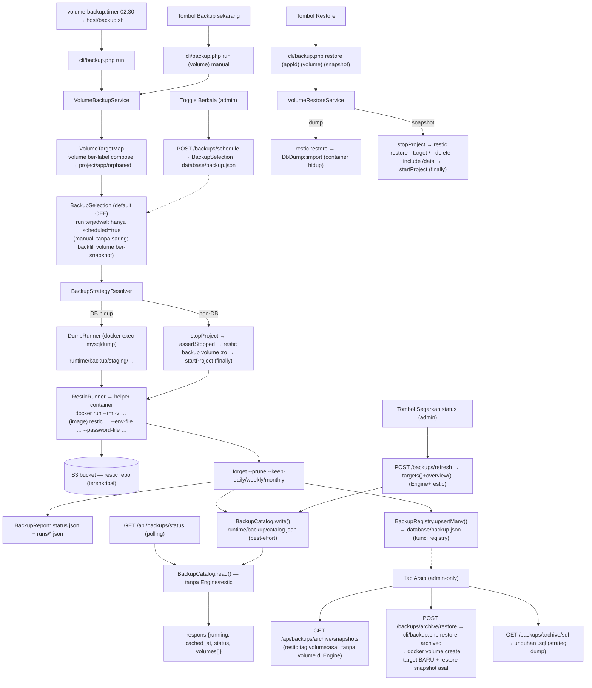

# ARCHITECTURE.md — Rames (Deploy Dashboard)

Dokumen ini menjelaskan **struktur kode** dan **cara kerja** project. Untuk spesifikasi kebutuhan & keputusan produk, lihat [`SPECS.md`](./SPECS.md).

---

## 1. Ringkasan

Rames (Phase 1) adalah aplikasi **Webman (PHP 8.1+)** yang berjalan **di dalam container Docker sebagai root**, mengelola:

- **App** — project yang di-deploy dari repo Git berisi `docker-compose.yml`
- **Container** — hasil `docker compose` tiap app (dijalankan pada daemon Docker *host* lewat socket)
- **Reverse proxy** — config Nginx ditulis ke direktori host (di-mount), Nginx native di host mem-forward subdomain ke port app

Arsitektur disiapkan agar logika eksekusi (`DeployerInterface`) bisa diekstrak menjadi **agent HTTP terpisah** di fase berikutnya (multi-server) tanpa merombak controller/business logic.

---

## 2. Diagram Arsitektur (Phase 1)

```mermaid
flowchart TB
    subgraph Host
        N[Nginx native<br/>:80 / :443]
        DNS[DNS wildcard *.APP_DOMAIN]
        NAvail[/etc/nginx/sites-available]
        NEnab[/etc/nginx/sites-enabled]
        WH[Watcher host - inotifywait + nginx -s reload<br/>(belum dipasang)]
    end

    subgraph Dashboard[rames-webman container]
        App[Webman HTTP]
        Lib[app/library - logika bisnis]
        DClient[DockerClient - Engine API]
        DCRun[DockerComposeRunner - CLI compose]
        NGGen[NginxConfigGenerator]
        GSvc[GitService]
        Worker[cli/deploy.php - background worker]
    end

    Daemon[(Docker Engine host)]

    App --> Lib
    App -- spawn detached --> Worker
    Lib --> GSvc
    Lib --> DClient
    Lib --> DCRun
    Lib --> NGGen
    Worker --> DCRun
    Worker --> DClient
    Worker --> NGGen
    DClient -- unix socket --> Daemon
    DCRun -- unix socket --> Daemon
    Daemon --> AppA[App A containers]
    Daemon --> AppB[App B containers]
    NGGen -- tulis .conf --> NAvail
    NAvail -. symlink .-> NEnab
    NAvail -- notifikasi perubahan --> WH
    WH -- reload --> N
    DNS -.-> N
    N -- proxy_pass 127.0.0.1:host_port --> AppA
    N -- proxy_pass 127.0.0.1:host_port --> AppB
```

**Poin kunci:**
- Dashboard **tidak** menjalankan `nginx -s reload` langsung ke host via shell — ia hanya menulis file `.conf` ke direktori yang di-mount; reload diaktifkan watcher host (`nginx -t && nginx -s reload`, SPECS §8.3) atau, sementara watcher belum ada, via helper container `--network host --pid host` yang me-chroot ke root host pada Docker socket (`NginxReloader`, SPECS §8.4).
- Semua operasi Docker dijalankan lewat `/var/run/docker.sock` yang di-mount → berjalan pada **daemon Docker host** (bukan daemon di dalam container).

---

## 3. Mode Menjalankan (Environment)

- Dashboard = container `rames-webman` (berjalan sebagai **root**), akses `http://host:{APP_PORT}`.
- Kode di-mount dengan path **sama dengan host** — `"${PWD}:${PWD}"` + `working_dir: ${PWD}`. Ini **krusial**: karena `docker compose` dieksekusi *di dalam container* tetapi daemon-nya *di host*, relative volume mount di `docker-compose.yml` milik app harus terselesaikan ke **path host yang valid**. Memakai `/app` membuat bind jadi `/app/apps/...` yang tidak dikenal daemon.
- `docker.sock` di-mount → dashboard mengeksekusi `docker compose` pada daemon host.
- Direktori Nginx host (`sites-available`/`sites-enabled`) di-mount → dashboard menulis file config; reload dilakukan watcher/manual di host.
- `/etc/letsencrypt` host di-mount → certbot (container) menulis sertifikat; nginx host membaca dari path yang sama.
- Container memakai `dns:` eksplisit (`DNS_1`/`DNS_2`) karena `/etc/resolv.conf` host pada environment ini bermasalah (symlink rusak) sehingga resolver internal Docker tak punya upstream.

---

## 4. Komponen & Lapisan

### 4.1 Lapisan HTTP — `app/controller/`

Controller hanya **mediator**: tidak memuat logika bisnis, tidak menyimpan state di properti (Webman persistent → `controller_reuse=false`), dan **tidak** memanggil `session()`/`request()` di konstruktor.

| Controller | Tanggung jawab |
|---|---|
| `AuthController` | Login/logout, session, regenerasi session id (anti fixation), migrasi kepemilikan app lama (best-effort) |
| `AppController` | Wizard create app (**tiga mode**: clone repo Git, paste/upload compose, dan **template** galeri siap-pakai §5.1c), halaman detail & halaman versi (`/apps/{id}/versions`), aksi (rebuild/rollback/stop/start/delete dengan mode preserve/purge volume — tombol Delete di tab khusus "Hapus App"), set/hapus custom domain, kelola environment variable app (simpan + auto-recreate, import `.env.example`), kelola external network (shared network lintas-app via compose override), kelola **nama container** (prefix `container_name`, §5.12), kelola **batas resource CPU/memori per service** (tab **Sumber Daya** — admin-only untuk mengubah, read-only untuk user lain, §5.12a), kelola **kepemilikan & sharing** (tab Akses: tambah/ubah/cabut member, transfer owner), endpoint polling status. Daftar app difilter ke app yang boleh diakses user |
| `TerminalController` | Terminal container (`docker exec`): buka sesi interaktif (open), stream output (SSE), kirim input, tutup sesi, dan one-shot run command; container divalidasi milik app **dan** user berhak (ability `terminal`); audit log ke `runtime/logs/terminal/` |
| `LogController` | Log container app (`docker logs`) untuk popup modal di detail app: `GET /api/apps/{id}/logs?container=&tail=`; ability `logs` (Viewer ke atas); nama container selalu divalidasi milik app (`AppContainers::resolve`) sebelum menyentuh Engine |
| `NginxController` | Halaman `/nginx` (global): status reload Nginx host terakhir + tombol Reload (khusus admin) — Nginx bersifat global (berlaku untuk semua app), di luar detail app |
| `DatabaseController` | Database manager (phpMyAdmin mini) + halaman `/database`. Daftar container difilter per kepemilikan app (non-admin: hanya app yang boleh diakses, tanpa container eksternal). **`findOwningApp()` adalah titik otorisasi tunggal** untuk semua endpoint DB (inspect/query/CRUD baris/user/dump) — koneksi Engine & kredensial hanya disentuh setelah otorisasi lolos |
| `VolumeController` | Halaman `/volumes`: daftar volume ber-label compose + bersihkan volume **yatim** (ditinggalkan app yang dihapus dengan mode preserve); daftar disaring ke app yang boleh diakses, purge hanya admin. Kolom **Ukuran** (storage terpakai per volume) dimuat asinkron dari `GET /api/volumes/usage` (`VolumeUsage::summarize` atas `GET /system/df`) agar render halaman tidak menunggu Engine menelusuri filesystem |
| `BackupController` | Halaman `/backups` + API backup volume ke S3 (§5.15): `GET /api/backups/status` (**cache-read** — tanpa Engine/restic), `GET /api/backups/snapshots`, `POST /backups/run` (ability `backup`), `POST /backups/restore` (ability `restore`), serta `POST /backups/refresh` & `POST /backups/schedule` (**admin global** — non-admin → **404**). Endpoint **arsip** (§5.15): `GET /api/backups/archive/snapshots`, `POST /backups/archive/restore`, `GET /backups/archive/sql` — semuanya **admin-only → 404** non-admin. Respons status disanitasi `publicStatus()` (daftar-putih — `volumes`/`error` mentah dibuang) + baris volume disaring `BackupAccess::visible()`; flag `scheduled` di-merge **segar** saat respons (`withScheduled()`); `data.archived` (riwayat volume terhapus) **admin-only** (`[]` untuk non-admin) dengan `restorable` per baris (`archivedRows()`). Halaman panduan `GET /backups/guide` (**admin-only → 404** non-admin) merender Markdown repo `host/restic-setup.md` lewat `Markdown::toHtml()` (helper statik `guideHtml()`; fail-safe `''` bila berkas tak ada/kosong/tak terbaca) ke view `backup/guide.php` (kotak `.guide-content`, **tanpa** `backup.js`) |
| `NetworkController` | Halaman `/networks`: daftar network Docker (built-in diberi label & dilindungi, milik app aktif ditandai "dikelola app"), buat shared network (bridge/overlay/macvlan + IPAM + flag attachable/internal), detail network (container terhubung + connect/disconnect), hapus network dengan proteksi berlapis (built-in / dipakai container / milik app aktif ditolak). Operasi global (buat/hapus/connect/disconnect) hanya admin; daftar disaring per app yang boleh diakses |
| `MonitorController` | Halaman global `/monitor` (nav sidebar) + `GET /api/monitor/overview` (metrik host + seluruh container) & `GET /api/monitor/host` (metrik host saja, untuk polling ringan kartu host — tanpa Engine). Read-only, tanpa state, tanpa CSRF. Otorisasi bertingkat: admin melihat semua container di host (termasuk container eksternal), user lain hanya container milik app yang boleh diakses (§5.13) |
| `UserController` | Kelola user — **khusus admin**: tambah/hapus user, ubah role (admin/member), ganti password. Menghapus user **mengalihkan app miliknya** ke admin yang menghapus |
| `SslController` | Halaman `/ssl`: daftar domain (subdomain/custom) + status SSL + tombol Aktifkan SSL / Retry; spawn worker `cli/ssl.php` |
| `IndexController` | Halaman utama dashboard (`view('index/hello')`) |
| `HealthController` | `GET /healthz` (**publik**, §5.14): status + SHA/branch dari `.git` (tanpa proses git) — dipakai helper self-update untuk memutuskan sehat/rollback, dan bisa dipakai monitoring eksternal |
| `UpdateController` | Endpoint self-update dashboard (§5.14): `GET /api/update/status` (semua user login), `POST /api/update/check`, `POST /api/update/start`, `POST /api/update/rollback` (admin). Panel-nya di halaman `/nginx` |

### 4.2 Middleware — `app/middleware/`

| Middleware | Peran |
|---|---|
| `CsrfMiddleware` | Validasi token CSRF untuk semua POST/PUT/PATCH/DELETE |
| `AuthMiddleware` | Lindungi semua route kecuali `/login` & aset statis; JSON 401 untuk request `/api/*` yang tidak login; **menyinkronkan user session dengan `auth.json`** pada setiap request (user dihapus → sesi dibuang; role berubah → langsung berlaku) |
| `StaticFile` | Tolak akses path berisi `/.` (bawaan webman) |

Terdaftar global di `config/middleware.php` dengan urutan: CSRF → Auth → StaticFile.

### 4.3 Lapisan Bisnis — `app/library/`

Semua logika bisnis ada di sini (controller tidak boleh berisi logika). Modul:

| Modul | Kelas | Peran |
|---|---|---|
| **Storage** | `JsonStore` | Baca/tulis JSON dengan `flock` + backup `.bak`; `update()` atomik (tulis in-place, ownership file host terjaga) |
| | `AppStore` | CRUD entri app di `database/apps.json` + kepemilikan (`owner_id`, `members`): `addMember()`, `removeMember()`, `transferOwner()`, `transferAllFrom()`, `ownedBy()`, `assignMissingOwners()` |
| **Auth** | `UserStore` | CRUD user di `database/auth.json`; hash bcrypt, `password_verify`; **role global** `admin`/`member` (`roleOf()`, `isAdmin()`, `changeRole()`, `countAdmins()`, `listWithRoles()`) + migrasi lazy berkas lama (user pertama = admin) |
| | `AppAccess` | **Satu-satunya pintu otorisasi app**: `roleFor()`, `can(ability, app, user)`, `require()` (melempar `AppAccessDenied`), `visible()` (filter daftar app), `abilitiesFor()`; stateless (aman untuk worker persistent). Ability `limits` (batas CPU/memori per service, §5.12a) eksklusif admin |
| | `AppAccessDenied` | Exception `extends BusinessException` yang merender **404** (JSON untuk `/api/*`, halaman 404 untuk request biasa) — menyembunyikan keberadaan app milik user lain |
| | `OwnershipMigrator` | Migrasi idempoten: app tanpa `owner_id` di-assign ke admin pertama |
| **Support** | `ProcessRunner` | Eksekusi command eksternal via `proc_open` (**array + `bypass_shell`** → tanpa shell, bebas command injection) + timeout; memasang `SIGCHLD=SIG_DFL` selama proses hidup agar git/docker compose tidak kehilangan `waitpid()` dan exit code tetap terbaca (§4.4) |
| | `SigchldGuard` | Penjaga disposisi `SIGCHLD` worker persistent: `disableIgnore()`, `withDefault()`, `ignoreAndReap()`, `isIgnored()`; murni statik, no-op bila pcntl tidak tersedia (§4.4) |
| | `Markdown` | Konversi **Markdown → HTML aman** untuk panduan template (§5.1c): `toHtml()` (statik murni, `html_input=escape` + `allow_unsafe_links=false` + `ExternalLinkExtension` → tautan eksternal `target="_blank"`/`rel="noopener noreferrer"`; converter juga mendaftarkan `TableExtension` → **tabel pipe GFM**, selain `CommonMarkCoreExtension` + `ExternalLinkExtension`); input kosong/whitespace **atau** kegagalan apa pun → `''` (panduan tak boleh menggagalkan halaman). Converter dibangun sekali (lazy static) |
| **Git** | `GitService` | `git clone` (depth 1) & `git pull --ff-only`; mendukung repo private via deploy key SSH (`GIT_SSH_COMMAND`) |
| | `SshKeyManager` | Generate/read/hapus pasangan kunci SSH (deploy key per app) di `database/keys/` |
| **Docker** | `ComposeParser` | Parse `docker-compose.yml` (short/long syntax port, IP binding) via `symfony/yaml` |
| | `PortManager` | Deteksi konflik port terhadap `apps.json`, saran port dari range, validasi port |
| | `DockerClient` | Client Engine API (Guzzle + `CURLOPT_UNIX_SOCKET_PATH`): list/inspect container, **log container `containerLogs()` (`/containers/{id}/logs`, respons multiplexed)**, **monitoring `containersOverview()` (`/containers/{id}/stats` + `/json` untuk banyak container sekaligus — fan-out paralel `CurlMultiHandler`, karena satu `stats` butuh ±1 detik)**, list volume (per project / semua), **pemakaian disk `getDiskUsage()` (`/system/df`, sumber ukuran terpakai volume)**, list/inspect/buat network, connect/disconnect container ke network, hapus network, ping |
| | `ContainerLogs` | Pembersihan stream log multiplexed (`demultiplex()` — buang header 8 byte per frame; teks polos container TTY dikembalikan apa adanya) + normalisasi `tail` (`normalizeTail()`, `tailOptions()`); murni statik |
| | `AppContainers` | Resolusi container milik app: `resolve($app, $name)` (validasi nama — dipakai terminal & log) dan `defaultContainer($app)` (container service `primary_service`, else pertama) |
| | `AppPorts` | Resolusi port app: `all($app)` (gabungan semua port publish tiap container), `forContainer($container)` (**dedupe** — Engine mengembalikan satu entri `Ports[]` per alamat IP untuk publish dual-stack IPv4+IPv6, plus fallback field lama `internal_port`/`host_port`), `proxiedContainerPort($app)` (port yang di-proxy Nginx — menghormati `primary_port`, fallback port pertama service primary), `primaryHostPort($app)` (target `proxy_pass`; dipakai `LocalDeployer` & view detail), **`hasHostPort($app)`** (penentu "app punya target `proxy_pass`": `false` ⇒ app tanpa vhost/subdomain, §5.1), `hostPortFor()`; murni statik tanpa I/O |
| | `VolumeUsage` | Pemetaan & format ukuran volume dari `GET /system/df` (`map()`, `summarize()`, `human()` — satuan SI seperti `docker system df`); murni statik tanpa I/O sehingga mudah diuji |
| | `ContainerStats` | Penafsiran `stats` + `inspect` menjadi baris monitoring (CPU% ala `docker stats`, memori dikurangi page cache cgroup, uptime dari `StartedAt`, restart count, health, PID) + `aggregate()` untuk total; murni statik tanpa I/O supaya rumusnya teruji |
| **System** | `HostUsage` | Metrik host — "total VM" halaman `/monitor`: CPU% (delta jiffies dua sampel `/proc/stat`), memori (`MemTotal`/`MemAvailable`), load, uptime, jumlah CPU; murni statik, path `/proc` bisa di-override (`HOST_PROC_PATH`), file tak terbaca → `null` (UI menampilkan N/A) |
| **Monitor** | `ResourceCollector` | Perakit data monitoring: aturan visibilitas container (hanya project app yang boleh diakses; container eksternal hanya admin) + penggabungan keluaran Engine menjadi baris siap tampil; statik, container ID di-resolve live (tanpa ubah `apps.json`) |
| | `DockerComposeRunner` | CLI `docker compose` untuk **orkestrasi**: up/down/build/stop/start/pull; `removeVolumes()` untuk `docker volume rm` (teardown selektif) |
| | `DockerExec` | Eksekusi `docker exec` ke container app: one-shot `runCommand()` (`sh -c`, timeout) & sesi interaktif `openInteractive()` — PTY via `script` (util-linux) + IPC berbasis FIFO di `runtime/terminal/{token}/` (proses detached, aman lintas-worker); `writeInput()/readOutput()/isRunning()/closeSession()` |
| **Db** | `DbContainerDetector` | **Dua tingkat klasifikasi (jangan dicampur)**: (a) `isDbContainer()`/`detectAll()`/`detectForApp()` = heuristik murah image (`mysql`/`mariadb`/`percona`) **atau** env `MYSQL_*`/`MARIADB_*`, dipakai halaman `/database` (**tanpa** exec); (b) `isDumpableForBackup()` = kelayakan untuk pemilihan strategi backup — image DB → `true`; sinyal env-only (image bukan DB) diverifikasi benar-benar punya `mysqldump`/`mariadb-dump` (`canRunDumpTool()`, memoize per id, timeout 10 dtk, gagal → `false` → strategi `snapshot`). `detectAll($apps, $includeUnowned)`: memetakan container → app pemilik; `$includeUnowned=false` (halaman `/database` non-admin) hanya mengembalikan container milik app yang diberikan — container app user lain & eksternal tidak di-inspect maupun ditampilkan. `detectForApp()` untuk tab Database di detail app |
| | `DbClient` / `DbConnectionResolver` / `DbCredentialResolver` | Koneksi PDO ke MySQL/MariaDB di container (host+port dari inspect) & deteksi otomatis kredensial dari env app/container |
| | `DbDump` / `DbUserManager` | Export/import dump database dan kelola user MySQL (create/delete/grant/revoke). **Guard tool**: bila `mysqldump`/`mariadb-dump` (export) atau `mysql`/`mariadb` (import) tidak ada di container → pesan jelas ke stderr + `exit 127` (bukan `sh: --host=… not found`). **Higiene kredensial**: password **tidak pernah** di string command/argv host — dikirim sebagai **baris pertama stdin** (`IFS= read -r __pw`) lalu hanya dipakai sebagai `MYSQL_PWD` untuk pemanggilan tool (`export()` menulis baris password ke pipe; `import()` mengirim `password"\n"+SQL`). Batasan: password tak boleh mengandung newline |
| **Nginx** | `NginxConfigGenerator` | Render & tulis config `.conf` + symlink ke `sites-enabled`; `ensureWritable()` fail-fast; render multi server block per app (subdomain + custom domain, redirect 301, blok `listen 443 ssl`, `location /.well-known/acme-challenge/`); **serve block HTTP 80 & HTTPS 443 meneruskan WebSocket** (`proxy_http_version 1.1` + `proxy_set_header Upgrade`/`Connection`), sedangkan redirect block & blok ACME tetap bersih (tanpa direktif WS) |
| | `NginxRoutes` | **Satu sumber kebenaran** bentuk data rute proxy tambahan per app (`apps.json` `nginx_routes`, §5.6a): `normalize()`/`parse()` **fail-fast** (validasi ketat `path` absolut + `target` http(s) tanpa userinfo/query/`..`, batas `MAX` = 20, tolak `/`, prefix `/.well-known` yang dicadangkan ACME, segmen `..` pada `path` — dicek terpisah dari regex agar `.` tetap sah, mis. `/a.b/` diterima, dan duplikat). `parse()` memvalidasi **per baris** sehingga kesalahan format/isi menyebut **nomor baris textarea** (`Baris N: …`); kesalahan lintas-entri (duplikat, `MAX`) muncul dari `normalize()` akhir tanpa nomor baris tetapi menyebut nilai path. Sedangkan `all($app)` **best-effort** (entri rusak dilewati, rute valid tetap dipakai, hasil ≤ `MAX`, tanpa throw → data `apps.json` rusak tidak menggagalkan deploy); `toText()` untuk textarea. Murni statik & stateless |
| | `NginxConfigGuard` | Penjaga penyimpanan rute proxy dengan alur "uji dulu, rollback bila gagal" (§5.6a): `applyRoutes($appId, $routes)` = snapshot rute lama → `AppStore::update()` → `DeployerInterface::writeNginxConfig()` → `NginxReloader::reload()`; bila tulis config atau uji/reload gagal → pulihkan `nginx_routes` lama + tulis ulang config lama (best-effort), host tidak di-reload. **Tidak pernah melempar**: selalu mengembalikan 4 kunci `{ok, reloaded, rolled_back, error}`; `rolled_back=false` + `PERINGATAN: rollback gagal` = pemulihan `apps.json` gagal (rute baru tertinggal), dan `rolled_back=true` + `PERINGATAN: config lama gagal ditulis ulang` = rute pulih tetapi config di disk bisa belum bersih. Instance (dependensi disuntikkan: `NginxReloader`/`DeployerInterface`/`AppStore`) & tanpa state lintas-request |
| | `NginxStatusReader` | Baca status reload terakhir watcher (`last-reload.json`) |
| | `NginxReloader` | Reload nginx HOST via helper container (`--network host --pid host --privileged`, chroot ke root host) pada Docker socket; `--network host` wajib agar resolusi DNS & konektivitas uji identik dengan nginx host (chroot membaca `/etc/resolv.conf` host — mis. `nameserver 127.0.0.1`; SPECS §8.4); tulis `last-reload.json`; dipakai tombol "Reload Nginx" di halaman `/nginx` + auto-reload setelah set/hapus custom domain, deploy/rebuild, dan SSL (best-effort) |
| **SSL** | `SslIssuer` | Terbitkan/revoke sertifikat Let's Encrypt via certbot (HTTP-01 webroot / DNS-01 Cloudflare), cek kedaluwarsa cert |
| **Deploy** | `DeployerInterface` | Abstraksi eksekusi deploy (siap diganti `HttpDeployer` untuk multi-server); termasuk `rollback()`, `apply()` (deploy ulang app mode compose tanpa git/build) dan `applyEnv()` (terapkan env var tanpa rebuild source) |
| | `ComposeSource` | Mode sumber app **compose** (create app dari file `docker-compose.yml` yang di-paste/di-upload, tanpa repo Git): `isCompose()`/`source()`, validasi & penyimpanan file unggahan (nama relatif aman, batas ukuran, tolak override generated), `assertDeployable()` (wajib `image:`, tolak `build:`), deteksi file utama, baca/tulis compose, daftar file sumber, serta `planHostPorts()` (port lama dipertahankan, konflik digeser via `PortManager`). **Pemilik tunggal urutan kanonik `compose_files`** — `orderFiles()` (base → `docker-compose.override.yml` reset → `.override.ports.yml` → `.override.names.yml` → `.override.limits.yml` → sisa override generated pada urutan asli, env paling akhir; duplikat & nama kosong dibuang); `AppController::orderComposeFiles()` hanya mendelegasikan ke sini. Juga `filterMissingGenerated($dir, $files)` — membuang **entri daftar** override generated (`GENERATED_PREFIX`) yang filenya sudah tidak ada di disk, tanpa pernah membuang base dan tanpa mengembalikan daftar kosong (§5.12a GOTCHA). Juga `declaresPorts($dir, $files)` — "apakah compose app mem-publikasikan `ports:`?" (mengabaikan `ports: !reset []`) untuk prasyarat Nginx sebelum container ada (§5.1). Murni statik |
| | `ComposeBinds` | Penyiapan **source bind mount** sebelum `docker compose up`: kumpulkan device volume bernama (`driver_opts` + `o: bind`) & bind mount service (short/long syntax), substitusi `${PWD}`/`${VAR}`, buat direktori yang belum ada di dalam direktori app, dan laporkan yang tidak bisa dibuat (file / di luar direktori app) sebagai petunjuk pada pesan error `compose up` (`missingHint()`); murni statik |
| | `ContainerNames` | Override **nama container** (`container_name`) per app (§5.12): skema `{prefix}-{service}`, validasi prefix, tolak service ber-replica, deteksi bentrok nama se-host (`usedFromEngine`/`usedFromApps`), serta `sync()`/`writeOverride()`/`removeOverride()` untuk `docker-compose.override.names.yml`; murni statik |
| | `ResourceLimits` | Override **batas maksimum CPU/memori per service** per app (§5.12a, SPECS §7.6b): field `limits` (map service → `{cpus, memory_mb}`), `normalize()`/`of()`, **`fromInput($posted, $services)`** (validasi whitelist service terhadap base compose + normalkan + buang entri tidak aktif — dipakai controller via `AppController::resolveLimits()`), `services()`/`detect()` (whitelist service + rencana keluarga field mengikuti base compose), `writeOverride()`/`removeOverride()`/`sync()` untuk `docker-compose.override.limits.yml`, dan **`persist($store, $app, $dir, $posted)`** — satu transaksi transparan: validasi nilai selalu dulu → parse base **hanya bila ada batas aktif** → tulis/hapus file → baru persist `limits`+`compose_files` (urutan via `ComposeSource::orderFiles()`); gagal tulis ⇒ state app tidak berubah. Fail-fast bila base compose tidak konsisten antar keluarga field Compose. Murni statik |
| `LocalDeployer` | Implementasi lokal: up → collect container → tulis config Nginx (termasuk custom domain & redirect subdomain); `rollback()` = fetch+checkout ref lama + rebuild, auto-restore ke versi aktif bila gagal, catat `deploy_history`; `applyEnv()` = tulis env + external networks + `up -d` (recreate); deploy/rebuild/rollback ikut `sync()` env + external networks + nama container + batas resource (§5.12a) |
| `EnvManager` | Kelola environment variable app: tulis managed env file (`database/env/{name}.env`, dipakai compose via `--env-file`) + override env (`docker-compose.override.env.yml`, inject `environment:` literal ke semua service); parse `.env.example` untuk import; `sync()` idempoten |
| **Template** | `TemplateCatalog` | Katalog **template app siap-pakai** (§5.1c) dari folder repo `templates/<slug>/` (`template.yml` + `docker-compose.yml` + `guide.md` + `files/`): `all()`/`find()`/`require()` (template rusak dikembalikan dengan `valid=false` + pesan error agar galeri menampilkannya, bukan menghilangkannya), validasi (image prebuilt tanpa `build:`, tolak `container_name` & replica > 1 & `name:` level atas — nama container/project dikelola dashboard per app; `ports:` opsional; tiap `${VAR}` tanpa default wajib dideklarasikan di `env[]`), `readGuide()` (baca `guide.md` ke kunci `guide`; batas `GUIDE_MAX_BYTES`, **non-fatal** — file hilang/kosong/terlalu besar/gagal baca → `''` dan `valid` **tidak** terpengaruh), `materialize()` (tulis compose + file pendukung ke direktori app lewat `ComposeSource::store()`; `guide.md` **tidak** ikut), serta `resolveEnv()`/`generatedKeys()` (nilai input → default → auto-generate rahasia → tolak bila wajib). Instance-based seperti `EnvManager` (path bisa di-override → mudah diuji) |
| `NetworkManager` | Kelola external network app: tulis `docker-compose.override.networks.yml` (deklarasi `external: true` + `networks: [default, <ext>]` ke semua service; merge compose `networks` union); `sync()` idempoten; dipanggil controller & `LocalDeployer` agar file konsisten dengan `apps.json` |
| | `DeployerFactory` | Satu-satunya titik pembuatan `DeployerInterface` |
| **Update** | `RepoInfo` | Pembacaan keadaan repo Git dashboard: `sha()`/`branch()`/`remoteUrl()` dibaca **langsung dari `.git`** (tanpa proses → murah untuk `/healthz`), sedangkan `headCommit()`/`trackedChanges()`/`untrackedFiles()` memakai git CLI dengan `-c safe.directory=<root>` (dashboard root ≠ pemilik berkas). `remoteHead()` = `git ls-remote` yang **tidak menyentuh repo lokal**; `compareUrl()` menyusun tautan compare GitHub/GitLab. Seluruh parser dipisah statik agar teruji |
| | `UpdateState` | Dua berkas status dengan **satu penulis masing-masing** (§5.14): `runtime/update/check.json` (ditulis dashboard) & `runtime/logs/update/run.json` + `<id>.log` (ditulis helper). Menyediakan pembacaan ternormalisasi, `isRunning()`, `finalize()` untuk run yang ditinggalkan helper, daftar/ekor log (nama divalidasi & dikurung di `run_dir`), serta serah-terima kepemilikan direktori ke uid pemilik repo agar helper bisa menulis |
| | `UpdateChecker` | Cek pembaruan = bandingkan SHA HEAD lokal dengan `git ls-remote origin refs/heads/<branch>` (tanpa `fetch` → tidak menulis objek/ref sebagai root); menulis `check.json` yang dibaca badge nav & panel. Kegagalan (jaringan/remote/detached HEAD) dikembalikan sebagai pesan, bukan exception |
| | `UpdateService` | Orkestrasi: `selfContext()` (inspect container dashboard sendiri via Engine → image, project, service, network, `dns`) untuk membangun perintah `docker run` helper (`buildHelperCommand()`, array tanpa shell, uid pemilik repo + `--group-add` gid socket), `preflight()` (fail-fast: repo bersih, branch, helper ada, tidak ada run berjalan), `start()` (tulis plan + status awal lalu spawn helper detached), `panel()` (ringkasan UI + deteksi run macet) |
| **Backup** | `VolumeBackupService` | Orkestrasi **satu run** backup volume → S3 via restic (§5.15): ambil `BackupRunLock`, enumerasi target (`VolumeTargetMap`), proses **serial per app** (dump untuk container DB hidup, snapshot untuk volume non-DB via stop→snapshot→start dengan start ulang di `finally`), retensi `forget --keep-*` per volume, tulis `BackupReport`; staging dibersihkan di `finally`. Tanpa state lintas-request. Pada run **terjadwal** (`trigger=schedule`, tanpa `volumes` eksplisit) hanya volume bertanda `scheduled=true` yang diproses (`BackupSelection`); `volumes` eksplisit (manual) **tidak** disaring. `catalog()` = baca cache `BackupCatalog` **tanpa** Engine/restic (dipakai `GET /api/backups/status`); `refreshCatalog()` = hitung live (`targets()`+`overview()`) lalu tulis cache; akhir run menulis cache **best-effort** (kegagalan cache tidak menggagalkan run). Kedua jalur cache ini juga memanggil `BackupSelection::backfill()` untuk baris `snapshots > 0` (seleksi berkala default **OFF**/opt-in → volume ber-snapshot otomatis tetap terjadwal). `snapshotCountsByVolume()` (dipakai `overview()` saat refresh/akhir run) memakai timeout **pendek** `SNAPSHOT_COUNT_TIMEOUT` (15 dtk) — **bukan** `VOLUME_BACKUP_TIMEOUT` (3600 dtk) — agar S3 lambat/down tidak menggantung UI; timeout → jumlah snapshot `0`. Akhir run juga mencatat riwayat permanen tiap volume `ok` (`recordRegistry()` → `BackupRegistry`); `refreshCatalog()`/akhir run menyinkronkan jumlah snapshot + prune (`syncRegistryCounts()`; guard peta-kosong §5.15) lalu mem-backfill riwayat volume ber-snapshot yang belum tercatat (`backfillRegistry()` → `BackupRegistry::backfill()`); `archived()` = entri riwayat yang **bukan** volume katalog (murni baca berkas, dipakai tab **Arsip**) |
| | `BackupSelection` | Flag seleksi backup **berkala per volume** (opt-in) di `database/backup.json` (gitignored, **terpisah** dari `apps.json` — skema tidak berubah): `isScheduled()` (**default OFF**/opt-in bila entri/kunci `scheduled` absen), `setScheduled()` (validasi nama volume fail-fast lalu tulis via `JsonStore::update`), `backfill(array $names)` (untuk nama **tanpa entri eksplisit** → tulis `{"scheduled":true,"updated_at":<ISO>,"updated_by":"system"}` dalam satu `JsonStore::update`; validasi nama via `VolumeStateGuard::assertVolumeName` **sebelum** menulis; idempotent — entri eksplisit ON/OFF tidak ditimpa), `explicit()` (entri yang pernah ditulis UI, untuk memulihkan toggle). Memo **per instance** (instance dibuat per request/run — bukan properti lintas-request); path bisa di-override saat tes |
| | `BackupRegistry` | Riwayat permanen volume yang **pernah ter-backup** (agar volume yang sudah dihapus tetap bisa dipulihkan, §5.15): **berbagi berkas** `database/backup.json` dengan `BackupSelection` tetapi **hanya** menyentuh kunci `registry` (`volumes` milik seleksi) — satu berkas, dua kunci. Entri: `project, app_id, app_name, strategy, first_backed_up_at, last_backed_up_at, last_snapshot, snapshots, bytes`. `upsertMany()` (satu `JsonStore::update`; `first_backed_up_at` dipertahankan, field absen mempertahankan nilai lama), `backfill()` (idempotent — sisipkan entri awal untuk volume ber-`snapshots > 0` yang **belum tercatat**; `last_snapshot: null`, `bytes: 0`, `first_/last_backed_up_at` dari `at`/sekarang; nama invalid dibuang; hanya kunci `registry` disentuh — dipanggil `VolumeBackupService::backfillRegistry()` **setelah** `syncCounts()`, §5.15), `read()`, `syncCounts()` (segarkan `snapshots` + **prune** entri yang snapshot-nya habis — **kecuali** peta counts kosong `[]` = "tidak diketahui" ⇒ mutasi **tidak** dijalankan, GOTCHA §5.15), `remove()`. Stateless; path bisa di-override saat tes |
| | `BackupCatalog` | Cache baris ringkasan volume di `runtime/backup/catalog.json` (gitignored): `read()` (tanpa Engine/restic; berkas absen ⇒ `volumes=[]`, `cached_at=null`), `write($rows)` (menyegel `cached_at`). Baris disanitasi ke daftar-putih kunci (`name, project, app_id, app_name, orphaned, strategy, container_state, last_run_at, last_ok, last_message, snapshots`) — kunci di luar daftar dibuang. Ditulis **hanya** saat run selesai atau tombol Segarkan — **bukan** saat polling. Stateless; path bisa di-override saat tes |
| | `VolumeRestoreService` | Restore sadar-strategi (§5.15): **dump** → `restic restore` ke direktori sementara lalu `DbDump::import()` ke container DB hidup; **snapshot** → `stopProject` → `restic restore --target / --delete --include /data` pada volume `rw` → `startProject` (`finally`). Fail-fast (nama volume, id snapshot, snapshot ada, kepemilikan) sebelum efek samping; **tanpa** `docker volume rm`. Mendukung **restore arsip** ke volume **baru** (§5.15): `planArchiveRestore()` (gate murni dipakai bersama controller & CLI), `archiveVolumeCreateArgv()`/`archiveVolumeRemoveArgv()` (argv `docker volume create`/`rm` statik murni), `extractSnapshotSql()` (unduh `.sql` dari snapshot dump) |
| | `ResticRunner` | Pembungkus restic di **helper container** (`docker run --rm … <image> restic …`): argv dibangun **array** lewat method statik murni (`build*Argv()`, teruji `tests/ResticArgvTest.php`), passphrase via `--password-file` (`/restic-password:ro`), kredensial S3 via `--env-file`, **DNS helper via `--dns`** (diisi `HelperImageResolver`), validasi regex nama volume/id snapshot, timeout `VOLUME_BACKUP_TIMEOUT`; operasi `backup`/`snapshots`/`restore`/`forget`/`check` |
| | `BackupStrategyResolver` | Statik murni: pilih `dump` (penanda `is_db` — dari `DbContainerDetector::isDumpableForBackup()` — **dan** container hidup) vs `snapshot` (sisanya; `VOLUME_BACKUP_DB_DUMP_ENABLED=false` ⇒ selalu snapshot) |
| | `VolumeStateGuard` | Penjaga keadaan: `containersForVolume()` (Engine filter `volume=<n>`, penanda `is_db` dari **`DbContainerDetector::isDumpableForBackup()`** — sadar-kapabilitas, bukan heuristik tampilan), `assertStopped()` (tolak snapshot bila ada container `running`), `stopProject()`/`startProject()` (`docker compose stop\|start`, **tanpa** `-v`); validasi nama volume/project |
| | `VolumeTargetMap` | Statik murni: pemetaan volume ber-label `com.docker.compose.project` → `{name, project, app_id, app_name, orphaned}` + `filterAccessible()` |
| | `BackupAccess` | Satu pintu otorisasi backup: mendelegasikan ke `AppAccess` (tidak menyalin role); volume yatim hanya admin global; `visible()` menyaring daftar |
| | `CredentialEnvFile` | Env-file kredensial S3 **per-run** (chmod 0600 **sebelum** tulis, dihapus di `finally`, `sweepStale()` sisa run crash) — satu sumber kebenaran backup & restore. Baris ditulis **mentah** `KEY=VALUE` **tanpa kutip** (wajib: `docker run --env-file` tidak mengupas kutip) + normalisasi `\r`/`\n` |
| | `HelperImageResolver` | Penentu image helper: override `VOLUME_BACKUP_IMAGE` → image container dashboard (inspect diri sendiri) → fail-fast; keputusan murni `choose()`. Inspect yang sama juga mengambil **DNS dashboard** (`HostConfig.Dns`) lewat `dns()`/`chooseDns()` (satu panggilan Engine, memoize; best-effort `[]` bila Engine tak terjangkau/DNS kosong) untuk diteruskan `ResticRunner` sebagai `--dns` |
| | `DumpRunner` | Dump logis container DB (memakai `DbDump`/`DbCredentialResolver`/`DbConnectionResolver`) ke `runtime/backup/staging/{project}/{timestamp}/`; kredensial lewat `MYSQL_PWD` |
| | `BackupRunLock` | `flock(LOCK_EX\|LOCK_NB)` pada `runtime/backup/run.lock` — cegah run harian vs manual tumpang tindih; `withLock()` |
| | `BackupReport` | Baca/tulis `runtime/backup/status.json` + `runs/*.json` via `JsonStore`; daftar-putih kunci + redaksi pola kredensial |

### 4.4 Background Worker — `cli/deploy.php`

- Dipanggil detached oleh `AppController` via **`pcntl_fork` + `pcntl_exec`** (bukan `proc_open`). Alasan: `proc_close()` memblokir request sampai worker selesai — build bisa berlangsung menit, sehingga timeout/refresh browser tampak "menggagalkan" deploy. Request langsung kembali (hanya fork), worker berjalan detached (`posix_setsid`, stdio → `/dev/null`) dan tetap lanjut meski HTTP worker di-restart. Logging tetap oleh worker sendiri (`file_put_contents`).
- **Jebakan `SIGCHLD` (`SigchldGuard`)** — worker deploy & sesi terminal tidak pernah di-`wait`, jadi proses HTTP worker meng-ignore SIGCHLD (`SIG_IGN`) agar tidak ada zombie. Tetapi `SIG_IGN` **diwariskan melewati `fork` + `exec` dan menetap selama worker hidup** — semua proses yang di-spawn worker itu setelahnya ikut meng-ignore SIGCHLD. Akibatnya: (a) proses yang menunggu anaknya sendiri gagal `waitpid()` (ECHILD) — git → `git-remote-https`/index-pack, `script` → `docker exec`, `docker compose` → docker → `error: waitpid for git-remote-https failed: No child process` / `error: waitpid for --shallow-file failed: No child process` / `fatal: index-pack failed`; dan (b) `proc_close()` tidak bisa membaca exit code (selalu `-1`) sehingga perintah yang sukses dianggap gagal.
  Penangkalnya `app\library\Support\SigchldGuard`: `disableIgnore()`/`withDefault()` memasang `SIG_DFL` **sebelum** spawn (disposisi diwariskan saat `fork`, jadi harus berlaku sampai proses di-wait/`proc_close`) lalu `ignoreAndReap()` memulihkan pola auto-reap + membuang zombie sisa. Dipakai `ProcessRunner` (seluruh perintah git/docker), `DockerExec::openInteractive()`, dan `DbDump::runToFile()`. Di sisi worker anak, `SIGCHLD` di-reset ke `SIG_DFL` sebelum `pcntl_exec` agar `ProcessRunner` di dalam worker membaca exit code dengan benar.
- UI deploy/rebuild memakai **AJAX + polling**: `fetch` pada tombol (tanpa navigasi halaman) + polling `/api/apps/{id}/status` menampilkan progres live (progress bar + stage + pesan). Bila halaman di-refresh saat build berjalan, page mendeteksi status `deploying` (panel `data-busy`) lalu melanjutkan polling otomatis sampai `running`/`error`.
- Mode: `deploy`, `rebuild`, `rollback` (dengan argumen ref SHA), `apply` (app mode compose — `up -d` tanpa build, §5.1b). Pipeline per tahap menulis status ke `apps.json` (via `AppStore->update`, `flock`), sehingga UI bisa *poll*:
  `deploying` → `build` → `collect` → `nginx` → `running` (atau `error`).
- Setelah selesai, persisten `containers` dan `deploy_history` kembali ke `apps.json`.
- Log per app: `runtime/logs/deploy/{appId}.log`.
- Worker SSL: `cli/ssl.php` — jalankan `certbot certonly`, update `ssl_status`/`ssl_expires_at`, tulis ulang config Nginx dengan SSL (log `runtime/logs/ssl/{appId}.log`).
- **Self-update dashboard** (§5.14) — bukan worker PHP, melainkan **helper container** yang di-spawn `UpdateService` (`docker run -d`, detached, di luar compose project) dan menjalankan `cli/self-update.sh` di dalam repo: `git fetch`/`merge --ff-only` → `composer install` (bila perlu) → `docker compose up -d --build --force-recreate` → tunggu `/healthz` → rollback otomatis (`git reset --hard` + rebuild) bila versi baru tidak sehat. Status ditulis oleh `cli/update-report.php` (PHP mandiri tanpa autoload, ikut disalin ke `/tmp` agar stabil saat kode berubah oleh `git pull`).

### 4.5 Storage

- `database/auth.json` — array user (id, username, password_hash, **role** `admin|member`, created_at). Berkas lama tanpa `role` dibaca sebagai user pertama = admin (tanpa menulis ulang berkas).
- `database/apps.json` — array app (struktur lengkap di SPECS §7.1): id, name, **source** (`git` default bila absen | `compose`), **template** (`{slug,title}` untuk app hasil template §5.1c, null untuk lain), **owner_id**, **members** (map userId → {role, added_at, added_by}, SPECS §7.7), subdomain, repo_url, branch, local_path, primary_service, **container_prefix** (prefix nama container, SPECS §7.6a), status, compose_files, auth_method, ssh_key, containers, timestamp, env (map KEY=value, SPECS §7.6), **limits** (map service → `{cpus, memory_mb}`, SPECS §7.6b).
- `templates/<slug>/` — definisi template create app (§5.1c): `template.yml` (metadata + deklarasi env), `docker-compose.yml` (image prebuilt), `guide.md` (panduan Markdown opsional, dibaca `TemplateCatalog::readGuide()` — katalog-only, **tidak** di-materialize), `files/` (file pendukung). Ikut versi repo (bukan data runtime) → dikelola admin/dev lewat git.
- `host/restic-setup.md` — panduan setup backup volume ke S3 (Markdown **repo**, bukan data runtime) yang dirender **di dalam UI** pada `GET /backups/guide` (admin-only, §5.15): dibaca `BackupController::guideHtml()` → `Markdown::toHtml()` (satu pintu sanitasi), tampil sebagai kotak `.guide-content`; ikut versi repo lewat git, **tidak** disalin ke app.
- `database/keys/` — pasangan kunci SSH (deploy key per app, chmod 0600) + `known_hosts`; private key tidak pernah keluar server.
- `database/env/{name}.env` — managed env file per app (chmod 0600); dibaca docker compose via `--env-file`.
- `apps/{name}/docker-compose.override.limits.yml` — override **batas CPU/memori** generated (`ResourceLimits`, SPECS §7.6b/§5.12a); ditulis/dihapus mengikuti field `limits` di `apps.json`.
- `runtime/update/check.json` — cache hasil cek pembaruan dashboard (§5.14), ditulis proses `update-check`/tombol **Cek Pembaruan**; dibaca badge nav tiap render halaman (tanpa jaringan).
- `runtime/logs/update/` — `run.json` (status update terakhir/sedang berjalan) + `<id>.log` (keluaran mentah git/composer/compose/curl), ditulis helper self-update.
- `runtime/backup/` — state backup volume (§5.15, gitignored): `status.json` (run terakhir, dibaca UI), `runs/*.json` (riwayat, retensi), `run.lock` (`flock`), `staging/` (dump logis sementara), `restore/` (kerja restore), `tmp/` (env-file kredensial per-run 0600), `catalog.json` (cache baris ringkasan — dibaca `GET /api/backups/status`, ditulis saat run/Segarkan).
- `database/backup.json` — **satu berkas, dua kunci** (§5.15, gitignored): `volumes` = seleksi backup **berkala per volume** (`BackupSelection`) dan `registry` = riwayat permanen volume yang **pernah ter-backup** (`BackupRegistry`, agar volume yang sudah dihapus tetap bisa dipulihkan). Bentuk: `{"version":1,"volumes":{"<nama>":{"scheduled":bool,"updated_at":ISO,"updated_by":id}},"registry":{"<nama>":{"project":str,"app_id":?str,"app_name":?str,"strategy":str,"first_backed_up_at":ISO,"last_backed_up_at":ISO,"last_snapshot":?str,"snapshots":int,"bytes":int}}}`. Untuk `volumes`, entri/kunci `scheduled` absen ⇒ default **OFF** (opt-in): volume tidak ikut run harian sampai entri eksplisit ditulis. Pengecualian: volume **ber-snapshot > 0** di-`backfill()` otomatis ke `scheduled=true` (`updated_by="system"`) saat `refreshCatalog()`/akhir run agar backup yang sudah ada tidak berhenti terjadwal; entri eksplisit tidak ditimpa. Untuk `registry`, tiap volume `ok` dicatat akhir run; entri dipangkas saat snapshot habis — **kecuali** peta counts kosong (`[]`)/`null` yang dianggap "tidak diketahui" (GOTCHA §5.15). **Catatan**: `POST /backups/refresh` **menulis** berkas ini (via `backfill()` + `syncRegistryCounts()`), bukan hanya `runtime/backup/catalog.json`.
- `database/restic/password` — passphrase restic (chmod 0600, gitignored), dirujuk `RESTIC_PASSWORD_FILE` (§5.15).
- Semua mutasi lewat `JsonStore->update()` dengan `flock` → aman dari race condition.
- Direktori `apps/`, `database/*.json`, `database/keys/`, `database/env/`, `nginx-status/` di-gitignore (data runtime).

### 4.6 Lapisan View & Aset Statis — `app/view/` + `public/`

View PHP native (mesin `Raw`, tanpa build step/bundler). **Shell halaman dikelola terpusat di dua partial**: `app/view/partials/header.php` membuka `<body>` lalu menulis `<aside id="appSidebar" class="app-sidebar offcanvas-lg offcanvas-start">` (brand + `nav.sidebar-nav` + `.sidebar-user`) dan membuka `.app-main`; `app/view/partials/footer.php` menutup `</main>`, footer, lalu `
` penutup `.app-main`. Semua view cukup meng-`include` kedua partial — kontrak include ini **tidak berubah** saat layout berganti.

- **Menu dikelola di satu partial** (Apps, SSL, Volumes, Networks, Backup, Monitor, Database, Config[+ badge `update`], Users[bila admin]). **WAJIB**: view lain **tidak boleh** menyentuh/menduplikasi nav — menambah/mengubah item cukup di `partials/header.php`; state aktif lewat variabel `$active` + `aria-current="page"`.
- **Ikon menu = inline SVG, tanpa library ikon/CDN.** Tiap item `nav.sidebar-nav` merender `` (SVG line-art `viewBox="0 0 24 24"`, 18×18, `stroke="currentColor"`, `aria-hidden="true"`) lalu `` (teks); `<a>` membawa **`data-label`** (label untuk popover rail, lihat di bawah) + `aria-label` — **bukan** `title`. Peta ikon `$__navIcons` dan `$__burger` dikumpulkan di `partials/header.php`. **DILARANG menambah library ikon/webfont/CDN** — ikon wajib inline SVG (tanpa dependensi runtime, ikut `currentColor` saat aktif/hover).
- **Lipat sidebar (desktop ≥ 992px)**: tombol `.sidebar-toggle[data-sidebar-toggle]` paling kiri `.app-sidebar-head` (kelas `d-none d-lg-inline-flex`, `aria-controls="appSidebar"`) men-toggle class **`body.sidebar-collapsed`** lewat `public/js/layout.js` (vanilla, tanpa dependensi). Kondisi rail menyempitkan `.app-sidebar` → **72px**, `.app-main { margin-left: 72px }`, menyembunyikan `.nav-label`/badge/`.brand`/`sidebar-user-*`/`.sidebar-logout`, dan memusatkan ikon. Pilihan dipersist di `localStorage['rames.sidebar']` (`'collapsed'`/`'expanded'`); skrip inline di `partials/header.php` (sebelum `<aside>`) menerapkan class **sebelum paint** (anti-flash), lalu `layout.js` menyinkronkan `aria-expanded`/`aria-label` tombol. Kegagalan `localStorage` (mode privat/storage penuh) diabaikan, bukan error.
- **Popover label menu saat rail terlipat (murni CSS, tanpa JS baru)**: di rail (≥ 992px, `body.sidebar-collapsed`) `.nav-label` disembunyikan, jadi tiap `a.nav-link` membawa **`data-label`** yang dirender ulang sebagai *popover* lewat `content: attr(data-label)` pada `.nav-link::after` (bubble ke kanan ikon; `left: calc(100% + 10px)`, `white-space: nowrap`) ditambah `.nav-link::before` (panah kecil penunjuk ikon). Popover tampil saat **`:hover`** dan **`:focus-visible`** (transisi `opacity .14s ease` + geser `translateX`), `pointer-events: none`, `z-index: 1080` (**relatif di dalam stacking context `.app-sidebar`** — bukan nilai efektif global; lihat sub-bullet berikut).
  - **`z-index: 1030` pada `.app-sidebar` (≥ 992px) WAJIB.** Popover (`.nav-link::after`) berada di dalam stacking context `.app-sidebar`; tanpa `z-index` pada elemen sidebar (semula `auto`), card/konten `.app-main` yang datang **belakangan di DOM** melukis **di atas** sidebar sehingga popover (dan sidebar) terhalang. Nilai `1030` = layer "fixed" Bootstrap: di atas seluruh konten halaman, **di bawah** `.offcanvas` (`1045`) dan `.modal` (`1055`) agar dialog tetap menutupi sidebar. **Lever-nya adalah `z-index` elemen `.app-sidebar`, bukan `::after`** — `z-index: 1080` pada `::after` hanya berlaku relatif di dalam stacking context sidebar, jadi ia **tidak** dapat mengangkat popover melewati card `.app-main`. Aturan ini **hanya** berlaku di dalam `@media (min-width: 992px)`; drawer offcanvas mobile (< 992px) tidak terpengaruh.
  - **`body.sidebar-collapsed .sidebar-nav { overflow: visible; }` WAJIB.** `.sidebar-nav` adalah satu-satunya elemen peng-clip di jalur rail (`overflow-y: auto`; `.offcanvas-lg` pada ≥ lg tidak menyetel `overflow`), sedangkan popover menggantung ke kanan melewati rail 72px — tanpa `overflow: visible` popover terpotong. `overflow` **hanya** dilonggarkan di mode rail; saat sidebar terbuka nilainya tetap `auto` (menu tetap scrollable) dan popover tidak dirender.
  - `@media (prefers-reduced-motion: reduce)` mematikan transisi `::before`/`::after` (bersama transisi `width`/`margin-left` shell).
- **Burger mobile (< 992px)**: `.sidebar-burger` di **kiri** topbar (`<button data-bs-toggle="offcanvas" data-bs-target="#appSidebar">`) membuka drawer offcanvas via `bootstrap.bundle.min.js` — **tanpa JS kustom**.
- **Topbar mobile**: `<header class="topbar sticky-top d-lg-none">` (brand + tombol hamburger di atas) hanya tampil < 992px.
- **Responsif**: komponen Bootstrap `offcanvas-lg offcanvas-start` — < 992px sidebar menjadi **drawer offcanvas**; ≥ 992px (`@media (min-width: 992px)` di `public/css/app.css`) sidebar `position: fixed` selebar **264px** dan `.app-main` digeser `margin-left: 264px`. Tanpa library/JS baru (`bootstrap.bundle.min.js` sudah dimuat).
- **Gaya & aset**: kelas `.app-sidebar`/`.app-sidebar-head`/`.sidebar-nav`/`.sidebar-user`/`.sidebar-user-name`/`.sidebar-user-badge`/`.sidebar-logout`/`.app-main`/`.nav-ico`/`.nav-label`/`.sidebar-toggle`/`.sidebar-burger`/`.brand-text` di `public/css/app.css`; `.topbar`/`.brand`/`.avatar`/`.footer` dipertahankan (`.topbar` kini khusus topbar mobile). Transisi `width`/`margin-left` **`.18s ease`**, dimatikan `@media (prefers-reduced-motion: reduce)`. JS: `public/js/layout.js` (dimuat di `partials/footer.php`) + `app-terminal.js`/`backup.js`/`monitor.js`/`update.js` per halaman. Mengubah layout = sentuh kedua partial + CSS/JS, **bukan** 17 view.
- **Breadcrumb — partial `app/view/partials/breadcrumb.php` (presentasi murni, satu sumber kebenaran).** Partial membaca variabel **`$breadcrumbs`** = array item berbentuk `['label' => string, 'href' => string|null]`; item **terakhir** = halaman aktif → dirender **tanpa** tautan (`href => null`) + `aria-current="page"` dan class `.active`; item lain ber-`href` menjadi `<a>`. Semua label/href lewat `e()`. Markup: `nav[aria-label="Breadcrumb"]` → `ol.breadcrumb` (komponen Bootstrap) berisi `li.breadcrumb-item`. **Titik render**: `partials/header.php` meng-include partial ini **tepat setelah `<main class="container-fluid …">` dan sebelum blok flash**, hanya bila `!empty($breadcrumbs)` — kontrak include `<main>`/`.app-main` **tidak berubah**, dan halaman tanpa `$breadcrumbs` tidak menampilkan breadcrumb. Karena variabel view berbagi scope dengan include, halaman cukup men-set `$breadcrumbs` **sebelum** `include …/partials/header.php`.
- **Gaya `.breadcrumb`** di `public/css/app.css` (`font-size: 12.5px`; divider `›` lewat `--bs-breadcrumb-divider: "\203A"`; `--bs-breadcrumb-item-padding-x: .5rem`; `--bs-breadcrumb-margin-bottom: 0`): tautan warna sekunder (`--bs-secondary-color`) → hover/focus-visible `--accent2`; item `.active` warna `--bs-body-color` + tebal. Memakai variabel Bootstrap dan **tidak** menyentuh `.page-head`.
- **Penggantian tautan back tingkat halaman**: tautan "kembali ke induk" (mis. `← Daftar Apps`, `← Apps`, `← Daftar Database`, `← Networks`, `← Detail app`, `← Semua Template`, `← Kembali ke Apps`) **dihapus** dan digantikan breadcrumb. **Form-action** `Batal`/`Kembali` **di dalam form tetap** (bagian alur form, bukan navigasi hierarki). Halaman **tanpa** breadcrumb (tidak punya tautan ke induk): `/apps`, `/database`, `/users`, `error/404`.
- **Halaman ber-breadcrumb (13)** dan rantainya:

| Route | Rantai `$breadcrumbs` |
|---|---|
| `/apps/{id}` | `Apps` → `{app name}` |
| `/apps/{id}/versions` | `Apps` → `{app name}` → `Versi` |
| `/apps/create/template/{slug}` | `Apps` → `Template` (`/apps/create?mode=template`) → `{template title}` |
| `/apps/create` | `Apps` → `Buat App` |
| `/apps/create/confirm` | `Apps` → `Buat App` → `Konfirmasi` |
| `/database/{container}` | `Apps` → `{app name}` *(dilewati bila app `null`)* → `Database` → `{container}` |
| `/networks` | `Apps` → `Networks` |
| `/networks/{name}` | `Apps` → `Networks` → `{name}` |
| `/ssl` | `Apps` → `SSL` |
| `/volumes` | `Apps` → `Volumes` |
| `/backups` | `Apps` → `Backup` |
| `/monitor` | `Apps` → `Monitor` |
| `/nginx` | `Apps` → `Config` |

> **WAJIB — halaman ber-breadcrumb men-set `$breadcrumbs` sebelum `include …/partials/header.php`, dan item terakhir (halaman aktif) ber-`href => null`.** Gejala: breadcrumb tidak tampil, atau item aktif muncul sebagai tautan yang bisa diklik ke dirinya sendiri. Sebab: partial hanya dirender bila `!empty($breadcrumbs)`, dan posisi aktif ditentukan dari **urutan array** (`array_key_last`), bukan dari `href`. Penangkal: set array lengkap (item induk ber-`href`, item terakhir `href => null`) di atas `include` header; jangan bergantung pada `$breadcrumbs` yang mungkin di-set halaman lain.
> **GOTCHA — jangan menyisakan kolom kanan `page-head` kosong saat tombol opsional tak dirender.** Gejala: `page-head` tampak berlubang/tidak seimbang ketika tombol Panduan (atau tombol log) tidak ada, karena `
` pembungkus tombol tetap tercetak walau isinya kosong. Sebab: breadcrumb menggantikan tautan back, sehingga `page-head` pada sebagian halaman hanya punya tombol opsional di kolom kanan. Penangkal: bungkus kolom kanan itu dengan kondisi — sudah dilakukan di `app/view/app/detail.php` (`if ((($guideHtml ?? '') !== '') || ($logContainer !== null && $logContainer !== ''))`) dan `app/view/app/template.php` (`if (($guide_html ?? '') !== '')`).
> **DILARANG — menambah CDN/library breadcrumb.** Breadcrumb wajib memakai komponen Bootstrap (`nav`/`ol.breadcrumb`) + CSS tema di `public/css/app.css`; jangan menarik library/plugin breadcrumb dari CDN atau bundler baru.

> **WAJIB — semua aturan `body.sidebar-collapsed` tetap di dalam `@media (min-width: 992px)`.** Gejala: di layar < 992px drawer offcanvas menyempit/menghilangkan label, atau `.app-main` tiba-tiba di-dorong `margin-left: 72px`. Sebab: pada mobile `.app-main` mengikuti alur normal (bukan `position: fixed`), sehingga aturan rail yang bocor merusak layout. Penangkal: setiap selector `body.sidebar-collapsed …` hanya di dalam blok `@media (min-width: 992px)`, termasuk yang menyembunyikan `.nav-label`, aturan popover (`::before`/`::after`, `content: attr(data-label)`), dan `overflow: visible` pada `.sidebar-nav`.
> **GOTCHA — rail 72px menyembunyikan teks via `display: none`, bukan menghapus `<a>`.** Karena `.nav-label` di-`display: none` saat rail, link **wajib** mempertahankan `aria-label` agar ikon tetap punya nama aksesibel; SVG tetap `aria-hidden="true"`/`focusable="false"` agar ikon tidak diumumkan ganda. **WAJIB**: label popover diambil dari **`data-label`** (bukan `title`) — memakai `title` akan memunculkan **tooltip native + popover CSS sekaligus** (tooltip ganda) saat hover.
> **GOTCHA — jangan turunkan/naikkan `z-index` `.app-sidebar` melewati `1045` (offcanvas) / `1055` (modal).** Gejala: rail/popover menimpa latar dialog sehingga dialog tidak lagi menutupi sidebar. Sebab: nilai > `1045` mengangkat stacking context sidebar di atas layer offcanvas/modal Bootstrap. Sebab lain (arah turun): menghapus/menaikkan ke `auto` mengembalikan bug popover terhalang card `.app-main`. Penangkal: **pertahankan `1030`** — cukup untuk mengangkat sidebar di atas konten halaman, tetap di bawah dialog.

---

## 5. Alur Utama

### 5.1 Create App (end-to-end)

```mermaid
flowchart TD
    A[Form: nama slug, repo URL, branch, akses repo] --> B[Validasi: slug unik, URL http/https/ssh]
    B --> B1{Akses private via SSH?}
    B1 -- ya --> B2[SshKeyManager generate deploy key<br/>database/keys/name + .pub]
    B2 --> C[GitService clone → apps/name<br/>pakai GIT_SSH_COMMAND]
    B1 -- tidak --> C
    C --> D{Ada docker-compose.yml?}
    D -- tidak --> E[Tolak + error; bersihkan dir]
    D -- ya --> F[ComposeParser: service + port]
    F --> G[PortManager: deteksi konflik + saran port range]
    H[Konfirmasi: edit host port + pilih primary service + prefix nama container + batas resource admin]
    H --> I[writeOverride: tulis override reset + ports + names + limits]
    I --> J[AppStore.create status=deploying]
    J --> K[Spawn cli/deploy.php detached]
    K --> L[DockerComposeRunner up -d --build]
    L --> M[DockerClient listContainersForProject → simpan containers]
    M --> N[NginxConfigGenerator tulis .conf + symlink]
    N --> O[Status running]
```

Detil penting:

- **Repo private via deploy key SSH**: sistem membangkitkan keypair ed25519 per app (`database/keys/{name}`) sebelum clone. Public key ditampilkan di form/konfirmasi untuk ditambahkan user sebagai Deploy Key repo (Settings → Deploy keys). Bila clone gagal karena key belum ditambahkan, form dirender ulang bersama public key (kunci dipakai ulang saat percobaan berikutnya). `git pull` saat Rebuild memakai key yang sama.
- **Override port dua lapis** (`writeOverride`): karena docker compose **menggabungkan** daftar `ports` (base + override, bukan mengganti), port bawaan repo harus di-reset dulu:
  1. `docker-compose.override.yml` → `ports: !reset []` (tag YAML, via `Symfony\Component\Yaml\Tag\TaggedValue`)
  2. `docker-compose.override.ports.yml` → `ports: [host:container]` (hasil edit user)
  → `compose_files` menyimpan ketiganya. File compose asli repo tetap bersih.
- **Lapis ketiga (opsional) = nama container** (§5.12): bila user mengisi *Prefix nama container*, `writeOverride()` menulis `docker-compose.override.names.yml` (`container_name: {prefix}-{service}` per service) dan menambahkannya ke `compose_files` setelah override ports. Bila user **admin** mengisi batas resource di halaman konfirmasi (§5.12a), `ResourceLimits::writeOverride()` menulis `docker-compose.override.limits.yml` yang disisipkan **setelah** override nama dan **sebelum** override network/env. Urutan kanonik akhir dimiliki **satu** kelas, `ComposeSource::orderFiles()` (`AppController::orderComposeFiles()` hanya mendelegasi).
- Service **tanpa port exposed** (mis. `php-fpm`) dilewati di validasi port & tidak ditulis override; tidak bisa dipilih sebagai primary service. Bila **tidak ada satu pun** service yang mem-publish port (mis. server database yang hanya dipakai internal), app tetap bisa dibuat/di-deploy: `primary_service`/`primary_port` dibiarkan kosong dan app **tidak dibuatkan vhost/subdomain**.
- **Port yang di-proxy dipilih user**: halaman konfirmasi menampilkan **satu baris per port** (service dengan >1 port — mis. web `9119` + gateway API `8642` — punya host port sendiri-sendiri, input `services[<svc>][ports][<containerPort>][host_port]`) dan satu radio *Trafik domain* (`primary` = `<service>:<port>`). Hasilnya disimpan sebagai `primary_service` + `primary_port` di `apps.json`; semua port tetap di-publish (port lain diakses langsung `http://<host>:<port>`). Target `proxy_pass` Nginx dihitung `AppPorts::primaryHostPort()` — `primary_port` diprioritaskan, fallback port pertama service untuk app lama (§4.3).
- Langkah konfirmasi memanggil `ensureWritable()` (cek izin tulis direktori Nginx) agar gagal cepat dengan pesan jelas, bukan di tengah build — **hanya bila ada service ber-`ports:`**; app tanpa port tidak menyentuh direktori Nginx, jadi direktori itu tidak boleh menggagalkan deploy-nya.
- **App tanpa host port = tanpa vhost/subdomain** (`AppPorts::hasHostPort()`, satu pintu untuk deployer & view): seluruh langkah Nginx (`ensureNginxPrecondition()` + `writeNginxConfig()`) dilewati dan config lama **dibuang** (supaya tidak menyisakan vhost menunjuk port mati) — berlaku di deploy/rebuild/rollback/apply, saat set/hapus custom domain, dan di worker SSL (`cli/ssl.php`); logger menulis pesan jujur `Tidak ada host port terpublish — app tidak di-proxy ke domain`. `LocalDeployer::ensureNginxPrecondition()` menilai dari container yang sudah ada (`hasHostPort`) **atau** deklarasi `ports:` compose (`ComposeSource::declaresPorts`, untuk deploy pertama). Ini juga menutup kondisi container yang **tidak jalan**: Engine tidak melaporkan port untuk container berhenti, sehingga app dianggap tanpa port — deploy tidak lagi gagal dengan pesan menyesatkan `Tidak ada host port untuk app ...` (status container yang sebenarnya tetap terlihat di tab Container). Perubahan port di compose (tab Compose) otomatis mengembalikan/menghapus domain pada Deploy Ulang.

### 5.1b Create App — Mode "Compose (paste / upload)"

Cara kedua membuat app (SPECS §7.2a), untuk aplikasi yang memakai image **prebuilt** (tanpa build context):

1. Tab **Compose** di `/apps/create` → nama app + isi `docker-compose.yml` (paste di textarea) dan/atau file unggahan (`files[]`, multipart, boleh file pendukung seperti `nginx.conf`).
2. `AppController::composePreview` → `ComposeSource::store()` menulis file ke `apps/{name}` (validasi dulu: nama relatif aman tanpa `..`/absolut, tolak file override generated, batas ukuran) → `ComposeSource::assertDeployable()` (setiap service wajib `image:`, `build:` ditolak). Gagal = direktori dibersihkan + form dirender ulang dengan isi user.
3. Parse compose (`ComposeParser`) + resolusi konflik port (sama seperti mode git) → session `pending_app` → halaman konfirmasi yang sama → `confirmCreate` menyimpan `source: "compose"` (`repo_url`/`branch`/`auth_method` = `null`) lalu spawn worker `deploy` (tanpa langkah git).
4. Perubahan sumber berikutnya lewat tab **Compose** di detail app (ability `compose`, Operator ke atas) — lihat §5.2.

> **Bind mount**: `LocalDeployer::upCompose()` memanggil `ComposeBinds::ensure()` sebelum `up` — direktori source bind yang belum ada (mis. `device: ${PWD}/.hermes` atau `- ./data:/data`) dibuat otomatis di direktori app; bila `up` tetap gagal, pesan error diberi daftar source yang belum siap. `DockerComposeRunner` menyetel env `PWD` ke direktori app agar substitusi `${PWD}` deterministik.

### 5.1c Create App — Mode "Template" (galeri siap-pakai)

Cara ketiga membuat app: memilih **template** yang sudah disiapkan di folder repo `templates/<slug>/` — app docker-ready (image prebuilt) plus deklarasi variabel environment-nya. Di `/apps/create`, urutan link mode adalah **Template**, **Clone repo Git**, **Compose (paste / upload)**; mode aktif ditandai pada navigasi dan default tetap **Clone repo Git**. Tujuannya satu klik, tanpa menempel compose dan tanpa menebak env.

```mermaid
flowchart TD
    A[Link mode: Template -> Clone repo Git -> Compose<br/>default Clone repo Git] --> B[TemplateCatalog::all<br/>grid tile: logo lokal/fallback + nama + category]
    B --> C[Klik tile -> modal detail<br/>deskripsi, category, image, port, domain, env/files]
    C --> D{Valid?}
    D -->|Tidak| E[Status/error di modal<br/>Deploy disabled]
    D -->|Ya| F[Deploy -> form existing<br/>/apps/create/template/slug]
    F --> G[POST /apps/create/template/slug]
    G --> H[TemplateCatalog::resolveEnv:<br/>input -> default -> generate rahasia]
    H --> I[TemplateCatalog::materialize:<br/>compose + files/ -> apps/name]
    I --> J[PortManager::resolve:<br/>port template dijaga, konflik digeser]
    J --> K[writeOverride port + nama container<br/>prefix = nama app (+ limits admin)]
    K --> L[EnvManager::write + writeOverride<br/>+ persist env ke apps.json]
    L --> M[AppStore.create source=compose<br/>template=slug + spawn worker deploy]
    M --> N[Halaman detail: polling progres<br/>deploying -> running]
```

- **Definisi template** (folder repo, bukan UI): `template.yml` (title/description/category/icon/docs_url, `env[]` = `{key,label,help,default,secret,generate,required}`, `primary` = `{service,port}`, `files[]`), `docker-compose.yml` (semua service `image:`, tanpa `build:`), `files/` (file pendukung yang di-bind mount).
- **Aturan yang ditegakkan `TemplateCatalog`** (lihat §4.3): tanpa `build:`/`container_name`/`name:`/replica > 1, `ports:` **opsional**, dan tiap `${VAR}` tanpa default wajib dideklarasikan di `env[]` — mencegah app jalan dengan variabel kosong (docker compose hanya memberi warning, bukan error).
- **Satu app = satu salinan materialized**: `materialize()` memakai jalur `ComposeSource::store()` (validasi nama file & compose identik dengan mode paste/upload) sehingga app hasil template adalah **app mode compose biasa** — sumbernya bisa diedit lewat tab Compose lalu Deploy Ulang. Template tidak di-*re-sync* setelah create (tanpa rollback, §5.7).
- **Nama container & port**: template dilarang menulis `container_name` (nama dikelola dashboard: `{nama_app}-{service}`, §5.12) dan host port diresolusi otomatis (`PortManager::resolve()` — port bawaan template dipertahankan bila bebas, konflik digeser dari rentang `PORT_RANGE_START`–`PORT_RANGE_END`), sehingga template yang sama bisa dipakai berkali-kali tanpa saling bentrok.
- **Env**: nilai dari form → `default` template → auto-generate (rahasia acak hex) → tolak bila `required`; hasilnya ditulis ke `database/env/{name}.env` + `docker-compose.override.env.yml` **dan** dipersist ke `apps.json.env` (kalau tidak, `EnvManager::sync()` di `LocalDeployer` akan menghapus file env saat deploy).
- **Daftar dan detail UI**: galeri berupa grid tile thumbnail yang menampilkan logo image lokal atau fallback icon, nama, dan category; klik tile membuka modal berisi deskripsi, category, image, port, target domain, jumlah env/file, validitas/error, dan dokumentasi. Modal detail memakai tab **Detail | Panduan**. URL dokumentasi hanya ditautkan untuk skema `http`/`https`; Deploy aktif hanya untuk template valid. Tombol valid membuka form dan route create template yang sudah ada; form serta empty state tidak berubah.
- **Panduan template (`guide.md`)**: alurnya `templates/<slug>/guide.md` → `TemplateCatalog::readGuide()` (kunci `guide`, non-fatal) → `app\library\Support\Markdown::toHtml()` (statik murni; mendukung heading, daftar, kode, tautan, dan **tabel pipe GFM**) → `guide_html`/`guideHtml` yang disuntik `AppController` → view. Tampil di **tiga tempat**: (a) tab **Panduan** pada modal detail galeri (`app/view/app/create.php`, `guide_html` per template; tanpa panduan → pesan fallback), (b) modal `#template-guide-modal` di form deploy (`app/view/app/template.php`), dan (c) modal `#app-guide-modal` di detail app (`app/view/app/detail.php`, `guideHtml` hanya bila entri `apps.json` app punya `template.slug` **dan** template masih ada di katalog — dibaca dalam `try/catch` agar kegagalan katalog tidak menggagalkan halaman detail). Modal tidak dirender bila panduan kosong (form/detail). **Keamanan**: `html_input=escape` (HTML mentah di Markdown di-escape, bukan dirender), `allow_unsafe_links=false` (tautan `javascript:`/`data:` ditolak), dan `ExternalLinkExtension` (`target="_blank"` + `rel="noopener noreferrer"` untuk tautan eksternal). Karena output sudah tersanitasi, view merender `guide_html`/`guideHtml` **tanpa `e()`**. Seluruh template bawaan (12) menyertakan `guide.md` — ditegakkan test `TemplateCatalogTest::testShippedTemplatesHaveGuide`, **bukan** `valid=false`, supaya template pihak ketiga tanpa panduan tetap dapat di-deploy.
- **Aset logo galeri**: logo produk yang tersedia dari Dashboard Icons dibundel lokal dari [Dashboard Icons](https://dashboardicons.com/) dan [repo dashboard-icons](https://github.com/homarr-labs/dashboard-icons), tanpa pemuatan CDN saat runtime. WAHA memakai logo resmi WAHA lokal karena belum ditemukan di Dashboard Icons; Wabaileys memakai fallback icon karena logonya belum ditemukan. Ghost memakai PNG (katalog menyediakan PNG/WebP), dan view memilih ekstensi sesuai aset.
- **Jalur create bersama**: `AppController::createAndDeploy()` menulis file (override port/nama + limits untuk admin + env) **sebelum** entri `apps.json` dibuat, lalu spawn worker — dipakai baik oleh halaman konfirmasi (mode git/compose) maupun deploy template, sehingga kegagalan tidak meninggalkan app setengah jadi.
- **Hak akses**: membuat app (termasuk dari template) terbuka untuk semua user yang sudah login — sama seperti dua mode create lain; app otomatis dimiliki pembuatnya (§5.10). Mengubah/menambah template bukan operasi UI: hanya lewat file di repo (admin/dev).
- **Template service database** (`templates/mysql`, `templates/mariadb`): app **tanpa port host** (tanpa vhost/subdomain, port 3306 tidak diteruskan ke host) — dikelola lewat `/database` (mini phpMyAdmin, dashboard menyambung sendiri ke network app) atau dengan menambahkan `ports:` lewat tab Compose bila DB perlu dijangkau dari host / app lain. Dua hal WAJIB saat menambah/mengubah template ini:
  1. **DILARANG mendeklarasikan `MYSQL_USER`/`MARIADB_USER`** (alias `DB_USERNAME`/`DB_USER`). `DbCredentialResolver` mengutamakan pasangan user aplikasi di atas root, sehingga menambahkannya membuat panel `/database` terkoneksi sebagai user ber-hak-terbatas dan kehilangan kemampuan admin (CREATE DATABASE/USER, GRANT, dump/restore). Template karena itu **hanya** menyediakan password root; user aplikasi dibuat dari tab **Pengguna** di `/database`.
  2. Host port di compose template ditulis ulang dashboard (§5.1c) — deklarasi `127.0.0.1:` pada `ports:` **hilang** (override port selalu menulis `host:container`), jadi jangan mengandalkannya untuk membatasi akses; gunakan firewall.
  Verifikasi empiris: `mysql:8.4` menyediakan `mysqladmin` (healthcheck `mysqladmin ping -h 127.0.0.1`, tanpa kredensial), sedangkan `mariadb:11.4` **tidak** menyediakannya — healthcheck-nya memakai `healthcheck.sh --connect --innodb_initialized` bawaan image. Keduanya memberi `root@'%'` (default `*_ROOT_HOST` = `%`) sehingga dashboard/klien luar bisa terhubung sebagai root.
- **Template `outline`** (`templates/outline`): Outline memakai image prebuilt dengan PostgreSQL 18 dan Redis; port container `3000` dipublish untuk reverse proxy Nginx Rames, dengan host port dikelola seperti template lain. `URL` publik harus cocok dengan domain/subdomain app yang diatur di Rames, termasuk custom domain yang telah dikonfigurasi. Login memakai OIDC dengan automatic discovery dan wajib menerima issuer URL, client ID, serta client secret dari provider eksternal; tidak ada login lokal username/password. Template meng-auto-generate `SECRET_KEY`, `UTILS_SECRET`, dan password PostgreSQL yang kosong. Named volumes mempertahankan data PostgreSQL dan local file storage Outline. SMTP tidak wajib untuk basic OIDC login. Referensi: `docs_url` template mengarah ke [Outline Docker](https://docs.getoutline.com/s/hosting/doc/docker-7pfeLP5a8t), sedangkan kontrak OIDC dijelaskan di [Outline OIDC](https://docs.getoutline.com/s/hosting/doc/oidc-8CPBm6uC0I). Callback URI spesifik tidak ditetapkan di dokumentasi ini.
- **Template `nocodb`** (`templates/nocodb`): satu service `nocodb/nocodb:latest`, port container `8080` untuk reverse proxy Rames, metadata internal SQLite dengan named volume `nocodb-data` di `/usr/app/data`, dan `NC_AUTH_JWT_SECRET` auto-generated. Template ini tidak menyertakan database target atau meminta kredensial target saat create. Setelah deploy, pengguna menambahkan MySQL/MariaDB existing sebagai external data source dari UI NocoDB; SQLite metadata internal bukan datasource target dan koneksi tidak otomatis. Target wajib routable dari container NocoDB. Untuk DB app Compose Rames lain, attach kedua app ke shared external network lewat konfigurasi network Rames. Gunakan user DB dengan privilege minimum dan jangan expose port DB publik tanpa alasan. Referensi koneksi: [NocoDB Connect to Data Source](https://nocodb.com/docs/product/integrations/data-sources/connect-to-data-source).
- **Template `raisfast`** (`templates/raisfast`): satu service `ghcr.io/raisfast/raisfast:latest`, port container `9898` dipublish untuk reverse proxy Nginx (host port dikelola seperti template lain), named volume `raisfast-data` di `/app/storage` (default `STORAGE_ROOT_DIR` image) menyimpan SQLite `storage/db/raisfast.db`, uploads, dan logs. Template berjalan `APP_ENV=production` sehingga `JWT_SECRET` non-default dibuat otomatis dan `CORS_ORIGINS` diambil dari `${BASE_URL}` (interpolasi compose memakai `--env-file` milik `EnvManager`); `BASE_URL` dan `APP_KEY` wajib diisi user. **GOTCHA**: `APP_KEY` harus base64 dari tepat 32 byte (AES-256-GCM) dan image tidak dapat mem-persist `.env` otomatis, jadi `APP_KEY` tidak boleh di-`generate` template (generator hanya hex) dan nilainya harus stabil. Referensi: `docs_url` mengarah ke https://www.raisfast.com/en/docs.
- **Template rusak tampil apa adanya**: `all()` mengembalikan `valid=false` + pesan error yang ditampilkan pada modal detail, dengan tombol Deploy dinonaktifkan, supaya admin tahu template mana yang perlu diperbaiki.

> **GOTCHA — `guide.md` tidak pernah ikut ke direktori app.** Gejala: panduan tampil di galeri/form/detail tapi tidak ada `apps/{name}/guide.md` (dan memang tidak seharusnya ada). Sebab: `guide.md` bukan bagian `files[]`, dan `materialize()` hanya menyalin `docker-compose.yml` + file di `files/`. Penangkal: panduan adalah **metadata katalog** — ubah di `templates/<slug>/guide.md` (repo) dan jangan mengandalkannya tersalin ke app.
>
> **DILARANG menambahkan `e()` di sekitar `guide_html`/`guideHtml`.** Output `Markdown::toHtml()` **sudah tersanitasi** (`html_input=escape` + tolak tautan tidak aman); membungkusnya dengan `e()` akan menampilkan HTML sebagai teks mentah. Sebaliknya, penulis `guide.md` **tidak** boleh mengandalkan HTML mentah (`<script>`, ``, dst.) — semuanya di-escape, bukan dirender. Jaga `Markdown::toHtml()` sebagai satu-satunya pintu render (duplikasi konverter tanpa `escape`/`allow_unsafe_links=false` = jalur XSS).

### 5.2 Rebuild / Deploy Ulang

`AppController::rebuild` → spawn worker mode `rebuild` → `LocalDeployer::rebuild`:
- **Mode git**: `git pull --ff-only` → `docker compose up -d --build` → collect container → tulis ulang config Nginx → status `running`.
- **Mode compose** (tanpa repo): `docker compose up -d` **tanpa** `--build` → collect container → tulis ulang config Nginx → status `running`. Tombol di UI berlabel **Deploy Ulang** (tooltip menjelaskan tanpa build/git).

Perubahan compose untuk app mode compose lewat tab **Compose** di detail app: `AppController::saveCompose` memvalidasi isi (YAML + `image:`/tanpa `build:`) → menulis file (compose utama + file pendukung baru, hapus yang dicentang) → `ComposeSource::planHostPorts()` merencanakan host port (port lama per service dipertahankan, konflik dengan app lain digeser) → tulis ulang override port → spawn worker mode `apply` (`DeployerInterface::apply()` = `up -d` tanpa build + collect + tulis Nginx + riwayat).

### 5.3 Stop / Start

Sinkron via `DockerComposeRunner->stop()/start()` (cepat), lalu update status di `apps.json`.

### 5.4 Delete

Delete dua mode (modal konfirmasi di detail app):

- **Hapus & pertahankan volume** (default, aman): `LocalDeployer::teardown($app, $preserveVolumes)` → `docker compose down` (tanpa `-v`), lalu `docker volume rm` hanya volume project yang **tidak** dicentang (via `DockerClient::listVolumesForProject` + `DockerComposeRunner::removeVolumes`). Named volume yang dipertahankan akan **dipakai ulang otomatis** saat app dibuat ulang dengan nama yang sama (project name compose = nama app) — data DB tidak hilang.
- **Hapus total** (`mode=purge`): `LocalDeployer::teardown($app, null)` → `docker compose down -v` (semua named + anonymous volume terhapus permanen; butuh konfirmasi tambahan).

Lalu: hapus config Nginx (+ symlink) → hapus direktori `apps/{name}` → hapus entri dari `apps.json`. Volume **yatim** (project-nya sudah tidak ada di `apps.json`) dapat dilihat & dibersihkan di halaman `/volumes` (`VolumeController`).

### 5.5 Autentikasi

1. `/login` → `UserStore::verify` (`password_verify`, bcrypt).
2. Sukses → regenerasi session id → set `user` di session.
3. Semua route (kecuali `/login`) dilindungi `AuthMiddleware`.
4. Logout → hapus `user` + flush session.

### 5.6 Custom Domain & SSL per Domain

1. Halaman detail app → form **Set Custom Domain** (FQDN publik valid, unik di semua app, bukan subdomain sendiri). App **tanpa host port** ditolak lebih dulu dengan pesan jelas (tidak ada target `proxy_pass`) — subdomain & SSL-nya memang tidak berlaku (§5.1).
2. Set → update `apps.json` (`custom_domain` + `custom_ssl_status=disabled`) → tulis ulang config Nginx: subdomain menjadi block redirect `301` ke `http(s)://{custom_domain}`, custom domain melayani app (`LocalDeployer::renderNginxConfig`).
3. Ganti/hapus custom domain → `SslIssuer::revoke()` mencabut sertifikat lama (no-op bila belum ada cert), lalu config ditulis ulang (subdomain kembali melayani app).
4. SSL custom domain → tombol di detail app & `/ssl` → spawn `cli/ssl.php <appId> <domain>`; worker menentukan slot `custom_ssl` (bila domain = `custom_domain`) atau `ssl` (subdomain), menjalankan certbot, lalu tulis ulang config Nginx.

### 5.6a Rute proxy tambahan per app (Simpan & Terapkan + rollback)

> Terkait: SPECS §8.2a. Field `apps.json` `nginx_routes`; blok `location ^~ <path>` di-render `NginxConfigGenerator::render()` **hanya** di serve block (HTTP 80 & HTTPS 443).

1. Detail app → kartu **Rute Proxy Tambahan** (ability `routes` = operator ke atas; `AppController::findApp($id, 'routes')` → tanpa hak = **404**). App tanpa host port (`AppPorts::hasHostPort`, §5.1) ditolak lebih dulu dengan pesan prasyarat — **sebelum** efek samping apa pun.
2. `POST /apps/{id}/routes` → `AppController::saveRoutes`: textarea (`<path> <target>` per baris; baris `#` = komentar; kosong = `[]` = hapus semua) di-parse `NginxRoutes::parse()` (fail-fast). Kesalahan **per baris** (format maupun isi) menyebut **nomor baris textarea** (`Baris N: …`); kesalahan **lintas-entri** (duplikat `path`, batas `MAX`) berasal dari `normalize()` akhir tanpa nomor baris tetapi menyebut nilai path-nya.
3. `NginxConfigGuard::applyRoutes($id, $routes)` menjalankan transaksi "uji dulu":
   - snapshot `nginx_routes` lama (mentah);
   - `AppStore::update()` menyimpan rute baru;
   - `DeployerInterface::writeNginxConfig()` menulis ulang config app — rute dirender lewat `NginxRoutes::all()` di `LocalDeployer::renderNginxConfig()`;
   - `NginxReloader::reload()` (`nginx -t` + reload host, §5.6/§8.4).
4. **Bila gagal** (tulis config melempar, atau uji/reload menolak) → guard **rollback**: pulihkan `nginx_routes` ke nilai lama + tulis ulang config lama; host **tidak** di-reload. `applyRoutes()` **tidak pernah melempar** — selalu mengembalikan 4 kunci `{ok, reloaded, rolled_back, error}`:
   - `rolled_back=true` = rute lama berhasil dipulihkan di `apps.json`;
   - `rolled_back=false` + `error` memuat `PERINGATAN: rollback gagal: …` = pemulihan `apps.json` gagal → rute baru tetap tersimpan;
   - `rolled_back=true` + `error` memuat `PERINGATAN: config lama gagal ditulis ulang: … (periksa/Deploy Ulang)` = `apps.json` pulih tetapi config di disk bisa tetap versi baru.
   Controller menerjemahkan hasil menjadi flash + `redirect('/apps/{id}')`; konsumen **wajib** menampilkan `error`, bukan hanya membaca `rolled_back`. **Alasan**: `nginx -t` memvalidasi seluruh config host; config invalid yang tertinggal di disk memblokir reload nginx **seluruh host** (semua app + renewal SSL) karena watcher sengaja tidak reload saat validasi gagal (§8.3) — rollback wajib.
5. Regenerate lain (deploy/rebuild/rollback/SSL) juga memanggil `NginxRoutes::all()` di `renderNginxConfig()`, sehingga rute ikut ditulis ulang otomatis tanpa langkah tambahan.

**Jebakan (ringkas; rinci di SPECS §8.2a)**: G1 `target` hostname wajib resolvable dari host Nginx; G2 `/.well-known` dicadangkan (jangan timpa blok ACME); G3 `setDomain`/`removeDomain`/`cli/ssl.php` (& deploy) **belum** lewat guard (rute hanya ter-render, tanpa rollback transaksional); G4 rollback best-effort — `rolled_back=true` **tidak** menjamin file config di disk bersih, dan kegagalan rollback `apps.json` (`rolled_back=false`) meninggalkan rute baru tersimpan; G5 tanpa lock per-app (dua simpan bersamaan bisa *lost update*); G7 `all()` best-effort vs `normalize()`/`parse()` fail-fast; G8 non-atomik terhadap crash (proses mati antara persist & reload → jalankan ulang/Deploy Ulang).

**Pengujian**: `tests/NginxRoutesTest.php`, `tests/NginxConfigGuardTest.php`, `tests/NginxConfigGeneratorTest.php`.

### 5.7 Rollback (kembali ke versi sebelumnya)

> Hanya untuk app mode `source: "git"`. App mode `compose` (§5.1b) tidak punya checkpoint commit: `deploy_history` tetap dicatat sebagai log deployment (`sha` kosong), tetapi tombol Rollback & link *Semua versi* disembunyikan, route `/apps/{id}/versions` dialihkan ke detail app, dan `LocalDeployer::rollback()` menolak.

1. Setiap deploy/rebuild **sukses** mencatat `git rev-parse HEAD` ke `deploy_history` (field baru di `apps.json`, maks. 20 entri) — inilah checkpoint rollback. Rollback sendiri juga menambah entri (reversibel).
2. Halaman **Versi** (`/apps/{id}/versions`) menampilkan seluruh checkpoint; tombol **↶ Rollback** pada entri sukses/restored (bukan versi aktif). Detail app menampilkan 5 terakhir + link ke halaman versi. Guard: ditolak saat status `deploying` (busy).
3. `AppController::rollback` → set `deploying` → spawn `cli/deploy.php <id> rollback <full_sha>` (detached).
4. `LocalDeployer::rollback`: `git fetch origin <sha>` (repo shallow `--depth 1` → SHA lama di-fetch dari remote) → `git checkout <sha>` → `docker compose up -d --build` → collect → tulis ulang config Nginx → `running`.
5. Bila build versi lama **gagal** → auto-`git checkout` kembali ke versi aktif sebelumnya + `up -d --build` (restore best-effort); bila restore gagal → status `error`.
6. Non-destruktif: volume Docker tidak dihapus (`down -v` tidak dijalankan). Override ports dashboard (`docker-compose.override*.yml`, untracked) dipertahankan — hanya source tracked yang ikut ke versi lama. Rebuild berikutnya memanggil `git checkout {branch}` dulu untuk keluar dari detached HEAD.
7. Unit test fitur: `tests/` (PHPUnit 10) — jalankan `composer test`. `DeployerFactory` mendukung override env `DEPLOYER_CLASS` (hook test) untuk fake deployer tanpa daemon Docker; `cli/deploy.php` mode rollback diuji end-to-end via subproses (`CliDeployRollbackTest`).

### 5.8 Kelola Network & Shared Network Lintas-App

1. **Halaman `/networks`** (nav sidebar, `NetworkController`): daftar semua network Docker dengan status — **built-in** (`bridge`/`host`/`none`/`ingress`/`docker_gwbridge`) diberi label & tidak bisa dihapus; network compose milik app aktif ditandai "dikelola app"; network yang dipakai container diblokir hapus (Engine menolak 409). Dari sini bisa **buat shared network** (driver bridge/overlay/macvlan + IPAM subnet/gateway/ip-range + flag `attachable`/`internal`), **hubungkan/putuskan container** (dengan alias network opsional), dan hapus network yang bebas.
2. **Tab Network di detail app** — koneksi **persisten** lintas-app: pilih shared network, `NetworkManager` menulis `docker-compose.override.networks.yml` (`networks: {name}: {external: true}` + tiap service `networks: [default, <ext>...]`; merge compose `networks` bersifat union sehingga network base dipertahankan), lalu `up -d` (recreate) tanpa rebuild. Koneksi ini tidak hilang saat Rebuild/Rollback.
3. **Catatan**: `docker network connect` manual (dari halaman detail network) **hilang** saat compose me-recreate container; untuk koneksi yang persisten gunakan tab Network di detail app.

### 5.9 Terminal Container (docker exec)

Tab **Container** di detail app menampilkan dua aksi per container (hanya saat status `running`):

- **⌁ Terminal** — shell interaktif penuh (xterm.js di browser). Klik → modal → `POST /api/apps/{id}/terminal/open` → proses `docker exec -it <container> <shell>` di-spawn detached dengan PTY (dibungkus `script -qf -c`, util-linux; variabel di-escape `escapeshellarg`) dan IPC berbasis **FIFO** di `runtime/terminal/{token}/` (`stdin` + `stdout`; stderr digabung).
  - **Output** di-stream ke browser via **SSE** (`GET .../stream`) memakai `Workerman\Timer` (non-blocking); respons memakai **`Transfer-Encoding: chunked`** dan tiap frame dikirim sebagai objek `Chunk` berisi `ServerSentEvents` (event `output` base64, `close` saat proses berakhir, `cycle` saat server mengakhiri satu siklus koneksi, `gone` saat sesi sudah tidak ada, plus komentar `keepalive`). Ada heartbeat tiap `SSE_HEARTBEAT_SECONDS`, siklus koneksi ≤ `SSE_CYCLE_SECONDS` (klien reconnect otomatis via `retry`), dan deteksi sesi macet (proses hidup tapi tak pernah mengeluarkan output).
    - **WAJIB chunked**: `Webman\App::send()` hanya memakai jalur `$connection->send()` (tanpa `close()`) bila respons `Transfer-Encoding: chunked`. Untuk request ber-`Connection: close` / HTTP/1.0 — yaitu **default `proxy_http_version 1.0` nginx** pada proxy apa pun yang berdiri di depan endpoint SSE ini — respons non-chunked ditutup seketika: header SSE terkirim, lalu **nol event**.
      - **Catatan cakupan**: vhost **app** yang ditulis `NginxConfigGenerator` (§4.3) kini memakai `proxy_http_version 1.1` + header `Upgrade`/`Connection`, tetapi dashboard Rames **sendiri** tidak dilayani vhost generator itu — ia diekspos langsung lewat port (`docker-compose.yml`, `${APP_PORT}:8787`). Bila dashboard diletakkan di belakang nginx milik pengguna dengan default HTTP/1.0, jebakan ini tetap berlaku untuk SSE terminal dashboard.
    - **WAJIB `Webman\Http\Response`** (bukan `Workerman\Protocols\Http\Response`, yang merupakan induknya): pipeline middleware (`App::collectCallbacks`) dan `App::send()` mengenali tipe hanya lewat `instanceof Webman\Http\Response`. Memakai induknya membuat respons di-*stringify* lalu dibungkus ulang sebagai `Content-Type: text/html;charset=utf-8` → `EventSource` menolak dengan `MIME type ... is not text/event-stream`. Dijaga `tests/TerminalStreamContractTest.php`.

  - **Input** keyboard dikirim via `POST .../input` → ditulis ke FIFO stdin. Resize terminal mengirim `stty cols X rows Y` ke shell.
  - Karena semua state hidup di file/FIFO + proses detached (bukan anak satu worker HTTP), **SSE dan POST boleh dilayani worker berbeda** (Webman multi-process) — tanpa state di memori shared.
  - Lifecycle: **koneksi SSE drop bukan akhir sesi** (proxy boleh memutus koneksi lama; `EventSource` menyambung ulang otomatis). Sesi berakhir lewat `POST .../close` (modal ditutup / `beforeunload`), proses yang keluar, atau *prune* lazily saat sesi baru dibuka: proses mati, umur > `terminal_session_ttl`, atau tanpa aktivitas > `terminal_idle_timeout` (penanda `activity` diperbarui oleh stream yang terpasang & tiap input/output). Direktori sesi yang baru dibuat dilindungi `PRUNE_GRACE_SECONDS` supaya prune worker lain tidak menghapusnya di jendela antara `mkdir` dan penulisan metadata. Batas sesi serentak: `terminal_max_sessions`.
  - **Jebakan produksi** (terbukti empiris lewat nginx dengan `proxy_http_version 1.0` bawaan):
    1. respons SSE non-chunked → koneksi ditutup seketika, **nol output** sampai ke browser (lihat catatan chunked di atas);
    2. menutup sesi dari handler `onClose` koneksi SSE → setiap reconnect `EventSource` menjawab **404** (`Sesi terminal tidak ditemukan atau sudah berakhir`) dan terminal mati permanen, padahal secara lokal (akses langsung port, HTTP/1.1 keep-alive) semuanya tampak normal;
    3. membalas **JSON 404** untuk token yang tidak dikenal → browser menolak (`MIME type is not text/event-stream`) dan retry tanpa henti, karena itu jalur ini membalas SSE berisi event `gone`.
- **> Run** — perintah satu kali (non-interaktif): `POST .../run` → `docker exec <container> sh -c "<cmd>"` (array + `bypass_shell`, timeout `terminal_run_timeout`); output & exit code ditampilkan.

Keamanan: container wajib milik app (cek `apps.json` lalu Engine API label project) **dan** user wajib berhak (ability `terminal`), shell whitelist (`sh`/`bash`/`ash`/`zsh`), semua POST kena CSRF, endpoint di balik `AuthMiddleware`, dan tiap open/run/close dicatat ke `runtime/logs/terminal/{date}.log`.

### 5.10 Kepemilikan & Sharing App

1. **Create App** → pembuat otomatis menjadi `owner_id` app. App hanya terlihat oleh owner, member yang dibagikan, dan admin.
2. **Tab Akses** di detail app (owner/admin): pilih user + role (`viewer`/`operator`/`owner`) → `POST /apps/{id}/members`; ubah role memakai endpoint yang sama (upsert); cabut via `POST /apps/{id}/members/{userId}/remove`; pindah kepemilikan via `POST /apps/{id}/owner` (owner lama menjadi co-owner).
3. **Penegakan**: semua controller memanggil `AppAccess` (lihat §4.3). App yang tidak boleh diakses → **404** (`AppAccessDenied`), bukan 403, agar keberadaan app user lain tidak bocor. Perubahan hak berlaku pada request berikutnya (tanpa cache).
4. **Sesi**: `role` global user disimpan di session saat login; `AuthMiddleware` menyinkronkan session dengan `auth.json` tiap request — user yang dihapus langsung kehilangan akses (sesi dibuang) dan perubahan role (admin↔member) langsung berlaku tanpa login ulang. Sesi lama yang belum memuat `role` otomatis dilengkapi.
5. **Resource global**: daftar `/ssl`, `/database`, `/volumes`, `/networks` disaring ke app yang boleh diakses (`/database` juga menyembunyikan container eksternal untuk non-admin); volume yatim & operasi global (buat/hapus network, connect/disconnect, reload Nginx, purge volume) khusus admin. Batas resource app (`limits`, §5.12a) juga khusus admin — owner/operator/viewer hanya melihat nilai read-only.
6. **User dihapus**: seluruh app miliknya dialihkan ke admin yang menghapus (`AppStore::transferAllFrom`), keanggotaannya di app lain dibersihkan.
7. **Migrasi data lama**: `OwnershipMigrator` (dipanggil saat login & `make:admin`) atau `php webman app:assign-owner [username]` menugaskan app tanpa `owner_id` ke admin pertama.

### 5.11 Log Container (popup modal)

1. **Tombol**: `⧉ Log` di header detail app (container default = service `primary_service`) dan di tiap baris tabel tab **Container** (container baris itu). Modal log hanya dirender bila user punya ability `logs` dan app punya container.
2. **Isi modal** (`LogController` + `DockerClient`): dropdown container (diambil dari `apps.json`, container dari tombol baris otomatis ditambahkan bila belum ada di daftar), dropdown jumlah baris (50/200/500/1000/2000), toggle **Auto** (muat ulang tiap 3 detik), tombol muat ulang & salin, dan panel log monospace yang menempel ke bawah (auto-scroll hanya bila user sedang di dasar panel).
3. **Endpoint** `GET /api/apps/{id}/logs?container={nama}&tail={baris}` → `{code:0, data:{container, tail, text, at}}`. Log diambil dari Engine (`GET /containers/{id}/logs`, `stdout=1&stderr=1&timestamps=1`) lalu header stream multiplexed dibuang (`ContainerLogs::demultiplex()`); `tail` dibatasi `ContainerLogs::normalizeTail()` (maks 2000).
4. **Otorisasi**: ability `logs` = **Viewer ke atas** (membaca log tidak mengubah apa pun); app tanpa hak → 404, container yang tidak terdaftar milik app → 404 (`ContainerLogs`/`AppContainers` tidak pernah mempercayai nama container dari request).
5. **Tanpa state**: tidak ada sesi/interval di sisi server — polling dilakukan browser (interval dihentikan saat modal ditutup), sehingga aman pada worker Webman persistent.

### 5.12 Nama Container (override `container_name`)

Fitur opsional: memberi **prefix nama container** per app (SPECS §7.6a) — pasangan dari override host port, sehingga nama container stabil & mudah dikenali di `docker ps`.

1. **Input**: field *Prefix nama container* di halaman konfirmasi create (opsional; kosong = nama default compose `<app>_<service>_1`) dan form **Nama container** di tab Container detail app (ability `compose` = Operator ke atas). Skema `<prefix>-<service>` (kebab), prefix `^[a-z0-9]([a-z0-9-]*[a-z0-9])?$` maks 20 karakter.
2. **Validasi** (`AppController::resolveContainerPrefix`) berurutan: format prefix → tolak service ber-replica (`deploy.replicas`/`scale` > 1 tidak kompatibel dengan `container_name`) → **fail-fast bentrok nama**. Berbeda dari nama default compose, `container_name` **unik se-Docker host tanpa prefix project**, jadi nama final dicek lewat `usedContainerNames()` (Engine API `listContainers()`; cadangan `apps.json` bila Engine tidak terjangkau) — mencakup container app lain, container eksternal, dan container dashboard sendiri.
3. **File**: `apps/{name}/docker-compose.override.names.yml` (`ContainerNames::writeOverride()`), disisipkan ke `apps.json.compose_files` **setelah** override ports dan **sebelum** override limits/network/env — urutan kanonik dimiliki `ComposeSource::orderFiles()` (`AppController::orderComposeFiles()` hanya mendelegasi); override env tetap paling akhir.
4. **Penerapan**: `ContainerNames::sync()` (idempoten) dipanggil di seluruh jalur `up` — `LocalDeployer::deploy/rebuild/rollback/applyCompose/applyEnv` — sehingga file di disk selalu konsisten dengan `apps.json`. Endpoint `POST /apps/{id}/container-names` menulis file → persist → recreate container via `DeployerInterface::applyEnv()` (`up -d` tanpa build; compose otomatis menggantikan container lama yang namanya berbeda, terverifikasi: recreate tanpa orphan).
5. **Tidak berdampak** pada orkestrasi: label `com.docker.compose.project` dan DNS antar-service (tetap nama service) tidak berubah, sehingga discovery container, config Nginx, teardown, dan volume tetap berjalan — nama baru terbaca saat *collect* (`LocalDeployer::getContainers()`).
6. **Risiko yang disadari**: mengubah nama = container diciptakan ulang (isi filesystem container hilang, named volume tetap), dan override ini menimpa `container_name` yang mungkin sudah ditulis di base compose repo.

### 5.12a Batas Resource (CPU & Memori) per Service

Fitur admin (SPECS §7.6b): menetapkan **batas maksimum** CPU & memori **per service** sebuah app lewat tab **Sumber Daya** detail app — ditulis sebagai override generated, bukan mengubah `docker-compose.yml` repo.

1. **Input**: kartu *Batas Sumber Daya* di **halaman konfirmasi** create (mode git/compose) & **form template** (keduanya hanya dirender untuk admin, prefill dari compose repo), plus tabel editable di **tab Sumber Daya** detail app (`POST /apps/{id}/limits`). Non-admin melihat tabel **read-only**. Ability `limits` = **admin global** (satu pintu `AppAccess`; penolakan → **404**).
2. **Validasi** (logika di library: `ResourceLimits::fromInput($posted, $services)`; controller `AppController::resolveLimits()` hanya mediator, sesuai larangan #5): nama service di-whitelist terhadap **base compose** (nama dari POST tak dipercaya); nilai divalidasi `ResourceLimits::normalize()` — `cpus` numerik `> 0` & `<= 1024`, `memory_mb` digit murni (tanpa satuan) `>= 6` & `<= 1048576`; entri yang kedua nilainya kosong dibuang (tidak aktif). Gagal = tidak ada file/state yang berubah. Jalur create memakai `fromInput()` yang sama, sehingga aturan validasi tidak terduplikasi. **Bentuk input** dinilai dari **nilai entri**, bukan bentuk list: setiap service wajib map `{cpus, memory_mb}`, dan entri yang nilainya skalar/list ditolak dengan pesan format yang menyebut key-nya (key numerik murni seperti service bernama `0` tetap sah).
3. **File & urutan**: `apps/{name}/docker-compose.override.limits.yml` (`ResourceLimits::writeOverride()`), disisipkan ke `apps.json.compose_files` **setelah** override ports/nama dan **sebelum** override network/env. Urutan kanonik dimiliki **satu** kelas — `ComposeSource::orderFiles()` (base → `docker-compose.override.yml` reset → `.override.ports.yml` → `.override.names.yml` → `.override.limits.yml` → sisa override generated pada urutan asli, env paling akhir); `AppController::orderComposeFiles()` hanya mendelegasi. Override env tetap paling akhir agar menang atas repo.
4. **Alur simpan (`POST /apps/{id}/limits`, tab Sumber Daya)**: `ResourceLimits::persist()` menjalankan satu transaksi transparan — (a) **validasi nilai selalu lebih dulu** (`normalize()` dijalankan bahkan pada jalur mengosongkan, agar input invalid tidak diam-diam diabaikan); (b) base compose diparse **hanya bila ada batas aktif** (`services()` + whitelist service); (c) tulis/hapus file override; (d) **baru** persist `limits` + `compose_files` ke `apps.json`. Gagal tulis ⇒ state app tidak berubah sama sekali (tanpa penulisan parsial); field lain (`status`/`message`/`containers`) tidak disentuh. Controller hanya memanggil library, lalu recreate via `DeployerInterface::applyEnv()` (`up -d` tanpa build) — kegagalan recreate tidak membatalkan penyimpanan (flash error, recovery via Rebuild). Mengubah batas = container diciptakan ulang (named volume tetap).
4a. **Penerapan berulang**: `ResourceLimits::sync()` (idempoten) dipanggil di seluruh jalur `up` — `LocalDeployer::deploy/rebuild/rollback/applyCompose/applyEnv` — sehingga file di disk selalu konsisten dengan `apps.json` (dan **dihapus** bila tidak ada batas aktif, agar limit lama tidak tetap berlaku).
5. **Keluarga field ditiru dari base compose** (bukan pilihan bebas): `ResourceLimits::detect()` memetakan tiap service ke rencana tulis `legacy` (`cpus`/`mem_limit`), `modern` (`deploy.resources.limits.*`), atau **keduanya** — lihat GOTCHA di bawah. Base compose yang tidak konsisten (nilai beda antar keluarga, atau key legacy canonical tanpa pasangan modern padahal blok `limits` ada) **ditolak lebih dulu** (fail-fast, file tidak ditulis).
6. **Semantik kosong**: field kosong = tidak diatur dashboard → key tidak ditulis → nilai compose repo tetap berlaku. **Tidak** memakai `!reset` untuk menghapus limit repo. **Mengosongkan seluruh batas tetap berhasil walau base compose sedang tidak terbaca** (mis. `git pull` gagal / repo rusak): jalur kosong sengaja **tidak** mem-parse base — file override dihapus, `limits` = `null`, entri `.override.limits.yml` dibuang dari `compose_files`, tanpa error. Sebaliknya, **menetapkan batas aktif fail-fast** bila base compose tidak terbaca (`Base compose tidak ditemukan: …` / `Tidak ada service pada base compose app.`). App lama tanpa field `limits` aman (tanpa migrasi).

> **GOTCHA — Compose menolak campuran keluarga field dengan nilai berbeda.** Gejala: `docker compose up`/`config` gagal dengan `services.<x>: can't set distinct values on 'cpus' and 'deploy.resources.limits.cpus': invalid compose project`. Sebab: Compose (v5.5.1, non-swarm) memperlakukan key legacy `cpus`/`mem_limit` dan blok modern `deploy.resources.limits.*` sebagai sumber yang **harus sepakat**: begitu sebuah service punya blok `deploy.resources.limits` (key **apa pun** di dalamnya — termasuk untuk resource lain) dan key legacy canonical untuk resource yang sama, pasangan modern-nya **wajib** ada bernilai identik. Tag `!override` **tidak** menolong. Penangkal: `ResourceLimits` meniru keluarga field base compose **per service** — base modern → tulis modern; base modern **dan** memakai key legacy canonical → tulis keduanya (nilai identik); base tanpa blok `deploy.resources.limits` → tulis legacy (portabel, terbukti tanpa warning deprecation). Blok `reservations` dan key legacy "saudara" (`cpu_shares`, `mem_reservation`, …) **tidak** memicu aturan ini.
>
> **DILARANG memakai `--compatibility`** untuk fitur ini: flag itu mengubah penamaan project/container (merusak `container_prefix`, §5.12) — bukan solusi masalah keluarga field.
>
> **GOTCHA — nama service numerik murni (mis. `0`) tidak bisa ditulis sebagai override.** `symfony/yaml` (`Yaml::dump()`) tidak merepresentasikan key service numerik sebagai map — key numerik berurutan keluar sebagai *sequence*, key numerik lain keluar tanpa kutip (`0:`) sehingga terbaca int, dan `docker compose` menolak `services`. Penangkal: `ResourceLimits::writeOverride()` **fail-fast sebelum menulis file** dengan pesan yang meminta service diganti nama di base compose (prinsip fail-fast sebelum efek samping).
>
> **Deteksi gaya diulang setiap `sync()`**, bukan hanya saat simpan: base compose app repo Git bisa berubah gaya setelah `git pull`/rollback.
>
> **GOTCHA — entri override generated yang yatim di `compose_files` melumpuhkan seluruh orkestrasi app.** Gejala: `docker compose -f docker-compose.override.<x>.yml …` gagal `no such file or directory`, sehingga deploy/stop/start/rebuild/rollback app itu rusak — **padahal app sendiri sehat** dan file compose lainnya lengkap. Sebab: `apps.json.compose_files` masih memuat **entri** override generated yang file-nya sudah **dihapus dari disk** (mis. `AppStore::update()` gagal tepat setelah `unlink()` — file hilang, daftar belum diperbarui — atau edit manual `apps.json`); karena `docker compose -f <file-hilang>` menolak jalan, semua jalur yang memakainya ikut mati. Penangkal: `ComposeSource::filterMissingGenerated($dir, $files)` dipanggil `LocalDeployer::resolveComposeFiles()` **setelah** `repairStaleOverrides()` — dan **semua** jalur compose (`deploy/rebuild/rollback/apply/applyEnv/stop/start`) lewat satu method itu. Entri berawalan `ComposeSource::GENERATED_PREFIX` yang tidak ada di disk dibuang (entri kosong/blank juga), sementara **base compose (`docker-compose.yml`) tidak pernah dibuang** — base yang hilang wajib tetap muncul agar compose memberi error yang jelas (fail-fast) — dan daftar hasil **tidak pernah kosong** (fallback: base pertama, lalu `docker-compose.yml`). Bedakan perannya dari `repairStaleOverrides()`: yang itu menyaring **isi** file override stale (service yang sudah tidak ada di base) dan **tidak pernah menghapus file**; `filterMissingGenerated()` menyaring **entri daftar**, murni (hanya `is_file()`), tanpa efek samping dan tanpa exception.

### 5.13 Monitoring Resource Container & Total VM

Halaman global **`/monitor`** (nav sidebar — bukan di detail app) menampilkan pemakaian resource tiap container dan ringkasan "total VM".

1. **Sumber data**: metrik host dari `/proc` (`HostUsage`) dan metrik container dari Engine (`stats?stream=false` + `inspect`) — tidak ada field baru di `apps.json` dan tidak ada state di server.
2. **Paralel**: `DockerClient::containersOverview()` mengambil `stats` **dan** `inspect` semua container sekaligus lewat `CurlMultiHandler`. Satu `stats` butuh ±1 detik (daemon mengambil dua sampel CPU); serial 19 container ≈ 19 detik vs paralel ≈ 2,5 detik (terukur). Kegagalan satu container diisolasi (`error` per container), tidak mengosongkan halaman.
3. **Halaman & endpoint**: `MonitorController::index` merender kerangka (`view/monitor/index.php` + `partials/panel.php`), lalu `public/js/monitor.js` memanggil `GET /api/monitor/overview` sekali saat halaman dibuka; tombol **Refresh** memuat ulang semuanya. Kartu **host** dipoll tiap `MONITOR_POLL_MS` (default 7 detik) lewat `GET /api/monitor/host` — endpoint ini **hanya** membaca `/proc` (±0,25 detik) sehingga tidak membebani Engine, berbeda dari `stats` container. Interval hidup **hanya selama halaman terbuka**: dijeda saat tab tidak terlihat (dan disegarkan sekali saat kembali), dimatikan saat halaman ditinggalkan — tanpa permintaan latar belakang. Tabel container tidak ikut dipoll. Halaman tidak punya state di server (tidak ada cache/interval server-side).
4. **Isi**: kartu CPU host (dengan vCPU), memori host (terpakai/total/tersedia), agregat container (jumlah, jalan, CPU, memori), uptime host, total volume terpakai (angka disk diambil dari `GET /api/volumes/usage` yang sudah disaring hak akses, karena `/system/df` mahal); tabel per container berisi status (+ badge health), uptime, restart count, CPU%, memori (terpakai/limit + bar), dan PID.
5. **Otorisasi bertingkat**: admin melihat **semua** container di host (container di luar compose project dashboard ditandai *eksternal*); user lain hanya menerima container milik app yang boleh diakses (`AppAccess::visible()`), persis seperti `/volumes`, `/database`, dan `/networks`. Penyaringan dilakukan di sisi server (`ResourceCollector`), bukan sekadar menyembunyikan di UI.
6. **Nilai jujur**: container idle dilaporkan `0%` (dua sampel valid walau delta nol), sedangkan data yang memang tak ada (container berhenti, `precpu_stats` kosong, `/proc` tak terbaca) dilaporkan **N/A** — bukan 0 yang menyesatkan.
7. **Tanpa mount tambahan**: `/proc` di dalam container dashboard sudah menampilkan nilai host (Docker tidak men-*namespace*-kan `stat`/`meminfo`/`loadavg`); `HOST_PROC_PATH` disediakan bila host memakai lxcfs.

### 5.14 Self-Update Dashboard (update rames dari UI)

Menggantikan alur "SSH → `git pull`". Panel ada di halaman **`/nginx`** (menu nav **Config**) (+ badge `update` di nav sidebar untuk admin, dibaca dari `check.json` tanpa jaringan).

```mermaid
flowchart TD
    A[Panel /nginx: Cek Pembaruan + tombol Update] --> B[UpdateController::start]
    B --> C[UpdateService::preflight]
    C -- gagal --> C1[Pesan jelas: repo kotor / bukan git / helper tidak ada / update berjalan]
    C -- lolos --> D[Tap tulis plan.json + run.json<br/>runtime/logs/update]
    D --> E[spawn helper: docker run -d<br/>uid pemilik repo + --group-add gid socket<br/>--network & --dns sama dengan dashboard]
    E --> F[cli/self-update.sh:<br/>git fetch + merge --ff-only origin/branch]
    F --> G[composer install bila vendor/ atau composer.* berubah]
    G --> H[docker compose up -d --build --force-recreate]
    H --> I{GET /healthz sehat?}
    I -- ya --> J[run.json: success]
    I -- tidak --> K[git reset --hard SHA lama + rebuild + recreate]
    K --> L{sehat?}
    L -- ya --> M[run.json: rolled_back]
    L -- tidak --> N[run.json: error]
    D -. polling 2 dtk .-> O[GET /api/update/status + ekor log]
    J --> O
    M --> O
    N --> O
```

**Poin kunci**
- **Helper container, bukan worker PHP** (sama seperti `NginxReloader`): `docker compose up` akan me-recreate container dashboard — proses di dalamnya akan mematikan dirinya sendiri di tengah pekerjaan (container lama di-stop lebih dulu, jadi kegagalan di jendela itu meninggalkan dashboard mati). Helper hidup di luar lifecycle itu.
- **Helper berjalan sebagai pemilik repo** (`--user <uid>:<gid>` + `--group-add <gid socket Docker>`): `git pull` sebagai root meninggalkan berkas milik root di repo milik user host (merusak `git pull` dari SSH berikutnya) dan git menolak repo ber-owner lain saat dijalankan root (`detected dubious ownership`). UID/GID diambil dari `fileowner()`/`filegroup()` direktori repo, gid socket dari socket Docker.
- **DNS & network diwarisi dari container dashboard** (dibaca dari `inspect` diri sendiri): daemon Docker tidak mewarisi `dns:` compose dan pada sebagian host `/etc/resolv.conf` host rusak → tanpa `--dns` helper tidak bisa resolve remote Git. Network yang sama juga membuat nama container dashboard resolve → target `/healthz` tanpa bergantung `APP_PORT`.
- **`--force-recreate`**: bila perubahan hanya kode PHP (image identik karena kode di bind-mount), compose TIDAK men-ciptakan ulang container — proses lama tetap memakai kelas di memori dan kode baru tidak aktif.
- **Cek pembaruan tanpa `fetch`**: `git ls-remote` tidak menulis ke `.git` (lihat §6); jumlah commit tertinggal tidak dihitung, UI menautkan halaman compare remote.
- **Kepemilikan berkas status diserahkan ke helper**: `runtime/logs/update/` di-`chown` ke uid pemilik repo saat dashboard (root) membuatnya; satu penulis per berkas (`check.json` = dashboard, `run.json` = helper) → tidak ada perebutan.
- **Guard**: repo kotor → update ditolak (daftar berkas ditampilkan); `check` boleh semua user login, `update`/`rollback` admin; rollback hanya setelah update **berhasil**; run yang ditinggalkan helper ditutup `error` saat panel dibaca (UI tidak macet).

### 5.15 Backup Volume Harian ke S3 (restic)

Halaman **`/backups`** (nav **Backup**) mem-backup volume Docker milik app ke object storage (S3) via **restic** — **terpisah** dari backup data dashboard §8g. Meniru pola `NginxReloader`/`UpdateService`: restic **tidak** dijalankan di container dashboard (tidak melihat filesystem volume app), melainkan di **helper container**. Spesifikasi: `SPECS.md` §8h.

Kontrak: `GET /backups` (halaman), `GET /api/backups/status` (**cache-read** — tanpa Engine/restic), `GET /api/backups/snapshots?volume=…`, `POST /backups/run` (ability `backup`), `POST /backups/restore` (ability `restore`), `POST /backups/refresh` & `POST /backups/schedule` (**admin global**), serta endpoint **arsip** `GET /api/backups/archive/snapshots?volume=…`, `POST /backups/archive/restore`, `GET /backups/archive/sql?volume=&snapshot=` (**admin-only**). Ability `backup` = operator, `restore` = owner; penolakan **404** (satu pintu `BackupAccess` → `AppAccess`); non-admin memanggil refresh/schedule/arsip → **404**, bukan 403.

```mermaid
flowchart TD
    T["volume-backup.timer 02:30 → host/backup.sh"] --> CLI["cli/backup.php run"]
    U[Tombol Backup sekarang] --> CLI2["cli/backup.php run (volume) manual"]
    R2[Tombol Restore] --> CLI3["cli/backup.php restore (appId) (volume) (snapshot)"]
    CLI --> SVC[VolumeBackupService]
    CLI2 --> SVC
    SVC --> TGT["VolumeTargetMap<br/>volume ber-label compose → project/app/orphaned"]
    TGT --> SELF["BackupSelection (default OFF)<br/>run terjadwal: hanya scheduled=true<br/>(manual: tanpa saring; backfill volume ber-snapshot)"]
    SELF --> RES[BackupStrategyResolver]
    RES -- "DB hidup" --> DUMP["DumpRunner (docker exec mysqldump)<br/>→ runtime/backup/staging/…"]
    RES -- "non-DB" --> SNAP["stopProject → assertStopped → restic backup volume :ro → startProject (finally)"]
    DUMP --> REST["ResticRunner → helper container<br/>docker run --rm -v … (image) restic … --env-file … --password-file …"]
    SNAP --> REST
    REST --> S3[("S3 bucket — restic repo (terenkripsi)")]
    REST --> FORGET["forget --prune --keep-daily/weekly/monthly"]
    FORGET --> REP["BackupReport: status.json + runs/*.json"]
    FORGET --> CATW["BackupCatalog.write()<br/>runtime/backup/catalog.json (best-effort)"]
    RF["Tombol Segarkan status (admin)"] --> REF["POST /backups/refresh → targets()+overview() (Engine+restic)"]
    REF --> CATW
    ST["GET /api/backups/status (polling)"] --> CAT["BackupCatalog.read() — tanpa Engine/restic"]
    CATW --> CAT
    CAT --> RESP["respons {running, cached_at, status, volumes[]}"]
    SCH["Toggle Berkala (admin)"] --> SELW["POST /backups/schedule → BackupSelection<br/>database/backup.json"]
    SELW -.-> SELF
    CLI3 --> RSVC[VolumeRestoreService]
    RSVC -- dump --> IMP["restic restore → DbDump::import (container hidup)"]
    RSVC -- snapshot --> RS["stopProject → restic restore --target / --delete --include /data → startProject (finally)"]
    FORGET --> REGW["BackupRegistry.upsertMany()<br/>→ database/backup.json (kunci registry)"]
    AR["Tab Arsip (admin-only)"] --> ASN["GET /api/backups/archive/snapshots<br/>(restic tag volume:asal, tanpa volume di Engine)"]
    AR --> ACR["POST /backups/archive/restore → cli/backup.php restore-archived<br/>→ docker volume create target BARU + restore snapshot asal"]
    AR --> AQL["GET /backups/archive/sql → unduhan .sql (strategi dump)"]
    REGW -.-> AR
```

**Poin kunci**
1. **Cakupan = named volume ber-label `com.docker.compose.project` saja** (`VolumeTargetMap`). Bind mount host & anonymous volume di luar cakupan. Volume **yatim** (project tak ada di `apps.json`) tetap di-backup sampai retensi habis, tetapi hanya admin yang melihat/memulihkannya.
2. **Dua strategi konsistensi (D1)** dipilih `BackupStrategyResolver` (statik murni): `dump` bila container DB **layak-dump** (`DbContainerDetector::isDumpableForBackup()` — image DB, atau sinyal env DB yang **terbukti** punya binary dump) **dan** hidup; `snapshot` untuk sisanya (fallback aman bila DB mati, container env-only tanpa tool, atau `VOLUME_BACKUP_DB_DUMP_ENABLED=false`).
3. **Serial per app**: `VolumeBackupService::processProject()` mengelompokkan volume per project; fase 1 dump (tanpa downtime), lalu fase 2 snapshot dengan `stop → snapshot → start` **sekali per app** (`docker compose stop\|start` tanpa `-v`, dibatasi `VOLUME_BACKUP_STOP_TIMEOUT`).
4. **Start ulang dijamin `finally`**: penanda `stoppedForBackup` di-set **sebelum** stop sehingga bila stop gagal di tengah, `startProject()` tetap dipanggil; app tidak pernah ditinggalkan mati. Kegagalan satu volume tidak menular (dicatat per baris).
5. **Staging & lock**: dump logis ke `runtime/backup/staging/{project}/{timestamp}/` (dibersihkan `DumpRunner::cleanup()` di `finally`); `BackupRunLock` mencegah run harian vs manual tumpang tindih.
6. **UI**: `view/backup/index.php` (kerangka) + `public/js/backup.js` (polling `GET /api/backups/status` tiap `data-interval`, dijeda saat `document.hidden`, dibersihkan `pagehide`/`beforeunload`); tombol **Backup sekarang** (per volume), **Restore** (konfirmasi ketik nama volume), **Segarkan status** yang **admin-only** (`POST /backups/refresh` — memicu live + tulis cache); kolom **Berkala** (toggle interaktif untuk admin, badge read-only untuk non-admin); footer menampilkan `cached_at`. Modal daftar snapshot read-only. Halaman memakai **dua tab**: **Volume aktif** (tabel di atas) & **Arsip** (**admin-only**) — riwayat volume terhapus dengan aksi **Lihat snapshot**, **Restore ke volume baru…** (prefill nama asli), dan **Unduh SQL** (entri strategi `dump`), plus modal daftar snapshot arsip & modal restore. Tombol = lapisan kedua, server tetap menolak.
7. **Worker detached**: controller spawn `cli/backup.php` via `pcntl_fork` + `pcntl_exec` (bukan `proc_open` yang memblokir request sampai selesai).
8. **Status cache-read**: `GET /api/backups/status` **tidak** memanggil Docker Engine/restic — ia membaca cache `BackupCatalog` (`runtime/backup/catalog.json`) + status run/lock; kolom "Status container"/"Snapshot" baru akurat setelah run atau tombol **Segarkan status**. Cache ditulis akhir run (**best-effort**) & saat Segarkan (`refreshCatalog()` = `targets()` + `overview()`).
9. **Seleksi berkala per volume**: `BackupSelection` (`database/backup.json`, default **OFF**/opt-in) menentukan volume mana yang ikut run **terjadwal** (`trigger=schedule`, tanpa `volumes` eksplisit); filter ini **murni membaca** `database/backup.json` (tanpa panggilan Engine/restic tambahan). `volumes` eksplisit (manual) **tidak** disaring. Volume ber-snapshot (`snapshots > 0`) tanpa entri eksplisit di-`backfill()` otomatis ke ON oleh `refreshCatalog()`/akhir run. Flag `scheduled` **tidak** disimpan di cache — di-merge segar saat respons (`BackupController::withScheduled()`).
10. **Riwayat & restore volume arsip**: tiap volume `ok` dicatat permanen (`VolumeBackupService::recordRegistry()` → `BackupRegistry`, `database/backup.json` kunci `registry`) sehingga volume yang sudah dihapus (app dihapus total) tetap bisa dipulihkan; `refreshCatalog()`/akhir run menyegarkan jumlah snapshot & **memangkas** entri yang snapshot-nya habis (`syncRegistryCounts()`). `archived()` = entri registry ∩ **bukan** volume di katalog (cache — murni baca berkas, tanpa Engine/restic); tiap baris diberi `restorable = (strategy==='snapshot' && snapshots>0)`. **Restore arsip** membuat **volume Docker BARU** ber-label compose-project (bukan menimpa volume lama) lalu memulihkan snapshot (tag nama volume **asal**) via worker detached `cli/backup.php restore-archived`; arsip strategi `dump` **tidak** dapat direstore ke volume → gunakan **Unduh SQL**. Seluruh endpoint arsip **admin-only** (non-admin → **404**); `data.archived` pada status/refresh bernilai `[]` untuk non-admin.
   - **Backfill riwayat**: `refreshCatalog()`/akhir run **juga** memanggil `VolumeBackupService::backfillRegistry()` → `BackupRegistry::backfill()` (idempotent; hanya kunci `registry`) untuk volume ber-`snapshots > 0` yang **belum tercatat** — menutup celah snapshot yang dibuat **sebelum** fitur arsip ada, sehingga volume tetap bisa direstore dari tab **Arsip** walau app+volumenya dihapus lebih dulu. **Urutan penting**: backfill dijalankan **setelah** `syncRegistryCounts()` — bila dibalik, `syncCounts()` dapat mem-prune entri yang baru di-backfill (entri belum ada di peta counts live). Entri hasil backfill memakai `last_snapshot: null` & `bytes: 0` (timestamp dari `last_run_at` baris, atau waktu sekarang) ⇒ tombol **Unduh SQL** belum tersedia sampai run berikutnya mencatat snapshot id lewat `recordRegistry()`; tombol **Restore** tetap muncul selama `snapshots > 0`.

> **WAJIB — image dashboard harus memuat `restic`.** Seluruh run restic terjadi di **helper container** yang memakai image dashboard (`Dockerfile` memasang paket `restic` Alpine). Instalasi yang container-nya dibuat sebelum fitur ini **wajib rebuild image** (`docker compose up -d --build`) sebelum dipakai; bukti `docker exec <container> restic version`. Override image helper lewat `VOLUME_BACKUP_IMAGE` (`HelperImageResolver`: override → inspect image dashboard sendiri → fail-fast, **tidak** menebak nama image).

> **WAJIB — snapshot filesystem hanya saat container berhenti.** restic mem-backup volume yang di-bind `:ro`; `VolumeStateGuard::assertStopped()` menolak snapshot bila ada container `running` yang me-mount volume (Engine filter `volume=<n>`), dan `VOLUME_BACKUP_REQUIRE_STOPPED=true` (default) menjaga restore snapshot. **Tidak ada jalur paksa dari UI** — run harian selalu `stop → snapshot → start`.

> **GOTCHA — helper container nge-bind volume, jadi binary restic harus ada di IMAGE HELPER (bukan sekadar di dashboard).** Gejala: `exec: "restic": executable file not found` / `restic: not found` saat run. Sebab: restic dipanggil **di dalam** helper (`docker run … <image> restic …`), sedangkan `ResticRunner` hanya menyusun argv — tidak memasang binary. Penangkal: pastikan image helper (dashboard, atau `VOLUME_BACKUP_IMAGE`) benar-benar memuat restic; `HelperImageResolver` fail-fast bila image tak bisa ditentukan, tetapi **tidak** memverifikasi isi image.

> **GOTCHA — kredensial S3 tidak boleh masuk argv; passphrase restic harus file.** `docker run -e AWS_SECRET_ACCESS_KEY=…` bocor ke `ps`. `CredentialEnvFile` menulis env-file **0600 per-run** (chmod **sebelum** menulis isi) dan `ResticRunner` meneruskannya via `--env-file`; passphrase lewat `--password-file` dengan file di-mount `/restic-password:ro`. Sisa env-file dari run yang crash dibersihkan `sweepStale()`; semuanya dihapus dari `finally` (backup & restore). **DILARANG** menyematkan kredensial di `RESTIC_REPOSITORY` (nilai repo masuk argv → terlihat `ps`).

> **GOTCHA — `docker run --env-file` tidak mengupas kutip; tulis env-file mentah `KEY=VALUE`.** Gejala: `restic gagal: Stat(<config/>) failed: Stat: Access Denied …` padahal kredensial benar. Sebab: `CredentialEnvFile` dulu menulis `AWS_ACCESS_KEY_ID="…"`; `docker run --env-file` (beda dari `docker compose env_file:` yang mengupas kutip) meneruskan kutip sebagai **bagian nilai** → tanda tangan S3 mengandung `"` → `Access Denied`. Penangkal: `CredentialEnvFile::create()` menulis baris **mentah** `KEY=VALUE` (tanpa kutip) + membuang `\r`/`\n` (satu baris = satu variabel). **DILARANG** menambahkan kutip pada env-file yang dikonsumsi `docker run --env-file`.

> **WAJIB — helper restic butuh `--dns` eksplisit dari container dashboard.** Gejala: halaman `/backups` macet di "Memuat …"; `restic` menggantung / `GET /api/backups/status` tak kembali (bukan kasus `RESTIC_REPOSITORY belum dikonfigurasi`). Sebab: pada sebagian host `/etc/resolv.conf` adalah symlink rusak sehingga resolver internal Docker tak punya upstream; hanya **service dashboard** yang punya blok `dns:` di `docker-compose.yml`, sedangkan helper `docker run --rm` **tidak** mewarisinya. Penangkal: `HelperImageResolver` mengambil `HostConfig.Dns` dari inspect container dashboard (**satu** panggilan Engine, `chooseDns()` murni, best-effort) dan `ResticRunner::buildHelperArgv()` meneruskannya sebagai `--dns` (backup, snapshots, restore, forget, check). **WAJIB** mempertahankan blok `dns:` pada service dashboard saat deployment.

> **GOTCHA — deteksi container DB untuk backup harus sadar-kapabilitas, bukan hanya env.** Gejala: volume non-DB yang container-nya mewarisi env `MYSQL_*` (mis. `ghost` mendapat `MYSQL_ROOT_PASSWORD`) dipilih untuk strategi `dump` → `Export gagal (exit 127): sh: --host=127.0.0.1: not found` → volume tak ter-backup. Sebab: `DbContainerDetector::isDbContainer()` cocok lewat env `MYSQL_*` walau image bukan image DB dan container tak punya binary dump. Penangkal: `isDumpableForBackup()` — image DB → `true`; env-only → diverifikasi `command -v mysqldump || command -v mariadb-dump` (memoize, timeout 10 dtk, gagal → `false` → strategi `snapshot`). `isDbContainer()` **tidak** berubah → konsekuensinya container env-only seperti Ghost **tetap terdaftar** di `/database` (nuansa yang disengaja: klasifikasi tampilan ≠ kelayakan dump).

> **WAJIB — hitung snapshot untuk ringkasan status memakai timeout pendek.** `VolumeBackupService::snapshotCountsByVolume()` (dipakai `overview()` saat tombol **Segarkan**/akhir run — **bukan** polling cache) memakai `SNAPSHOT_COUNT_TIMEOUT` (**15 dtk**), **bukan** `VOLUME_BACKUP_TIMEOUT` (3600 dtk): ini pemuatan interaktif, jadi S3 lambat/tak terjangkau tidak boleh mengunci. Timeout → jumlah snapshot `0` (ringkasan tetap kembali).

> **GOTCHA — namespace env `VOLUME_BACKUP_*`/`RESTIC_*`/`AWS_*` terpisah dari `BACKUP_*` (§8g).** `BACKUP_ENABLED`/`BACKUP_RETENTION` mengatur salinan `.bak` data dashboard; memakai nama itu untuk fitur volume akan membingungkan & berpotensi bentrok. Konfigurasi backup volume **hanya** dibaca dari `config('deploy.volume_backup_*')`/`restic_*`/`aws_*` (`config/deploy.php`).

> **GOTCHA — restore snapshot menimpa (termasuk menghapus berkas basi) tanpa `docker volume rm`.** `restic restore --target / --delete --include /data` menulis ulang isi volume di tempat; `--delete` **wajib** disertai `--include /data` (restic menolak `--delete` tanpa filter) agar penghapusan terbatas pada isi volume, bukan filesystem helper. Container app di-stop sebelum restore dan di-start ulang `finally`. Berkas yang tidak ada di snapshot **hilang** — karena itu ability `restore` = owner + konfirmasi ganda (ketik nama volume).

> **GOTCHA — `/backups` menampilkan data CACHE, bukan live.** Gejala: kolom **Status container**/**Snapshot** tidak berubah walau container baru saja start/stop — seolah UI "nyangkut". Sebab: `GET /api/backups/status` sengaja **tidak** menyentuh Docker Engine/restic (agar polling murah) — ia membaca `BackupCatalog` hasil run/Segarkan terakhir. Penangkal: akui ini perilaku cache; minta **Segarkan status** (admin) atau tunggu run berikutnya; footer menampilkan `cached_at`. **Jangan** mengira baris per-volume itu live.

> **WAJIB — refresh status mahal & wajib admin-only.** `POST /backups/refresh` memicu Engine + `restic snapshots` (S3) atas **SEMUA** volume dan menulis **cache bersama** (`BackupCatalog`), jadi ia hanya boleh dipicu **admin global** (non-admin → **404**, bukan 403). **Jangan** membuka endpoint ini ke semua user login: N pemanggil = N pass Engine+S3 dan balapan tulis cache. `VOLUME_BACKUP_ENABLED=false` → **422** tanpa menyentuh Engine (fail-fast sebelum efek samping).

> **DILARANG — jangan kirim `status.json` mentah ke klien.** `BackupReport::readStatus()` memuat `volumes[]` (nama/error volume run terakhir — bisa milik app user lain) & `error`. `BackupController::publicStatus()` menyaring ke daftar-putih (`running, started_at, finished_at, duration_ms, status, trigger, totals`) — **`volumes` & `error` dibuang**; baris per-volume dikirim terpisah **setelah** disaring `BackupAccess::visible()` lalu di-merge `scheduled`. Semua respons status **wajib** lewat `publicStatus()` (termasuk untuk non-admin).

> **GOTCHA — seleksi Berkala ≠ policy snapshot.** Flag **Berkala** per volume (`BackupSelection`) hanya memengaruhi run **terjadwal** (timer `trigger=schedule`): volume bertanda `scheduled=false` dilewati run harian (default kini **OFF**/opt-in — volume baru **tidak** ikut sampai diaktifkan atau di-`backfill()` karena sudah punya snapshot). Ia **tidak** mengubah `VOLUME_BACKUP_SNAPSHOT_POLICY` (`stop`/`skip`) maupun aksi **manual** — tombol **Backup sekarang** dan `volumes` eksplisit **tidak** disaring seleksi. Mematikan Berkala bukan berarti volume tak akan di-backup saat manual.

> **WAJIB (operasional) — pasca-upgrade, `backfill()` belum berjalan sebelum run/refresh pertama.** Gejala: run terjadwal pertama setelah upgrade memproses **0 volume** namun berstatus `ok` (seolah delay satu siklus). Sebab: `database/backup.json` belum ada ⇒ semua volume default **OFF**; `BackupSelection::backfill()` hanya dijalankan saat `refreshCatalog()` (tombol **Segarkan status**) atau **di akhir** run. Penangkal: **admin** menekan **Segarkan status** sekali setelah upgrade (memicu backfill volume ber-snapshot), atau mencentang volume yang diinginkan; volume **baru** memang opt-in.

> **CATATAN — `POST /backups/refresh` menulis `database/backup.json`.** `refreshCatalog()` selain menyegarkan `runtime/backup/catalog.json` juga memanggil `backfill()` sehingga endpoint ini **memutasi berkas seleksi** (admin-only; hanya menandai volume yang punya snapshot, tidak menimpa entri eksplisit). Jangan menganggap refresh hanya membaca.

> **DILARANG (diperkuat) — jangan menyimpan state seleksi backup di `apps.json`.** Seleksi berkala tetap di `database/backup.json` (`BackupSelection`, §5.15): skema `apps.json` tidak berubah dan seleksi bersifat global per-**nama volume** (bukan per-app).

> **Default OFF ≠ policy.** Flag `scheduled` hanya memengaruhi run **terjadwal**; manual/eksplisit (`volumes`) bebas — tidak disaring seleksi dan tidak mengubah `VOLUME_BACKUP_SNAPSHOT_POLICY`.

> **GOTCHA — arsip strategi `dump` tidak bisa direstore ke volume; gunakan Unduh SQL.** Gejala: tombol **Restore** tidak muncul / `POST /backups/archive/restore` menolak **422** untuk volume yang aslinya container DB. Sebab: backup `dump` adalah `.sql` logis, bukan snapshot filesystem — restore-nya butuh container DB hidup (buat ulang app dulu). Penangkal: `VolumeRestoreService::planArchiveRestore()` memblokir `strategy !== 'snapshot'` dengan **422** + pesan mengarahkan ke **Unduh SQL** (`GET /backups/archive/sql`), dan `restorable=false` untuk baris dump (`BackupController::archivedRows()`).

> **WAJIB — jangan prune riwayat saat peta counts kosong (`[]`).** Gejala: seluruh riwayat hilang dari tab **Arsip** setelah refresh/run padahal snapshot masih ada di S3. Sebab: repo restic yang terjangkau tetapi kosong / salah bucket mengembalikan peta counts `[]`, yang **tak dapat dibedakan** dari "seluruh snapshot habis"; mem-prune berdasarkan itu akan menghapus semua entri. Penangkal: `BackupRegistry::syncCounts()` memperlakukan peta kosong `[]` sebagai **"tidak diketahui" ⇒ mutasi tidak dijalankan sama sekali** (bukan hanya jangan prune); peta `null` bahkan **tidak** dipanggilkan (dilewati lebih dulu oleh `VolumeBackupService::syncRegistryCounts()`). Prune hanya sah bila peta non-kosong. Konsekuensi yang disengaja: repo benar-benar kosong → entri tertinggal `snapshots: 0` tanpa tombol Restore (lebih aman daripada kehilangan riwayat); pembersihan manual lewat `remove()`. `BackupRegistry::syncCounts([])` karenanya **no-op**.

> **WAJIB — seluruh endpoint arsip admin-only (404), bukan 403.** `GET /api/backups/archive/snapshots`, `POST /backups/archive/restore`, dan `GET /backups/archive/sql` memberi **404** ke non-admin (satu pintu `is_admin()`; keberadaan endpoint tidak bocor), dan `data.archived` pada `GET /api/backups/status`/`POST /backups/refresh` bernilai `[]` untuk non-admin (`archivedRows(..., false)`). **DILARANG** menaruh cek otorisasi hanya di view/tombol — server tetap menolak.

---

## 6. Keputusan Teknis Penting

- **Anti command injection**: `ProcessRunner` memakai bentuk **array + `bypass_shell`** (langsung `execve`, tanpa shell) — lebih ketat daripada string + `escapeshellarg`.
- **Hybrid Docker**: CLI `docker compose` untuk orkestrasi (up/down/build), `DockerClient` (Engine API via unix socket) untuk operasi baca status. Ini menghindari SDK yang tak punya semantik `compose up`.
- **Overwrite port via `!reset`**: solusi atas perilaku merge daftar `ports` docker compose; butuh compose **v2.6+**.
- **JSON in-place write**: `JsonStore::update()` menulis pada file yang sudah ada (`fopen c+`) sehingga ownership file tetap milik host — nyaman saat file di-share host↔container.
- **Tanpa state lintas-request**: tidak ada property controller yang menyimpan data; semua state di session/file.
- **Mount path sama dengan host (`${PWD}:${PWD}`)**: syarat agar relative bind mount milik app terselesaikan ke path host oleh daemon.
- **Disposisi sinyal adalah state proses, bukan state request**: `SIGCHLD=SIG_IGN` yang dipasang untuk auto-reap anak detached bocor ke proses anak berikutnya (diwariskan melewati `exec`) — di worker persistent ini merusak `git`/`docker compose`. Setiap spawn yang membaca exit code wajib memakai `SigchldGuard` (§4.4).
- **`container_name` bersifat global**: nama container custom tidak mendapat prefix project Docker (beda dari nama default compose), sehingga wajib divalidasi unik se-host **sebelum** menulis override — kalau tidak, `compose up` gagal di tengah deploy (`Conflict. The container name ... is already in use`, §5.12).
- **Override batas resource meniru keluarga field base compose**: Compose menolak mencampur key legacy (`cpus`/`mem_limit`) dengan `deploy.resources.limits.*` bernilai beda dan `!override` tidak menolong, jadi `ResourceLimits` memilih keluarga field **per service** mengikuti base — legacy untuk base tanpa blok `deploy.resources.limits` (portabel, terbukti tanpa warning deprecation), modern bila base sudah memakai blok itu, dan keduanya (nilai identik) bila base memakai keduanya (§5.12a).
- **Deteksi gaya limit diulang tiap `sync()`**: base compose app repo Git bisa berubah gaya setelah `git pull`/rollback, sehingga keluarga field tidak boleh di-cache dan `ResourceLimits` dijalankan ulang di setiap jalur `up` (§5.12a).
- **Urutan `compose_files` & entri yatim punya satu penjaga**: urutan kanonik dimiliki **satu** kelas (`ComposeSource::orderFiles()` — base → reset → ports → names → limits → sisa generated pada urutan asli, env paling akhir; `AppController::orderComposeFiles()` hanya mendelegasi), dan sebelum `docker compose -f …` dijalankan, `LocalDeployer::resolveComposeFiles()` membuang entri override generated yang file-nya sudah tidak ada (`ComposeSource::filterMissingGenerated()`) — tanpa itu satu entri yatim membuat seluruh perintah compose gagal `no such file or directory` (§5.12a GOTCHA).
- **Proses tidak boleh me-recreate container yang menjalankannya** (§5.14): update dashboard dijalankan helper container terpisah; kalau dijalankan dari proses di dalam container target, container lama di-stop lebih dulu dan kegagalan di jendela itu meninggalkan dashboard mati.
- **`git ls-remote`, bukan `git fetch`, untuk cek pembaruan**: fetch menulis objek/ref ke `.git` sebagai root (dashboard = root, repo = milik user host) dan meninggalkan berkas milik root yang membuat `git pull` dari SSH gagal; selain itu repo "kotor" karena status berubah — padahal update justru butuh repo bersih.
- **restic di helper container, bukan di dashboard** (§5.15): dashboard tidak melihat filesystem named volume app, jadi backup/restore memakai `docker run --rm` yang nge-bind volume target (`:ro` untuk backup, `rw` untuk restore). Konsekuensinya binary restic harus ada di **image helper** (`Dockerfile`), kredensial diteruskan lewat `--env-file`/`--password-file` (file, bukan argv) agar tidak bocor ke `ps`, dan helper **tidak** mewarisi `dns:` compose sehingga `--dns` diambil dari inspect dashboard (`HelperImageResolver`) — sama seperti `UpdateService::selfContext()`.
- **Helper Nginx WAJIB berbagi network namespace host** (`--network host`, SPECS §8.4): helper `NginxReloader` me-chroot ke root host sehingga `nginx -t` membaca `/etc/resolv.conf` **host**, tetapi tanpa netns host `127.0.0.1` di dalam helper menunjuk loopback container — bila host memakai resolver lokal (`nameserver 127.0.0.1`, mis. systemd-resolved/dnsmasq), resolusi DNS gagal dan `nginx -t` menolak vhost `proxy_pass` hostname yang sebenarnya sah (`[emerg] host not found in upstream`) → false negative + rollback padahal config valid. **Konsekuensi**: resolusi & konektivitas uji identik dengan nginx host; risiko tambahan nihil karena helper sudah `--privileged` dan meng-mount `/:/host`.
- **Backup volume memakai namespace env terpisah dari backup data**: `VOLUME_BACKUP_*`/`RESTIC_*`/`AWS_*` (§5.15) vs `BACKUP_*` (§8g) — jangan digabung atau saling membajak nama.
- **Status backup dibaca dari cache, bukan live** (§5.15): `GET /api/backups/status` di-poll tiap `data-interval`, jadi menyentuh Engine + restic S3 tiap poll akan membuat halaman menggantung saat S3 lambat. Cache `BackupCatalog` ditulis akhir run & saat admin menekan **Segarkan** — satu-satunya jalur yang mengizinkan muat live.
- **Seleksi backup berkala disimpan di berkas terpisah** (`database/backup.json`, `BackupSelection`, §5.15), bukan di `apps.json`: skema `apps.json` tidak berubah, seleksi bersifat global per-**nama volume** (bukan per-app), dan default **OFF** (opt-in) — hanya volume yang **eksplisit** diaktifkan, atau di-`backfill()` karena sudah punya snapshot, yang ikut run harian; mencegah volume baru ikut terjadwal tanpa sengaja.
- **GOTCHA — kelas PHP tidak hot-reload di worker persistent**: perubahan `app/library/**`/controller kadang tidak berefek (mis. data baru tidak tampil) walaupun file di disk sudah benar. **Sebab**: worker Webman memuat kelas **sekali** saat boot; `controller_reuse=false` hanya soal state antar-request, **bukan** hot-reload kode. **Penangkal**: `docker exec rames-webman php start.php reload` setelah mengubah kelas yang dipakai runtime (view `app/view/**`/CSS tidak perlu — cukup hard refresh).
- **Rute proxy per app disimpan terstruktur, bukan snippet Nginx mentah** (§5.6a): bentuk `[{path, target}]` + validasi ketat `NginxRoutes` membuat dashboard tetap bisa memvalidasi & membatasi (maks 20 rute, path absolut, `/.well-known` dicadangkan untuk ACME, tolak `..`/userinfo/query) **sebelum** menulis config. Snippet mentah (`include`/`server`/`listen`/`server_name` dari user) sengaja tidak didukung — config rusak bukan sekadar app itu mati, karena `nginx -t` memvalidasi seluruh host (lihat §8, future work).
- **Penyimpanan rute wajib lewat `NginxConfigGuard` (uji + rollback)** (§5.6a): menulis config lalu mengandalkan watcher saja tidak aman karena watcher sengaja **tidak** reload saat `nginx -t` gagal (§8.3) — config rusak tetap tertinggal di disk dan memblokir reload berikutnya untuk **seluruh** host. Guard karena itu menyimpan secara transaksional: `nginx -t`/reload dulu, dan bila gagal `nginx_routes` + config lama dipulihkan. `applyRoutes()` **tidak melempar** — selalu mengembalikan `{ok, reloaded, rolled_back, error}`; karena rollback itu sendiri best-effort, `rolled_back` hanya berarti `apps.json` pulih (bukan jaminan file config di disk bersih), sehingga konsumen **wajib** menampilkan `error` (yang memuat `PERINGATAN` saat rollback gagal sebagian).

---

## 7. Keamanan (Phase 1)

- Password bcrypt; tidak pernah plaintext / di-log.
- CSRF token untuk semua mutasi.
- **Ownership & role**: setiap app punya `owner_id` + `members`; semua akses diperiksa lewat `AppAccess` (satu pintu) di **setiap** endpoint — termasuk terminal, database manager, SSL, volume, dan network. Akses tidak sah → **404** (bukan 403) supaya keberadaan app user lain tidak bocor. Tombol di UI hanya lapisan kedua (server tetap menolak).
- **Kelola user khusus admin**; admin terakhir tidak bisa dihapus/diturunkan; menghapus user mengalihkan app miliknya ke admin.
- Operasi global (network, reload Nginx, purge volume) hanya admin.
- **Batas resource** (§5.12a): ability `limits` = **admin saja** (satu pintu `AppAccess`); owner/operator/viewer hanya melihat nilai read-only. Nama service dari POST tidak dipercaya (whitelist dari base compose), nilai divalidasi ketat, dan base compose yang tidak konsisten antar keluarga field ditolak **sebelum** menulis file. `--compatibility` dilarang untuk fitur ini.
- **Monitoring** (`/monitor`): daftar container disaring di sisi server — non-admin hanya menerima container app yang boleh diakses, container eksternal (dan angka host yang rinci) hanya untuk admin; endpoint read-only (GET) sehingga tidak butuh CSRF dan tidak mengubah apa pun.
- **Backup volume** (§5.15): ability `backup` = operator, `restore` = owner (destruktif); satu pintu `BackupAccess`→`AppAccess`, penolakan **404**, volume yatim hanya admin. `POST /backups/refresh` & `POST /backups/schedule` hanya **admin global** (non-admin → 404); respons status disanitasi `publicStatus()` (daftar-putih — `volumes`/`error` mentah **dibuang**) dan baris volume disaring `BackupAccess::visible()` sehingga **cache bersama tidak bocor lintas-app**. Kredensial S3 hanya lewat env-file 0600 (`--env-file`) & passphrase restic lewat `--password-file` (`:ro`) — tidak pernah di argv/`ps`, log, atau JSON; nama volume & id snapshot divalidasi regex sebelum masuk argv helper; semua spawn array + `bypass_shell` + `SigchldGuard`. Snapshot filesystem **hanya** sah saat container berhenti (`VolumeStateGuard`), tanpa jalur paksa dari UI. Endpoint **arsip** (`archive/snapshots`, `archive/restore`, `archive/sql`) & `data.archived` **admin-only** (non-admin → 404 / `[]`); restore arsip membuat volume **baru** ber-label project (volume lama tidak disentuh) dan unduhan `.sql` memakai nama aman (`safeDownloadName()`) + `X-Content-Type-Options: nosniff` dengan direktori temp dibersihkan `finally`.
- Input divalidasi ketat (slug `[a-z0-9-]`, URL http/https, branch, port int 1–65535).
- **Template** (§5.1c): definisi template hanya dari folder repo `templates/` (bukan input user/unggahan), nama file pendukung divalidasi relatif & aman, file override generated ditolak, dan nilai rahasia dari template (auto-generate) hanya tersimpan di `database/env/{name}.env` (chmod 0600, gitignored) — tidak pernah masuk repo atau `apps.json` versi kode. Env hasil deploy tetap dipersist di `apps.json.env` seperti env yang diisi user lewat tab Environment.
- Eksekusi command tanpa shell (lihat §6).
- **Self-update** (§5.14): hanya **admin** yang bisa menjalankan update/rollback (cek pembaruan boleh semua user login); update ditolak selama repo punya perubahan belum di-commit (agar pekerjaan lokal tidak tertimpa); helper berjalan sebagai pemilik repo (bukan root) dengan akses socket Docker via `--group-add`; nilai dari plan (SHA/branch/path) divalidasi & diteruskan sebagai argv terpisah (tanpa shell). `GET /healthz` **publik** tetapi hanya mengembalikan `{ok, service, sha, branch, time}` — SHA repo dashboard (repositori publik pada instalasi default) tanpa data instalasi.
- Deploy key SSH per app: private key di `database/keys/` (chmod 0600, gitignored), hanya public key yang ditampilkan; `GIT_SSH_COMMAND` memakai `IdentitiesOnly=yes`, `StrictHostKeyChecking=accept-new`, dan `UserKnownHostsFile` milik sistem.
- SSL: sertifikat Let's Encrypt hanya diaktifkan untuk domain publik (`SslIssuer::isPublicDomain`); `/etc/letsencrypt` di-mount baca-tulis ke container; `CLOUDFLARE_CREDS` (API token) via file dengan izin ketat, bukan hard-coded.
- `docker.sock` di-mount adalah risiko yang disengaja; semua akses dashboard di balik autentikasi.
- Direktori Nginx host yang di-mount dibatasi hanya `sites-available/` + `sites-enabled/`.
- **Rute proxy tambahan** (§5.6a): disimpan terstruktur (bukan snippet mentah) & divalidasi ketat `NginxRoutes` (maks 20, path absolut, `/.well-known` dicadangkan, tolak `..`/userinfo/query), ability `routes` = operator (satu pintu `AppAccess`, tolak **404**). Penyimpanan transaksional lewat `NginxConfigGuard` (uji `nginx -t` + rollback) agar config invalid tidak pernah tertinggal — config rusak memblokir reload nginx **seluruh** host. `applyRoutes()` tidak melempar: kegagalan rollback dilaporkan lewat `error` (dengan `PERINGATAN` bila pemulihan gagal sebagian), jadi UI **wajib** menampilkan `error` dan tidak boleh menganggap `rolled_back=true` berarti disk sudah bersih. Guard **belum** mencakup `setDomain`/`removeDomain`/`cli/ssl.php` yang masih `applyNginxConfig()` langsung (SPECS §8.2a G3).

---

## 8. Batasan & Future Work

- **Watcher reload Nginx belum ada** (SPECS §8.3) — otomatisasi via `inotifywait` dijadwalkan. Pengganti sementara: dashboard me-reload nginx host lewat Docker socket (`NginxReloader`) — tombol "Reload Nginx" + auto-reload setelah set/hapus custom domain, deploy/rebuild, dan SSL (best-effort, non-fatal).
- **Self-update** (§5.14) baru sebatas tombol manual: belum ada penjadwalan (cron/timer yang benar-benar menjalankan update), notifikasi hasil, changelog terstruktur (hanya tautan compare remote), dan tidak ada migrasi data (state dashboard = JSON). Bila dashboard tetap tidak sehat setelah rollback otomatis, pemulihan manual lewat SSH tetap perlu.
- **SSL otomatis** (SPECS §8a) sudah diimplementasikan: halaman `/ssl` + worker `cli/ssl.php` menjalankan certbot di container (HTTP-01 webroot / DNS-01 Cloudflare). Otomasi renewal `certbot renew` di host tetap prasyarat manual.
- **Deteksi konflik port** hanya terhadap app terkelola sendiri (SPECS §7.2), bukan container eksternal di host.
- Ekstraksi `DeployerInterface` → agent HTTP terpisah (multi-server).
- Role & permission antar user — Phase 1 memakai 4 tingkat role tetap (admin/owner/operator/viewer, §5.10); permission granular per-resource belum ada.
- Log viewer per container sudah ada (modal di detail app, §5.11) — masih **polling** (3 detik); streaming SSE seperti terminal belum ada.
- Monitoring resource sudah ada di halaman global `/monitor` (§5.13) — kartu host dipoll tiap `MONITOR_POLL_MS` (default 7 detik) **hanya selama halaman terbuka**, sedangkan container masih **snapshot** (dipicu tombol Refresh); belum ada historis/grafik/alerting, angka disk hanya volume (image & build cache belum), I/O network/block belum ditampilkan, dan detail app **tidak** memuat panel monitoring (endpoint per app bisa ditambahkan dengan `ResourceCollector::collect([$app], false)` bila nanti diperlukan).
- **Batas resource** (§5.12a) sebatas **hard limit** per service (tanpa `reservations`) — bukan jaminan/kuota host: total limit bisa melebihi kapasitas host. Belum ada `!reset` untuk **menghapus** limit yang ditulis base compose repo (mengosongkan field hanya mengembalikan ke nilai repo), dan kompatibilitas keluarga field baru terverifikasi pada Compose v5.5.1 non-swarm. Sisa risiko: `compose_files` bisa menunjuk override limits yang sudah dihapus bila `AppStore::update()` gagal tepat setelah penghapusan (pola sama dengan override env/nama) — **dimitigasi defensif** oleh `ComposeSource::filterMissingGenerated()` di `LocalDeployer::resolveComposeFiles()` (§5.12a GOTCHA), sehingga entri yatim tidak pernah diteruskan ke `docker compose -f`.
- Migrasi JSON → SQLite/RDBMS bila skala bertambah.
- **Template**: galeri hanya untuk create app baru — belum ada *upgrade* app yang sudah ada ke versi template terbaru, belum ada katalog dari sumber eksternal (registry/marketplace) atau template berbasis repo Git (template saat ini khusus compose prebuilt, §5.1c), dan template tidak bisa dikelola dari UI (masih file di repo, §4.5).
- Rootless Podman sebagai pengganti `docker.sock` untuk isolasi lebih baik.
- **Snippet Nginx mentah per app (Lapis B) belum ada** — §5.6a sengaja hanya mendukung rute **terstruktur** (path + target) agar dashboard bisa memvalidasi & membatasi sebelum menulis config; `include`/`server`/`listen`/`server_name` dari user tidak diizinkan (config invalid memblokir reload nginx seluruh host). Guard rollback juga belum mencakup `setDomain`/`removeDomain`/`cli/ssl.php` (SPECS §8.2a G3), belum ada lock per-app untuk penyimpanan rute yang bersamaan (SPECS §8.2a G5 — hanya `JsonStore::update()` yang terkunci, urutan snapshot→persist→reload→rollback tetap bisa *lost update*), dan penyimpanan belum **atomik terhadap crash** (SPECS §8.2a G8): proses yang mati antara persist `apps.json` dan reload/rollback bisa meninggalkan rute tersimpan sementara config di disk belum konsisten — penangkal sementara = jalankan ulang Simpan & Terapkan / Deploy Ulang.
