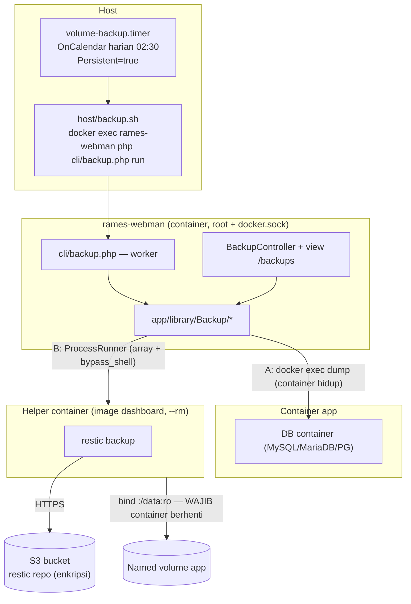

# PLAN — Backup Volume Harian ke External Storage (S3, restic)

> **Status: SELESAI — dipromosikan ke dokumen otoritatif.** Implementasi sudah selesai dan
> diverifikasi independen (verifikasi: **LULUS DENGAN CATATAN**; `composer test` = 499 test hijau).
> Perilaku final kini ada di [`SPECS.md`](./SPECS.md) **§8h** (kebutuhan, kebijakan dua strategi,
> keamanan, env) dan [`ARCHITECTURE.md`](./ARCHITECTURE.md) **§4.3** (tabel modul `Backup/*`) +
> **§5.15** (alur backup/restore, GOTCHA/WAJIB). Dokumen ini disimpan sebagai **artefak historis**
> (rencana, ceklis eksekusi, kontrak, risiko) — **bukan** sumber kebenaran. Bila ada perbedaan,
> ikuti `SPECS.md`/`ARCHITECTURE.md`/kode.
> **Dibuat:** 2026-09-30 · **Dipromosikan:** 2026-10-01

---

## 1. Keputusan yang Sudah Dikunci

| # | Pertanyaan | Keputusan |
|---|---|---|
| 1 | Cakupan sumber data | **Named volume** (label `com.docker.compose.project`) saja. Bind mount host, anonymous volume, dan volume container eksternal **di luar** cakupan. |
| 2 | Mesin & format backup | **restic** (inkremental + dedup + enkripsi + retensi native `forget`). |
| 3 | Penjadwalan | **systemd timer di host** (`host/backup.sh` + `volume-backup.{service,timer}`), memicu `docker exec rames-webman php cli/backup.php run` — meniru pola `certbot-renew.timer` (§8a). |
| 4 | Ruang lingkup | **Termasuk restore** (bukan sekadar backup + prosedur manual). |
| 5 | Otorisasi | **Disaring** lewat `AppAccess` — non-admin hanya melihat/mengakses backup volume milik app yang boleh diaksesnya (bukan admin-only). |
| 6 | Konsistensi data (D1) | **Dua strategi**: (a) **logical dump** untuk container DB — dijalankan saat container hidup; (b) **filesystem snapshot** (restic) untuk volume non-DB — **harian**, via jendela singkat **stop → snapshot → start** (snapshot hanya sah saat container berhenti). |
| 7 | Volume yatim (D2) | Ikut di-backup sampai retensi habis; **hanya admin** yang melihat & memulihkannya. |
| 8 | Kredensial (D3) | Kredensial S3 via `.env` → `environment:` compose; **passphrase restic di file** `database/restic/password` (chmod `0600`, gitignored), dirujuk `--password-file`. |
| 9 | Role ability (D4) | `backup` = **operator**, `restore` = **owner**. |

### Non-tujuan (tetap di luar cakupan)
- Backup bind mount host (`apps/{name}/*`, `driver_opts: {o: bind}`) — keputusan #1.
- Anonymous volume (tanpa nama stabil, tidak bisa di-atribusi ke app).
- Multi-target / multi-cloud sekaligus, replikasi antar-bucket, immutability/WORM.
- Backup `database/*.json` + config Nginx — itu **sudah** ditangani §8g (`BACKUP_ENABLED`), **jangan digabung**.

---

## 2. Kebijakan D1 — Aturan Konsistensi (WAJIB)

Setiap volume dipetakan ke **satu strategi** oleh `BackupStrategyResolver` (statik, teruji):

### Strategi A — Logical dump (container DB, tanpa downtime)
- Berlaku bila volume dipakai container DB terdeteksi (`DbContainerDetector`: MySQL/MariaDB/Postgres).
- Dijalankan **selagi container hidup** via `docker exec` (`mysqldump`/`pg_dump` — memakai ulang `app/library/Db/DbDump`
  bila cocok); hasil dump disalurkan ke **direktori staging** `runtime/backup/staging/{project}/{timestamp}/`
  lalu di-backup restic. Restore = **import dump** ke container, **bukan** menimpa volume.
- Bila container DB justru sedang **mati** → fallback ke Strategi B (snapshot aman).

### Strategi B — Filesystem snapshot (restic, **hanya saat container mati**) — **HARIAN untuk volume non-DB**
- **WAJIB:** sebelum snapshot, seluruh container yang me-mount volume tersebut harus **berhenti**.
  `VolumeStateGuard::assertStopped()` memeriksa lewat Docker Engine; bila ada yang `running` → snapshot
  **ditolak** dengan pesan jelas (tidak ada jalur paksa dari UI).
- **Mekanisme harian (dikunci):** run terjadwal **selalu** mem-backup volume non-DB dengan urutan
  **stop → snapshot → start** (`VOLUME_BACKUP_SNAPSHOT_POLICY=stop`), dibatasi `VOLUME_BACKUP_STOP_TIMEOUT`.
  Jadi setiap volume non-DB **punya backup harian**, dengan downtime singkat yang direncanakan di jendela dini hari.
- **Granularitas per app:** hentikan **seluruh container app** (`docker compose -p {project} stop`, tanpa `-v`) **sekali** per app,
  snapshot **semua** volume app itu, lalu **start kembali** — menghindari stop/start berulang per volume. App diproses **serial**.
- **Start ulang dijamin** lewat `finally` (termasuk bila snapshot/upload gagal) agar app tidak tertinggal mati;
  kegagalan start dicatat sebagai error yang tampak di UI.
- Restore = isi volume ditimpa dari snapshot; container app **wajib** berhenti saat restore.
- *(Opsional, di luar scope wajib):* pada jendela stop yang sama, volume DB boleh ikut di-snapshot mentah sebagai bonus —
  jalur restore utama DB tetap **dump logis** (Strategi A).

---

## 3. Arsitektur Usulan



**Poin kunci:**
- **Strategi per volume** ditentukan `BackupStrategyResolver` (dump untuk container DB; snapshot untuk sisanya) — lihat §2.
- **`VolumeStateGuard`** memblokir snapshot bila ada container `running` yang me-mount volume; run harian menjalankan
  **stop → snapshot → start** agar snapshot sah (aturan D1, tak bisa dilewati dari UI).
- restic **tidak** dijalankan di container dashboard (tidak bisa melihat filesystem volume app); ia dijalankan di
  **helper container** yang nge-bind volume target (`docker run --rm -v <vol>:/data:ro <image> restic …`), meniru pola
  `NginxReloader` / `UpdateHelper`. Image helper default = **image dashboard** (memuat restic) via `VOLUME_BACKUP_IMAGE`.
- **Strategi A** memakai `docker exec` di container DB (binary dump sudah ada di sana) → tidak perlu binary tambahan.
- Semua spawn lewat `app\library\Support\ProcessRunner` (**array + `bypass_shell`**, exit code dibaca → `SigchldGuard`).
- Snapshot Strategi B di-stream langsung (tanpa spool); hanya **staging dump** Strategi A yang memakai disk sementara.
- State/laporan hidup di `runtime/backup/*` — **bukan** `apps.json` (hindari churn skema).

---

## 4. Kontrak (tidak boleh diubah diam-diam oleh Frontend UI)

### 4.1 Route (`config/route.php`)
| Method | Path | Handler | Ability |
|---|---|---|---|
| GET | `/backups` | `BackupController::index` | `view` (halaman disaring `visible()`) |
| GET | `/api/backups/status` | `BackupController::status` | login (disaring) |
| GET | `/api/backups/snapshots` | `BackupController::snapshots` | login (disaring) |
| POST | `/backups/run` | `BackupController::run` | `backup` (per app/volume) |
| POST | `/backups/restore` | `BackupController::restore` | `restore` (per app/volume) |

### 4.2 Ability (`app/library/Auth/AppAccess.php` → `ABILITIES`)
- `'backup'  => ROLE_OPERATOR` - `'restore' => ROLE_OWNER`

Semua cek **hanya** lewat `AppAccess::require()`/`can()` → penolakan `AppAccessDenied` → **404** (bukan 403).

### 4.3 Environment (namespace baru — **hindari tabrakan** dengan §8g `BACKUP_*`)
```
VOLUME_BACKUP_ENABLED=true
VOLUME_BACKUP_DB_DUMP_ENABLED=true         # Strategi A: dump logis untuk container DB (container hidup)
VOLUME_BACKUP_SNAPSHOT_POLICY=stop         # stop (default) = volume non-DB dibackup harian via stop→snapshot→start; skip = manual saja
VOLUME_BACKUP_REQUIRE_STOPPED=true         # guard: tolak snapshot bila ada container running memakai volume
VOLUME_BACKUP_STOP_TIMEOUT=120             # detik, tunggu container benar-benar berhenti sebelum snapshot
VOLUME_BACKUP_DUMP_TIMEOUT=600             # detik, timeout mysqldump/pg_dump
RESTIC_REPOSITORY=s3:https://s3.amazonaws.com/<bucket>/rames
RESTIC_PASSWORD_FILE={proyek}/database/restic/password   # chmod 0600, gitignored
AWS_ACCESS_KEY_ID=
AWS_SECRET_ACCESS_KEY=
AWS_DEFAULT_REGION=
VOLUME_BACKUP_IMAGE=            # kosong = image container dashboard
VOLUME_BACKUP_TIMEOUT=3600      # detik, timeout satu run restic
VOLUME_BACKUP_KEEP_DAILY=7      # restic forget --keep-daily
VOLUME_BACKUP_KEEP_WEEKLY=4     # restic forget --keep-weekly
VOLUME_BACKUP_KEEP_MONTHLY=3    # restic forget --keep-monthly
VOLUME_BACKUP_HOST_CONTAINER=rames-webman   # dipakai host/backup.sh
```

### 4.4 Berkas state & log (runtime, gitignored)
```
runtime/backup/status.json          # status run terakhir (mulai/selesai/ok/gagal, ringkasan per volume)
runtime/backup/runs/{ISO8601}.json  # riwayat run (JsonStore, retensi N terakhir)
runtime/backup/run.lock             # flock: cegah backup harian vs manual tumpang tindih
runtime/backup/staging/             # (Strategi A) dump logis sementara sebelum di-backup; dibersihkan setelah run
runtime/logs/backup/{project}.log   # log per volume/project
```

### 4.5 File yang disentuh
| Lapisan | File |
|---|---|
| Library (baru) | `app/library/Backup/ResticRunner.php`, `VolumeBackupService.php`, `VolumeRestoreService.php`, `VolumeTargetMap.php`, `BackupStrategyResolver.php`, `VolumeStateGuard.php`, `DumpRunner.php`, `BackupRunLock.php`, `BackupReport.php` |
| Worker (baru) | `cli/backup.php` (`run` \| `restore <appId> <volume> <snapshot>`) |
| Controller (baru) | `app/controller/BackupController.php` |
| View/JS (baru) | `app/view/backup/index.php`, `public/js/backup.js` |
| Ubah | `config/route.php`, `config/deploy.php`, `app/library/Auth/AppAccess.php`, `app/view/partials/header.php` (nav "Backup"), `docker-compose.yml` (env), `Dockerfile` (paket `restic`), `.env`/README (dok env) |
| Host (baru/ubah) | `host/backup.sh`, `host/systemd/volume-backup.service`, `host/systemd/volume-backup.timer`, `host/install.sh` |
| Test (baru) | `tests/VolumeTargetMapTest.php`, `tests/BackupStrategyResolverTest.php`, `tests/VolumeStateGuardTest.php`, `tests/ResticArgvTest.php`, `tests/BackupVisibilityTest.php` |

---

## 5. Ceklis Eksekusi per Peran

> Aturan: **satu pemanggilan = satu peran**. Urutan mengikuti mode routing (Auth & Security → Deploy & Docker →
> Backend PHP → Frontend UI → Verifier → Docs Architect).

### 5.1 [Auth & Security] — kontrak hak & rahasia
- [ ] Tambah ability `backup` (operator) & `restore` (owner) di `AppAccess::ABILITIES` + dokumentasi blok komentar kelas.
- [ ] Tetapkan satu pintu otorisasi backup: helper `BackupAccess`/pemakaian `AppAccess::require()` untuk **setiap** endpoint
      (index/status/snapshots/run/restore) — termasuk pemetaan `project → app` supaya filter `visible()` benar.
- [ ] Tetapkan aturan volume **yatim** (keputusan D2) — hanya admin.
- [ ] Pastikan kredensial (D3) **tidak pernah**: masuk `apps.json`, log (`runtime/logs/backup/*`), respons JSON, atau argv proses.
- [ ] Audit: tidak ada `die/exit/echo/print`, tidak ada state di properti controller, tidak ada `session()`/`request()` di konstruktor.
- [ ] Pastikan restore **fail-fast** (validasi kepemilikan volume + app) **sebelum** efek samping apa pun.
- [ ] Kontrak restore sadar-strategi: **restore dump** (Strategi A) vs **restore snapshot** (Strategi B) — keduanya
      butuh ability `restore`, keduanya menolak sebelum validasi lolos.
- [ ] Guard konsistensi tak bisa dilewati dari UI: snapshot wajib lewat `VolumeStateGuard` (tidak ada jalur "paksa").

### 5.2 [Deploy & Docker] — image, helper, timer host
- [ ] `Dockerfile`: tambahkan binary `restic` (verifikasi ketersediaan di repo Alpine yang dipakai;
      bila tak tersedia → unduh static binary resmi restic + verifikasi checksum). Jalankan `docker build` sebagai bukti.
- [ ] `docker-compose.yml`: teruskan env `VOLUME_BACKUP_*` / `RESTIC_*` / `AWS_*` (dengan default aman).
- [ ] Image helper backup default = image dashboard; dukung override `VOLUME_BACKUP_IMAGE`.
      Bila helper `--rm`, pastikan `--password-file` & kredensial di-inject via `--env-file`/`-e` (bukan argv).
- [ ] `host/backup.sh`: EnvironmentFile `-/etc/rames/volume-backup.env`; `docker exec rames-webman php cli/backup.php run`;
      log ke stdout (systemd journal) + exit code benar; **jangan** `set -e` yang menelan diagnosa.
- [ ] `host/systemd/volume-backup.service` (oneshot, `After=network-online.target`) + `volume-backup.timer`
      (`OnCalendar=*-*-* 02:30:00`, `RandomizedDelaySec=10m`, `Persistent=true`).
- [ ] Jendela harian ditempatkan di **jam sepi** dan diproses **serial per app** (`stop → snapshot → start` sekali per app)
      dengan `VOLUME_BACKUP_STOP_TIMEOUT` sebagai batas, agar downtime singkat dan tidak menumpuk.
- [ ] `host/install.sh`: pasang script+unit (pola `install_module_certbot_renew`), `systemctl daemon-reload`,
      `systemctl enable --now volume-backup.timer`, cetak ringkasan.
- [ ] Strategi A **tidak** butuh binary tambahan di image dashboard (`mysqldump`/`pg_dump` dijalankan **di container DB**
      via `docker exec`); hanya path staging `runtime/backup/staging/` yang perlu izin tulis & pembersihan.
- [ ] Jaga gotcha: `ProcessRunner` array + `bypass_shell` + `SigchldGuard`; `PWD` eksplisit; bind source volume **harus ada**.

### 5.3 [Backend PHP] — logika bisnis (semua di `app/library/`)
- [ ] `VolumeTargetMap`: enumerasi `DockerClient::listVolumes(['label' => ['com.docker.compose.project']])`,
      map `project → app` (via `AppStore`), tandai `orphaned`; **statik murni** agar teruji (masukkan data volume & apps sebagai argumen).
- [ ] `ResticRunner`: bangun argv restic (`backup`, `snapshots --json`, `restore`, `forget --keep-*`, `check`)
      sebagai **array** dan eksekusi via `ProcessRunner` di helper container; timeout `VOLUME_BACKUP_TIMEOUT`; parse JSON keluaran.
- [ ] `BackupStrategyResolver`: tentukan strategi per volume — **dump** bila volume dipakai container DB terdeteksi
      (`DbContainerDetector`), selain itu **snapshot**; bila container DB mati → fallback **snapshot**. **Statik murni**, teruji.
- [ ] `VolumeStateGuard`: daftar container yang me-mount volume (inspect volume `Containers[]` / `Mounts`) + `assertStopped()`;
      **tolak** snapshot bila ada yang `running` (kecuali policy `stop`); sediakan `stopContainer()`/`startContainer()`
      untuk mode stop→snapshot→start (`DockerComposeRunner`, **tanpa** `-v`) dengan start ulang dijamin lewat `finally`.
- [ ] `DumpRunner`: dump logis di container DB via `docker exec` (mysqldump/pg_dump; pakai ulang `app/library/Db/DbDump`
      bila cocok) ke `runtime/backup/staging/{project}/{timestamp}/`, timeout `VOLUME_BACKUP_DUMP_TIMEOUT`.
- [ ] `VolumeBackupService`: orkestrasi satu run — ambil lock, iterasi volume yang boleh di-backup secara **serial**,
      pilih strategi (`BackupStrategyResolver`) → (A) dump lalu `restic backup` direktori staging, atau
      (B) stop container app → `restic backup` volume ter-mount → start container app (default `stop`, sekali per app);
      tag `project`/`volume`/`app-id`/`strategy`;
      lalu `forget --prune` sesuai retensi, tulis `BackupReport` + log per project.
      Kegagalan satu volume tidak menghentikan volume lain; staging dibersihkan setelah run (juga saat gagal).
- [ ] `VolumeRestoreService`: validasi (ability, volume milik app, snapshot ada) → bedakan jalur:
      (A) **restore dump** — import ke container DB (`DbDump` import, container hidup);
      (B) **restore snapshot** — stop container app → `restic restore --target <temp>` → sinkronkan isi ke volume
      (**tanpa** `docker volume rm`, isi ditimpa) → start ulang app.
      Gagal di tengah → pesan jelas + status `error`, container **selalu** dikembalikan ke keadaan awal.
- [ ] `BackupRunLock`: `flock` pada `runtime/backup/run.lock`; tolak run kedua dengan pesan jelas (bukan error senyap).
- [ ] `BackupReport`: baca/tulis `runtime/backup/*.json` lewat `JsonStore` (atomic + backup `.bak`), retensi riwayat run.
- [ ] `cli/backup.php`: worker CLI (`PHP_SAPI === 'cli'`), `require vendor/autoload` + `support/bootstrap`, validasi argv,
      exit code 0/1, log ke `runtime/logs/backup/`. Mode `run` (dipanggil timer) & `restore` (dipanggil controller detached).
- [ ] `BackupController`: mediator — validasi input (nama volume pola `^[a-zA-Z0-9][a-zA-Z0-9_.-]*$`, id snapshot),
      `AppAccess::require()`, delegasi ke service/worker, kembalikan `json()`/`view()`/`redirect()`; **tanpa** logika bisnis.
- [ ] `config/deploy.php`: tambah key config (baca `getenv`), `config/route.php`: daftar route §4.1.

### 5.4 [Frontend UI] — halaman `/backups`
- [ ] Nav sidebar (`app/view/partials/header.php`): link **Backup** dengan `active` state (pola `/volumes`).
- [ ] `app/view/backup/index.php`: tabel volume per app (nama, project, ukuran via `/api/volumes/usage` yang sudah ada,
      **strategi** = dump/snapshot, status container), status run terakhir, jumlah snapshot,
      tombol **Backup sekarang** (`backup`), **Stop & Snapshot** (mode `stop`/jendela perawatan), & **Restore** (`restore`);
      kolom **hanya** menampilkan app yang boleh dilihat user.
- [ ] `public/js/backup.js`: polling status (jeda saat `document.hidden`, bersihkan saat `pagehide`), modal konfirmasi restore
      yang **membedakan** dump vs snapshot (dengan **verifikasi ganda** ketik nama volume), semua POST mengirim token CSRF.
- [ ] Escape semua output dengan `e()`; setiap form memakai `<?= csrf_field() ?>`; tombol yang tak diizinkan tidak ditampilkan
      (lapisan kedua — server tetap menolak).
- [ ] **Tidak** menambah framework/bundler/CDN baru.

### 5.5 [Verifier] — bukti (oleh *Rames Assure*, bukan penulis kode)
- [ ] `php -l` untuk **setiap** file PHP baru/ubah (termasuk view).
- [ ] `composer test` (PHPUnit 10; `failOnWarning`/`failOnRisky` = true) — hijau, tanpa warning.
- [ ] Unit test baru: pemetaan `project → app` (termasuk yatim), **pemilihan strategi** (DB → dump, non-DB → snapshot,
      fallback saat container DB mati), **`VolumeStateGuard` menolak snapshot saat container `running`**,
      pembentukan **argv restic sebagai array** (tanpa string shell), filter visibilitas per role.
- [ ] Smoke render view: `php /tmp/rames-view-smoke.php` untuk halaman `/backups` (skrip di `/tmp`, **jangan** di-commit).
- [ ] Uji fungsional ke **target S3 tiruan (MinIO) di direktori temp** + project palsu/volume temp:
      backup → `snapshots` → restore → verifikasi isi, **serta** bukti guard menolak snapshot saat container hidup.
      **Selalu** akhiri `docker compose down -v`.
- [ ] Bukti `docker build` sukses & `restic version` ada di image.
- [ ] Audit regresi: `/volumes`, `/monitor`, `/database` tidak berubah perilaku; `apps.json` tidak berubah skema.

### 5.6 [Docs Architect] — dokumentasi (oleh *Rames Assure*)
- [ ] `SPECS.md`: bagian **§8h — Backup Volume ke S3** (tujuan, alur, **kebijakan dua strategi D1**, retensi, config,
      restore, aturan "snapshot hanya saat container mati") + tandai butir baru di Goal list (§2) & Security (§11).
- [ ] `ARCHITECTURE.md`: tambah modul `Backup/*` di tabel §4.3 + sub-bagian alur §5.x + jebakan baru bertanda
      **GOTCHA/WAJIB** (helper container, `--password-file`, `run.lock`, namespace env, restore fail-fast).
- [ ] Tabel `.env` (§9 SPECS) + struktur direktori (`runtime/backup/`, `host/systemd/volume-backup.*`).
- [ ] README: env baru + prosedur restore manual darurat.

---

## 6. Definisi "Selesai" (Definition of Done)

Sebuah item dianggap selesai hanya bila **keluaran perintah** dilampirkan sebagai bukti:

1. `php -l` → semua file OK.
2. `composer test` → hijau (tanpa warning/risky).
3. `docker build` → sukses; `restic version` tersedia di image.
4. Uji backup+restore di **MinIO/volume temp** → bukti sukses + `docker compose down -v` di akhir.
5. Smoke render `/backups` → tanpa error variabel template.
6. `SPECS.md` §8h + `ARCHITECTURE.md` §4.3/§5.x sudah diperbarui.

**Dilarang saat verifikasi (larangan #15/#16):** menyentuh `database/*.json`, `database/keys/`, `database/env/`, `apps/`,
`nginx-status/` nyata; menjalankan restore/rollback pada instalasi nyata; menghapus volume nyata; `docker compose down` proyek nyata.

---

## 7. Jebakan yang Wajib Dijaga

- [ ] **SigchldGuard** — semua spawn (restic/helper/docker) yang exit code-nya dibaca wajib lewat `ProcessRunner`+`SigchldGuard`.
- [ ] **argv, bukan shell** — `docker run … restic …` dibangun sebagai **array**; **dilarang** string shell (larangan #8).
- [ ] **Secret tidak di argv/log** — passphrase restic via `--password-file`; kredensial S3 via env helper (bukan `-e KEY=val` yang membocorkan ke `ps`, kecuali via `--env-file`).
- [ ] **Namespace env** — pakai `VOLUME_BACKUP_*`/`RESTIC_*`; **jangan** membajak `BACKUP_*` milik §8g.
- [ ] **Validasi nama** — nama volume & id snapshot divalidasi regex sebelum masuk argv helper.
- [ ] **Lock run** — `run.lock` (flock) mencegah backup harian & manual tumpang tindih (hindari konflik lock restic).
- [ ] **Snapshot hanya saat container mati (WAJIB)** — `VolumeStateGuard` menolak snapshot bila ada container `running`
      yang me-mount volume; jangan menyediakan jalur paksa dari UI.
- [ ] **Start ulang dijamin** — pada mode stop→snapshot→start, container **selalu** di-start kembali lewat `finally`
      (termasuk bila snapshot/upload gagal) agar app tidak tertinggal mati.
- [ ] **Staging dump dibersihkan** — `runtime/backup/staging/` dikosongkan setelah tiap run (sukses maupun gagal).
- [ ] **Serial per app** — stop/snapshot/start satu app pada satu waktu (bukan semua app serentak) agar downtime pendek & I/O terkendali.
- [ ] **Restore sadar-strategi** — dump di-import (container hidup), snapshot wajib container mati; **jangan** `docker volume rm` saat restore.
- [ ] **Otorisasi satu pintu** — hanya `AppAccess`; 404 (bukan 403) untuk app milik user lain.
- [ ] **Tanpa state di controller** — worker Webman persistent (`controller_reuse=false`).
- [ ] **Timeout wajib** — setiap run restic & HTTP client punya timeout (≤ wajar; `VOLUME_BACKUP_TIMEOUT`).

---

## 8. Risiko

| Risiko | Dampak | Mitigasi |
|---|---|---|
| Snapshot volume DB hidup tidak konsisten | Restore korup tanpa error | **Strategi A** (dump logis) untuk DB; **Strategi B** hanya saat container mati (§2) |
| Downtime harian dari mode `stop→snapshot→start` (volume non-DB) | App mati singkat tiap hari | Jendela jam sepi + serial per app + `STOP_TIMEOUT` + start ulang dijamin `finally`; downtime tampak di UI |
| Staging dump memenuhi disk | Backup gagal / disk penuh | Retensi staging + pembersihan di `finally` |
| Biaya & ukuran S3 membengkak | Biaya tak terduga | Retensi `forget --keep-*` + S3 lifecycle policy |
| Backup panjang > jadwal berikutnya | Run bertumpuk / lock bentrok | `run.lock` + `Persistent=true` + `RandomizedDelaySec` |
| Volume besar → I/O & bandwidth tinggi | Dampak ke app produksi | Serial, `:ro`, throttle (nice/ionice) bila perlu |
| Binary `restic` tak ada di repo Alpine | Build gagal | Static binary resmi + checksum |
| Kredensial bocor (log/argv/ps) | Kompromi bucket | `--password-file`, `--env-file`, audit Verifier |
| Operasi restore salah sasaran | **Kehilangan data** | Ability owner + konfirmasi ganda + hanya volume app yang boleh diakses |

---

## 9. Urutan Eksekusi (ringkas)

1. ~~Konfirmasi D1–D4~~ → **sudah dikunci** (§1); kebijakan snapshot **harian** volume non-DB ditetapkan (§2).
2. *Rames Build* · **Auth & Security** → kontrak ability + audit rahasia (§5.1).
3. *Rames Build* · **Deploy & Docker** → `Dockerfile` (restic) + compose env + `host/` timer (§5.2).
4. *Rames Build* · **Backend PHP** → `app/library/Backup/*` + `cli/backup.php` + controller + route + config (§5.3).
5. *Rames Build* · **Frontend UI** → `/backups` + nav + JS (§5.4).
6. *Rames Assure* · **Verifier** → bukti & audit regresi (§5.5, §6).
7. *Rames Assure* · **Docs Architect** → `SPECS.md` §8h + `ARCHITECTURE.md` (§5.6).
