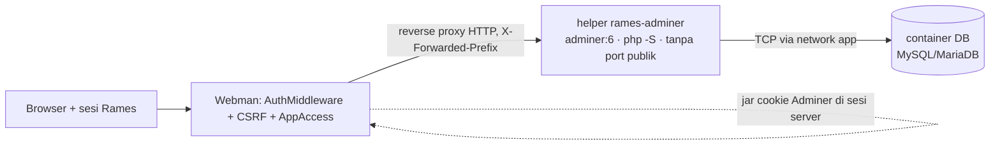
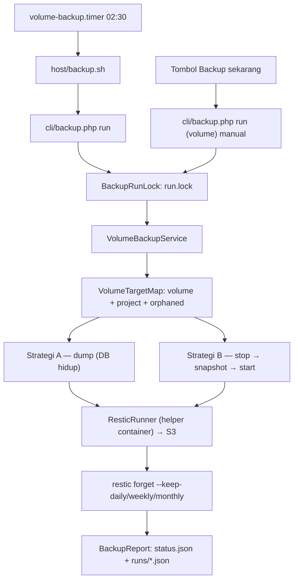

# SPECS.md — Rames (Deploy Dashboard)

## 1. Overview

Dashboard manajemen deployment sederhana (mirip cPanel) untuk mengelola:
- App (project) yang di-deploy dari repo Git yang sudah berisi `docker-compose.yml`
- Container yang dihasilkan oleh tiap app
- Reverse proxy Nginx yang mengarahkan subdomain ke container yang sesuai

**Fase saat ini (Phase 1):** dashboard dan "agent" (logic eksekusi Docker/Nginx) dibangun dan dijalankan di **satu server yang sama**, dibungkus dengan Docker Compose. Arsitektur tetap disiapkan agar logic eksekusi bisa diekstrak menjadi agent HTTP terpisah di fase berikutnya (multi-server) tanpa merombak business logic dashboard.

## 2. Goals (Phase 1)

- [x] Login dashboard dengan kredensial sederhana (username/password) dari `database/auth.json`
- [x] User bisa membuat app baru dengan menyuplai URL repo Git yang sudah punya `docker-compose.yml`
- [x] Sistem clone repo, build & jalankan `docker compose` untuk app tersebut
- [x] Sistem mendeteksi port yang dipakai di `docker-compose.yml`, mendeteksi konflik dengan app lain, dan memungkinkan user mengedit port host sebelum build
- [x] Sistem mencatat daftar container yang dihasilkan tiap app, ditampilkan di halaman detail app
- [x] App otomatis bisa diakses lewat `namasite.namadomain.com`, dengan `namadomain.com` diatur lewat `.env`
- [x] Sistem generate & reload config Nginx otomatis setiap ada app baru/berubah
- [x] Multi user untuk login dashboard, tanpa konsep role/permission (semua user punya akses yang sama)
- [x] SSL otomatis per subdomain menggunakan Let's Encrypt
- [x] Reload Nginx host via Docker socket (`NginxReloader`) sebagai pelengkap/fallback watcher (§8.4)
- [x] Rollback app ke versi sukses sebelumnya (checkpoint `deploy_history`, §7.5)
- [x] Dukungan repo private via deploy key SSH per app (§7.1)
- [x] Delete app dengan pilihan pertahankan/purge volume + halaman `/volumes` (§7.4)
- [x] Installer otomatis host (`host/install.sh`) — setup nginx, watcher, renewal certbot, `.env`, build dashboard
- [x] Nginx reload watcher host (`host/nginx-reload-watcher.sh` + systemd unit) (§8.3)
- [x] Renewal certbot otomatis (`host/certbot-renew.sh` + systemd timer) (§8a)
- [x] Kepemilikan app per user + sharing ke user lain (role viewer/operator/owner) & role global admin/member (§6.1, §7.7)
- [ ] Log viewer real-time per container (§8c)
- [x] Monitoring resource container & total VM — halaman global `/monitor` (§8d)
- [ ] Search / filter / pagination daftar app (§8e)
- [ ] Rate limiting / proteksi brute-force login (§8f)
- [ ] Backup otomatis data & config sebelum overwrite (§8g)
- [x] Backup volume harian ke object storage (S3) via restic — dump logis (DB) & snapshot (non-DB) (§8h)
- [x] File manager container per container app (jelajah, unggah multi-berkas, unduh, edit teks, buat folder, rename, hapus, ekstrak arsip) — ability `files` = operator+, hanya saat container berjalan (§7.9)

## 3. Non-Goals (Phase 1)

- Multi-server / agent sebagai service HTTP terpisah
- Permission granular per-resource (mis. izin terpisah untuk terminal vs database) — Phase 1 memakai 4 tingkat role tetap: admin, owner, operator, viewer (§7.7)
- Auto-scaling, health-check lanjutan & monitoring resource penuh (metrik historis, alerting) — Phase 1 hanya ringkasan status/usage per container (§8d)
- Log viewer streaming penuh & buffer historis — Phase 1 memakai polling tail sederhana (§8c)
- Podman — Phase 1 tetap pakai Docker Engine yang sudah familiar; migrasi ke rootless Podman jadi pertimbangan keamanan di fase lanjutan

## 4. Tech Stack

| Komponen | Pilihan | Catatan |
|---|---|---|
| Backend/dashboard | Webman (PHP) | Sesuai stack yang sudah dikuasai user |
| Container runtime | Docker + Docker Compose | Dieksekusi lewat shell (`proc_open`/`exec`), bukan Docker API SDK, untuk kesederhanaan Phase 1 |
| Reverse proxy | Nginx (jalan sebagai container dalam compose stack yang sama) | Config di-generate ke direktori yang di-mount, reload via `docker exec nginx nginx -s reload` |
| Storage data | File JSON (`database/auth.json`, `database/apps.json`) | Bukan RDBMS dulu — cukup untuk skala Phase 1 |
| Parsing YAML | Library YAML parser PHP (mis. `symfony/yaml`) | Untuk membaca & menulis ulang `docker-compose.yml` |

## 5. Arsitektur Phase 1

Nginx **tidak** dijalankan sebagai container — sistem memakai instalasi Nginx yang sudah ada langsung di host server (sesuai kebiasaan setup manual user sebelumnya). Dashboard hanya menulis file config ke direktori Nginx di host dan memicu reload; Nginx sendiri tetap dikelola sebagai service level-sistem (systemd), bukan bagian dari compose stack.

```
┌───────────────────────────────────────────────────────────┐
│                        Host Server                          │
│                                                             │
│   ┌────────────────────┐        ┌─────────────────────┐   │
│   │  Nginx (native,     │◀───────│  DNS *.example.com    │   │
│   │  systemd service)   │        └─────────────────────┘   │
│   │  :80 / :443         │                                  │
│   └─────────┬───────────┘                                  │
│             │ proxy_pass ke host_port tiap app             │
│             ▼                                               │
│   ┌────────────────────┐   ┌─────────────────────┐          │
│   │  App A containers   │   │  App B containers   │  ...   │
│   │  (docker compose)    │   │  (docker compose)     │        │
│   └────────────────────┘   └─────────────────────┘          │
│             ▲                        ▲                       │
│             └───────────┬────────────┘                       │
│                          │ docker.sock                        │
│                 ┌─────────────────────┐                       │
│                 │  Dashboard (Webman)   │                     │
│                 │  container            │                     │
│                 │  - Auth                │                     │
│                 │  - App CRUD           │                     │
│                 │  - Deployer (internal  │                     │
│                 │    module, akan        │                     │
│                 │    diekstrak jadi      │                     │
│                 │    agent nanti)        │                     │
│                 └───────────┬─────────┘                       │
│                              │ tulis file config                │
│                              ▼                                 │
│                 /etc/nginx/sites-available/{name}.conf         │
│                 (mounted volume ke dashboard container)         │
└───────────────────────────────────────────────────────────┘
```

**Reload Nginx tanpa exec langsung ke host:** karena dashboard jalan di dalam container sedangkan Nginx native di host, dashboard **tidak** langsung menjalankan perintah `nginx -s reload` di host (itu butuh akses shell ke luar container). Pendekatan yang dipakai:

- Direktori config Nginx di host (mis. `/etc/nginx/sites-available/`) di-mount sebagai **volume** ke dashboard container — dashboard cukup punya izin **tulis file** di situ, bukan izin eksekusi command host
- Di host, jalankan **watcher script** kecil (systemd service, pakai `inotifywait`) yang memantau perubahan di direktori tsb, lalu otomatis jalankan `nginx -t && nginx -s reload` begitu ada file baru/berubah
- Dashboard tidak pernah butuh sudo/SSH ke host — cukup tulis file, watcher yang urus sisanya

Ini menghindari kebutuhan expose SSH atau sudo dari dalam container ke host, sekaligus tetap memakai Nginx yang sudah ada di server.

**Catatan penting soal `docker.sock`:** Phase 1 tetap membutuhkan dashboard container mount `/var/run/docker.sock` untuk mengeksekusi `docker compose` bagi tiap app. Ini adalah *known risk* yang disengaja diterima untuk fase awal (single admin, tidak ada input publik ke dashboard). Validasi input tetap wajib diterapkan ketat (lihat bagian Security). Isolasi lebih baik (agent terpisah, rootless Podman) direncanakan untuk fase berikutnya, bukan Phase 1.

Struktur kode disiapkan dengan interface `DeployerInterface` (clone, build, up, get containers, generate nginx config) supaya implementasi bisa diganti dari "eksekusi lokal" menjadi "panggil agent HTTP" tanpa mengubah controller/business logic dashboard.

## 6. Autentikasi

### 6.1 Sumber data
File: `database/auth.json`

```json
[
  {
    "id": "u1",
    "username": "admin",
    "password_hash": "$2y$10$...",
    "role": "admin"
  },
  {
    "id": "u2",
    "username": "budi",
    "password_hash": "$2y$10$...",
    "role": "member"
  }
]
```

- Password disimpan sebagai hash (`password_hash()` PHP, bcrypt), **bukan plaintext**.
- Login membandingkan input dengan `password_verify()` terhadap entry yang `username`-nya cocok.
- **Role global user** (`role`):
  - `admin` — melihat **semua** app (beserta nama pemiliknya) dan **punya kuasa penuh** ke semua app; satu-satunya yang boleh mengelola user.
  - `member` — hanya melihat app miliknya sendiri dan app yang **dibagikan** kepadanya; app user lain tidak terlihat sama sekali.
- **Migrasi berkas lama**: `auth.json` tanpa field `role` diperlakukan sebagai user pertama = admin, sisanya member (dibaca saat runtime, tanpa menulis ulang berkas) — instalasi lama tidak pernah kehilangan admin.
- Halaman **Manage Users** (`/users`) hanya bisa diakses admin: tambah/hapus user, ganti password, ubah role. Menghapus user **mengalihkan seluruh app miliknya ke admin yang menghapus**; admin terakhir tidak bisa dihapus/diturunkan. Perubahan role & penghapusan user **langsung berlaku** pada request berikutnya (session disinkronkan dengan `auth.json` oleh `AuthMiddleware`, bukan hanya saat login).
- Kepemilikan app diatur terpisah (per app) di `apps.json` — lihat §7.7.

### 6.2 Alur
1. User akses `/login`, isi username & password
2. Sistem baca `auth.json`, cari entry dengan `username` yang cocok, verifikasi password
3. Jika valid, buat session (Webman session bawaan) yang menyimpan `id`/`username` user tsb
4. Semua route dashboard selain `/login` dilindungi middleware auth
5. Logout menghapus session

### 6.3 Provisioning awal
Karena belum ada installer resmi di Phase 1, entry pertama di `auth.json` dibuat manual lewat script/console command (mis. `php webman make:admin`) yang generate username/password default dan menuliskannya ke file — dijalankan sekali saat setup. User pertama otomatis berrole **admin**. User tambahan berikutnya dibuat lewat halaman "Manage Users" di dashboard (khusus admin). Command `php webman app:assign-owner` menugaskan app lama yang belum punya owner (§7.7).

## 7. App Management

### 7.1 Sumber data
File: `database/apps.json` — array of app object.

```json
[
  {
    "id": "b3f1c2a4-...",
    "name": "myapp",
    "source": "git",             // git (hasil clone repo) | compose (paste/upload docker-compose.yml)
    "owner_id": "u1",
    "members": {
      "u2": { "role": "operator", "added_at": "2026-09-16T09:10:00+07:00", "added_by": "u1" },
      "u3": { "role": "viewer",   "added_at": "2026-09-16T09:12:00+07:00", "added_by": "u1" }
    },
    "subdomain": "myapp.example.com",
    "repo_url": "https://github.com/user/myapp.git",
    "branch": "main",
    "local_path": "apps/myapp",
    "primary_service": "web",
    "primary_port": 8080,        // port container yang di-proxy Nginx ke domain (dipilih user saat create)
    "container_prefix": "myapp",  // prefix nama container (override container_name) — null/kosong = nama default compose
    "status": "running",
    "auth_method": "none",       // none (publik) | ssh (deploy key per repo)
    "ssh_key": null,              // path relatif private key (mis. "keys/myapp") utk repo private
    "containers": [
      {
        "service_name": "web",
        "container_name": "myapp_web_1",
        "image": "myapp-web:latest",
        "internal_port": 8080,
        "host_port": 30001,
        "status": "running"
      },
      {
        "service_name": "worker",
        "container_name": "myapp_worker_1",
        "image": "myapp-worker:latest",
        "internal_port": null,
        "host_port": null,
        "status": "running"
      }
    ],
    "limits": {                   // batas maksimum CPU/memori per service (§7.6b); null/absen = tanpa limit dashboard
      "web":    { "cpus": 1.5,  "memory_mb": 512 },
      "worker": { "cpus": null, "memory_mb": 256 }
    },
    "nginx_routes": [             // rute proxy tambahan per app (§8.2a); absen/[] = perilaku lama (config identik)
      { "path": "/api/", "target": "http://127.0.0.1:3001" }
    ],
    "created_at": "2026-08-13T10:00:00+07:00",
    "updated_at": "2026-08-13T10:05:00+07:00"
  }
]
```

Field penting:
- `name` — slug unik **global** (dipakai sebagai subdomain, nama project compose, dan direktori lokal `apps/{name}`), sehingga tidak ada dua app dengan nama sama meski pemiliknya berbeda
- `source` — asal source app: `git` (default bila field absen — dibuat lewat mode *Clone repo Git*) atau `compose` (dibuat lewat mode *Compose (paste/upload)*: file `docker-compose.yml` ditulis langsung ke `apps/{name}` **tanpa repo Git**, untuk image prebuilt). Menentukan perilaku Rebuild (§7.2a) dan ketersediaan Rollback (§7.5)
- `owner_id` — id user pemilik app; app hanya terlihat oleh owner, member yang dibagikan, dan admin (§7.7)
- `members` — map `userId → {role, added_at, added_by}`; role `viewer` | `operator` | `owner` (co-owner)
- `primary_service` — nama service dalam `docker-compose.yml` yang menerima traffic dari subdomain (ditentukan user saat create, default: service pertama yang punya port exposed)
- `primary_port` — **port container** pada service tersebut yang menerima trafik domain app (di-reverse-proxy Nginx). Dipilih user di halaman konfirmasi saat create; absen/null = port pertama service (perilaku app lama). Penting untuk service yang mempublikasikan **lebih dari satu port** (mis. web `9119` + gateway API `8642`): semua port tetap di-*publish* ke host port masing-masing (bisa diakses langsung `http://<host>:<port>`), tetapi hanya satu yang dilayani domain app
- `containers[].host_port` — port di host yang sudah final dipakai (setelah resolusi konflik), inilah yang dipakai Nginx sebagai target `proxy_pass`
- `containers[].ports[]` — daftar **semua** port yang di-publish container (`{host, container}`), **tanpa duplikat**: Docker Engine mengembalikan satu entri per alamat IP untuk publish dual-stack (IPv4 `0.0.0.0` + IPv6 `::`), dashboard menduplikasi-kannya (`AppPorts::forContainer()`). Dipakai untuk menampilkan daftar port & memilih port yang di-proxy (`primary_port`)
- `container_prefix` — prefix **nama container** (`container_name`): bila diisi, setiap service memakai nama `{prefix}-{service}` (mis. `myapp-web`) alih-alih nama default compose `{nama_app}_{service}_{n}`. Absen/null = nama default (perilaku app lama). Ditulis ke `docker-compose.override.names.yml` (`ContainerNames`, §7.6a)
- `auth_method` — metode akses repo: `none` (publik, anonim) atau `ssh` (deploy key per app)
- `ssh_key` — path relatif private key terhadap `database_path` (mis. `keys/myapp`), dipakai saat `git pull` Rebuild; hanya path yang disimpan, private key di file terpisah (`database/keys/`)
- `template` — `{slug, title}` bila app dibuat dari template (§7.2b), `null` untuk app lain. Hanya penanda asal-usul (untuk audit/tampilan); template **tidak** di-*re-sync* setelah create — perubahan sumber dilakukan lewat tab Compose/Deploy Ulang seperti app compose lain
- `env` — map `KEY => value` environment variable app (§7.6); untuk app dari template diisi saat create (nilai form, default template, atau hasil auto-generate)
- `limits` — map `service => {cpus: float|null, memory_mb: int|null}`: batas **maksimum** CPU (core, float) & memori (MB, int) per service (§7.6b). `null`/absen = tidak diatur dashboard (nilai compose repo tetap berlaku); tanpa migrasi untuk app lama. Ditulis ke `docker-compose.override.limits.yml` (`ResourceLimits`, §7.6b). Hanya admin yang boleh mengubah (§7.7)
- `nginx_routes` — daftar rute proxy tambahan per app (§8.2a): `[{path, target}]`, opsional, maks. **20** rute. Absen/`[]` = perilaku lama (config Nginx identik, tanpa perubahan). Dirender ke **serve block** (HTTP 80 & HTTPS 443) saja; tanpa migrasi untuk app lama

### 7.2 Alur "Create App"

Ada **tiga mode sumber** di halaman `/apps/create`. Link navigasi berurutan **Template**, **Clone repo Git**, lalu **Compose (paste / upload)**; mode aktif ditandai sebagai state navigasi aktif. Mode default tetap **Clone repo Git**.

| Mode | Sumber | Cocok untuk |
|---|---|---|
| **Template** (§7.2b) | template siap-pakai di folder `templates/<slug>/` (compose prebuilt + deklarasi env) | app docker-ready yang sering dipakai (galeri satu klik) |
| **Clone repo Git** (default) | `git clone` repo yang berisi `docker-compose.yml` | app yang di-build dari source (`build:`/Dockerfile) |
| **Compose (paste / upload)** (§7.2a) | file `docker-compose.yml` yang di-paste/di-upload + file pendukung | app dengan image **prebuilt** (tanpa build context) |

**Batas resource (admin, opsional)** — lintas ketiga mode: user berrole **admin** dapat menetapkan **batas maksimum CPU & memori per service** saat membuat app — di **langkah konfirmasi** (mode *Clone repo Git* & *Compose*, §7.2 langkah 7) dan di **form template** (§7.2b). Nilai bawaan compose repo ditampilkan sebagai **prefill yang bisa diedit**; dikosongkan = ikut compose repo / tanpa batas. Non-admin tidak melihat field ini. Detail: §7.6b.

**Langkah mode Clone repo Git:**

1. **Input form**: nama app (slug), URL repo Git, branch (default `main`)
2. **Validasi**: nama unik (cek `apps.json`), format slug valid (`a-z0-9-`), URL repo formatnya valid
3. **Clone repo** ke `apps/{name}` (`git clone --branch {branch} {repo_url} apps/{name}`). Untuk repo private, sistem **membangkitkan deploy key SSH per app** (keypair ed25519 di `database/keys/{name}`), menampilkan public key agar user menambahkannya sebagai Deploy Key repo (Settings → Deploy keys), lalu clone memakai `GIT_SSH_COMMAND` (`ssh -i {key} -o IdentitiesOnly=yes -o StrictHostKeyChecking=accept-new`)
4. **Cek keberadaan** `docker-compose.yml` (atau `.yaml`) di root repo — jika tidak ada, tolak dan tampilkan error
5. **Parse** `docker-compose.yml`, ekstrak semua service beserta `ports:` mapping (`HOST:CONTAINER`)
6. **Deteksi konflik port**: bandingkan setiap host port dengan seluruh `host_port` yang sudah terpakai di `apps.json`
   - Jika konflik, sistem sarankan port alternatif dari range yang dikonfigurasi (`PORT_RANGE_START`–`PORT_RANGE_END` di `.env`)
7. **Tampilkan halaman konfirmasi** — user melihat daftar service & port yang terdeteksi (**satu baris per port**, jadi service dengan >1 port punya host port sendiri-sendiri), bisa mengedit host port manapun sebelum lanjut, dan memilih **satu port** yang menerima trafik domain app (radio *Trafik domain* → `primary_port`). Port lain tetap dipublikasikan ke host port-nya dan diakses langsung `http://<host>:<port>`. Di halaman yang sama user boleh mengisi **prefix nama container** (opsional, §7.6a).
8. **Tulis ulang port**: sistem menulis `docker-compose.override.yml` di direktori app (bukan mengubah `docker-compose.yml` asli) berisi override `ports:` sesuai hasil edit user — supaya file asli dari repo tetap bersih dan tidak konflik saat `git pull` update berikutnya. Bila prefix nama container diisi, ditulis juga `docker-compose.override.names.yml` (§7.6a).
9. **Pilih primary service & port** — user pilih service + port container yang akan menerima traffic domain (dropdown/radio dari daftar service yang punya port exposed)
10. **Build & Up**: jalankan `docker compose -p {name} -f docker-compose.yml -f docker-compose.override.yml up -d --build`
11. **Kumpulkan info container**: jalankan `docker compose -p {name} ps --format json` untuk ambil nama container, status, image
12. **Generate config Nginx** untuk `{name}.{APP_DOMAIN}` yang proxy ke `127.0.0.1:{host_port primary_service}`
13. **Validasi config**: `docker exec nginx nginx -t` — jika gagal, rollback (app tetap dibuat tapi status `error`, tampilkan pesan error ke user)
14. **Reload Nginx**: `docker exec nginx nginx -s reload`
15. **Simpan** seluruh data app ke `apps.json` dengan `status: running` dan `owner_id` = user pembuat (§7.7)

**App tanpa port host (didukung)**

Bila tidak ada satu pun service yang mem-publish port (mis. server database yang hanya dipakai internal), halaman konfirmasi tetap bisa dilanjutkan: app dibuat **tanpa** `primary_service`/`primary_port` (keduanya kosong). App seperti itu **tidak dibuatkan vhost & subdomain** — langkah Nginx (12–14) dilewati, config Nginx lama (bila app pernah punya port) dibuang, dan deploy tetap berakhir `running` (bukan `error`). Port juga tidak diteruskan ke host, jadi app hanya bisa dijangkau lewat network Docker (mis. halaman `/database` menyambung sendiri ke network app). Begitu `ports:` ditambahkan pada compose (tab Compose) lalu Deploy Ulang, app otomatis kembali punya domain — begitu pula sebaliknya: bila port hilang (mis. container tidak jalan), deploy tetap sukses tanpa vhost, dan status container yang sebenarnya terlihat di tab Container.

### 7.2a Mode "Compose (paste / upload)"

Mode create kedua: app dibuat **tanpa repo Git**, hanya dari file `docker-compose.yml` yang ditempel (textarea) atau diunggah, plus file pendukung opsional (mis. config yang di-bind mount). Berguna untuk mendeploy app yang **tidak butuh build image custom** (semua service memakai `image:` prebuilt).

**Batasan & validasi (ditolak dengan pesan jelas, bukan gagal di tengah build)**
- Service **wajib** punya `image:` dan **tidak boleh** memakai `build:` — mode ini tidak punya source/build context (`ComposeSource::assertDeployable()`).
- Nama file unggahan wajib relatif & aman: segmen `[A-Za-z0-9._-]+`, tanpa `..`/path absolut, dan **file override generated** (`docker-compose.override*`) tidak boleh diunggah.
- Ukuran unggahan dibatasi (`COMPOSE_UPLOAD_MAX_FILE_BYTES` default 1 MB/file, `COMPOSE_UPLOAD_MAX_TOTAL_BYTES` default 4 MB/request).
- `docker-compose.yml` harus dari **salah satu** sumber: textarea ATAU file unggahan (keduanya sekaligus ditolak supaya tidak ambigu).

**Alur**
1. **Input form** (tab *Compose*): nama app (slug), isi `docker-compose.yml` (paste) dan/atau file unggahan (`files[]`, multipart).
2. **Validasi** nama (slug unik & format) lalu file ditulis ke `apps/{name}` (`ComposeSource::store()` → validasi dulu, baru tulis; gagal = direktori dibersihkan & form dirender ulang dengan isi yang sudah diisi user).
3. **Parse** compose (`ComposeParser`) → daftar service & port; sama seperti mode Git, host port yang berkonflik diresolusi ke range `PORT_RANGE_START`–`PORT_RANGE_END`.
4. **Halaman konfirmasi** (§7.2 langkah 7) + pilih primary service — header menampilkan sumber *file compose* (bukan repo/branch).
5. **Tulis override port** (2 lapis `!reset` + `ports`) ke direktori app.
6. **Worker deploy** (`cli/deploy.php {id} deploy`): `docker compose up -d --build` (tanpa langkah git) → collect container → tulis config Nginx → status `running`. `source: "compose"` dan `repo_url`/`branch`/`auth_method` = `null`.

**Penyiapan bind mount (otomatis)**
- Sebelum `docker compose up` (deploy/rebuild/deploy ulang/apply env), `ComposeBinds::ensure()` memindai seluruh source bind mount: device volume bernama dengan `driver_opts: {o: bind}` (mis. `device: ${PWD}/.hermes`) dan bind mount service (`- ./data:/data`, long syntax `{type: bind, source: ...}`) → direktori yang belum ada **dibuat otomatis di dalam direktori app**. Tanpa ini daemon gagal: `failed to populate volume: ... mount <path>:...: no such file or directory`.
- Substitusi variabel mengikuti docker compose: `${PWD}` = direktori app (runner menyetel env `PWD` ke direktori app agar deterministik) dan `${VAR}` dari managed env app.
- **Tidak** dibuat otomatis (hanya dilaporkan, dan ditambahkan sebagai petunjuk pada pesan error `docker compose up`): source berupa **file** (`./nginx.conf`, `./.env`, `./app.json`) dan path **di luar** direktori app (`/srv/data`, `../shared`). Untuk file, unggah lewat tab Compose.

**Rebuild / Deploy ulang (khusus mode compose)**
- Tombol **Rebuild** di detail app berlabel **Deploy Ulang** dan **tidak** menjalankan `git pull` (tidak ada repo): hanya `docker compose up -d` **tanpa** `--build` dari file compose + image lokal yang ada (`DeployerInterface::apply()` / `LocalDeployer::rebuild()` untuk app compose).
- Worker menerima mode `apply` — dipakai setelah compose diedit lewat tab **Compose** di detail app (§7.3).
- **Rollback & halaman Versi tidak tersedia** untuk app mode ini (tidak ada checkpoint commit Git, §7.5); `deploy_history` tetap dicatat sebagai log deployment dengan `sha` kosong.
- **Tab Compose** (ability `compose` = Operator ke atas) — editor isi `docker-compose.yml` + unggah/ganti/hapus file pendukung. Simpan = validasi (`build:` ditolak) → **regenerate override port** (host port lama dipertahankan per service; konflik dengan app lain digeser otomatis) → spawn worker `apply` (progres via polling status, §7.2 langkah 10).

### 7.2b Mode "Template" (galeri app siap-pakai)

Mode create ketiga: app dibuat dari **template** yang sudah disiapkan di folder `templates/<slug>/` (ikut versi repo dashboard, dikelola admin/dev lewat git — bukan lewat UI). Tujuannya: satu klik untuk app docker-ready yang berulang (mis. gateway WhatsApp, workflow automation, monitoring), tanpa menempel compose dan tanpa menebak variabel environment-nya.

**Struktur satu template**

```
templates/<slug>/
  template.yml          # metadata + deklarasi env (lihat tabel di bawah)
  docker-compose.yml    # isi compose app (image prebuilt, tanpa `build:`)
  guide.md              # opsional: panduan Markdown yang dirender di UI (tidak disalin ke app)
  files/                # opsional: file pendukung yang di-bind mount (mis. nginx.conf)
```

| Field `template.yml` | Wajib | Fungsi |
|---|---|---|
| `title`, `description`, `category`, `icon`, `docs_url` | tidak | nama dan detail template di daftar/modal (default: slug / "Lainnya") |
| `env[]` → `{key, label, help, default, secret, generate, required}` | tidak | field di form deploy + aturan nilai (lihat di bawah) |
| `primary` → `{service, port}` | tidak | service + **port container** yang di-proxy ke domain app; default = service pertama yang punya `ports:` |
| `files[]` → nama relatif | tidak | file dari `files/` yang disalin ke direktori app |

**Aturan template (ditegakkan `TemplateCatalog`, ditolak dengan pesan jelas sebelum deploy)**
- Service **wajib** punya `image:` dan **tidak boleh** `build:` — template memakai jalur mode compose (§7.2a), jadi tidak ada build context.
- **DILARANG** `container_name` dan `deploy.replicas`/`scale` > 1: nama container dikelola dashboard (prefix otomatis = nama app, §7.6a) supaya satu template bisa dipakai banyak app.
- **DILARANG** `name:` di level atas: nama project compose ditentukan dashboard dari nama app (dipakai untuk reuse volume saat app dibuat ulang, §7.4).
- `ports:` **opsional**: template tanpa port (mis. server database yang tidak perlu diekspos ke host) menghasilkan app **tanpa vhost/subdomain** — `primary` sengaja dikosongkan, bukan dianggap template rusak (§7.2).
- Setiap `${VAR}`/`$VAR` di compose **tanpa nilai default** wajib dideklarasikan di `env[]` (variabel yang diisi sistem seperti `${PWD}` dikecualikan); tanpa aturan ini compose tetap jalan dengan variabel kosong (docker compose hanya memberi warning) sehingga app bisa diam-diam salah konfigurasi.
- File pendukung wajib relatif & aman (segmen `[A-Za-z0-9._-]+`, tanpa `..`) dan tidak boleh memakai nama file override yang dikelola dashboard (`docker-compose.override*`).
- Template yang rusak **tetap tampil** di daftar; status dan pesan error ditampilkan di modal detail, dan tombol deploy dinonaktifkan (bukan dihilangkan diam-diam).

**Nilai environment** (`TemplateCatalog::resolveEnv()`), urutannya: nilai dari form → `default` template → **auto-generate** (`generate: secret`, nilai acak hex 48 karakter) → tolak bila `required`. Nilai yang dikosongkan tanpa default/generate tidak ditulis. Hasilnya disimpan ke `apps.json.env` **dan** ditulis `EnvManager` ke `database/env/{name}.env` + `docker-compose.override.env.yml` sehingga langsung ter-inject ke seluruh service.

**Panduan template (`guide.md`)** — setiap template boleh menyertakan panduan **Markdown** di root template: `templates/<slug>/guide.md` (**bukan** di `files/` dan **tidak** ikut di-materialize ke `apps/{name}`; panduan murni metadata katalog). Isi panduan dirender aman ke HTML (`Markdown::toHtml()`, ARCHITECTURE §5.1c) dan tampil di **tiga tempat**:
1. **Tab Panduan** pada modal detail di galeri `/apps/create?mode=template` (bersanding dengan tab **Detail**);
2. **Modal tersendiri** di halaman form deploy `/apps/create/template/{slug}` (tombol **📖 Panduan**);
3. **Modal tersendiri** di halaman detail app — hanya bila app dibuat dari template (entri `apps.json` punya `template.slug`) **dan** template itu masih ada di katalog.

Template tanpa panduan tetap menampilkan tab Panduan dengan pesan fallback di galeri, sedangkan modal tidak dirender pada form deploy/detail app. Membaca panduan bersifat **non-fatal**: file tidak ada/kosong/terlalu besar (> 256 KB) atau katalog gagal dibaca **tidak pernah** menggagalkan deploy maupun halaman detail (detail app membungkus bacaannya dengan try/catch). **WAJIB**: seluruh template bawaan galeri (§ di bawah) menyertakan `guide.md` berisi dan menghasilkan HTML — ditegakkan test `TemplateCatalogTest::testShippedTemplatesHaveGuide`, **bukan** lewat `valid=false`, supaya template pihak ketiga tanpa panduan tetap dapat di-deploy.

**Alur deploy (satu langkah, tanpa halaman konfirmasi port)**

Logo produk yang tersedia dari Dashboard Icons dibundel sebagai aset lokal (sumber: [Dashboard Icons](https://dashboardicons.com/) dan [repo dashboard-icons](https://github.com/homarr-labs/dashboard-icons)); browser tidak mengambil logo dari CDN saat runtime. WAHA belum tersedia di Dashboard Icons dan memakai logo resmi WAHA lokal. Wabaileys belum memiliki logo yang tersedia dan memakai fallback icon. Ghost memakai PNG karena katalog menyediakan PNG/WebP; view memilih ekstensi sesuai aset lokal.

1. Link navigasi mode **Template** membuka galeri grid thumbnail. Tiap tile menampilkan logo image lokal (atau fallback icon bila logo tidak tersedia), nama, dan category. Mode ini berada sebelum **Clone repo Git** dan **Compose (paste / upload)**; mode default tetap **Clone repo Git** dan link mode aktif memiliki state navigasi aktif.
2. Klik tile membuka modal detail berisi deskripsi, category, image, port, target domain, jumlah variabel environment dan file, status validitas/pesan error, serta dokumentasi. Modal memiliki tab **Detail | Panduan** (tab Panduan menampilkan `guide.md` yang sudah dirender, atau pesan fallback bila tidak ada). Link dokumentasi hanya menjadi link aktif bila URL menggunakan `http` atau `https`. Tombol **Deploy** aktif untuk template valid dan disabled untuk template invalid.
3. Tombol Deploy pada template valid membuka form `/apps/create/template/{slug}` yang tetap menggunakan alur yang ada: nama app (slug) + field env (field `secret` memakai input password; diberi keterangan "kosongkan untuk dibuat otomatis"). Bila template punya panduan, form menyediakan tombol **📖 Panduan** yang membuka modal tersendiri. Bila user **admin**, form juga menampilkan kartu **Batas Sumber Daya** (opsional, prefill dari compose repo — §7.6b). Form, route create, dan empty state tidak berubah.
4. `POST /apps/create/template/{slug}` → validasi template + nama + nilai env (`TemplateCatalog::resolveEnv()`), lalu **materialisasi** file template ke `apps/{name}` (`ComposeSource::store()` — validasi identik dengan mode paste/upload).
5. Parse compose → **host port diresolusi otomatis** (`PortManager::resolve()`: host port template dipertahankan bila bebas, konflik digeser dari `PORT_RANGE_START`–`PORT_RANGE_END`); `primary_service`/`primary_port` diambil dari `primary` template (template tanpa `ports:` → keduanya kosong = app tanpa vhost/subdomain, §7.2); **prefix nama container = nama app** (dicek bentrok se-host, §5.12/§7.6a).
6. Tulis override port + nama container (+ override limits bila admin mengisi, §7.6b), tulis env (managed + override), lalu simpan entri app (`source: compose`, `template: {slug, title}`) dan spawn worker `deploy`.
7. UI memakai AJAX + polling yang sama dengan create biasa: langsung diarahkan ke halaman detail app yang menampilkan progres build (`deploying` → `build` → `collect` → `nginx` → `running`). Halaman detail app menyediakan tombol **📖 Panduan** + modal tersendiri bila app dibuat dari template dan template itu masih ada di katalog.

Kegagalan sebelum entri app dibuat membersihkan direktori `apps/{name}` (tidak ada state setengah jadi). Hasil akhirnya adalah **app mode compose biasa**: bisa Stop/Start/Rebuild (Deploy Ulang), atur domain & SSL, kelola env/network/nama container, terminal, log, dan database — dengan catatan **tanpa rollback** karena tidak ada repo Git (§7.5).

**Template bawaan galeri** (ikut versi repo, bukan data runtime): `uptime-kuma`, `n8n`, `waha`, `wabaileys`, `ghost`, `outline`, `nocodb`, `raisfast`, `openclaw`, `lemp`, `cockpit`, `adminer`, serta server database `mysql` (MySQL 8.4 LTS) dan `mariadb` (MariaDB 11.4 LTS). Template database hanya menerima dua hal saat create: **password root** (auto-generate bila dikosongkan) dan **nama database awal** — sengaja **tanpa** user aplikasi (`MYSQL_USER`/`MARIADB_USER`), karena `DbCredentialResolver` mengutamakan pasangan user aplikasi di atas root: bila dideklarasikan, sesi Adminer `/database` (dan **dump backup otomatis**) ikut memakai user ber-hak-terbatas, bukan root (kemampuan admin penuh seperti CREATE DATABASE/USER & GRANT tidak lagi jadi alasan — panel `/database` kini Adminer, §7.10). User aplikasi untuk dipakai aplikasi dibuat dari **dalam Adminer** (bukan tab Pengguna yang sudah tidak ada). Keduanya juga sengaja **tidak mem-publish port ke host**: app tanpa vhost/subdomain, port 3306 tidak diteruskan ke host (tidak terekspos jaringan), dan server dikelola lewat `/database` — proxy Adminer (§7.10) menyambung sendiri ke network app lewat helper internal. Data disimpan di volume per app sehingga aman saat container dibuat ulang; blok `ports:` bisa ditambahkan lewat tab Compose lalu Deploy Ulang bila DB perlu dijangkau dari host / app lain.

Template `ghost` adalah template Ghost core minimal: `ghost:6-alpine` + `mysql:8.0`, dengan named volume untuk content dan database. `GHOST_URL` wajib sama dengan domain/subdomain app yang diatur di Rames; `MYSQL_ROOT_PASSWORD` dan `MYSQL_PASSWORD` dibuat otomatis bila dikosongkan. Port container Ghost `2368` dipublish dan host port-nya dikelola Rames untuk Nginx native. Template ini **bukan** compose resmi `ghost-docker` utuh: tidak menyertakan Caddy, service Tinybird/Analytics, atau ActivityPub self-hosted.

#### Template `outline`

Template `outline` menyediakan Outline (image prebuilt), PostgreSQL 18, dan Redis. Port container Outline `3000` dipublish dengan host port yang dikelola Rames untuk reverse proxy Nginx; URL publik `URL` wajib cocok dengan domain/subdomain app Rames, termasuk custom domain bila sudah dikonfigurasi di Rames. Outline mewajibkan provider authentication eksternal: template memakai OIDC automatic discovery dan memerlukan `OIDC_ISSUER_URL`, `OIDC_CLIENT_ID`, serta `OIDC_CLIENT_SECRET`. Login lokal username/password tidak tersedia. `SECRET_KEY`, `UTILS_SECRET`, dan `POSTGRES_PASSWORD` dibuat otomatis bila dikosongkan. Named volumes menyimpan data PostgreSQL dan local file storage Outline. SMTP tidak diperlukan untuk basic OIDC login, tetapi dapat dikonfigurasi kemudian untuk email transaksional. Dokumentasi image/hosting: [Outline Docker](https://docs.getoutline.com/s/hosting/doc/docker-7pfeLP5a8t); dokumentasi OIDC: [Outline OIDC](https://docs.getoutline.com/s/hosting/doc/oidc-8CPBm6uC0I).

#### Template `nocodb`

Template `nocodb` adalah workspace NocoDB mandiri dengan satu service `nocodb/nocodb:latest` pada port container `8080`, dipublish melalui host port yang dikelola Rames untuk reverse proxy Nginx. SQLite adalah database **metadata internal NocoDB**; named volume `nocodb-data` pada `/usr/app/data` mempertahankan data tersebut. Secret `NC_AUTH_JWT_SECRET` dibuat otomatis. Template ini **tidak** menyertakan atau menjalankan MySQL/MariaDB, dan create app tidak meminta kredensial database target.

Setelah deploy, pengguna menambahkan **external data source** melalui UI NocoDB, lalu mengisi host, port, nama database, user, dan password MySQL/MariaDB yang sudah tersedia. Database metadata SQLite internal dan external datasource target adalah dua hal berbeda: volume template menyimpan metadata NocoDB, bukan database target; menghubungkan datasource bukan otomatis dan tidak membuat database target.

Target harus dapat dijangkau dari container NocoDB menggunakan hostname dan port yang routable. Untuk database pada app Compose Rames lain, kedua app harus di-attach ke shared external network yang sama melalui konfigurasi network Rames. Gunakan user database dengan privilege minimum yang diperlukan, dan jangan expose port database ke publik tanpa alasan. Panduan koneksi datasource: [NocoDB Connect to Data Source](https://nocodb.com/docs/product/integrations/data-sources/connect-to-data-source).

#### Template `raisfast`

Template `raisfast` menyediakan RaisFast (headless CMS & backend-as-a-service berbasis **Rust**, satu binary) sebagai satu service dengan image prebuilt `ghcr.io/raisfast/raisfast:latest`. Port container `9898` dipublish dan host port-nya dikelola Rames untuk reverse proxy Nginx native. Data disimpan di **SQLite internal** (bukan database eksternal yang dikelola saat create); named volume `raisfast-data` pada `/app/storage` (default `STORAGE_ROOT_DIR` image) mempertahankan database (`storage/db/raisfast.db`), uploads, dan logs.

Template berjalan dengan `APP_ENV=production`: `JWT_SECRET` dibuat otomatis (hex 48 karakter), sedangkan `BASE_URL` **wajib** diisi (URL publik app, harus cocok dengan domain/subdomain yang diatur di Rames) dan dipakai juga sebagai `CORS_ORIGINS`. `APP_KEY` **wajib** diisi dan harus berupa **base64 dari tepat 32 byte** (`openssl rand -base64 32`; 44 karakter berakhiran `=`) karena dipakai untuk enkripsi AES-256-GCM (mis. token API) dan image **tidak** dapat mem-persist `.env` otomatis (direktori `/app` milik root). Nilai `APP_KEY` harus tetap sama selama data terenkripsi masih dipakai.

Setelah deploy, admin UI tersedia di `/admin` untuk menyiapkan akun admin; health endpoint `/healthz`.

**GOTCHA**: karena `APP_ENV=production`, RaisFast **menolak start** bila `JWT_SECRET` masih default atau `CORS_ORIGINS` kosong — template menyediakan keduanya, jadi jangan menghapus `BASE_URL`. Dokumentasi: [RaisFast Docs](https://www.raisfast.com/en/docs).

#### Template `openclaw`

Template `openclaw` adalah gateway asisten AI self-hosted dengan **Control UI berbasis WebSocket**, memakai satu service `openclaw-gateway` (image prebuilt `ghcr.io/openclaw/openclaw:latest`). Port container `18789` dipublish dan host port-nya dikelola Rames untuk reverse proxy Nginx; command container menjalankan `gateway --bind lan --port 18789` (`--bind lan`, bukan loopback, agar port yang di-publish bisa dijangkau Nginx host). Dua named volume menyimpan data persisten: `openclaw-state` → `/home/node/.openclaw` (state, config `openclaw.json`, workspace) dan `openclaw-auth-profile` → `/home/node/.config/openclaw` (kunci profil autentikasi provider). Hardening mengikuti compose resmi: `cap_drop` `NET_RAW`/`NET_ADMIN`, `no-new-privileges`, dan `extra_hosts host.docker.internal:host-gateway` agar provider model lokal di host bisa dijangkau. Healthcheck bawaan image (`/healthz`) **tidak** diduplikasi di template.

Environment form: `OPENCLAW_GATEWAY_TOKEN` (auto-generate bila dikosongkan) dipakai untuk masuk ke Control UI; `TZ` (default `Asia/Jakarta`). `OPENAI_API_KEY` dan `ANTHROPIC_API_KEY` **opsional** (`required: false`; bila dikosongkan tidak ditulis) — salah satu boleh diisi, atau onboarding dilakukan lewat tab Terminal app.

Sebagian pengaturan **belum otomatis** dan harus dilakukan pengguna lewat tab **Terminal** app: onboarding/penambahan channel, dan `gateway.controlUi.allowedOrigins` untuk origin publik. **Peringatan keamanan**: jangan mengekspos gateway ke publik tanpa token akses, dan tinjau ulang hardening serta eksposur OpenClaw. Logo galeri memakai aset logo lokal `public/images/templates/openclaw.svg`.

#### Template `lemp`

Template `lemp` adalah wadah gaya *shared hosting*: **1 app = nginx + PHP-FPM + MySQL**. Service `web` memakai image prebuilt `serversideup/php:8.4-fpm-nginx` (**PHP 8.4**; nginx + php-fpm sudah dikonfigurasi di image, **tanpa** `build:`), dan service `mysql` memakai image resmi **`mysql:8.4`**. Port container `8080` di-publish dan di-proxy ke domain app oleh Nginx host Rames → `primary: {service: web, port: 8080}`. Peruntukannya: pengguna **menaruh aplikasi PHP-nya sendiri** secara manual lewat tab **Terminal** app (tanpa git, tanpa build) — beda dari template aplikasi siap-pakai seperti `outline`/`nocodb`/`raisfast`.

**Penyimpanan**: kode aplikasi di named volume `app-code` → `/var/www/html`, data MySQL di `mysql-data` → `/var/lib/mysql` (keduanya per app). **Docroot publik = `/var/www/html/public`** (nilai `NGINX_WEBROOT` yang di-set eksplisit di compose — juga nilai bawaan image), sehingga file di luar `public/` (vendor, config, `.env`) **tidak** dapat diakses dari browser.

**GOTCHA (WAJIB)** — volume kode **wajib** di-mount ke `/var/www/html`, **bukan** `/app`. Volume baru mewarisi ownership `www-data` dari direktori image sehingga user default container bisa menulis; mount ke path yang tidak ada di image (mis. `/app`) membuat Docker membuat mountpoint `root:root` dan `www-data` gagal menulis. Konsekuensinya: file aplikasi ditaruh lewat tab **Terminal** (berjalan sebagai `www-data`), sedangkan file yang dibuat sebagai `root` (mis. `docker cp`) **tidak bisa** ditulis `www-data` — perbaikannya `chown -R www-data:www-data /var/www/html`. Volume `app-code` yang masih kosong membuat domain menampilkan **404/blank** sampai aplikasi ditaruh (**normal**, bukan kegagalan deploy).

**Environment form (5 field)**: `TZ` (default `Asia/Jakarta`; juga menjadi `PHP_DATE_TIMEZONE`), `MYSQL_ROOT_PASSWORD` (*auto-generate* bila dikosongkan), `MYSQL_DATABASE` (default `app`), `PHP_MEMORY_LIMIT` (default `256M`), `PHP_DISPLAY_ERRORS` (default `Off`). Sisa nilai (`PHP_OPCACHE_ENABLE=1`, `NGINX_WEBROOT`, `APP_BASE_DIR`, `DB_*`) adalah **konstanta compose**, bukan field form.

Aplikasi menyambung ke DB pada host `mysql` (nama service), port `3306`, user `root`, lewat env `DB_HOST`/`DB_PORT`/`DB_DATABASE`/`DB_USERNAME`/`DB_PASSWORD` yang di-inject ke service `web`; port `3306` **tidak** dipublikasikan ke host. Halaman `/database` Rames tetap memakai **root** karena template sengaja **tidak** mendeklarasikan `MYSQL_USER`/`MYSQL_PASSWORD` (aturan yang sama dengan template `mysql`/`mariadb`, §7.2b): `DbCredentialResolver` mengutamakan user aplikasi sehingga menambahkannya membuat panel manager kehilangan hak admin. Backup/restore kedua volume lewat halaman **Volume**. **Tanpa rollback** karena app dibuat mode compose (tanpa repo Git, §7.5).

**GOTCHA 1 (WAJIB)**: service `web` **DILARANG** memakai `init: true` — image `serversideup/php` memakai **s6-overlay** yang wajib PID 1; menambahkannya memicu `s6-overlay-suexec: fatal: can only run as pid 1` → container restart loop (exit 100). Ini **kebalikan** dari pola `mysql`/`openclaw` yang justru memakai `init: true`.

**GOTCHA 2 (WAJIB)**: `mysql:8.4` **tidak** menyediakan healthcheck bawaan, sedangkan service `web` memakai `depends_on: {mysql: {condition: service_healthy}}` → template **wajib** menulis healthcheck `mysqladmin ping` eksplisit; tanpanya deploy gagal dengan `has no healthcheck configured`.

HTTPS ditangani Nginx host Rames yang mengirim `X-Forwarded-Proto` (aplikasi harus mempercayai proxy header; `SSL_MODE=mixed` **tidak** membuat `$_SERVER['HTTPS']` menjadi on). Kartu galeri memakai **fallback icon** (emoji `🐘` dari `icon`) karena template **tidak** menyertakan berkas logo di `public/images/templates/`. Dokumentasi image: [serversideup/php](https://serversideup.net/open-source/docker-php/docs/).

#### Template `adminer`

Template `adminer` adalah klien manajemen database berbasis web serbaguna: satu service `adminer` dengan image prebuilt `adminer:6` (varian *standalone*). Port container `8080` dipublish dan host port-nya dikelola Rames untuk reverse proxy Nginx native (`primary: {service: adminer, port: 8080}`), sama seperti template lain. Template ini **stateless**: image hanya menyajikan antarmuka dan **tidak** menyimpan data/kredensial (kredensial diisi pengguna di halaman login Adminer), sehingga `Hapus App` + purge tidak menghapus data apa pun, tidak ada volume yang perlu di-backup, dan app aman dibuat/dihapus berkali-kali.

Environment form (3 field, semuanya punya `default` sehingga boleh dikosongkan): `ADMINER_DEFAULT_SERVER` (default `host.docker.internal`) — nilai awal kolom **Server** di halaman login (diisi image dari `$_ENV`; fallback bawaannya `db`); `ADMINER_DESIGN` (default `pepa-linha`) — tema bawaan image; `TZ` (default `Asia/Jakarta`). Compose menambahkan `extra_hosts host.docker.internal:host-gateway` (pola sama dengan template `openclaw`) supaya database yang port-nya dipublish di host bisa dijangkau container — bukan loopback container itu sendiri. Image menyediakan driver **MySQL/MariaDB** (`mysqli`), **PostgreSQL** (`pdo_pgsql`), **SQLite** (`pdo_sqlite`), dan **MS SQL** (`pdo_dblib`) secara langsung; driver lain (mis. Oracle, Firebird, MongoDB) **butuh ekstensi PHP tambahan** (`oci8`/`interbase`/`mongodb`) yang tidak dipasang template ini. SimpleDB & Elasticsearch **tidak** tersedia (tidak muncul di dropdown *System* Adminer 6), berbeda dari teks README Docker Hub yang sudah basi. Plugin tambahan dapat diaktifkan lewat `ADMINER_PLUGINS` + file plugin dengan mengubah compose di tab **Compose** lalu Deploy Ulang; template **tidak** memakainya secara default.

Tiga cara menghubungkan ke database: (a) **DB app Rames lain** — attach kedua app ke shared external network yang sama lewat tab **Network** (ARCHITECTURE §5.8), lalu isi Server dengan nama container DB (mis. `namaapp-mariadb-1`); (b) **DB di host** — publish port DB ke host lalu biarkan Server = `host.docker.internal`; (c) **DB remote** — isi Server dengan hostname/IP server database dan pastikan port-nya terbuka. Perannya **berbeda** dari halaman `/database` dashboard: template ini adalah klien serbaguna untuk DB **remote/arbitrer** (mis. PostgreSQL/SQLite, atau server di luar Rames) lewat domain app, sedangkan container DB yang dikelola dashboard dibuka dari `/database` — di sana Rames menjalankan helper Adminer internal tanpa port publik (§7.10). Logo galeri memakai aset lokal `public/images/templates/adminer.svg` (sumber Dashboard Icons). Dokumentasi resmi: [Adminer Docker](https://hub.docker.com/_/adminer).

### 7.3 Halaman Detail App

Menampilkan:
- Info umum: nama, subdomain (dengan link langsung), repo URL, branch — untuk app mode `compose` baris repo/branch diganti **Sumber: Compose (paste/upload)** (§7.2a). Untuk app **tanpa port terpublish** baris Subdomain menampilkan *tidak dipakai* (tanpa link) dan tab Domain & SSL menjelaskan bahwa domain/SSL tidak berlaku (§7.2)
- **Daftar port app**: setiap port container → host port-nya, dengan penanda **di-proxy ke domain** pada `primary_port` (§7.1). Tab **Container** juga menampilkan seluruh port tiap container (badge `di-proxy` pada port yang dilayani domain). Port selain `primary_port` diakses langsung `http://<host>:<port>`
- Badge hak akses user saat ini (Owner/Operator/Viewer/Admin) + tab **Akses** untuk pemilik app (§7.7)
- Tab **Compose** (app mode `compose`, ability `compose` = Operator ke atas): editor `docker-compose.yml` + daftar file sumber (dengan centang hapus) + unggah file pendukung; tombol **Simpan & Deploy Ulang** menerapkan perubahan via worker `apply` (§7.2a)
- Daftar container: nama, image, status (running/stopped/exited), port mapping
- Form **Nama container** di tab Container (ability `compose` = Operator ke atas): prefix nama container app (§7.6a) + tombol *Simpan & Terapkan* (recreate container tanpa build)
- Kartu **Rute Proxy Tambahan** (ability `routes` = Operator ke atas, setara `domain`): tabel rute saat ini + textarea satu rute per baris (`<path> <target>`, mis. `/api/ http://127.0.0.1:3001`) + tombol **Simpan & Terapkan** dan **Hapus semua rute**. Menyimpan menulis ulang config Nginx app, mengujinya (`nginx -t`) lalu me-reload Nginx host; bila uji gagal, rute dikembalikan ke kondisi sebelumnya (§8.2a). App **tanpa host port** menampilkan penjelasan bahwa rute tidak berlaku, bukan form
- Tab **Sumber Daya** (ability `limits` = **admin** untuk mengubah): tabel batas maksimum CPU/memori per service (§7.6b) — admin melihat field editable yang di-prefill dari compose repo, sedangkan role lain melihat nilai **read-only** (termasuk nilai yang berasal dari compose repo)
- **Log container** (popup modal): tombol `⧉ Log` di header app (container default = service primary) dan di tiap baris container pada tab Container → modal berisi dropdown container, pilihan jumlah baris (50–2000), toggle **Auto** (muat ulang tiap 3 detik), tombol muat ulang & salin, serta panel log monospace (auto-scroll bila user ada di dasar panel). Log diambil `docker logs` (stdout+stderr, dengan timestamp) lewat `GET /api/apps/{id}/logs`; bisa dilihat sejak role **Viewer**. Modal tertutup → polling berhenti.
- **File manager container** (tombol `📁 Files` di tiap baris container pada tab **Container**, ability `files` = Operator ke atas, §7.9): modal jelajah berkas + unggah, unduh, edit teks (maks 2 MiB; biner ditolak), buat folder, rename, hapus, dan ekstrak `.zip`/`.tar.gz`. Tombol hanya muncul untuk container berstatus `running`; target operasi adalah container app yang **sedang berjalan** (container berhenti → `409`), bukan volume Docker secara langsung
- Aksi: Rebuild (pull ulang + up ulang), Stop, Start, Delete (hapus container + config nginx + file lokal) — tombol yang tidak diizinkan role user **tidak ditampilkan**, dan endpoint-nya tetap menolak di server
- Riwayat Deployment + tombol Rollback (lihat §7.5)

### 7.4 Delete App

Dua mode (dipilih di modal konfirmasi pada halaman detail app):

- **Hapus & pertahankan volume** (default, aman): `docker compose -p {name} down` (tanpa `-v`) → semua named volume tetap ada; hanya named volume yang **tidak** dicentang (dan anonymous volume) yang dihapus via `docker volume rm`. Volume yang dipertahankan akan **dipakai ulang otomatis** bila app dibuat ulang dengan nama yang sama (project name compose = nama app) — data DB tidak hilang.
- **Hapus total**: `docker compose -p {name} down -v` → semua named + anonymous volume terhapus permanen (butuh konfirmasi tambahan).

Langkah umum:
1. **Lepas container asing** dari network project SEBELUM `docker compose down`. Network project tidak bisa dihapus selama masih ada container di luar project yang menempel (mis. helper `rames-adminer` atau container dashboard `rames-webman`) — Docker menolak `Resource is still in use` dan pembersihan network via Engine API gagal 403, sehingga penghapusan app ikut gagal. Container milik project **tidak pernah** dilepas (label `com.docker.compose.project`), dan container asing hanya **dilepas** (tanpa dihentikan/dihapus). Gagal lepas satu container → dicatat, teardown lanjut.
2. Down container sesuai mode volume di atas
3. Hapus config Nginx terkait, reload Nginx
4. Hapus direktori `apps/{name}`
5. Hapus entry dari `apps.json`

Kegagalan **penghapusan network** project **tidak** lagi menggagalkan penghapusan app: dicatat sebagai **PERINGATAN** ke `runtime/logs/deploy/teardown.log` (jalur produksi tanpa logger), karena exception di sini membuat `AppController::delete()` menandai "Gagal menghapus" **tanpa** menghapus record app — app setengah mati (container sudah dibersihkan, entri tetap ada). Operator diberi tahu sisa resource yang perlu dibereskan manual dari halaman **/networks**.

Volume yatim (ditinggalkan app yang dihapus dengan mode preserve) dapat dilihat & dibersihkan di halaman **/volumes** — hanya volume yang project-nya sudah tidak ada di `apps.json` yang bisa di-purge (volume app aktif ditolak).

Halaman **/volumes** juga menampilkan **ukuran storage terpakai tiap volume** (kolom _Ukuran_ + total di footer). Ukuran diambil dari Docker Engine (`GET /system/df`, tipe `volume`) dan dimuat **asinkron** lewat `GET /api/volumes/usage` setelah tabel tampil — Engine harus menelusuri filesystem tiap volume sehingga render halaman tidak boleh menunggunya. Volume yang ukurannya tidak bisa dihitung Engine ditandai `N/A` dan tidak ikut dijumlahkan; hanya volume yang boleh diakses user yang dihitung (aturan penyaringan sama dengan daftar).

### 7.5 Rollback App ke Versi Sebelumnya

Rollback mengembalikan app ke **commit yang pernah sukses** (checkpoint otomatis), berguna saat versi terbaru error.

> Berlaku hanya untuk app mode `source: "git"`. App mode `compose` (§7.2a) tidak punya commit/checkpoint Git: tombol Rollback dan link *Semua versi* disembunyikan, `/apps/{id}/versions` dialihkan ke detail app, dan `LocalDeployer::rollback()` menolak permintaan untuk app tersebut.

**Checkpoint otomatis (`deploy_history`)**
- Setiap deploy/rebuild **sukses** mencatat `git rev-parse HEAD` ke `deploy_history` di `apps.json`: `{sha, short, action, status, message, created_at}` (maksimal 20 entri terakhir).
- Rollback juga menambah entri (reversibel — bisa di-rollback lagi).
- `versi aktif` = entri sukses/restored terakhir; entri inilah target rollback yang valid.

**Alur rollback**
1. Halaman **Versi** (`/apps/{id}/versions`, dibuka lewat "Semua versi" di detail app) → tombol **↶ Rollback** pada entri riwayat yang sukses (bukan versi aktif). Halaman detail menampilkan 5 riwayat terakhir + link ke halaman versi.
2. Validasi: ref harus ada di `deploy_history` berstatus sukses/restored, bukan versi aktif; app tidak boleh berstatus `deploying` (busy) — guard anti-bentrok.
3. `AppController::rollback` set status `deploying` lalu spawn worker `php cli/deploy.php {id} rollback {full_sha}` (detached, pola sama dengan deploy/rebuild).
4. `LocalDeployer::rollback`:
   - `git fetch origin {sha}` (repo diklone **shallow `--depth 1`**, jadi SHA lama di-fetch dari remote; butuh server git yang mengizinkan fetch arbitrary SHA)
   - `git checkout {sha}` (detached HEAD)
   - `docker compose up -d --build` → collect container → tulis ulang config Nginx → status `running`
5. UI polling status (sama dengan rebuild) sampai selesai.

**Fallback otomatis**: bila build versi lama **gagal**, sistem otomatis `git checkout` kembali ke versi yang tadinya aktif + `up -d --build` (restore best-effort). Jika restore juga gagal, status `error`.

**Batasan & keputusan**
- **Non-destruktif**: volume Docker (`down -v`) **tidak** dijalankan — data DB dipertahankan. Risiko: kode lama + schema data baru bisa tidak kompatibel (diterima).
- **Override ports tetap**: `docker-compose.override.yml` & `docker-compose.override.ports.yml` (di-generate dashboard, untracked) **tidak** ikut ter-revert — memegang identitas port host app. `docker-compose.yml` repo ikut ke versi lama secara otomatis (tracked).
- **Detached HEAD**: rebuild berikutnya memanggil `git checkout {branch}` dulu agar `git pull --ff-only` tetap valid.
- Rollback ke versi yang sedang aktif ditolak (no-op).

**Pengujian**: unit test di `tests/` (PHPUnit 10 — jalankan `composer test` atau `vendor/bin/phpunit`):
- `GitServiceTest` — clone shallow, fetch SHA, checkout, re-attach branch, pull.
- `LocalDeployerRollbackTest` — rollback sukses, restore otomatis saat build gagal, no-op ke versi aktif, history cap 20.
- `CliDeployRollbackTest` — end-to-end `cli/deploy.php` mode rollback via subproses dengan fake deployer (`DEPLOYER_CLASS` env override di `DeployerFactory`, tanpa daemon Docker): persistensi status+history, jalur error, validasi argumen.
- `AppStoreTest` — persistensi `deploy_history`.
- `EnvManagerTest` — format managed env file, parse `.env.example`, override env ke semua service, sync/remove.

### 7.6 Environment Variables per App

Setiap app bisa diberi **environment variable** yang dikelola dashboard (mis. kredensial database). Fitur ini melayani dua kebutuhan sekaligus:

- **Substitusi `${VAR}`** di `docker-compose.yml` — dipakai docker compose via flag `--env-file` ke managed env file.
- **Injeksi ke environment container** — variabel di-inject `environment:` **literal** ke SETIAP service melalui override file, sehingga nilai benar-benar sampai ke aplikasi tanpa bergantung pada referensi `${VAR}` di repo.

**Data model (apps.json)**
- `env` — map `{KEY: value}` (urutan terjaga). Absen/null = tidak ada env vars.
- `compose_files` — `docker-compose.override.env.yml` ditambahkan sebagai entri **terakhir** (menang atas repo) saat `env` terisi; dihapus dari daftar bila `env` dikosongkan.

**File di disk (dikelola `EnvManager`)**
- Managed env file: `{database_path}/env/{name}.env` (di **luar** direktori repo app → tidak pernah konflik `git pull --ff-only` saat Rebuild; chmod 0600 karena bisa berisi secret).
- Override file: `apps/{name}/docker-compose.override.env.yml`.

**Alur simpan (POST `/apps/{id}/env`)**
1. Validasi ketat: kunci `^[A-Za-z_][A-Za-z0-9_]*$`, nilai tanpa baris baru, kunci tidak duplikat.
2. Tulis managed env file + override file (gagal → tidak ada state berubah).
3. Persist `env` + `compose_files` ke `apps.json`.
4. **Auto-recreate**: `docker compose up -d` (tanpa build) via `DeployerInterface::applyEnv()` — hanya container yang environment-nya berubah yang diciptakan ulang. Kegagalan penerapan tidak menggagalkan penyimpanan (flash error; recovery via Rebuild).

**Import `.env.example` (POST `/apps/{id}/env/import`)**
- Mengisi hanya kunci yang **belum ada** dari `.env.example` di direktori app (bila ada).
- Tidak auto-recreate — user meninjau nilai hasil import dulu, lalu klik "Simpan & Terapkan".

**Penerapan saat deploy/rebuild/rollback**: `LocalDeployer` selalu memanggil `EnvManager::sync()` (idempoten) sebelum `compose up`, sehingga file env di disk selalu konsisten dengan `apps.json` (aman bila file terhapus manual).

**Batasan & keputusan**
- Semua variabel di-inject ke **semua service** (nilai yang tidak relevan diabaikan runtime service) — tidak ada pemilihan service per-variabel di Phase 1.
- Nilai di-inject **literal** (bukan `${KEY}`) agar kredensial pasti benar, tidak bergantung urutan precedence interpolasi compose.
- Env vars tidak ikut tersimpan saat app dihapus (managed env file dibersihkan; konsisten dengan pembersihan deploy key).
- App lama tanpa field `env` aman (diakses dengan default kosong, tanpa migrasi data).

### 7.6a Nama Container per App

Setiap app bisa diberi **prefix nama container**, mengubah nama bawaan compose `{nama_app}_{service}_{n}` menjadi `{prefix}-{service}` (mis. `hermes-web`, `hermes-worker`). Ini pasangan dari override host port: nama container jadi stabil & mudah dikenali di `docker ps` — berguna bila container app dirujuk dari luar dashboard (script host, monitoring, dokumentasi internal).

**Data model (apps.json)**
- `container_prefix` — string `^[a-z0-9]([a-z0-9-]*[a-z0-9])?$`, maks 20 karakter. Kosong/null = nama default compose.
- `compose_files` — `docker-compose.override.names.yml` disisipkan **setelah** override ports dan **sebelum** override limits/network/env (override env wajib paling akhir agar menang atas repo). Urutan kanonik ini dimiliki satu kelas — `ComposeSource::orderFiles()`; `AppController::orderComposeFiles()` hanya mendelegasi.

**File di disk (dikelola `ContainerNames`)**
- `apps/{name}/docker-compose.override.names.yml` → `services: {<svc>: {container_name: <prefix>-<svc>}}` untuk **semua** service (termasuk service tanpa port, mis. worker).

**Alur simpan (POST `/apps/{id}/container-names`, form di tab Container; ability `compose` = Operator ke atas)**
1. **Validasi prefix**: normalisasi (trim + lowercase) + format/panjang. Prefix kosong = file override dihapus → kembali ke nama default compose.
2. **Tolak service ber-replica**: `deploy.replicas`/`scale` > 1 tidak kompatibel dengan `container_name` (compose tidak bisa menyalin service bernama tetap) — ditolak dengan pesan yang menyebut service-nya.
3. **Fail-fast bentrok nama**: berbeda dari nama default compose, `container_name` **unik se-Docker host tanpa prefix project**. Nama final dicek ke seluruh container di host lewat Engine API (`apps.json` dipakai sebagai cadangan bila Engine tidak terjangkau) — mencakup container app lain, container eksternal, dan container dashboard sendiri. Bentrok = ditolak sebelum file ditulis (tanpa cek ini `docker compose up` gagal di tengah deploy: `Conflict. The container name "/x-web" is already in use`).
4. Tulis/hapus file override, lalu persist `container_prefix` + `compose_files`.
5. **Auto-recreate**: `docker compose up -d` (tanpa build) via `DeployerInterface::applyEnv()`; container lama (nama berbeda) digantikan otomatis oleh compose. Kegagalan penerapan tidak menggagalkan penyimpanan (flash error; recovery via Rebuild).

**Penerapan saat deploy/rebuild/rollback**: `LocalDeployer` selalu memanggil `ContainerNames::sync()` (idempoten) sebelum `compose up`, sehingga file di disk selalu konsisten dengan `apps.json` (aman bila file terhapus manual).

**Catatan & batasan**
- Mengubah nama = container **diciptakan ulang**: isi filesystem container hilang, named volume tetap (§7.4).
- Override ini **menimpa** `container_name` yang mungkin sudah ditulis di base compose repo (mis. `container_name: hermesan`) — sesuai sifat override compose (file terakhir menang untuk field skalar).
- Nama container **tidak** dipakai untuk DNS antar-service (itu tetap nama service), dan tidak mengubah label `com.docker.compose.project` — sehingga discovery container, config Nginx, teardown, dan volume tetap berjalan tanpa perubahan.
- App lama tanpa `container_prefix` aman (dianggap kosong, tanpa migrasi data).
- Hanya lewat form create & tab Container — tab **Compose** tidak mengubah prefix (nilai yang tersimpan dipertahankan).

### 7.6b Batas Resource (CPU & Memori) per Service

Admin dapat menetapkan **batas maksimum** CPU dan memori **per service** sebuah app — melindungi host dari satu container yang "makan" seluruh resource, tanpa mengubah `docker-compose.yml` repo (ditulis sebagai override generated, sepasang dengan override port/nama/env).

**Keputusan produk**
- **Per service** (bukan per app) — tiap service punya batas sendiri.
- **Hard limit saja** — tanpa `reservations` (tidak ada jaminan/kuota resource). Limit hanyalah plafon pemakaian, **bukan** jaminan ketersediaan; total limit seluruh app boleh melebihi kapasitas host.
- Nilai limit **ditampilkan read-only** ke non-admin (viewer/operator/owner) — hanya **admin** yang boleh mengubah.

**Data model (apps.json)**
- `limits` — map `service => {cpus: float|null, memory_mb: int|null}`. `cpus` = jumlah core; `memory_mb` = memori dalam MB. `null`/absen = **tidak diatur dashboard** → key tidak ditulis, nilai CPU/memori milik compose repo (bila ada) tetap berlaku. App lama tanpa field `limits` aman (tanpa migrasi).

**File di disk (dikelola `ResourceLimits`)**
- `apps/{name}/docker-compose.override.limits.yml`.
- Posisi di `compose_files`: base → `docker-compose.override.yml` (reset) → `docker-compose.override.ports.yml` → `docker-compose.override.names.yml` → **`docker-compose.override.limits.yml`** → `docker-compose.override.networks.yml` → `docker-compose.override.env.yml` (override env tetap paling akhir agar menang atas repo). Urutan kanonik ini dimiliki satu kelas — `ComposeSource::orderFiles()`; `AppController::orderComposeFiles()` hanya mendelegasi.

**Alur simpan** (POST `/apps/{id}/limits`, tab **Sumber Daya**; ability `limits` = admin saja)

Seluruh logika ada di library — `ResourceLimits::persist()` (controller hanya mediator, sesuai larangan #5): satu transaksi transparan berurutan, sehingga kegagalan tidak meninggalkan penulisan parsial.

1. **Validasi nilai selalu lebih dulu** (`ResourceLimits::normalize()`, dijalankan juga pada jalur mengosongkan agar input berisi nilai invalid tidak diam-diam diabaikan).
2. **Bila ada batas aktif**: daftar nama service dibaca dari **base compose** dan di-whitelist (`ResourceLimits::fromInput()` — nama service dari POST tidak pernah dipercaya); nilai `cpus` numerik `> 0` & `<= 1024`; `memory_mb` digit murni (tanpa satuan) `>= 6` & `<= 1048576`. Input tidak valid → tidak ada file/state yang berubah.
3. **Tulis file**: `ResourceLimits::writeOverride()` menulis/menghapus `docker-compose.override.limits.yml`; bila tidak ada batas aktif, file override lama **dihapus** tanpa mem-parse base compose (lihat "Semantik kosong"). Gagal tulis → state `apps.json` tidak berubah (tidak ada penulisan parsial).
4. **Persist** `limits` + `compose_files` ke `apps.json`, daftar file dirapikan `ComposeSource::orderFiles()` (urutan di atas).
5. **Recreate**: `docker compose up -d` (tanpa build) via `DeployerInterface::applyEnv()` agar batas baru dipakai. Mengubah batas = container **diciptakan ulang** (isi filesystem container hilang, **named volume tetap**).

**Keluarga field (WAJIB meniru base compose — bukan pilihan bebas)**
Compose **menolak** mencampur key legacy (`cpus`/`mem_limit`) dengan blok modern `deploy.resources.limits.*` bila nilainya berbeda (`services.<x>: can't set distinct values on 'cpus' and 'deploy.resources.limits.cpus'`); tag `!override` tidak menolong. Karena itu keluarga field ditentukan **per service**, per resource:

| Base compose | Keluarga yang ditulis override |
|---|---|
| Punya blok `deploy.resources.limits` | **modern** (`deploy.resources.limits.cpus` / `.memory`) |
| Punya blok `deploy.resources.limits` **dan** memakai key legacy canonical (`cpus`/`mem_limit`) untuk resource itu | **keduanya**, nilai identik (legacy + modern) |
| Tanpa blok `deploy.resources.limits` | **legacy** (`cpus`/`mem_limit`) — portabel & terbukti tanpa warning deprecation |

Deteksi gaya **dijalankan ulang setiap `sync()`** (bukan hanya saat simpan) karena base compose app repo Git bisa berubah gaya setelah `git pull`. Base compose yang tidak konsisten antar keluarga field (nilai berbeda, atau key legacy canonical tanpa pasangan modern padahal blok `limits` ada) **ditolak lebih dulu** (fail-fast, file tidak ditulis).

**Semantik "kosong" & penerapan**
- Field kosong = tidak diatur dashboard → key tidak ditulis → nilai compose repo (bila ada) tetap berlaku. Belum ada `!reset` untuk **menghapus** limit yang ditulis repo (lihat batasan).
- **Mengosongkan seluruh batas tetap berhasil walau base compose sedang tidak terbaca** (mis. `git pull` gagal / repo rusak): jalur kosong sengaja tidak mem-parse base compose — file override dihapus, `limits` = `null`, entri dibuang dari `compose_files`, tanpa error. Sebaliknya, **menetapkan batas aktif fail-fast** bila base compose tidak terbaca.
- `ResourceLimits::sync()` idempoten & dipanggil di seluruh jalur `up` (`LocalDeployer::deploy/rebuild/rollback/apply/applyEnv`) sehingga file di disk selalu konsisten dengan `apps.json`; bila tidak ada batas aktif, file override **dihapus** agar limit lama tidak tetap berlaku.
- Non-admin melihat tabel batas **read-only** (nilai dashboard, atau nilai compose repo yang ditandai "(dari compose repo)"); field pada form create hanya dirender untuk admin.

**Batasan**
- **Tanpa reservation** — tidak ada `deploy.resources.reservations`; limit bukan jaminan resource.
- Limit per container **bukan kuota host** — total limit seluruh container bisa melebihi kapasitas host.
- **Belum** ada `!reset` → menghapus limit yang ditulis base compose repo belum didukung (mengosongkan field hanya mengembalikan ke nilai repo).
- `--compatibility` **tidak dipakai** (mengubah penamaan project/container → merusak `container_prefix`, §7.6a).
- **Nama service numerik murni** (mis. `0`) belum didukung: `symfony/yaml` menulis key numerik sebagai *sequence*/int sehingga `services` ditolak compose. Penulisan override **fail-fast sebelum file dibuat** dengan pesan jelas — ganti nama service di base compose.
- Kompatibilitas keluarga field baru terverifikasi pada **Compose v5.5.1** non-swarm.
- Sisa risiko: `compose_files` bisa menunjuk file override yang sudah dihapus bila `AppStore::update()` gagal tepat setelah penghapusan — pola sama dengan override env/nama yang sudah ada. **Dimitigasi defensif**: `LocalDeployer::resolveComposeFiles()` menyaring entri override generated yang filenya sudah tidak ada lewat `ComposeSource::filterMissingGenerated()` (dipanggil setelah `repairStaleOverrides()` di semua jalur `deploy/rebuild/rollback/apply/applyEnv/stop/start`), sehingga satu entri yatim tidak membuat seluruh perintah `docker compose -f` gagal `no such file or directory`; base compose tidak pernah dibuang dan daftar hasil tidak pernah kosong.

**Side effect positif**: halaman `/monitor` (memakai `ContainerStats::memLimit()`) kini menampilkan limit memori container.

### 7.7 Kepemilikan & Sharing App

Setiap app **dimiliki satu user (owner)** dan hanya terlihat oleh user yang berhak. App juga bisa **dibagikan** ke user lain dengan role tertentu.

**Model data (apps.json)**
- `owner_id` — id user pemilik app (dibuat saat Create App → pembuat menjadi owner).
- `members` — `{ userId: { role, added_at, added_by } }`.
- Role efektif user pada app (dari tertinggi): `admin` (role global) > `owner` > `operator` > `viewer`; tidak ada entri = tidak punya akses.

**Matriks hak**

| Aksi | viewer | operator | owner | admin |
|---|:--:|:--:|:--:|:--:|
| Lihat detail/status/versi/riwayat | ✅ | ✅ | ✅ | ✅ (semua app) |
| deploy / rebuild / rollback / stop / start | — | ✅ | ✅ | ✅ |
| Environment variable & external network | — | ✅ | ✅ | ✅ |
| Custom domain & SSL | — | ✅ | ✅ | ✅ |
| Rute proxy tambahan per app (`routes`, §8.2a) | — | ✅ | ✅ | ✅ |
| Terminal container & Database manager (Adminer, §7.10) | — | ✅ | ✅ | ✅ |
| File manager container (`files`, §7.9) | — | ✅ | ✅ | ✅ |
| Atur batas resource CPU/memori per service (`limits`) | — | — | — | ✅ |
| Lihat log container (popup modal) | ✅ | ✅ | ✅ | ✅ |
| Hapus app (preserve/purge volume) | — | — | ✅ | ✅ |
| Atur member & transfer owner | — | — | ✅ | ✅ |
| Operasi global: buat/hapus network, reload Nginx, purge volume yatim | — | — | — | ✅ |

**Penegakan (satu pintu)**
- `app\library\Auth\AppAccess` adalah satu-satunya tempat aturan hak: `roleFor()`, `can($ability, $app, $user)`, `require()` (melempar `AppAccessDenied`), `visible()`. Ability `limits` (batas maksimum CPU/memori per service, §7.6b) khusus **admin**; owner/operator/viewer tidak memilikinya. Ability `routes` (rute proxy tambahan, §8.2a) setara `domain` = **operator** ke atas. Ability `files` (file manager container, §7.9) setara `terminal`/`database` = **operator** ke atas — operator pada app yang sama sudah memegang shell penuh di container yang sama, sehingga file manager tidak menambah kuasa baru.
- Semua controller (App, Terminal, File, Log, Database, SSL, Volume, Network) memanggil `AppAccess`/`visible()`; tidak ada pengecekan `owner_id` yang ditulis ulang di tempat lain. `DatabaseController` memusatkan pemeriksaan pada `findOwningApp()` (dipakai daftar `/database` **dan** proxy Adminer, §7.10).
- **403 vs 404**: akses tidak sah → **404 Not Found** (`AppAccessDenied::render()`), supaya keberadaan app milik user lain tidak bocor. Endpoint `/api/*` menerima JSON `{"code":404}`, halaman biasa menerima halaman 404.
- Semua endpoint aksi tetap menolak di server meski tombolnya disembunyikan di UI (defense in depth).

**Penyaringan resource global**
- `/apps` — hanya app yang boleh diakses; tab filter **Semua (admin) / Milik Saya / Dibagikan ke Saya**; kolom **Owner** untuk admin.
- `/database` — non-admin hanya melihat container MySQL/MariaDB milik app yang bisa diaksesnya (milik sendiri + yang dibagikan); container app user lain dan container eksternal hanya tampil untuk admin. Tombol **Kelola →** (membuka proxy Adminer, §7.10) hanya muncul bila user punya ability `database` (operator ke atas) — endpoint proxy tetap menolak 404 bila dipaksa. Kolom Owner ditampilkan untuk admin.
- Nilai **environment variable** (bisa berisi kredensial) hanya ditampilkan untuk role **operator** ke atas; viewer hanya melihat keterangan tanpa nilainya.
- `/ssl`, `/database`, `/volumes`, `/networks` — daftar disaring ke app yang boleh diakses (admin: semua). Volume **yatim** (project sudah tidak ada di `apps.json`) hanya tampil untuk admin.
- Operasi global (buat/hapus network, connect/disconnect container, reload Nginx, purge volume) hanya admin.
- Resource teknis tetap **global** secara sengaja: keunikan `name` app, dan deteksi konflik port (`PortManager`) — agar tidak ada tabrakan port/project compose antar user.

**Migrasi data lama**
- `OwnershipMigrator` (idempoten) menugaskan app tanpa `owner_id` ke **admin pertama**; dijalankan saat login (best-effort), oleh `php webman make:admin`, atau manual:
  - `php webman app:assign-owner [username]` — assign app tanpa owner ke user tsb (default: admin pertama).
  - `php webman app:assign-owner --list` — audit peta owner tiap app.
- User yang dihapus: seluruh app miliknya (dan keanggotaannya di app lain) dialihkan/dibersihkan (`AppStore::transferAllFrom`).
- Transfer owner: owner baru menggantikan `owner_id`; owner lama tetap terdaftar sebagai **co-owner** (role `owner`) agar serah-terima tidak memutus akses mendadak.

**Pengujian**: `tests/AppAccessTest.php` (matriks hak per role), `tests/AppOwnershipTest.php` (owner/members/transfer/migrasi + role user).

### 7.8 Self-Update Dashboard (update rames dari UI)

Tujuan: menggantikan alur "SSH ke server → `git pull`" dengan satu tombol di dashboard. Panel-nya ada di halaman **`/nginx`** (menu nav **Config**; halaman operasional host yang sudah ada) supaya tidak menambah menu nav baru; badge **update** di nav sidebar hanya muncul untuk admin bila ada pembaruan.

**Kenapa helper container (bukan langsung dari proses PHP)**
Proses yang menjalankan update adalah proses **di dalam container dashboard**, dan `docker compose up -d` akan **me-recreate container itu sendiri** — ia mematikan dirinya di tengah pekerjaan (container lama di-stop lebih dulu, sehingga kegagalan di jendela itu meninggalkan dashboard mati). Karena itu update dijalankan oleh **helper container terpisah** (`docker run -d`, *bukan* bagian dari compose project) yang tetap hidup saat dashboard di-recreate — pola yang sama dengan `NginxReloader` (memakai Docker socket host):

```
docker run -d --rm --name rames-self-update-<id> \
  --user <uid>:<gid>            # = pemilik direktori repo (bukan root!)
  --group-add <gid socket>      # agar `docker compose` bisa dipakai user non-root
  --network <network dashboard> --dns <dns dashboard> \
  -v /var/run/docker.sock:/var/run/docker.sock \
  -v <repo>:<repo> -w <repo> <image dashboard> \
  sh -c 'cp "$1" /tmp/rames-self-update.sh && cp "$2" /tmp/rames-update-report.php && exec sh /tmp/rames-self-update.sh "$3"' \
  sh cli/self-update.sh cli/update-report.php <plan.json>
```

Alasan `--user <uid pemilik repo>` (bukan root): (a) `git pull` sebagai root meninggalkan berkas milik **root** di repo milik user host — `git pull` berikutnya dari SSH jadi gagal; dan (b) git sendiri menolak repo ber-owner lain saat dijalankan root (`detected dubious ownership in repository`). `--dns` diambil dari inspect container dashboard karena daemon Docker tidak mewarisi `dns:` compose dan pada sebagian host `/etc/resolv.conf` host rusak. Skrip helper **disalin ke `/tmp` sebelum dijalankan** supaya `git pull` tidak menimpa skrip yang sedang dieksekusi. Seluruh argumen disusun sebagai **array** (tanpa shell); plan berisi nilai validasi (SHA heksadesimal, branch, path) dan diteruskan sebagai argv terpisah.

**Alur satu tombol**
1. `POST /api/update/start` (admin) → **preflight** (gagal cepat di sini, bukan di tengah build): repo git ada & branch terdeteksi, `git` tersedia, berkas helper ada, **repo bersih**, tidak ada update berjalan, repo bisa ditulis, dan identitas container (project/service/network/image/dns) terbaca dari Engine.
2. Dashboard menulis `plan.json` + status awal (`runtime/logs/update/run.json`) lalu spawn helper (detached, request langsung kembali).
3. Helper: `git fetch` → `git checkout --force <branch>` → `git merge --ff-only origin/<branch>` → `composer install` (hanya bila `vendor/` hilang atau `composer.json`/`composer.lock` berubah) → `docker compose up -d --build --force-recreate <service>`.
   - `--force-recreate` penting: bila perubahan hanya berupa kode PHP (image identik), compose **tidak** men-ciptakan ulang container — proses PHP lama akan terus memakai kelas yang sudah dimuat di memori, sehingga kode baru tidak benar-benar aktif.
4. Helper menunggu `GET /healthz` versi baru sehat (default `UPDATE_HEALTH_TIMEOUT`, 180 detik).
5. **Sukses** → status `success`. **Gagal** (build error / tidak sehat) → **rollback otomatis**: `git reset --hard <SHA lama>` → rebuild + recreate → tunggu sehat → status `rolled_back` (atau `error` bila versi lama pun tidak sehat).
6. UI (panel `/nginx`) memantau lewat `GET /api/update/status` (polling 2 detik) + menampilkan **ekor log**; saat dashboard di-recreate, polling gagal sesaat dan otomatis tersambung kembali, lalu halaman dimuat ulang sekali.
   Konfirmasi sebelum update/rollback memakai **modal Bootstrap** (pola modal hapus app di halaman detail), **bukan** `window.confirm`; tombol konfirmasinya JS (bukan `submit` form) karena aksi dijalankan lewat AJAX + polling — form POST akan menggantung saat container di-recreate. Bila aset Bootstrap tidak termuat, aksi tidak dijalankan dan panel menampilkan pesan agar halaman dimuat ulang.

**Cek pembaruan tanpa menyentuh repo**
- `git ls-remote <remote> refs/heads/<branch>` **bukan** `git fetch`: fetch menulis objek/ref ke `.git` sebagai root (masalah kepemilikan di atas). Konsekuensinya jumlah commit tertinggal tidak dihitung; UI menampilkan SHA remote + tautan **lihat perubahan** ke halaman compare GitHub/GitLab.
- Proses `update-check` (Webman timer) menyegarkan cache `runtime/update/check.json` tiap `UPDATE_CHECK_INTERVAL` (default 1800 detik; 0 = tanpa cek berkala). Badge nav & panel membaca **cache ini** sehingga tidak ada panggilan jaringan saat render halaman. Cek manual tersedia lewat tombol **Cek Pembaruan**.

**Status & kepemilikan berkas**
- `runtime/update/check.json` — ditulis **dashboard** (root).
- `runtime/logs/update/run.json` + `<id>.log` — ditulis **helper** (uid pemilik repo). Dashboard menyerahkan kepemilikan direktori/berkas itu ke uid tsb saat membuat status awal (`chown` bila berjalan sebagai root), sehingga helper bisa menulis dan tidak ada perebutan penulis.
- `cli/update-report.php` sengaja **berdiri sendiri** (tanpa autoload/aplikasi) karena ia ikut disalin ke `/tmp` dan harus tetap konsisten walau `git pull` mengganti kode aplikasi; hanya stage/result dari daftar tertutup dan SHA yang diterima.
- Run yang ditinggalkan helper (helper mati mendadak) ditutup sebagai `error` saat panel dibaca — UI tidak pernah macet di status "sedang berjalan".

**Hak akses & batasan**
- `check` boleh dilakukan semua user login (sifatnya pembacaan); **update & rollback hanya admin**. Panel tetap tampil untuk semua user, dengan catatan tombolnya admin-only (server tetap menolak).
- Update **ditolak** bila repo punya perubahan yang belum di-commit (daftar berkasnya ditampilkan). Berkas **untracked** hanya diberi peringatan (git sendiri yang akan menolak bila bentrok).
- Rollback manual (tombol **Rollback**) hanya tersedia tepat setelah update yang **berhasil** — targetnya adalah versi yang digantikan update tersebut; versi yang sudah terbukti tidak sehat tidak boleh jadi target.
- Bila dashboard tetap tidak sehat setelah rollback, pemulihan manual lewat SSH diperlukan (log helper berisi seluruh keluaran command).
- `GET /healthz` bersifat **publik** (tanpa session): dibutuhkan helper untuk memutuskan sehat/rollback, sekaligus berguna untuk monitoring eksternal (mis. Uptime Kuma). Isinya hanya `{ok, service, sha, branch, time}` — tanpa data instalasi.
- Belum ada: penjadwalan update otomatis (mis. cron), notifikasi, changelog terstruktur (hanya tautan compare), dan migrasi database (data dashboard berupa JSON).

**Pengujian**: `tests/RepoInfoTest.php`, `tests/UpdateCheckerTest.php`, `tests/UpdateStateTest.php`, `tests/UpdateHelperTest.php` (perintah helper bebas injeksi + `cli/update-report.php`).

### 7.9 File Manager Container

**Tujuan**: mengelola berkas **di dalam container app** langsung dari dashboard — jelajah, unggah multi-berkas, unduh, edit teks, buat folder, rename, hapus, dan ekstrak arsip — sebagai pengganti `docker cp`/`docker exec` manual dari SSH. Fitur bekerja pada **container app yang sedang berjalan** (dipilih seperti tombol Log/Terminal), **bukan** pada volume Docker secara langsung.

**Hak akses**
- Ability `files` = **operator** ke atas (setara `terminal`/`database`, §7.7). Alasan keamanan: operator pada app yang sama sudah memegang shell penuh (`terminal`) di container yang sama, sehingga file manager **tidak menambah kuasa baru**; karena itu cukup operator, bukan owner. Viewer ditolak.
- Satu pintu `AppAccess::require('files', $app, $user)`; app yang tidak berhak → **404** (bukan 403) supaya keberadaan app user lain tidak bocor.
- Tombol `📁 Files` hanya dirender untuk container `running` **dan** user ber-ability `files`; endpoint tetap menolak di server (defense in depth).

**Kontrak endpoint (9 rute)**

| Method | Route | Fungsi |
|---|---|---|
| `GET` | `/api/apps/{id}/files` | daftar isi direktori (`path`, default `/`) |
| `GET` | `/api/apps/{id}/files/read` | baca teks berkas (`path`) |
| `GET` | `/apps/{id}/files/download` | unduh berkas (`path`) — respons **file**, bukan JSON |
| `POST` | `/apps/{id}/files/write` | simpan teks (`path`, `text`; fallback `content`) |
| `POST` | `/apps/{id}/files/mkdir` | buat folder (`path` = direktori induk, `name`) |
| `POST` | `/apps/{id}/files/rename` | rename/pindah (`path`, `to`; fallback `name`) |
| `POST` | `/apps/{id}/files/delete` | hapus berkas/folder (`path`; menolak akar `/`) |
| `POST` | `/apps/{id}/files/upload` | unggah multi-berkas (`files[]`, `path` = direktori tujuan) |
| `POST` | `/apps/{id}/files/extract` | ekstrak `.zip`/`.tar.gz`/`.tgz` (`path`, `name`, opsional `dest`) |

- Envelope JSON: sukses `{code:0, data:{...}}`; gagal `{code:<status>, msg:<pesan>}`. Route dilindungi `AuthMiddleware`; POST juga kena CSRF.
- Pemetaan error: `FileError` → `{code:<status asli>}` dengan pesan spesifik (400/404/409/413/415) yang dipakai UI; `InvalidArgumentException` (mis. field wajib absen) → **400**; exception **tak terduga** → **500** dengan pesan **generik** ("Gagal memproses operasi berkas.") sementara detailnya dicatat ke log server (`Log::error`) — detail internal tidak pernah dikirim ke klien.
- Parameter `container` = **nama container** yang divalidasi milik app lewat `AppContainers::resolve()` — **jalur yang sama** dengan `TerminalController`/`LogController` (bukan jalur pemeriksaan kedua). Nama container dari request tidak pernah dipercaya.
- `list`/`read`/`download` juga menegakkan "container harus berjalan" → `409`.

**Aturan operasi & batas**
- **Fail-fast container berjalan**: bila container tidak ada/berhenti → **409**; dashboard **tidak** membuat container sementara dan **tidak** menyentuh volume Docker langsung.
- **Edit teks**: maksimum **2 MiB** (`TextContent::MAX_TEXT_BYTES`); berkas > 2 MiB → **413**; berkas biner/non-UTF-8 → **415**. Penulisan juga dibatasi 2 MiB.
- **Daftar isi**: parser `stat` portabel BusyBox (Alpine) **dan** GNU (Debian); dibatasi `MAX_LIST_ENTRIES` = 5000 entri (sisanya ditandai `truncated`).
- **Unggah**: multi-berkas (`files[]`); batas klien & `upload_max_filesize` = **64 MiB** per berkas (lihat catatan build di bawah). Direktori tujuan harus sudah ada.
- **Transfer byte** (unggah/unduh/ekstrak) memakai `docker cp` + berkas temp di `runtime/files-transfer/` agar berkas besar **tidak** dimuat ke memori PHP (`memory_limit` tetap 128 MiB).
- **Ekstrak arsip**: hanya `.zip`/`.tar.gz`/`.tgz`; diekstrak **di host dashboard** (tidak bergantung `unzip`/`tar` di container app), dengan proteksi **zip-slip** (entri absolut/`..`/symlink yang keluar dari direktori ekstraksi ditolak) serta batas jumlah entri & total byte hasil ekstrak.
- **Path & nama**: path wajib absolut & dinormalisasi (`PathGuard`); nama entri tidak boleh memuat `/` atau diawali `-`.

**WAJIB — batas unggah baru berlaku setelah dashboard di-build ulang.** Batas 64 MiB berasal dari tiga tempat yang harus konsisten: `config/server.php` (`max_package_size`, dinaikkan ke **68 MiB** untuk menampung overhead multipart), `Dockerfile` (`upload_max_filesize=64M`, `post_max_size=68M`, plus paket `unzip`), dan batas klien di `public/js/app-files.js` (**64 MiB**). Perubahan pada image/PHP **baru berlaku setelah image dashboard di-build ulang dan di-deploy ulang**. Bila dashboard diakses melalui vhost Nginx milik pengguna, vhost itu perlu `client_max_body_size` yang memadai — bila tidak, Nginx membalas **413** sebelum request sampai ke PHP.

**Keamanan**: satu pintu `AppAccess` (penolakan **404**); container divalidasi `AppContainers::resolve`; `docker exec` lewat array + `sh -c` di dalam container dengan setiap argumen di-`escapeshellarg`; perintah host (`docker cp`/`unzip`/`tar`) array + `bypass_shell` (tanpa shell host); ekstraksi arsip di host dengan proteksi zip-slip; berkas temp transfer dibersihkan (`Workerman\Timer` + `prune()`); setiap operasi dicatat ke `runtime/logs/files/{date}.log`.

**GOTCHA/WAJIB** (detail gejala + sebab + penangkal di `ARCHITECTURE.md` §5.16):
- Jangan memuat berkas besar ke memori PHP — pakai `docker cp` + berkas temp.
- Ekstraksi dilakukan di **host** dashboard, bukan di dalam container app (tool `unzip`/`tar` belum tentu ada di sana).
- Respons unduhan di-stream **setelah** handler selesai, sehingga pembersihan berkas temp tidak boleh sinkron (`Workerman\Timer` + `prune()` untuk sisa).
- Parser listing `stat -c` harus bekerja di **BusyBox** (Alpine) **dan** **GNU** (Debian).

**Batasan / future work**: belum ada editor binary/hex, ubah permission/owner (`chmod`/`chown`), kompresi, pencarian isi berkas, atau streaming berkas besar; format arsip terbatas `.zip`/`.tar.gz`/`.tgz`; operasi hanya pada container **hidup** (container berhenti harus dijalankan dulu).

**Pengujian**: `tests/FilePathsTest.php` (`PathGuard`), `tests/FileTextContentTest.php` (`TextContent`), `tests/FileArchiveGuardTest.php` (zip-slip/symlink), `tests/FileListingParserTest.php` (parser BusyBox/GNU), `tests/FileInputTest.php` (kontrak field UI↔controller).

### 7.10 Database (Adminer via helper + proxy)

**Tujuan**: mengelola database MySQL/MariaDB yang berjalan di **container app** langsung dari dashboard. Halaman `/database` **bukan** lagi phpMyAdmin-mini buatan sendiri: Rames menjalankan **Adminer** (`adminer:6`) di **helper container** tanpa port publik, lalu meneruskan HTTP lewat **reverse proxy** dari Webman. Antarmuka lengkap (query, tabel, import/export, kelola user) tanpa memelihara klien SQL sendiri dan tanpa mengekspos port DB/Adminer ke jaringan. Ini menggantikan `DbClient`/`DbUserManager` dan 13 aksi lama (`manage`/`connect`/`query`/`row*`/`user*`/`export`/`import`) beserta view `db/manage.php` + `db/partials/*`.



**Kebutuhan**
- Ability `database` = **operator** ke atas (§7.7); penolakan **404** (bukan 403). Controller hanya mediator — logika di `app\library\Adminer\*`.
- Daftar container disaring `AppAccess::visible()` + `DbContainerDetector::detectAll()` (non-admin: hanya app yang boleh diakses; container eksternal & app user lain disembunyikan). Baris **Kelola →** hanya muncul untuk pemilik ability `database`.
- Helper dijalankan otomatis saat pertama dibuka (`AdminerHelper::ensureRunning()`): image `adminer:6` (`ADMINER_IMAGE`), nama `rames-adminer` (`ADMINER_CONTAINER`), worker `php -S` (`PHP_CLI_SERVER_WORKERS` dari `ADMINER_WORKERS`, default 8), `--restart unless-stopped` **tanpa** `--rm`.
- Helper berbagi **network internal** `rames-helpers` (`ADMINER_NETWORK`) dengan dashboard, lalu di-attach ke network app target tempat container DB berada (dipilih `AdminerHelper::targetNetwork()`); host koneksi DB = **nama container** DB (`AdminerHelper::databaseHost()`).
- **Batas umur attach**: helper hanya perlu berada di network app saat melayani `/database`; attach yang idle melebihi `ADMINER_NETWORK_TTL` (default 1800 detik; `0` = nonaktif) dilepas **oportunistik** dari `ensureRunning()` (tanpa scheduler baru). Network `rames-helpers` **tidak pernah** dilepas. Catatan waktu di `runtime/adminer-helper/networks.json` (direktori 0700/berkas 0600, **tanpa kredensial**, lewat `JsonStore`).

**Risiko sisa (diterima — pemilik: operasi).** Selama helper ter-attach ke network app (yang **bukan** `internal`), helper **punya egress** dan **halaman login Adminer (tanpa auth) dapat dijangkau container lain di network itu**. Mitigasinya: TTL + attach hanya saat `/database` diakses. Karena prune bersifat **oportunistik** (berjalan pada request `/database` berikutnya), sebuah network bisa tetap menempel **lebih lama dari TTL** bila tidak ada request `/database` berikutnya. Operator dapat menurunkan `ADMINER_NETWORK_TTL` untuk jendela yang lebih pendek.

**Alur**
1. Browser membuka `/database` → daftar container (deteksi murah tanpa exec).
2. Klik **Kelola →** → `GET /database/{container}/adminer`.
3. `DatabaseController::adminer()`: validasi nama container → **otorisasi** (`findOwningApp()`/`AppAccess`, sebelum efek samping; gagal → 404) → `DbContainerDetector::isDbContainer()` → pastikan helper hidup & ter-attach → resolusi kredensial (`DbCredentialResolver`) + host/port (`AdminerHelper::databaseHost()`, `DbConnectionResolver::internalPort()`) → teruskan lewat `AdminerProxy::forward()`.
4. Proxy mempertahankan **sesi Adminer di server**: auto-login `GET /` (ambil `token`) → `POST /` (`auth[driver|server|username|password|db]`) → 302; jar cookie disimpan di sesi Rames per container (kunci `adminer:<container>`), `Set-Cookie` Adminer **tidak pernah** diteruskan ke browser, dan cookie sesi Rames **tidak pernah** dikirim ke helper.
5. Respons diteruskan kembali; body besar ditulis ke berkas temp `runtime/adminer-proxy/` (`LimitedTempSink`) lalu di-stream Workerman (byte tidak ditahan di memori PHP).

**Kredensial manual (fallback)**: kredensial di-resolve otomatis dari env app/container lewat `DbCredentialResolver` (prioritas pasangan user aplikasi `MYSQL_USER`/`MARIADB_USER`/`DB_USERNAME`/`DB_USER` di atas root). Bila tak ada yang terdeteksi (mis. image DB custom), proxy **tidak** gagal: helper diberi `?server=<host:port>` sehingga **halaman login Adminer** tampil dengan kolom **Server** ter-prefill dan user mengetik kredensialnya sendiri. Jadi kredensial tak terdeteksi **bukan** error/409.

**Perilaku sesi**
- Sesi Adminer (jar cookie) hidup di sesi server → tidak ada cookie Adminer di browser.
- Sesi basi pada **GET** dipulihkan otomatis (login ulang **sekali**, lalu permintaan diulang) — aman karena halaman login berarti Adminer belum memproses apa pun.
- Sesi basi pada request yang **mengubah data** (mis. POST query/import) → Rames menampilkan halaman **`db/session-expired`** berstatus **409**: token form Adminer terikat sesi sehingga aksi tidak dapat diulang otomatis; input user hilang dan harus diulang. Percobaan pertama & kedua **tidak** ber-efek samping.
- Id helper berubah (helper di-recreate → sesi PHP Adminer hilang) → jar lama dibuang supaya auto-login dijalankan ulang.

**Batas (timeout & ukuran)**
- Timeout klien HTTP proxy dibatasi **≤30 detik** (`adminer_proxy_timeout`; env `ADMINER_PROXY_TIMEOUT`, nilai di-cap agar tidak bisa dilanggar).
- Batas ukuran respons **dan** body unggahan `adminer_proxy_max_bytes` (`ADMINER_PROXY_MAX_BYTES`, default **64 MiB**); pelanggaran → **413**.
- **Tidak** ada streaming inkremental: TTFB = durasi unduh penuh. Untuk **dump/import besar**, arahkan ke fitur **Volume/backup** (§8h) atau tab **Terminal** — jangan diakali lewat proxy Adminer (`AdminerProxy::LIMIT_MESSAGE`).
- Rames **tidak pernah** menyunting HTML Adminer; prefix proxy diberitahu via `X-Forwarded-Prefix` sehingga `path` cookie & URL relatif benar.

**Keamanan**
- Helper **tanpa port publik**; hanya dijangkau dashboard lewat **nama container** di network internal `rames-helpers` (`internal: true`).
- Otorisasi **sebelum** efek samping; nama container dari request divalidasi milik app (`AppContainers::resolve`) dan tidak pernah dipercaya.
- Tidak ada kredensial DB di argv helper; kredensial hanya dipakai proxy saat auto-login HTTP sisi server.
- Pengecualian CSRF **path-presisi** untuk proxy (`#^/database/[^/]+/adminer(/|$)#`, dicek **sebelum** `post()` agar body multipart utuh) — detail di `ARCHITECTURE.md` §5.17. Kompensasi: `AuthMiddleware` global tetap berjalan, otorisasi `AppAccess` di controller, cookie sesi ber-`SameSite=lax` yang **ditegakkan** di `config/session.php` (`'same_site' => 'lax'`; kosong = tanpa atribut SameSite, hanya mengandalkan default browser), cookie Adminer tidak pernah ke browser. **Catatan operator**: `config/session.php` memakai `'secure' => false` — cookie sesi **belum** dipaksa hanya-lewat-HTTPS; aktifkan bila dashboard selalu dilayani via HTTPS.
- Berkas respons temp `runtime/adminer-proxy/` ditegaskan direktori **0700** & berkas **0600** (`AdminerTempDir`), dipangkas TTL 3600 s (juga dipanggil dari `ensureRunning()`) sehingga respons (mis. halaman DB terbuka) tidak bisa dibaca pengguna lain di host.
- Header `X-Forwarded-*` dari klien **dibuang**; proxy menyetel sendiri `X-Forwarded-Prefix` (dari konfigurasi prefix), `X-Forwarded-Proto` (dari konteks request dashboard — TLS listener dashboard, atau `X-Forwarded-Proto: https` dari **peer internal**), dan `X-Forwarded-For` (`REMOTE_ADDR` dashboard, satu IP valid). `X-Forwarded-Host`/`X-Real-IP` **tidak** dikirim. `AdminerProxy::normalizePath()` juga menolak bentuk ter-encode `%2e`/`%2f`/`%5c` (case-insensitive) selain `..`/path absolut/`\\`/`//`.
- Audit trail akses: `runtime/logs/db/{date}.log` (per navigasi halaman + sesi kedaluwarsa).

**Batasan / future work**: hanya MySQL/MariaDB (deteksi `DbContainerDetector`); tidak ada streaming dump/import besar (timeout ≤30 s + batas ukuran); tidak ada multi-tab query atau saved query.

**Gap verifikasi (diterima)**: jalur pengembalian body via `Webman\Http\Response::withFile()` + pembersihan berkas temp `Timer` (unduh/ekspor besar) **belum** tercakup uji otomatis ber-sesi — sudah diuji **manual** oleh pemilik, tetapi setiap perubahan di jalur itu wajib diuji manual lagi di browser.

**Pengujian**: `tests/AdminerHelperTest.php`, `tests/AdminerProxyTest.php`, `tests/AdminerProxyForwardTest.php` (fake `tests/FakeAdminerHandler.php`), `tests/CsrfExemptAdminerProxyTest.php`, `tests/AdminerNetworkTtlTest.php` (prune TTL/`ensureOffNetwork`/izin temp; fake Docker client), `tests/AdminerForwardContextTest.php` (`adminerProxyContext()` — proto/for dari konteks dashboard, anti-spoof); `tests/DbContainerDetectorTest.php`, `tests/DbCredentialResolverTest.php`, `tests/DbContainerVisibilityTest.php`.

## 8. Reverse Proxy / Subdomain Routing

### 8.1 Domain dasar
Dikonfigurasi lewat `.env`:
```
APP_DOMAIN=example.com
```
App bernama `myapp` otomatis dapat subdomain `myapp.example.com`. DNS wildcard (`*.example.com`) diasumsikan sudah diarahkan oleh user ke IP server ini — di luar tanggung jawab sistem (dicatat sebagai prasyarat, bukan fitur).

### 8.2 Template Nginx config
Disimpan sebagai template, di-render per app langsung ke direktori Nginx **di host** (dimount ke dashboard container), mis. `/etc/nginx/sites-available/{name}.conf`, lalu di-symlink otomatis ke `sites-enabled/` (atau ditulis langsung ke `sites-enabled/` kalau setup host tidak memisahkan keduanya):

```nginx
server {
    listen 80;
    server_name {{name}}.{{APP_DOMAIN}};

    location / {
        proxy_pass http://127.0.0.1:{{host_port}};
        proxy_set_header Host $host;
        proxy_set_header X-Real-IP $remote_addr;
        proxy_set_header X-Forwarded-For $proxy_add_x_forwarded_for;
        proxy_set_header X-Forwarded-Proto $scheme;

        # Teruskan WebSocket (Upgrade) ke app.
        proxy_http_version 1.1;
        proxy_set_header Upgrade $http_upgrade;
        proxy_set_header Connection "upgrade";
    }
}
```

**Serve block** (HTTP 80 dan HTTPS 443) selalu memuat direktif penerusan **WebSocket** di atas — dibutuhkan app dengan antarmuka real-time berbasis WS (mis. Control UI OpenClaw, §7.2b). Untuk request HTTP biasa `$http_upgrade` kosong, sehingga nginx tidak mengirim header `Upgrade` dan request tetap berjalan normal. **Redirect block** (mis. subdomain → custom domain) dan blok `location /.well-known/acme-challenge/` sengaja **tidak** memuat direktif ini. Generator juga merender blok `listen 443 ssl` + redirect 80→HTTPS serta blok ACME sesuai kebutuhan app (tidak ditampilkan di contoh ringkas di atas).

### 8.2a Rute proxy tambahan per app

Selain `location / { … }` (seluruh app) tiap app bisa mendeklarasikan rute `location` tambahan yang di-proxy ke target lain (mis. gateway/API terpisah). Rute disimpan **terstruktur** (path + target), **bukan** snippet Nginx mentah — supaya dashboard tetap bisa memvalidasi & membatasi sebelum menulis config Nginx.

**Data model (`apps.json`)**
- `nginx_routes` — array `[{ "path": "/api/", "target": "http://127.0.0.1:3001" }]`, opsional, maks. **20** rute. Absen/`[]` = perilaku lama (config identik). Field diakses dengan `??` → app lama aman tanpa migrasi.

**Aturan validasi** (`NginxRoutes`, fail-fast; pesan berbahasa Indonesia menyebut rute/path mana yang salah & cara memperbaikinya):
- `path` wajib absolut (`/…`), hanya karakter `A-Z a-z 0-9 . _ ~ - /`, panjang ≤ 200; **tidak boleh** `/` (sudah dipakai `location /`), **tidak boleh** diawali `/.well-known` (jalur ACME dicadangkan), **tidak boleh** duplikat, dan **tidak boleh** mengandung segmen `..` (dicek terpisah dari regex — `.` tetap karakter sah, jadi `/a.b/` diterima sedangkan `/a/../b` ditolak).
- `target` wajib `http(s)://` + host, opsional `:port` (1–65535) & opsional path; **tanpa** userinfo, query, fragment, spasi, atau `..`.
- **Pesan error menyebut `Baris N:`** untuk kesalahan **per baris** textarea — baik format baris **maupun** isi `path`/`target` — mis. `Baris 3: Target rute #1 tidak valid: …`. Kesalahan **lintas-entri** (duplikat `path` & batas `MAX` = 20) diperiksa sekali di akhir oleh `normalize()` sehingga tampil **tanpa** nomor baris tetapi menyebut nilai path-nya, mis. `Path "/api/" dipakai lebih dari satu kali. Gabungkan menjadi satu rute.`

**Perilaku rendering** (`NginxConfigGenerator::render($hostPort, $servers, $routes)`)
- Tiap rute → blok `location ^~ {path}` berisi `proxy_pass {target}` + header proxy (`Host`, `X-Real-IP`, `X-Forwarded-For`, `X-Forwarded-Proto`) + WebSocket (`Upgrade`/`Connection`, `proxy_http_version 1.1`), dirender **setelah** `location / { … }`.
- Blok rute **hanya** dirender di **serve block** (HTTP 80 serve & HTTPS 443) — **tidak** di redirect block (subdomain → custom domain) maupun blok 80→https, karena blok-blok itu tidak mem-proxy ke app.
- Rute mengikuti jalur regenerate yang sudah ada (`LocalDeployer::renderNginxConfig` memanggil `NginxRoutes::all($app)`), sehingga otomatis ditulis ulang saat deploy/rebuild/rollback/SSL — rute tetap berlaku setelah setiap regenerate.

**Ability & endpoint**
- Ability `routes` = **operator** ke atas (setara `domain`, §7.7); ditolak **404** lewat `AppAccess` bila tanpa hak.
- `POST /apps/{id}/routes` (textarea `routes`, satu rute per baris `<path> <target>`, baris diawali `#` = komentar; kosong = hapus semua). App **tanpa host port** ditolak lebih dulu dengan pesan prasyarat (tidak ada vhost/target `proxy_pass`).

**Alur "Simpan & Terapkan" + rollback** (`NginxConfigGuard::applyRoutes()`)
1. Snapshot `nginx_routes` lama → simpan rute baru (`apps.json`).
2. Tulis ulang config Nginx app.
3. Jalankan `nginx -t` + reload host (`NginxReloader::reload()`, §8.4).
4. Bila tulis config **atau** uji/reload gagal → **rollback**: kembalikan `nginx_routes` ke nilai lama + tulis ulang config lama; host **tidak** di-reload. `applyRoutes()` **tidak pernah melempar** — selalu mengembalikan 4 kunci `{ok, reloaded, rolled_back, error}` yang wajib ditampilkan konsumen (UI). Semantik `rolled_back`/`error`:
   - `rolled_back=true` = rute lama **berhasil dipulihkan** di `apps.json`;
   - `rolled_back=false` + `error` memuat `… — PERINGATAN: rollback gagal: …` = pemulihan rute di `apps.json` **gagal** (app terhapus konkuren / IO / JSON korup) → **rute baru tetap tersimpan** walau config ditolak;
   - `rolled_back=true` tetapi `error` memuat `… — PERINGATAN: config lama gagal ditulis ulang: … (periksa/Deploy Ulang)` = rute lama pulih, **tetapi** file config di disk bisa tetap versi baru — jadi `rolled_back=true` **tidak** menjamin disk bersih. Konsumen wajib menampilkan `error`, bukan hanya membaca `rolled_back`.

**Alasan desain**: `nginx -t` memvalidasi **seluruh** config Nginx host. Config invalid yang tertinggal di disk memblokir reload Nginx **seluruh host** (watcher sengaja tidak reload saat `nginx -t` gagal, §8.3) sehingga semua app + renewal SSL ikut macet — karena itu kegagalan rute wajib di-rollback dalam satu transaksi.

**Jebakan**
- **GOTCHA (G1)** — `target` berupa *hostname* **WAJIB** resolvable dari host Nginx: nginx me-resolve `proxy_pass` saat memuat config, hostname non-resolvable → `nginx -t` gagal (`emerg: host not found in upstream`). **Penangkal**: alur Simpan & Terapkan + rollback di atas; IP literal (mis. `http://127.0.0.1:3001`) bebas masalah ini. **Catatan**: "resolvable" berarti resolvable **dengan konteks host** — helper `NginxReloader` yang menjalankan uji memakai network namespace host (§8.4), jadi hostname yang **hanya** bisa di-resolve oleh resolver lokal host tetap lolos `nginx -t`; jangan menyimpulkan hostname non-publik akan selalu ditolak.
- **DILARANG (G2)** — jangan menghapus/menimpa `location ^~ /.well-known/acme-challenge/`: renewal certbot bergantung padanya (karena itu prefix `/.well-known` ditolak oleh validasi).
- **GOTCHA (G3)** — cakupan guard terbatas pada jalur **rute**: `setDomain`/`removeDomain`/`cli/ssl.php` (dan jalur deploy/rebuild) tetap menulis config langsung via `applyNginxConfig()`/`writeNginxConfig()` **tanpa** uji-dulu + rollback guard — jangan diasumsikan tercakup. Rute memang ikut ter-render di jalur deploy (lewat `renderNginxConfig`), tetapi kegagalannya **tidak** di-rollback transaksional oleh guard.
- **GOTCHA (G4)** — rollback bersifat *best-effort* dan bisa gagal sebagian: `rolled_back=true` hanya berarti `apps.json` sudah pulih; bila penulisan ulang config lama gagal (disk/kewenangan), file config di disk bisa tetap versi baru sehingga watcher terus menolak reload. **Penangkal**: `error` menyertakan `PERINGATAN: config lama gagal ditulis ulang … (periksa/Deploy Ulang)` — UI wajib menampilkan `error`. Bila pemulihan rute di `apps.json` sendiri yang gagal (app terhapus konkuren / IO / JSON korup) → `rolled_back=false` + `PERINGATAN: rollback gagal: …`, dan **rute baru tetap tersimpan**; pengguna harus memperbaiki manual / simpan ulang.
- **GOTCHA (G5)** — race dua penyimpanan rute bersamaan pada app yang sama: hanya `JsonStore::update()` yang terkunci; urutan snapshot→persist→write→reload→rollback **tidak atomik** sehingga bisa terjadi *lost update* (yang terakhir menang). **Penangkal**: belum ada lock per-app — dicatat sebagai future work (§12).
- **GOTCHA (G7)** — `NginxRoutes::all()` bersifat **best-effort** (entri rusak dilewati, rute valid tetap dipakai, hasil ≤ `MAX`) sedangkan `normalize()`/`parse()` **fail-fast** — jangan tertukar.
- **GOTCHA (G8)** — non-atomik terhadap crash: bila proses mati antara persist `apps.json` dan reload/rollback, `apps.json` bisa memuat rute baru sementara config/reload di disk belum konsisten (tidak ada transaksi lintas-langkah). **Penangkal**: jalankan ulang Simpan & Terapkan atau **Deploy Ulang** agar config ditulis & diuji ulang.

**Prasyarat**
- App mem-publish host port (`AppPorts::hasHostPort`, §7.2) — app tanpa host port tidak punya vhost.
- Watcher reload Nginx (§8.3) atau `NginxReloader` (§8.4) aktif agar perubahan rute berlaku.

**Pengujian**: `tests/NginxRoutesTest.php` (validasi & toleransi), `tests/NginxConfigGuardTest.php` (alur simpan/uji/rollback), `tests/NginxConfigGeneratorTest.php` (rendering hanya di serve block).

### 8.3 Mekanisme reload

1. Dashboard menulis/menghapus file `.conf` di direktori yang di-mount dari host
2. Watcher service di host (systemd unit, mis. `dashboard-nginx-watcher.service`) mendeteksi perubahan lewat `inotifywait`, lalu:
   - Jalankan `nginx -t` — kalau gagal, log error dan **jangan** reload (config lama tetap aktif)
   - Kalau valid, jalankan `nginx -s reload` (zero-downtime, bukan restart)
3. Dashboard bisa polling status terakhir watcher (mis. baca file log/status sederhana) untuk menampilkan ke user apakah reload sukses atau gagal — berguna untuk feedback di UI setelah create/delete app

Pendekatan ini sengaja menghindari dashboard container butuh akses eksekusi command langsung di host (tidak perlu SSH/sudo dari container), cukup akses tulis file di volume yang di-mount.

**Implementasi watcher** disertakan di repo: `host/nginx-reload-watcher.sh` (loop `inotifywait` + `nginx -t`/`-s reload` + tulis status), unit `host/systemd/dashboard-nginx-watcher.service`, dan `host/systemd/dashboard-nginx-watcher.sudoers` (izin khusus binary `nginx` untuk user non-root). Semuanya dipasang otomatis oleh `host/install.sh` (fitur 1).

### 8.4 Reload dari dashboard (via Docker socket) — pelengkap/fallback watcher

Dashboard juga bisa me-reload nginx HOST sendiri lewat **Docker socket** (`NginxReloader`) — berjalan sebagai pelengkap watcher (§8.3) dan fallback bila watcher belum aktif/rusak:

1. Helper container berbagi **network namespace host** (`--network host`) dan **PID namespace host** (`--pid host`) serta **me-chroot ke root host** (volume `-v /:/host`), sehingga memakai binary, config, module, dan user nginx HOST yang persis (bukan binary Alpine). `--network host` **wajib**: karena chroot, helper membaca `resolv.conf` HOST, tetapi tanpa netns host `127.0.0.1` di dalamnya menunjuk loopback container — resolver lokal host (`nameserver 127.0.0.1`, mis. systemd-resolved/dnsmasq) jadi tak terjangkau dan resolusi DNS gagal, padahal nginx HOST sendiri bisa me-resolve. Dengan netns host, resolusi & konektivitas uji identik dengan nginx host (lihat Jebakan di bawah).
2. Tahap **validasi** (`nginx -t`): mount host **rw** + tmpfs `/host/run` (nginx -t menulis log ke host seperti `sudo nginx -t` manual; tmpfs melindungi pid file host dari tertimpa pid test).
3. Tahap **reload** (`nginx -s reload`): mount host **ro** — hanya membaca `/run/nginx.pid` lalu mengirim SIGHUP. Karena PID namespace dibagi host, sinyal sampai ke master nginx HOST (zero-downtime reload).
4. `--privileged` dipakai karena sebagian host membatasi capability/seccomp sehingga sinyal ke proses root host ditolak (EPERM); konsisten dengan threat model project (docker.sock sudah di-mount). Kegagalan reload tidak menggagalkan deploy/SSL (dicatat di log & status).
5. Hasil ditulis ke `nginx-status/last-reload.json` (format sama dengan watcher, dibaca `NginxStatusReader`) untuk feedback UI.

Pemicu reload:
- **Tombol "Reload Nginx"** di halaman detail app (`POST /nginx/reload`) — manual/kapan saja.
- **Otomatis** (best-effort, non-fatal) setelah: set/hapus custom domain (`AppController`), sukses deploy/rebuild (`cli/deploy.php`), dan sukses penerbitan SSL (`cli/ssl.php`) — karena ketiganya menulis ulang config Nginx.

Prasyarat: image helper `NGINX_RELOAD_IMAGE` (default `alpine`, cukup `sh`+`chroot`); path config host (`NGINX_HTTP_CONF`) dan binary nginx host (`NGINX_BIN`, default `/usr/sbin/nginx`) sesuai host; daemon Docker mengizinkan `--privileged`.

**Jebakan**
- **GOTCHA** — `nginx -t` di helper gagal `[emerg] host not found in upstream "<hostname>"` pada vhost ber-`proxy_pass` **hostname yang sah** (host me-resolve nama itu), sehingga jalur "Simpan & Terapkan" rute proxy / tombol Reload Nginx melaporkan **kegagalan + rollback padahal config valid** (false negative). **Sebab**: helper `chroot` ke root host sehingga membaca `/etc/resolv.conf` **host**, tetapi tanpa `--network host` ia tetap berada di network namespace **container** — `127.0.0.1` di dalamnya menunjuk loopback container sendiri, bukan host, sehingga resolver lokal host (`nameserver 127.0.0.1`, mis. systemd-resolved/dnsmasq) tak terjangkau dan resolusi DNS gagal. **Penangkal**: helper **WAJIB** `--network host` (jangan dihapus tanpa menggantinya dengan mekanisme DNS yang setara) agar resolusi & konektivitas uji identik dengan nginx host. Terbukti pada host ber-resolver lokal.

## 8a. SSL Otomatis (Let's Encrypt)

Nginx tetap native di host; **certbot dijalankan di dalam dashboard container** (root) oleh worker `cli/ssl.php`, dipicu tombol "Aktifkan SSL" di halaman `/ssl`. Dashboard tetap satu-satunya penulis file config Nginx — blok `listen 443 ssl` di-render sendiri, bukan dimodifikasi certbot (menghindari konflik kepemilikan config).

### Alur penerbitan sertifikat
1. Halaman `/ssl` menampilkan daftar domain (= subdomain tiap app) + status SSL (`disabled`/`pending`/`active`/`failed`); tombol **Aktifkan SSL** / **Retry**. Untuk domain non-publik (`APP_DOMAIN` `.local` dll) fitur dinonaktifkan. App **tanpa port terpublish** tidak muncul di daftar ini (tidak punya vhost/domain yang bisa di-SSL, §7.2); endpoint enable-nya juga menolak dengan pesan jelas.
2. Klik tombol → dashboard set `ssl_status=pending`, `needs_ssl=true`, spawn worker `cli/ssl.php` (detached; log `runtime/logs/ssl/{appId}.log`).
3. Worker menentukan domain = `{name}.{APP_DOMAIN}` lalu menjalankan `certbot certonly`:
   - `SSL_CHALLENGE=http` (default): `--webroot -w {SSL_WEBROOT}` — webroot dilayani nginx host lewat `location /.well-known/acme-challenge/` yang selalu dirender di tiap app conf; berlaku untuk semua DNS provider asal port 80 publik terbuka.
   - `SSL_CHALLENGE=dns-cloudflare`: `--dns-cloudflare --dns-cloudflare-credentials {CLOUDFLARE_CREDS}` — validasi via record TXT; cocok saat record Cloudflare proxy aktif, tidak butuh port 80 publik.
   - `SSL_CA_SERVER=staging` → tambah `--staging` untuk uji tanpa rate limit production.
4. Sukses → update `ssl_status=active` + `ssl_expires_at`, lalu **regenerate config Nginx** dengan blok `listen 443 ssl` + redirect HTTP→HTTPS (path cert `/etc/letsencrypt/live/{domain}/...` yang di-mount dari host). Watcher host me-reload.
5. Gagal → `ssl_status=failed` + pesan error; app tetap `running` via HTTP, tombol **Retry SSL** muncul.

### Renewal
Sertifikat diterbitkan dengan `--keep-until-expiring` sehingga `certbot renew` (atau tombol Enable/Retry) tidak menerbitkan ulang selama masih valid. Otomasi renewal di host memakai **systemd timer**: script `host/certbot-renew.sh` menjalankan `certbot renew` (2×/hari, `RandomizedDelaySec`), lalu `nginx -s reload` + tulis status **hanya bila** ada sertifikat yang benar-benar diperbarui (bandingkan mtime `live/*/fullchain.pem`). Unit `host/systemd/certbot-renew.{service,timer}` dipasang otomatis oleh `host/install.sh` (fitur 3).

### Prasyarat
- DNS wildcard/record subdomain mengarah ke server (untuk HTTP-01 juga butuh port 80 publik terbuka di firewall host)
- Port 80 dan 443 terbuka di firewall host
- Nginx reload watcher host (SPECS §8.3) aktif — dashboard hanya menulis `.conf`, watcher yang `nginx -t && reload`
- `ADMIN_EMAIL` diisi; untuk DNS-01 Cloudflare: `CLOUDFLARE_CREDS` menunjuk file berisi `dns_cloudflare_api_token = <token>` yang terbaca container dashboard
- `LETSENCRYPT_PATH` (default `/etc/letsencrypt`) di-mount ke container dari host

## 8b. Custom Domain per App

Setiap app bisa diberi **satu custom domain** (FQDN publik, mis. `example.org`). Subdomain bawaan `{name}.{APP_DOMAIN}` tetap aktif tetapi **redirect 301** ke custom domain. Custom domain & subdomain sama-sama di-proxy ke `127.0.0.1:{host_port primary_service}`.

### Data model (apps.json)
Field tambahan per app:
- `custom_domain` — string FQDN publik, atau `null` bila tidak ada
- `custom_ssl_status` — `disabled|pending|active|failed` (SSL custom domain)
- `custom_ssl_stage`, `custom_ssl_message`, `custom_ssl_error`
- `custom_ssl_expires_at` — tanggal kedaluwarsa cert custom domain

`ssl_status`/`ssl_stage`/`ssl_message`/`ssl_error`/`ssl_expires_at` (yang lama) tetap berlaku untuk subdomain bawaan. Semua field diakses dengan default (`??`), sehingga app lama tanpa field ini tetap aman (tanpa migrasi data).

### Alur set / ganti / hapus custom domain
1. Halaman detail app → form **Set Custom Domain**. Validasi:
   - FQDN publik valid (`SslIssuer::isPublicDomain` — menolak localhost/IP/TLD non-publik)
   - bukan subdomain bawaan app itu sendiri
   - **unik** di semua app (tidak boleh sama dengan subdomain maupun custom domain app lain)
2. Set → simpan `custom_domain` + reset status SSL custom → tulis ulang config Nginx:
   - subdomain bawaan → server block **redirect `301`** ke `http(s)://{custom_domain}`
   - custom domain → server block serve app (80, +443 ssl bila `custom_ssl_status=active`)
   - Redirect memakai `https` hanya bila SSL custom sudah `active`; sebelum itu `http` agar akses tidak terputus
3. Ganti custom domain → custom domain lama (bila punya cert) di-`revoke` dulu, lalu set yang baru
4. Hapus → `certbot revoke` cert custom domain (bila ada) + hapus field + tulis ulang config Nginx (subdomain kembali melayani app). Bila revoke gagal, domain tetap dihapus dari config (recovery via Rebuild)

### SSL custom domain
- Tombol **Aktifkan SSL** / **Retry** muncul di halaman detail app & halaman `/ssl` (baris custom domain ditandai `(custom)`)
- Worker `cli/ssl.php <appId> <domain>` — argumen domain menentukan slot:
  - `domain == custom_domain` → update `custom_ssl_*`
  - `domain == subdomain` (atau argumen kosong → default) → update `ssl_*`
- Cert disimpan di `{LETSENCRYPT_PATH}/live/{domain}/` (per-domain; path cert di server block mengikuti domain tsb)
- HTTP-01 tetap jalan: `location /.well-known/acme-challenge/` dirender di **setiap** server block (termasuk block redirect) sebelum `return 301`

### Prasyarat
- DNS custom domain harus diarahkan ke server ini (untuk HTTP-01: port 80 publik terbuka; bila record Cloudflare proxy aktif, gunakan `SSL_CHALLENGE=dns-cloudflare`)
- Sama seperti §8a: watcher reload Nginx (§8.3), `ADMIN_EMAIL`, mount `LETSENCRYPT_PATH`, dll

## 8c. Log Viewer Real-time per Container

**Tujuan:** melihat log stdout/stderr container app secara real-time dari halaman detail app, tanpa SSH ke server.

**Alur:**
1. Halaman detail app → panel **Logs** → pilih container (dropdown dari `app['containers']`).
2. Mode tampilan: **tail** (N baris terakhir, default 200) dan **follow** (auto-scroll ke baris terbaru).
3. Implementasi awal memakai **polling** `docker logs --tail/--since` (via Docker socket) tiap 2–3 detik; upgrade ke streaming (SSE) bila latency kurang responsif (tetap di Future Work §12).
4. Batas baris tampil (mis. maks 1000) + tombol **clear** untuk mengosongkan buffer UI (bukan log container).

**Implementasi (Phase 1):**
- `DockerClient::logs(string $container, int $tail = 200, ?string $since = null): string` — GET `/containers/{id}/logs?stdout=1&stderr=1&tail={n}&timestamps=1`.
- Endpoint `GET /api/apps/{id}/containers/{name}/logs?tail={n}&since={iso}` di `AppController` (dilindungi auth middleware).
- View `app/detail.php`: panel log + polling `fetch`.

## 8d. Monitoring Resource Container & Total VM

**Tujuan:** satu halaman global **`/monitor`** (nav sidebar) yang menampilkan pemakaian resource tiap container dan **total VM** (CPU, memori, load, uptime host) — cukup untuk deteksi dini, bukan monitoring historis/alerting penuh.

**Data:**
- **Host (total VM)** — dibaca dari pseudo-filesystem `/proc` host (`stat`, `meminfo`, `loadavg`, `uptime`, `cpuinfo`). Di dalam container dashboard, `/proc` **sudah** menampilkan nilai host (Docker tidak men-*namespace*-kan metrik ini) sehingga tidak perlu mount tambahan; path bisa di-override `HOST_PROC_PATH` bila host memakai lxcfs. Nilai yang tidak terbaca → ditampilkan **N/A**, bukan error.
- **Per container** — dari Docker Engine API, dibaca `DockerClient`:
  - `inspect` — `State.Status`, `State.Running`, `State.StartedAt`, `RestartCount`, `State.Health` (bila healthcheck didefinisikan di compose);
  - `stats?stream=false` — CPU% (`cpu_delta/system_delta × online_cpus × 100`), memori (`usage` dikurangi page cache `inactive_file`/`total_inactive_file`, seperti `docker stats`), `pids`.
  - Container yang benar-benar idle dilaporkan **0%**, sedangkan data yang tak ada (container berhenti, `precpu_stats` kosong) dilaporkan **N/A**.
- **Disk** — hanya **volume** (`GET /system/df?type=volume`) dan ditampilkan sebagai satu angka total; daftar per volume sudah ada di `/volumes`. Karena Engine harus menelusuri filesystem, angka ini dimuat dari endpoint yang sama dengan `/volumes` (`GET /api/volumes/usage`) agar tidak menahan kartu lain.

**Alur:**
1. `/monitor` merender kerangka halaman (kartu + tabel), lalu `public/js/monitor.js` memanggil `GET /api/monitor/overview` **sekali** saat halaman dibuka (metrik host + seluruh container sekaligus, paralel).
2. Kartu ringkas: CPU host (dengan jumlah vCPU), memori host (terpakai/total + tersedia), agregat container (jumlah, yang jalan, CPU total, memori), uptime host, dan total volume terpakai.
3. Tabel per container: status (+ badge health bila ada), uptime, restart count, CPU%, memori (terpakai/limit + bar), dan jumlah PID.
4. **Polling kartu host** — CPU, memori, load, dan uptime host diperbarui otomatis tiap `MONITOR_POLL_MS` (default **7000 ms**; `0` = tanpa polling) lewat `GET /api/monitor/host`. Endpoint ini **hanya** membaca `/proc` (±0,25 detik, **tidak** menyentuh Docker Engine), sehingga interval 5–10 detik tetap ringan — berbeda dengan `stats` container yang memblokir ±1 detik per container.
5. **Polling hanya hidup selama halaman `/monitor` terbuka**: interval dijeda saat tab tidak terlihat (`visibilitychange`, disegarkan sekali saat kembali terlihat) dan dimatikan saat halaman ditinggalkan (`pagehide`) — tidak ada permintaan latar belakang. Tabel container **tidak** ikut dipoll; dimuat ulang lewat tombol **Refresh** (`overview`).
6. Data **tidak persisten** (tanpa field baru di `apps.json`) dan tidak ada state/cache di server.

**Hak akses (bertingkat, ditegakkan di sisi server):**
- **Admin** — semua container di host, termasuk container di luar app dashboard (ditandai *eksternal*).
- **User lain** — hanya container milik app yang boleh diakses (aturan sama dengan `/volumes`, `/database`, `/networks`); container eksternal tidak dikirim ke UI. Angka host tetap tampil sebagai ringkasan.

**Implementasi:** `MonitorController` (mediator) → `Monitor\ResourceCollector` (aturan visibilitas + perakitan baris) → `System\HostUsage` (`/proc`) + `Docker\ContainerStats` (rumus) + `DockerClient::containersOverview()`.

**Catatan performa:** `stats?stream=false` memblokir ±1 detik per container, sedangkan handler Guzzle default (`CurlHandler`) serial. `DockerClient::containersOverview()` memakai `CurlMultiHandler` sehingga seluruh container diambil **paralel** (terukur 19 container ±2,5 detik, bukan ±19 detik); kegagalan satu container tidak menggagalkan yang lain.

## 8e. Search / Filter / Pagination Daftar App

**Tujuan:** memudahkan navigasi saat jumlah app banyak (daftar `/apps`).

**Alur:**
1. `/apps` menerima query params: `?q={keyword}&status={running|stopped|deploying|error}&page={n}`.
2. **Search (`q`)** — cocokkan case-insensitive pada `name`, `subdomain`, `custom_domain`, `repo_url`.
3. **Filter status** — dropdown (semua/running/stopped/deploying/error).
4. **Pagination** — `SITES_PER_PAGE` app per halaman (default 20), tombol prev/next + info "menampilkan x–y dari z".
5. Filter/search berbasis **query string** (bukan JS state) sehingga URL bisa di-share & tombol back bekerja.
6. Murni di `AppController::index` + view `app/index.php` (`request()->get()`), tanpa perubahan data model.

## 8f. Rate Limiting & Proteksi Brute-Force Login

**Tujuan:** memperlambat serangan brute-force ke halaman login (satu-satunya endpoint publik yang menerima input).

**Alur:**
1. Setiap percobaan login (gagal) dicatat per **IP + username** (dan per IP sebagai fallback).
2. Bila dalam jendela `LOGIN_MAX_ATTEMPTS` (default 5) percobaan gagal melewati ambang, maka untuk durasi `LOGIN_LOCKOUT_MINUTES` (default 15) endpoint `/login` POST ditolak dengan pesan "Terlalu banyak percobaan. Coba lagi nanti.".
3. Pencatatan di **file JSON** (`database/login_attempts.json`, `flock`) — konsisten dengan storage Phase 1, tanpa Redis. Entry basi dibersihkan otomatis saat akses (TTL).
4. Cek lockout dilakukan di `AuthController::login` **sebelum** verifikasi kredensial; setelah verifikasi, catat hasil.

**Config (.env):** `LOGIN_MAX_ATTEMPTS`, `LOGIN_LOCKOUT_MINUTES`.

## 8g. Backup Otomatis Data & Config

**Tujuan:** menjaga jejak pemulihan bila terjadi overwrite/kerusakan pada file data (`auth.json`, `apps.json`) dan config Nginx yang di-generate, sekaligus memenuhi butir §11 ("Backup sebelum overwrite").

**Alur:**
1. **Sebelum setiap write** `apps.json` / `auth.json` (di `AppStore`/`AuthStore`), salin file lama ke `database/backups/{file}.{timestamp}.bak` (mis. `apps.json.2026-08-18T10-00-00.bak`).
2. **Rotasi:** pertahankan `BACKUP_RETENTION` (default 20) file backup terbaru per jenis; sisanya dihapus.
3. **Config Nginx:** sebelum menulis/menghapus `.conf` app (`writeNginxConfig`), backup file lama ke `nginx-status/backups/` dengan pola nama sama.
4. **Backup penuh (arsip tar):** *belum diimplementasikan* — dulu direncanakan lewat `cli/backup.php`, tetapi nama berkas itu kini dipakai worker **backup volume** (§8h). Backup data/config saat ini mengandalkan salinan `.bak` per-file (butir 1–3).
5. Restore manual: salin ulang `.bak` terpilih ke file utama (dokumentasikan di README/ARCHITECTURE).

**Config (.env):** `BACKUP_ENABLED=true`, `BACKUP_RETENTION=20`, `BACKUP_PATH={proyek}/database/backups`.

## 8h. Backup Volume Harian ke S3 (restic)

**Tujuan:** mem-backup **volume Docker milik app** ke object storage eksternal (S3) secara **harian** dengan **restic** (inkremental + dedup + enkripsi + retensi native `forget`). Terpisah dari §8g (yang hanya menyalin `database/*.json` + config Nginx) — **jangan digabung**. Fitur mencakup **restore** dari UI, bukan sekadar prosedur manual.

### 8h.1 Dua strategi konsistensi (keputusan D1)

`BackupStrategyResolver` memilih **satu** strategi per volume:

**Strategi A — logical dump (container DB, tanpa downtime)**
- Berlaku bila volume dipakai **container DB yang layak-dump** (`DbContainerDetector::isDumpableForBackup()`: image DB, atau sinyal env `MYSQL_*` yang **terbukti** punya `mysqldump`/`mariadb-dump`) **dan** container itu hidup. Container env-only tanpa binary dump (mis. Ghost) otomatis jatuh ke Strategi B sehingga volume tetap ter-backup.
- Dijalankan **selagi container hidup** via `docker exec` (`mysqldump`/`mariadb-dump` — memakai ulang `DbDump`; kredensial lewat `MYSQL_PWD`, **bukan** argv).
- Hasil dump disalurkan ke staging `runtime/backup/staging/{project}/{timestamp}/{database|all-databases}.sql`, lalu di-backup restic.
- **Restore = import dump** ke container DB hidup — **bukan** menimpa volume.
- Bila container DB justru **mati**, atau `VOLUME_BACKUP_DB_DUMP_ENABLED=false` → fallback ke Strategi B (snapshot aman).

**Strategi B — filesystem snapshot (volume non-DB)**
- Untuk volume non-DB.
- **Harian** dengan urutan **stop → snapshot → start** (policy default `stop`), diproses **serial per app**: `docker compose stop` (`-p {project}`, **tanpa** `-v`) **sekali** untuk seluruh container app, snapshot **semua** volume non-DB app itu, lalu `docker compose start`. Container **selalu** di-start ulang lewat blok `finally` (termasuk bila snapshot/upload gagal) agar app tidak tertinggal mati.
- Snapshot **DITOLAK** (`VolumeStateGuard::assertStopped()`) bila masih ada container `running` yang me-mount volume — **tidak ada jalur paksa dari UI**.
- Restore = isi volume ditimpa dari snapshot (`restic restore --delete --include /data`), container **wajib** berhenti.
- Policy `skip` mematikan snapshot otomatis (hanya backup manual dari UI).

### 8h.2 Cakupan

- **Named volume** berlabel `com.docker.compose.project` saja (`VolumeTargetMap`). Bind mount host & anonymous volume **di luar cakupan**.
- **Volume yatim** (project sudah tidak ada di `apps.json`) tetap di-backup sampai retensi habis, tetapi **hanya admin** yang melihat/memulihkannya (`BackupAccess`).

### 8h.3 Alur run



1. Ambil `run.lock` (`flock`, cegah run harian vs manual tumpang tindih).
2. Enumerasi volume ber-label → `VolumeTargetMap::build()` (pemetaan `project → app`, tandai `orphaned`).
3. Iterasi **serial per app** (group project): pilih strategi → (A) dump lalu `restic backup` direktori staging; atau (B) stop → `assertStopped` → snapshot tiap volume → start (`finally`).
4. Retensi: `restic forget --prune --keep-daily/--keep-weekly/--keep-monthly` **per volume** (tag `volume:<nama>`).
5. Tulis laporan `runtime/backup/status.json` + `runtime/backup/runs/*.json` (`BackupReport`, `JsonStore`), log per project `runtime/logs/backup/{project}.log`. Staging dibersihkan di `finally`.

Kegagalan satu volume **tidak** menghentikan volume lain; status run `ok` / `partial` / `failed`.

### 8h.4 Restore (sadar-strategi)

- Snapshot menandai strategi lewat tag `strategy:`; bila absen, fallback deteksi container DB (`BackupStrategyResolver::isDb()`).
- **Dump** → `restic restore` ke direktori sementara (helper, target `/restore`) → `DbDump::import()` ke container DB **hidup**.
- **Snapshot** → container app **wajib berhenti** → `restic restore --target / --delete --include /data` pada volume yang di-mount `rw` → start ulang di `finally`. **Tanpa** `docker volume rm` (isi ditimpa di tempat).
- Fail-fast: validasi nama volume, id snapshot, keberadaan snapshot di repo, dan kepemilikan volume **sebelum** efek samping apa pun.
- Restore **arsip** (volume sudah dihapus) ke volume **baru** dijelaskan di §8h.11.

### 8h.5 Otorisasi

- Ability `backup` = **operator**, `restore` = **owner** (destruktif). Satu pintu `AppAccess` lewat `BackupAccess`.
- `POST /backups/refresh` (hitung live + tulis cache) & `POST /backups/schedule` (seleksi berkala) = **admin global**; non-admin → **404**. Fitur mati (`VOLUME_BACKUP_ENABLED=false`) ⇒ refresh **422** tanpa menyentuh Engine.
- Penolakan akses = **404** (bukan 403); daftar volume disaring `BackupAccess::visible()`.
- Respons status disanitasi daftar-putih (`publicStatus()`): `volumes`/`error` mentah pada `status.json` **dibuang** agar cache bersama tidak bocor lintas-app.

### 8h.6 Penjadwalan & helper container

- **Timer host** `volume-backup.timer` (`OnCalendar=*-*-* 02:30:00`, `RandomizedDelaySec=10m`, `Persistent=true`) → `host/backup.sh` → `docker exec <container> php cli/backup.php run`. Nama container dari `VOLUME_BACKUP_HOST_CONTAINER` (host, `/etc/rames/volume-backup.env`, default `rames-webman`).
- restic **tidak** dijalankan di container dashboard (tidak melihat filesystem volume app), melainkan di **helper container**: `docker run --rm -v <volume>:/data:ro … <image> restic …`. Image helper default = **image container dashboard** (memuat restic), override `VOLUME_BACKUP_IMAGE`.
- Helper **tidak** mewarisi `dns:` compose, sehingga dashboard meneruskan **DNS** helper secara eksplisit (`--dns` dari `HostConfig.Dns` container dashboard) — wajib agar `restic`/S3 dapat di-resolve saat `/etc/resolv.conf` host rusak.
- `GET /api/backups/status` adalah **cache-read**: ia hanya membaca cache ringkasan (`runtime/backup/catalog.json`) + status run/lock — **tanpa** Docker Engine/restic, agar polling murah. Ringkasan **live** (Engine + `restic snapshots`) dihitung oleh tombol **Segarkan status** (`POST /backups/refresh`, admin) dan ditulis akhir run. Penghitungan snapshot memakai timeout **pendek** (15 dtk) sehingga S3 lambat/down tidak menggantung; jumlah snapshot `0` bila timeout.
- Backend API: `GET /backups`, `GET /api/backups/status`, `GET /api/backups/snapshots`, `POST /backups/run`, `POST /backups/restore` (ability dijaga `BackupAccess`), `POST /backups/refresh` & `POST /backups/schedule` (**admin global**), halaman panduan in-app `GET /backups/guide` (**admin-only** — merender Markdown repo `host/restic-setup.md`), serta endpoint **arsip** `GET /api/backups/archive/snapshots`, `POST /backups/archive/restore`, `GET /backups/archive/sql` (**admin-only**, §8h.11). Worker `run`/`restore`/`restore-archived` di-spawn **detached** (`pcntl_fork` + `pcntl_exec`).

### 8h.7 Prasyarat deploy (WAJIB)

Image dashboard harus memuat binary `restic` (`Dockerfile`: paket `restic` dari Alpine). Pada instalasi yang container-nya dibuat **sebelum** fitur ini, **wajib rebuild image** (`docker compose up -d --build`) sebelum fitur dipakai, dan **wajib** menyiapkan `RESTIC_REPOSITORY`, kredensial `AWS_*`, serta file passphrase `database/restic/password` (chmod 0600). Bukti restic tersedia: `docker exec <container> restic version`.

**DNS:** service dashboard **wajib** mempertahankan blok `dns:` di `docker-compose.yml` — dashboard membacanya dari `inspect` diri sendiri dan meneruskannya ke helper restic (`--dns`); tanpa itu helper tidak dapat resolve endpoint S3 saat `/etc/resolv.conf` host rusak.

**Panduan in-app.** Langkah-langkah di atas juga tersedia **di dalam UI** sebagai halaman **`/backups/guide`** (**admin-only**; non-admin → **404**): dashboard merender Markdown repo `host/restic-setup.md` (`Markdown::toHtml()`, fail-safe `''` bila berkas tak ada/kosong) sehingga admin tidak perlu membuka README. Tombol **📖 Panduan setup** di toolbar `/backups` (khusus admin) menuju halaman ini.

### 8h.8 Aturan kredensial (DILARANG)

- **DILARANG** menyematkan kredensial di dalam nilai `RESTIC_REPOSITORY` — nilai repo masuk **argv** helper (`ps` dapat membacanya). Kredensial `AWS_*` hanya lewat **env-file sementara 0600** (`--env-file`), passphrase restic hanya lewat **`--password-file`** (file di-mount `:ro`).
- **DILARANG** menaruh kredensial di `apps.json`, log, atau respons JSON (backup volume **bukan** backup data dashboard §8g).
- **DILARANG** membungkus nilai env-file kredensial dengan kutip: `docker run --env-file` (dipakai helper) **tidak** mengupas kutip (beda dari `docker compose env_file:`), sehingga kutip menjadi bagian nilai → tanda tangan S3 salah → `Access Denied`. Env-file ditulis **mentah** `KEY=VALUE`.
- **DILARANG** menaruh password DB pada string command/argv host: `DbDump` mengirim password sebagai **baris pertama stdin** (`IFS= read -r __pw`), bukan di argv (`ps` aman). Batasan: password tidak boleh mengandung newline.
- **DILARANG** menyediakan jalur "paksa" snapshot saat container hidup.

### 8h.9 Risiko & trade-off

- **Downtime singkat harian** pada volume non-DB (jendela `stop → snapshot → start`) — mitigasi: jadwal jam sepi (`02:30`), serial per app, `VOLUME_BACKUP_STOP_TIMEOUT`, dan start ulang dijamin `finally`.
- Snapshot volume DB **hidup** tidak konsisten → dijaga dengan Strategi A (dump logis).
- Biaya/ukuran S3 → retensi `forget --keep-*` + lifecycle policy S3. Penghitungan snapshot untuk ringkasan **live** (Segarkan/akhir run) memakai timeout pendek (15 dtk) agar S3 lambat/down tidak mengunci UI (jumlah snapshot `0` saat timeout).

### 8h.10 Seleksi berkala per volume & status cache

**Kebutuhan.** Admin dapat memilih **volume mana** yang ikut backup **terjadwal** (timer), tanpa mengubah policy stop/skip, dan halaman `/backups` dimuat murah (tanpa memanggil Engine/restic tiap poll). Default bersifat **opt-in**: volume baru tidak ikut run harian sampai diaktifkan, sedangkan volume yang sudah pernah di-backup aktif otomatis (backfill).

- **Seleksi per volume** disimpan di `database/backup.json` (gitignored, **terpisah** dari `apps.json` — skema tidak berubah): `{"version":1,"volumes":{"<nama>":{"scheduled":bool,"updated_at":ISO,"updated_by":id}}}`. **Default OFF (opt-in)**: entri/kunci `scheduled` absen ⇒ volume **tidak** ikut run harian; hanya volume yang **eksplisit** diaktifkan yang diproses. Pengecualian: volume yang **sudah punya snapshot** (`snapshots > 0`) di-**backfill** otomatis ke `scheduled=true` (`updated_by="system"`) oleh `refreshCatalog()`/akhir run agar backup yang sudah ada tidak berhenti terjadwal; entri eksplisit (ON/OFF) **tidak** ditimpa (idempotent). Diubah lewat `POST /backups/schedule` (**admin**) atau toggle kolom **Berkala** di UI, ditulis via `JsonStore` (atomik).
- **Filter run terjadwal murni baca seleksi**: run `trigger=schedule` (tanpa `volumes` eksplisit) menyaring target dari `database/backup.json` **tanpa** panggilan Engine/restic tambahan.
- **Status cache-read**: `GET /api/backups/status` membaca cache `runtime/backup/catalog.json` (`BackupCatalog`) + status run/lock — **tanpa** Engine/restic. Cache ditulis akhir run (**best-effort**) & tombol **Segarkan status** (`POST /backups/refresh`, **admin**) yang menghitung live (`targets()` + `overview()`); refresh juga memicu backfill seleksi (memutasi `database/backup.json` — hanya menandai volume ber-snapshot, lihat di atas). Respons `{running, cached_at, status, volumes[], archived[]}`; tiap baris `volumes[]` menyertakan `scheduled` **segar** (bukan dari cache); `archived[]` (riwayat volume terhapus) **admin-only** — `[]` untuk non-admin, §8h.11; footer UI menampilkan `cached_at`.
- **Keamanan**: refresh/schedule **admin global** (non-admin → **404**); `VOLUME_BACKUP_ENABLED=false` → refresh **422** tanpa menyentuh Engine. Status disanitasi daftar-putih (`publicStatus()` — `volumes`/`error` mentah **dibuang**) dan baris volume disaring `BackupAccess::visible()`, sehingga **cache bersama tidak bocor lintas-app**.
- **Seleksi ≠ policy**: flag ini hanya memengaruhi run **terjadwal**; `VOLUME_BACKUP_SNAPSHOT_POLICY` tetap mengatur stop/skip, dan aksi **manual** (tombol Backup sekarang / `volumes` eksplisit) **tidak** disaring.

**Config (.env):** lihat §9 (`VOLUME_BACKUP_*`, `RESTIC_*`, `AWS_*`).

### 8h.11 Riwayat volume ter-backup (arsip) & restore ke volume baru

**Kebutuhan.** Menghapus app (mode purge) menghapus volumenya dari Engine, tetapi snapshot restic-nya tetap ada di S3. Tanpa riwayat, dashboard lupa nama volume/project/strateginya sehingga snapshot itu tak bisa dipulihkan. Fitur ini menyimpan riwayat permanen volume yang **pernah** ter-backup, menampilkannya sebagai **arsip** (khusus admin), memulihkannya ke **volume baru**, atau mengunduh dump `.sql` untuk arsip berstrategi dump.

**Penyimpanan.** `database/backup.json` (gitignored) menyimpan **dua kunci** dalam satu berkas: `volumes` (seleksi berkala, `BackupSelection` §8h.10) dan `registry` (riwayat, `BackupRegistry`). Bentuk registry: `{"<nama volume>":{"project":str,"app_id":?str,"app_name":?str,"strategy":str,"first_backed_up_at":ISO,"last_backed_up_at":ISO,"last_snapshot":?str,"snapshots":int,"bytes":int}}`. `first_backed_up_at` dipertahankan sekali; `snapshots` disinkronkan dari repo restic.

- **Pencatatan**: tiap volume berstatus `ok` pada akhir run dicatat (`VolumeBackupService::recordRegistry()`); nama volume divalidasi **sebelum** menulis.
- **Backfill riwayat**: `refreshCatalog()`/akhir run juga mengisi registry untuk volume ber-`snapshots > 0` yang **belum tercatat** (`VolumeBackupService::backfillRegistry()` → `BackupRegistry::backfill()`, idempotent — tak menimpa entri eksisting) — menjamin volume yang sudah ter-backup **sebelum** fitur ini ada tetap tercatat sehingga tetap dapat direstore dari tab **Arsip** walau app+volumenya dihapus. **Urutan**: dijalankan **setelah** sinkronisasi/prune agar `syncCounts()` tidak memangkas entri yang baru di-backfill; entri hasil backfill punya `last_snapshot: null`/`bytes: 0` ⇒ **Unduh SQL** baru tersedia setelah run berikutnya mencatat snapshot id (`recordRegistry()`).
- **Sinkronisasi & prune**: `refreshCatalog()` & akhir run menyegarkan jumlah snapshot (`syncCounts()`); entri yang snapshot live-nya habis (`0`) **dipangkas** dari riwayat.
- **Pengecualian prune (WAJIB)**: peta jumlah snapshot **kosong** (`[]` — repo terjangkau tetapi kosong / salah bucket) **tidak** memicu prune; peta `null` (tak diketahui) bahkan tidak dipanggilkan (`VolumeBackupService::syncRegistryCounts()` melewatinya lebih dulu). Keduanya dianggap **"tidak diketahui" ⇒ tidak mem-prune** — mencegah seluruh riwayat terhapus keliru. Konsekuensi yang disengaja: bila repo benar-benar kosong seluruhnya, entri tertinggal `snapshots:0` (tanpa tombol Restore) — lebih aman daripada kehilangan riwayat.

**Arsip (UI & API).** Tab **Arsip** di `/backups` (**admin-only**) menampilkan entri registry yang **bukan** volume aktif dari katalog (`VolumeBackupService::archived()` — murni baca berkas). `GET /api/backups/status` & `POST /backups/refresh` menyertakan `data.archived` hanya untuk admin (`[]` untuk non-admin); tiap baris diberi `restorable = (strategy==='snapshot' && snapshots>0)`. Endpoint arsip (semua **admin-only → 404** untuk non-admin):

- `GET /api/backups/archive/snapshots?volume=` — daftar snapshot restic ber-tag `volume:<nama>` (**tanpa** butuh volume ada di Engine, sehingga volume yang sudah dihapus tetap bisa dipulihkan).
- `POST /backups/archive/restore` (`volume, snapshot, target_name`) — restore arsip ke **volume Docker BARU** (keputusan 1c): `docker volume create --label com.docker.compose.project=<project> <target_name>`, lalu pulihkan snapshot (tag nama volume **asal**) via `VolumeRestoreService::restore(..., $sourceVolume)`; dijalankan **detached** (`cli/backup.php restore-archived`). **422** bila strategi `dump`, `target_name` sudah ada, atau input invalid (fail-fast lewat `planArchiveRestore()` — satu sumber kebenaran controller & CLI).
- `GET /backups/archive/sql?volume=&snapshot=` — **unduhan** berkas `.sql` dari snapshot strategi `dump` (keputusan 2a), header `Content-Disposition: attachment` + nama aman (`safeDownloadName()`); direktori temp dibersihkan `finally`.

**Alur `restore-archived`.** Worker detached: validasi nama volume/target/id snapshot → baca entri registry → cek volume target (Engine) → gate `planArchiveRestore()` → `docker volume create` ber-label project → `restic restore` snapshot asal ke volume baru. Bila restore gagal **setelah** volume dibuat, volume target yang baru dihapus lagi (best-effort) agar tidak meninggalkan volume setengah jadi ber-label project; snapshot sumber tetap utuh di S3.

**CLI.** `php cli/backup.php restore-archived <volume> <snapshot> <targetName>`.

**Keamanan.** Seluruh endpoint arsip **admin global** (non-admin → **404**, bukan 403); arsip tidak menyentuh volume lama (selalu volume baru), nama target divalidasi regex + label project divalidasi `VolumeStateGuard::assertProjectName()`; spawn array + `bypass_shell`; unduhan `.sql` memakai `nosniff`.

**Config (.env):** tidak ada variabel baru (memakai `RESTIC_*`/`AWS_*`/`VOLUME_BACKUP_*` §8h/§9).

## 9. Environment Variables (`.env`)

```
APP_DOMAIN=example.com
APP_PORT=8000
SESSION_SECRET=change-me
PORT_RANGE_START=30000
PORT_RANGE_END=30999
APPS_PATH=/app/apps
NGINX_CONF_PATH=/etc/nginx/sites-available   # dimount dari host ke dashboard container
NGINX_RELOAD_STATUS_FILE=/app/nginx-status/last-reload.json  # ditulis watcher, dibaca dashboard
LOGIN_MAX_ATTEMPTS=5        # rate limiting login (§8f)
LOGIN_LOCKOUT_MINUTES=15    # durasi lockout setelah percobaan gagal
SITES_PER_PAGE=20           # pagination daftar app (§8e)
BACKUP_ENABLED=true         # backup otomatis data & config (§8g)
BACKUP_RETENTION=20         # jumlah file backup yang dipertahankan per jenis
HOST_PROC_PATH=/proc        # sumber metrik "total VM" (§8d; ubah bila host pakai lxcfs)
MONITOR_STATS_TIMEOUT=20    # timeout satu siklus stats container (detik)
MONITOR_POLL_MS=7000        # interval polling metrik host di /monitor (ms, 0 = mati)
FILES_TIMEOUT=120           # timeout perintah singkat file manager di dalam container (detik, §7.9)
FILES_TRANSFER_TIMEOUT=600  # timeout docker cp & ekstraksi arsip file manager (detik, §7.9)
# Adminer sebagai mesin halaman /database (§7.10) — helper tanpa port publik + reverse proxy.
ADMINER_IMAGE=adminer:6             # image helper Adminer
ADMINER_CONTAINER=rames-adminer     # nama container helper
ADMINER_NETWORK=rames-helpers       # network internal (internal: true) dashboard + helper
ADMINER_NETWORK_TTL=1800            # detik; attach helper ke network app dilepas bila idle ≥ TTL (0 = nonaktif)
ADMINER_WORKERS=8                   # worker `php -S` di helper (PHP_CLI_SERVER_WORKERS)
ADMINER_PROXY_TIMEOUT=30            # timeout klien HTTP proxy (detik; di-cap ≤30)
ADMINER_PROXY_MAX_BYTES=67108864    # batas ukuran respons/body proxy (byte, 64 MiB)
ADMINER_PREFIX_BASE=/database       # basis prefix URL publik Adminer per container
DB_IMPORT_TIMEOUT=600       # timeout restore dump logis (DbDump) pada Volume/backup (§8h) — bukan halaman /database
TEMPLATES_PATH={proyek}/templates   # folder galeri template create app (§7.2b)
UPDATE_ENABLED=true         # false = sembunyikan seluruh fitur self-update (§7.8)
UPDATE_BRANCH=              # branch yang di-update (kosong = branch aktif repo)
UPDATE_CHECK_INTERVAL=1800  # cek pembaruan berkala di background (detik, 0 = mati)
UPDATE_HEALTH_TIMEOUT=180   # batas tunggu versi baru sehat sebelum rollback (detik)
UPDATE_ROLLBACK_TIMEOUT=180 # batas tunggu versi lama pulih setelah rollback (detik)
UPDATE_PATH={proyek}        # direktori repo dashboard (path host)
UPDATE_IMAGE=               # image untuk helper (kosong = image container dashboard)

# Backup volume harian ke S3 via restic (§8h). Namespace VOLUME_BACKUP_*/RESTIC_*/AWS_*
# TERPISAH dari BACKUP_* (§8g) — jangan digabung.
VOLUME_BACKUP_ENABLED=true           # false = matikan seluruh fitur backup volume
VOLUME_BACKUP_DB_DUMP_ENABLED=true   # Strategi A: dump logis container DB (container hidup)
VOLUME_BACKUP_SNAPSHOT_POLICY=stop   # stop (default: stop→snapshot→start harian) | skip (manual saja)
VOLUME_BACKUP_REQUIRE_STOPPED=true   # tolak snapshot bila ada container running memakai volume
VOLUME_BACKUP_STOP_TIMEOUT=120       # detik, tunggu container berhenti sebelum snapshot
VOLUME_BACKUP_DUMP_TIMEOUT=600       # detik, timeout dump logis (batas keras ada di timer host)
VOLUME_BACKUP_TIMEOUT=3600           # detik, timeout satu run restic di helper container
VOLUME_BACKUP_IMAGE=                 # image helper (kosong = image container dashboard)
VOLUME_BACKUP_KEEP_DAILY=7           # restic forget --keep-daily
VOLUME_BACKUP_KEEP_WEEKLY=4          # restic forget --keep-weekly
VOLUME_BACKUP_KEEP_MONTHLY=3         # restic forget --keep-monthly
RESTIC_REPOSITORY=                   # mis. s3:https://s3.amazonaws.com/<bucket>/rames (TANPA kredensial)
RESTIC_PASSWORD_FILE={proyek}/database/restic/password   # passphrase restic, chmod 0600, gitignored
AWS_ACCESS_KEY_ID=                   # kredensial S3 (diteruskan ke helper via --env-file)
AWS_SECRET_ACCESS_KEY=
AWS_DEFAULT_REGION=
```

> `VOLUME_BACKUP_HOST_CONTAINER` (default `rames-webman`) adalah env **host** yang dibaca `host/backup.sh`, disimpan di `/etc/rames/volume-backup.env` — bukan `.env` container.

## 10. Struktur Direktori (usulan)

```
/dashboard
├── app/                      # source Webman
├── database/
│   ├── auth.json
│   ├── apps.json
│   ├── backup.json           # seleksi berkala (volumes) + riwayat volume (registry) — §8h (gitignored)
│   ├── backups/              # backup otomatis data & config (§8g)
│   ├── restic/
│   │   └── password          # passphrase restic (chmod 0600, gitignored) — §8h
│   └── keys/                 # deploy key SSH per app (private 0600) + known_hosts
├── host/                     # skrip & unit systemd untuk infra host (installer/watcher/renewal)
│   ├── install.sh
│   ├── nginx-reload-watcher.sh
│   ├── certbot-renew.sh
│   ├── backup.sh             # jembatan timer host → cli/backup.php run (§8h)
│   └── systemd/              # dashboard-nginx-watcher.{service,sudoers}, certbot-renew.{service,timer},
│                             #   volume-backup.{service,timer} (§8h)
├── runtime/
│   ├── backup/               # state backup volume (§8h, gitignored): status.json, runs/, run.lock,
│   │                         #   staging/ (dump logis), restore/ (kerja restore), tmp/ (env kredensial)
│   ├── files-transfer/       # berkas temp transfer file manager (§7.9, gitignored): staging unduh/unggah/
│   │                         #   ekstrak, dibersihkan Workerman\Timer + prune()
│   └── logs/files/           # audit operasi file manager, satu berkas per hari (§7.9)
├── apps/                    # hasil clone repo tiap app (gitignored)
│   └── {name}/
│       ├── docker-compose.yml           # asli dari repo user
│       └── docker-compose.override.yml  # hasil edit port oleh sistem
├── .env
├── docker-compose.yml        # compose untuk stack dashboard saja (nginx tidak ikut di-compose)
└── SPECS.md

# Di host (di luar direktori dashboard, dikelola install.sh):
/etc/nginx/sites-available/{name}.conf   # digenerate dashboard, dimount sbg volume
/etc/nginx/sites-enabled/{name}.conf     # symlink, dibuat watcher atau dashboard
/etc/systemd/system/dashboard-nginx-watcher.service   # watcher inotify + reload
/etc/systemd/system/certbot-renew.{service,timer}     # renewal certbot otomatis (2×/hari)
/etc/systemd/system/volume-backup.{service,timer}     # backup volume harian (02:30) (§8h)
/usr/local/bin/rames-volume-backup.sh                 # salinan host/backup.sh (dipasang install.sh)
/etc/rames/volume-backup.env                          # env host: nama container/timeout (§8h)
```

## 11. Security Considerations (Phase 1)

- Password admin di-hash (bcrypt), tidak pernah disimpan/di-log plaintext
- **Rate limiting pada login** (§8f): batasi percobaan per IP+username, lockout sementara bila melewati ambang — memperlambat brute-force pada satu-satunya endpoint publik
- Semua input user (nama app, repo URL, branch, port) disanitasi sebelum dipakai dalam perintah shell — **hindari command injection** (gunakan `escapeshellarg()`, jangan concatenate string mentah ke `exec()`)
- Validasi format port (integer, dalam range yang wajar) sebelum ditulis ke `docker-compose.override.yml`
- File JSON (`apps.json`, `auth.json`) ditulis dengan file locking (`flock`) untuk menghindari race condition saat ada dua request bersamaan
- Dashboard container yang mount `docker.sock` adalah titik sensitif — akses ke dashboard **harus** selalu di balik autentikasi, tidak boleh ada endpoint yang expose eksekusi shell tanpa lolos middleware auth
- **Backup otomatis** `apps.json`/`auth.json` + config Nginx sebelum overwrite (§8g) — file `.bak` ber-timestamp dengan rotasi `BACKUP_RETENTION`, agar ada jejak jika perlu rollback manual
- **Backup volume (§8h):** ability `backup` = operator, `restore` = owner (destruktif) — satu pintu `AppAccess` (`BackupAccess`), penolakan **404**, volume yatim hanya admin. Kredensial S3 hanya lewat **env-file sementara 0600** (`--env-file`) dan passphrase restic lewat **`--password-file`** (file di-mount `:ro`) — **tidak pernah** di argv/`ps`, log, atau JSON. Nama volume & id snapshot divalidasi regex sebelum masuk argv helper; semua spawn berbentuk array + `bypass_shell` + `SigchldGuard`. Snapshot filesystem **hanya** sah saat container berhenti (`VolumeStateGuard`), tanpa jalur paksa dari UI
- Direktori Nginx host yang di-mount ke dashboard container dibatasi sesempit mungkin (hanya `sites-available/`, bukan seluruh `/etc/nginx`), agar dashboard tidak bisa menimpa `nginx.conf` utama atau config app lain di luar mekanisme yang disediakan
- Watcher service di host dijalankan dengan user yang punya izin reload Nginx (lewat `sudoers` khusus untuk `nginx -s reload` saja) — bukan root penuh, dan tidak menerima input dari dashboard secara langsung (dashboard cuma menulis file, bukan mengirim perintah)
- Deploy key SSH per repo disimpan privat (chmod 0600, gitignored); hanya public key yang ditampilkan ke user. `git` memakai `GIT_SSH_COMMAND` dengan `IdentitiesOnly=yes` & `StrictHostKeyChecking=accept-new` (host key tersimpan di file `known_hosts` sistem)
- **File manager container (§7.9)**: ability `files` = operator (satu pintu `AppAccess`, penolakan **404**; operator sudah memegang shell penuh di container yang sama sehingga tidak menambah kuasa). Nama container dari request tidak dipercaya (`AppContainers::resolve`); semua path dinormalisasi `PathGuard` (wajib absolut, `.`/`..` diselesaikan, karakter kontrol ditolak) dan nama entri tidak boleh memuat `/` atau diawali `-` sebelum masuk `docker exec`/`docker cp`; argumen `docker exec` di-`escapeshellarg` (array + `sh -c` di dalam container), perintah host (`docker cp`/`unzip`/`tar`) array + `bypass_shell`. Ekstraksi arsip dilakukan **di host dashboard** (bukan di container app) dengan proteksi **zip-slip** (entri absolut/`..`/symlink keluar ditolak). Byte ditransfer via berkas temp `runtime/files-transfer/` yang dibersihkan (`Workerman\Timer` + `prune()`), bukan ke memori PHP. Operasi hanya ke container **berjalan** (berhenti → **409**), tanpa container sementara maupun volume langsung
- **Rute proxy tambahan (§8.2a)**: rute disimpan **terstruktur** (path + target), bukan snippet Nginx mentah, sehingga dashboard bisa memvalidasi & membatasi sebelum menulis config Nginx; `path`/`target` divalidasi ketat (`NginxRoutes` — batas **20** rute, path absolut, prefix `/.well-known` **dicadangkan** untuk ACME/challenge certbot, tolak `/`, duplikat, `..`, userinfo/query/fragment). Ability `routes` = operator (satu pintu `AppAccess`, penolakan **404**). Penyimpanan memakai alur uji + **rollback** (`NginxConfigGuard`): `nginx -t` memvalidasi seluruh config host, jadi config invalid yang tertinggal memblokir reload nginx **seluruh** host (semua app + renewal SSL) — kegagalan karena itu tidak boleh meninggalkan config rusak di disk. `applyRoutes()` **tidak pernah melempar**: kegagalan rollback (pemulihan `apps.json` maupun tulis ulang config) dilaporkan lewat `error` dengan `rolled_back` yang mencerminkan keberhasilan pemulihan `apps.json` — konsumen **wajib** menampilkan `error`, bukan hanya membaca `rolled_back`

## 12. Future Work (di luar Phase 1)

- Ekstrak `DeployerInterface` implementation menjadi agent HTTP terpisah untuk dukungan multi-server
- Role & permission antar user (mis. admin vs. member dengan akses app terbatas)
- Migrasi dari JSON file ke SQLite/RDBMS jika jumlah app/user bertambah signifikan
- Rootless Podman sebagai pengganti Docker socket untuk mengurangi risiko root-escape
- Log viewer streaming penuh (SSE) & buffer historis — polling tail sudah masuk Phase 1 (§8c)
- **Snippet Nginx mentah per app (Lapis B)** — sengaja di luar lingkup §8.2a: hanya rute **terstruktur** (path + target) yang didukung agar dashboard tetap bisa memvalidasi & membatasi sebelum menulis config; `include`/`server`/`listen`/`server_name` dari user **dilarang**. Guard rollback juga belum mencakup jalur `applyNginxConfig()` langsung (`setDomain`/`removeDomain`/`cli/ssl.php`, §8.2a G3). Belum ada **lock per-app** untuk penyimpanan rute yang bersamaan (§8.2a G5) — saat ini hanya `JsonStore::update()` yang terkunci sehingga urutan snapshot→persist→reload→rollback tetap dapat balapan (*lost update*).
- Monitoring resource penuh (metrik historis, graf, alerting) — ringkasan per-container sudah masuk Phase 1 (§8d)